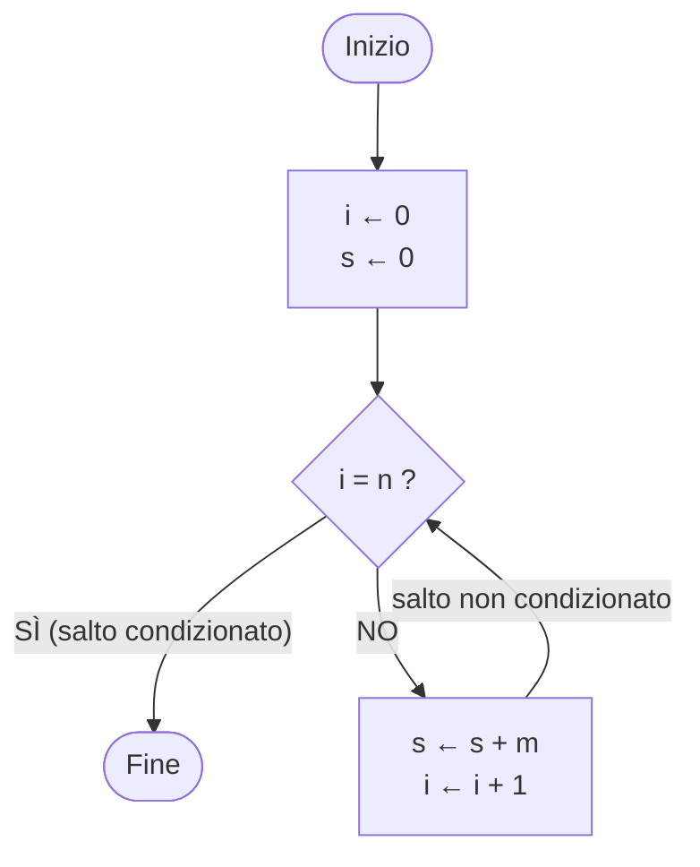
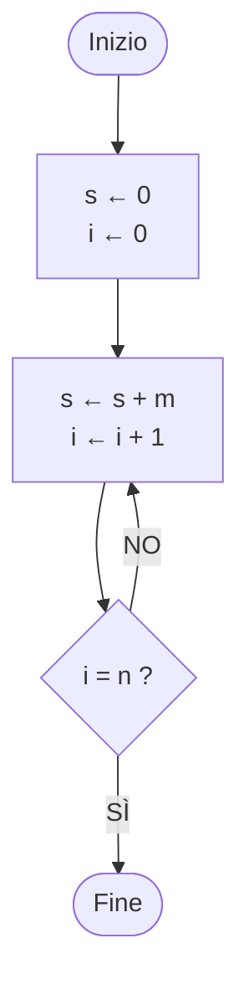

# 01A — Un primo algoritmo

## In breve (7 punti)

1. L'informatica studia gli **algoritmi**, non i computer (frase attribuita a Dijkstra: il computer sta all'informatica come il telescopio all'astronomia).
2. **Algoritmo** = insieme **ordinato** di operazioni **non ambigue** ed **effettivamente computabili** che, quando eseguito, **produce un risultato** e **si arresta in un tempo finito**.
3. Esempio guida: calcolare `m × n` (interi, `n ≥ 0`) con una macchina che sa solo **sommare, assegnare, confrontare** → **somme ripetute** partendo dall'elemento neutro 0.
4. Servono un **accumulatore** `s` (somma parziale) e un **contatore** `i` (addizioni già fatte).
5. Principio di progetto del corso: **prima verificare le condizioni, poi eseguire**. Controllando `i = n` *dopo* la somma, con `n = 0` l'algoritmo non termina. Slide 20: *"La gestione del caso iniziale è una tipica fonte di errori, anche in sede d'esame."*
6. Notazione: `←` assegnamento, `=` confronto; salti condizionati/non condizionati → blocchi **Inizio/Fine** annidati + indentazione (programmazione strutturata).
7. Diagramma di flusso = rappresentazione del flusso di controllo. Obiettivo del corso: tradurre in **C** algoritmi descritti in italiano; modello di calcolo: **macchina di Von Neumann** (lezione successiva).

## Se sei del canale A o C

- **Canale A (Fiandrotti):** deck molto simile "01A_primo_algoritmo" (40 slide, settimana 28/09–02/10). Stesse versioni dell'algoritmo V1–V6, compreso il bug del caso n = 0. Rispetto al canale B mancano la slide "In informatica tutto è numero" (B6), la slide "Progettare un algoritmo" con input/output/passi/terminazione (B8), il riquadro su dati/procedure e Wirth "Programma = Algoritmi + Strutture Dati" (B14), la V7 senza numeri di riga (B26) e il confronto tra flow-chart e rappresentazione strutturata (B28); la slide sul caso iniziale (A23) non dice "anche in sede d'esame". Nella stessa settimana c'è anche "01B_architettura" (storia del calcolatore, bit e byte, macchina di Von Neumann).
- **Canale C (Mazzei):** sezione "Il Primo Algoritmo" (slide 20–42) della lezione 01 del 28/09. Parte dall'addizione in colonna ("le istruzioni della maestra") e chiama "dita" il contatore. **Non** presenta le versioni sbagliate né il caso n = 0: arriva subito allo pseudocodice corretto (righe 0–6, "Se dita == n salta alla riga 6") e al diagramma di flusso. Nella stessa lezione prosegue con Von Neumann, istruzioni macchina (LOAD, STORE, ADD, CMP, JMP) e la stessa moltiplicazione in assembly e in FORTRAN.
- L'esame è unico per i tre canali: le parti su caso iniziale, "prima verificare, poi eseguire" e programmazione strutturata (§7–§8, §14) valgono per tutti.

---

## §1 Che cos'è l'informatica (slide 2–4)

- **Calcolatore / computer**: in origine una *persona* che eseguiva calcoli a mano (carta, penna, calcolatrici meccaniche); dagli anni '50 un *dispositivo elettromeccanico programmabile* per calcoli anche complessi. Foto nelle slide: una sala di calcolatori umani e la **Olivetti Programma 101** (1965, "the do-it-yourself computer").
- Citazione (slide 3, attribuita a E. W. Dijkstra): *"L'informatica non è la scienza dei calcolatori. Non più di quanto l'astronomia sia la scienza dei telescopi o la chirurgia la scienza dei bisturi."* → l'informatica studia gli algoritmi, non i dispositivi.
- **Informatica = studio degli algoritmi** (slide 4), che comprende:
  | Aspetto | Contenuto | [OLTRE LE SLIDE] Dove si ritrova |
  |---|---|---|
  | Proprietà formali e matematiche | algoritmi corretti ed efficienti | Algoritmi e Strutture Dati, corsi di matematica/logica |
  | Realizzazione fisica | progettare e costruire computer che li eseguono | Architettura degli Elaboratori |
  | Realizzazione linguistica | progettare linguaggi di programmazione | Programmazione I/II, Linguaggi Formali e Traduttori |
  | Applicazioni | software (algoritmi implementati) per problemi importanti | Basi di Dati, Reti, Sistemi Operativi… |

## §2 Algoritmo: definizioni e proprietà (slide 5)

- **Definizione intuitiva**: procedimento di calcolo ben definito, eseguibile **meccanicamente** da un essere umano o da una macchina, per ottenere un risultato (**output**) a partire da dati di partenza (**input**).
- **Definizione precisa (da memorizzare)**: *un insieme ordinato di operazioni non ambigue ed effettivamente computabili che, quando eseguito, produce un risultato e si arresta in un tempo finito.*

| Proprietà | Significato | Controesempio [OLTRE LE SLIDE] |
|---|---|---|
| Ordinato | sequenza precisa: dopo ogni passo si sa quale viene dopo | istruzioni in ordine sparso |
| Non ambiguo | una sola interpretazione possibile | "aggiungi sale q.b." |
| Effettivamente computabile | ogni operazione è davvero eseguibile dall'esecutore | "calcola m × n" per una macchina che sa solo sommare; "dividi per 0" |
| Produce un risultato | c'è un output | procedura che non restituisce nulla |
| Si arresta in tempo finito | termina per **ogni** input ammesso | la versione V2 con n = 0 (§8) |

- "Eseguibile meccanicamente" = non servono intuito o creatività: per questo si può affidare a una macchina.
- **Etimologia**: dal matematico persiano **al-Khwārizmī** (circa anno 800), il cui libro sui *calcoli con i numerali indiani* descrive procedure per l'aritmetica. [OLTRE LE SLIDE] Traduzione latina "Algoritmi de numero Indorum"; da un altro suo libro (*al-jabr*) deriva "algebra".

## §3 Tutto è numero; programmazione imperativa (slide 6–7)

- Ogni informazione (testi, immagini, suoni, istruzioni) in memoria è codificata come **numero**, cioè come **sequenza di bit**. [OLTRE LE SLIDE] `'A'` = 65 = `01000001` in ASCII.
- Un programma **imperativo** lavora modificando valori numerici memorizzati nello **stato** della macchina. **Programmare** = descrivere come trasformare questi valori passo dopo passo.
- **Programmazione imperativa**: programma = sequenza ordinata di istruzioni, **una riga = una istruzione**; finita la riga *n* si esegue la *n+1*, **se non specificato diversamente**.
- Istruzioni tipiche della macchina: **assegnare** un valore a una variabile; **sommare** due variabili e memorizzare il risultato in una terza; **confrontare** due variabili; **saltare** a una riga diversa dalla successiva (eventualmente sotto condizione).
- **Variabile**: contenitore con un nome il cui valore può cambiare; l'insieme dei valori = stato.

## §4 Progettare un algoritmo: il problema (slide 8)

Problema: `m × n`, con `m, n` interi e `n ≥ 0`. Bisogna definire:
- **Input**: `m`, `n` · **Output**: `m × n` · **Passi**: sequenza non ambigua di operazioni eseguibili dalla macchina · **Terminazione**: si raggiunge l'output e ci si arresta dopo un numero finito di passi.
- Ipotesi: la macchina **non sa moltiplicare**; sa fare **somma, assegnamento, confronto**.
- Progettare = **costruire il risultato usando solo le operazioni disponibili** (ricondurre la moltiplicazione all'addizione).
- [OLTRE LE SLIDE] `n ≥ 0` è la **precondizione**; su `m` nessun vincolo (può essere negativo).

## §5 L'idea: somme ripetute (slide 9–13)

```
m × n = m + m + … + m          (n addendi: sommo m a sé stesso n−1 volte)
s     = 0 + m + m + … + m      (parto dall'elemento neutro 0: sommo m esattamente n volte)
```
Perché partire da 0 (elemento neutro della somma): tutti i passi sono uguali (`s ← s + m`); il caso `n = 0` è gestito da solo (s = 0); le addizioni sono esattamente `n`. Resta da stabilire **come eseguire esattamente n addizioni e poi fermarsi** → serve un contatore.

Esempio slide 10–13 (m = 4, n = 3), con le dita che contano le addizioni fatte:

| Dita alzate (addizioni fatte) | Operazione | s |
|---|---|---|
| 0 (pugno chiuso) | parziale iniziale | 0 |
| 1 | 0 + 4 | 4 |
| 2 | 4 + 4 | 8 |
| 3 → mi fermo | 8 + 4 | 12 |

## §6 Accumulatore, contatore, Wirth (slide 14)

- **Accumulatore** `s`: tiene la somma parziale (≈ il foglio su cui faccio le addizioni).
- **Contatore** `i`: tiene il numero di addizioni fatte (≈ le dita della mano).
- Due concetti essenziali: **DATI** (valori e loro organizzazione) e **PROCEDURE** (operazioni che li trasformano).
- **Niklaus Wirth**: *Programma = Algoritmi + Strutture Dati*. [OLTRE LE SLIDE] È la formula del titolo del suo libro del 1976, *Algorithms + Data Structures = Programs*; Wirth ha creato il Pascal.
- [OLTRE LE SLIDE] Schemi ricorrenti: accumulatore inizializzato all'elemento neutro (0 per somme/conteggi, 1 per prodotti); ciclo controllato da contatore.

## §7 Le sette versioni dell'algoritmo (slide 15–26)

**V1 — idea a parole (slide 15)**
```
1. Imposta l'accumulatore s al valore neutro 0 e il contatore i a 0.
2. Somma m a s esattamente n volte, aggiornando contemporaneamente i e s.
```
Difetto: il punto 2 è *semanticamente complesso* (nasconde ripetizione e controllo).

**V2 — passi elementari, controllo alla fine (slide 16) — SBAGLIATA per n = 0**
```
1. s ← 0, i ← 0
2. somma m all'accumulatore s
3. somma 1 al contatore i
4. se i = n: fine (s è il totale), altrimenti ripeti dal punto 2
```

**V3 — prima il controllo (slide 21)**
```
[1] imposta s a 0 e i a 0
[2] se i = n le addizioni sono finite e s è il totale: terminiamo; altrimenti continuiamo
[3] somma m all'accumulatore s
[4] somma 1 al contatore i
[5] ritorna alla riga 2
```

**V4 — notazione formale (slide 22)**: `←` assegnamento, `=` confronto, `▷` commento; il **rientro** di [3]–[5] indica che dipendono dalla condizione in [2].
```
[1] s ← 0,  i ← 0
[2] se i = n l'algoritmo termina, altrimenti
[3]     s ← s + m        ▷ somma m ad s
[4]     i ← i + 1        ▷ incrementa di 1 il contatore i
[5]     ritorna alla riga 2
```

**V5 — istruzione Fine e salti (slide 22–24)**: "termina" è troppo forte, perché dopo la moltiplicazione potremmo voler eseguire altro.
```
[1] s ← 0,  i ← 0
[2] se i = n allora salta alla riga 6, altrimenti
[3]     s ← s + m
[4]     i ← i + 1
[5]     salta alla riga 2
[6] Fine
```

**V6 — blocchi Inizio/Fine (slide 25)**: salto **condizionato** (riga 3 → 7, solo se `i = n`) e **non condizionato** (riga 6 → 3, sempre).
```
[1] Inizio Algoritmo
[2]     s ← 0,  i ← 0
[3]     Inizio Ripetizione Condizionata
            se i = n allora salta alla riga 7, altrimenti      ▷ salto condizionato
[4]         s ← s + m
[5]         i ← i + 1
[6]         salta alla riga 3                                ▷ salto non condizionato
[7]     Fine Ripetizione Condizionata
[8] Fine Algoritmo
```

**V7 — versione strutturata senza numeri di riga (slide 26)**
```
Inizio Algoritmo
    s ← 0,  i ← 0
    Inizio Ripetizione Condizionata
    se i = n salta alla Fine Ripetizione Condizionata, altrimenti
        s ← s + m
        i ← i + 1
        salta all'Inizio Ripetizione Condizionata
    Fine Ripetizione Condizionata
Fine Algoritmo
```
La struttura (blocchi annidabili) elimina i numeri di riga; l'indentazione rende visibile la gerarchia e l'appartenenza di ogni istruzione al proprio blocco. È la forma del `while` in C.

## §8 Il bug del caso n = 0 (slide 17–20)

L'algoritmo V2 è stato sviluppato su valori "di prova" (m = 4, n = 3). Verifica su un caso particolare: `n = 0`, risultato atteso 0.

| Passo | Istruzione (V2) | s | i | Verifica |
|---|---|---|---|---|
| 1 | s ← 0, i ← 0 | 0 | 0 | — |
| 2 | s ← s + m | 4 | 0 | — |
| 3 | i ← i + 1 | 4 | 1 | — |
| 4 | se i = n … | 4 | 1 | 1 = 0? NO → ripeti |
| 7 | se i = n … | 8 | 2 | 2 = 0? NO → ripeti |
| … | … | … | … | i > n per sempre: **non termina** |

- Causa: V2 prima aggiorna `s` e `i`, poi confronta. Con `n = 0` vale sempre `i > n`.
- Correzione: prima verificare che il contatore sia inferiore a `n`, e solo dopo eseguire l'addizione (V3). Con V3 e n = 0: `0 = 0? SÌ` → fine con `s = 0`.
- **Paradigma di progetto del corso** (slide 20): *"prima verificare le condizioni e solo dopo eseguire (la prima di una serie di) operazioni"* — "ci accompagnerà nel resto di questo insegnamento".
- **Slide 20**: *"La gestione del caso iniziale è una tipica fonte di errori, anche in sede d'esame."*
- [OLTRE LE SLIDE] Casi limite da provare sempre: n = 0, n = 1, m = 0, m negativo, precondizione violata (n < 0).

## §9 Diagramma di flusso (slide 28–29)

- Rappresentazione intermedia prima del linguaggio vero; mette in evidenza il **flusso di controllo** (le possibili sequenze di esecuzione).
- A differenza della rappresentazione strutturata **non rende esplicito l'annidamento dei blocchi**: segue i collegamenti tra istruzioni.
- Storicamente molto usato, a volte utile; i linguaggi moderni preferiscono strutture di controllo annidate.
- Simboli: ovale = Inizio/Fine; rettangolo = operazioni; rombo = condizione (uscite SÌ/NO); frecce = flusso.

Diagramma della slide 29 (versione corretta, verifica prima):


[OLTRE LE SLIDE] Versione V2 (verifica dopo): il corpo è eseguito almeno una volta.


## §10 Programmi, linguaggi, obiettivo del corso (slide 27, 30)

- **Programma**: descrizione di un algoritmo attraverso un linguaggio di programmazione.
- **Linguaggio di programmazione**: insieme di parole e regole, definite in modo formale, per programmare un calcolatore affinché esegua compiti predeterminati.
- Linguaggi di **basso livello** (linguaggio macchina, assembly) vs **alto livello**, vicini al linguaggio naturale (FORTRAN, C, Java, Python).
- Scopo del corso: implementare algoritmi elementari in **C**, cioè **tradurre in C algoritmi specificati in italiano**.
  - *Implementare* = realizzare concretamente una procedura in un linguaggio di programmazione partendo dalla sua definizione logica.
  - Nell'esame di *Algoritmi* lo scopo sarà invece **analizzare e progettare nuovi algoritmi**.
- Modello di calcolo: **macchina di Von Neumann**. [OLTRE LE SLIDE] Memoria con dati *e* istruzioni; CPU che ripete preleva–decodifica–esegui; il *program counter* indica la prossima istruzione ("riga n+1"); un salto cambia il program counter.

## §11 [OLTRE LE SLIDE] La moltiplicazione in C

Verificato con `gcc -Wall -Werror` (output `4 x 3 = 12`; corretto anche con 5×0, 0×7, −2×3).
```c
#include <stdio.h>
#include <assert.h>

int main(void) {
    int m = 4, n = 3;      // input (per ora fissati nel codice)
    assert(n >= 0);        // precondizione
    int s = 0;             // accumulatore: parte dall'elemento neutro
    int i = 0;             // contatore delle addizioni fatte

    while (i != n) {       // prima verifico la condizione...
        assert(s == m * i);// invariante: vale a ogni controllo
        s = s + m;         // ...poi eseguo: s <- s + m
        i = i + 1;         // i <- i + 1
    }
    assert(s == m * n);    // postcondizione

    printf("%d x %d = %d\n", m, n, s);
    return 0;
}
```
| Pseudocodice | C | Nota |
|---|---|---|
| `s ← 0` | `s = 0;` | in C `=` è l'assegnamento |
| `i = n` (confronto) | `i == n` | trappola: `if (i = n)` assegna invece di confrontare |
| Inizio … Fine | `{ … }` | blocco |
| Ripetizione condizionata "se i = n salta alla fine" | `while (i != n) { … }` | il while ripete finché la condizione è vera: la condizione di uscita va negata |
| salta all'inizio della ripetizione | `}` | implicito a fine blocco |

- `while (i < n)` equivale a `i != n` se n ≥ 0; con n < 0 termina subito (risultato sbagliato) invece di non terminare.
- La V2 corrisponde a `do { … } while (…);` (corpo eseguito almeno una volta).

## §12 [OLTRE LE SLIDE] Perché funziona: invariante, terminazione, costo

- **Invariante** (vero a ogni controllo della condizione): `s = m × i`. Inizio: `0 = m × 0`. Passo: `s + m = m × (i + 1)`. Uscita (`i = n`): `s = m × n`.
- **Terminazione**: `n − i` parte da `n ≥ 0` e cala di 1 a ogni giro → dopo n giri vale 0. Con `n < 0` non termina (precondizione necessaria).
- **Costo**: condizione valutata `n + 1` volte, corpo eseguito `n` volte.

## §13 Trappole ed errori tipici

1. Controllare la condizione **dopo** il corpo quando il corpo potrebbe non dover essere eseguito (caso n = 0).
2. Non inizializzare accumulatore/contatore (in C: valore indeterminato).
3. Elemento neutro sbagliato: 0 per somme e conteggi, 1 per prodotti.
4. Errori "di uno": n addendi = n − 1 addizioni; partendo da 0 sono n.
5. Confondere assegnamento e confronto (`←`/`=`; in C `=`/`==`).
6. Ignorare la precondizione (n < 0 → non termina).
7. Testare solo il caso di prova: provare n = 0, n = 1, m = 0, m negativo.
8. Invertire l'ordine delle istruzioni nel corpo quando una usa il valore aggiornato dall'altra.

## §14 Collegamento con l'esame

Tipico esame (slide del canale B 2026/27): esercizi su Moodle al PC in laboratorio — programmazione iterativa e ricorsiva, teoria (correttezza, tipi), stato della memoria (esecuzione simulata). Dettagli in `contesto_ai/PROG1/corso.md`.

| Tipologia | Legame con 01A |
|---|---|
| Funzione iterativa | accumulatore/contatore; valore iniziale della sentinella (= caso iniziale) |
| Funzione ricorsiva | caso base = caso iniziale; terminazione |
| Modello della memoria | traccia di esecuzione passo passo |
| Correttezza | precondizione `n ≥ 0`, postcondizione `s = m × n`, invariante `s = m × i` |

Regole d'esame (anni passati; riepilogo d'esame 2025/26): funzioni iterative con **una sola `return`**, variabili sentinella, niente `break`/`switch`/`case`/`static` né altri costrutti non visti a lezione; funzioni ricorsive senza cicli (`return` multipli ammessi). È la programmazione strutturata della V7: dal ciclo si esce solo tramite la condizione (es. `while (i < aLen && !esiste)`).

## §15 Esercizi (con soluzioni)

**1. Traccia (base).** Esegui V6 con m = 5, n = 2.
Soluzione: righe eseguite 1,2,3,4,5,6,3,4,5,6,3,7,8 (13 passi); s: 0 → 5 → 10; condizione valutata 3 volte (n+1), addizioni 2 (n); risultato 10.

**2. Caccia al bug (base).** V2 con m = 3, n = 1 e n = 0.
Soluzione: n = 1 → s = 3 corretto; n = 0 → s = 3, i = 1, 1 ≠ 0, … non termina. V2 esegue il corpo almeno una volta: corretto solo se n ≥ 1.

**3. Numeri negativi (medio).** (a) m = −2, n = 3? (b) m = 2, n = −3? (c) estendere a n qualsiasi sapendo calcolare `x ← −x`.
Soluzione: (a) s = −6 corretto. (b) non termina (precondizione violata). (c) premettere `se n < 0 allora m ← −m, n ← −n` (perché `m × n = (−m) × (−n)`), poi l'algoritmo normale.

**4. Divisione intera per sottrazioni ripetute (medio).** Dati m ≥ 0, n > 0, calcolare quoziente q e resto r.
```
Inizio Algoritmo
    q ← 0,  r ← m
    Inizio Ripetizione Condizionata
    se r < n salta alla Fine Ripetizione Condizionata, altrimenti
        r ← r − n
        q ← q + 1
        salta all'Inizio Ripetizione Condizionata
    Fine Ripetizione Condizionata
Fine Algoritmo
```
14 ÷ 4: (q, r) = (0,14) → (1,10) → (2,6) → (3,2) → q = 3, r = 2. Con n = 0 non termina (divisione per zero). Invariante: `m = q × n + r`.

**5. Potenza (medio → difficile).** (a) `p = mⁿ` con moltiplicazione disponibile: `p ← 1` (elemento neutro del prodotto), ciclo n volte `p ← p × m`. (b) Solo somme (m ≥ 0): sostituire `p ← p × m` con un ciclo interno che somma `p` per `m` volte (`s ← 0, j ← 0; finché j ≠ m: s ← s + p, j ← j + 1; p ← s`) → cicli annidati, secondo contatore e secondo accumulatore azzerati a ogni giro esterno.

**6. Somma 1 + 2 + … + n (medio).** `s ← 0, i ← 0; finché i ≠ n: i ← i + 1, s ← s + i`. Con n = 4 → 10. Invertendo le due istruzioni si somma 0 + 1 + … + (n−1): errore "di uno".

**7. Diagramma di flusso (base).** Per l'esercizio 4: Inizio → [q ← 0, r ← m] → ◇ r < n ? — SÌ → Fine (salto condizionato); NO → [r ← r − n, q ← q + 1] → torna al rombo (salto non condizionato).

**8. Meno addizioni (difficile).** Con m, n ≥ 0 fare min(m, n) addizioni: se n > m scambiare m e n prima del ciclo, con variabile d'appoggio (`t ← m; m ← n; n ← t`). `m ← n; n ← m` non funziona: entrambe diventano il vecchio n.

## §16 Domande di ripasso (con risposta breve)

1. *Cos'è un algoritmo?* → Insieme ordinato di operazioni non ambigue ed effettivamente computabili che produce un risultato e termina in tempo finito.
2. *Cosa intende la frase sui telescopi?* → L'informatica studia gli algoritmi; il computer è lo strumento. Quattro aspetti: proprietà formali, realizzazione fisica, realizzazione linguistica, applicazioni.
3. *Origine della parola?* → al-Khwārizmī (circa 800), libro sui calcoli con i numerali indiani.
4. *"Tutto è numero"?* → Ogni informazione è codificata in bit; un programma imperativo trasforma valori numerici dello stato.
5. *Programmazione imperativa?* → Sequenza ordinata di istruzioni, una per riga, esecuzione sequenziale salvo salti; istruzioni: assegna, somma, confronta, salta.
6. *Cosa definire per progettare un algoritmo?* → Input, output, passi (operazioni disponibili), terminazione.
7. *Perché s parte da 0?* → Elemento neutro: n addizioni tutte uguali, caso n = 0 gestito da solo.
8. *Accumulatore vs contatore?* → Somma parziale (foglio) vs numero di addizioni fatte (dita).
9. *Programma = Algoritmi + Strutture Dati?* → Wirth: dati + procedure che li trasformano.
10. *Perché V2 è sbagliata?* → Controlla dopo aver eseguito: con n = 0 non termina. Principio: prima verificare, poi eseguire.
11. *Salto condizionato vs non condizionato?* → V6 riga 3 → 7 solo se i = n (nel diagramma: uscita SÌ del rombo); riga 6 → 3 sempre (freccia di ritorno).
12. *Perché "termina" è troppo forte?* → La moltiplicazione può essere parte di un algoritmo più grande: si salta alla Fine del blocco.
13. *Inizio/Fine e indentazione?* → Delimitano blocchi annidabili; eliminano i numeri di riga; l'indentazione mostra la gerarchia.
14. *Flow-chart vs strutturata?* → Il flow-chart mostra il flusso di controllo ma non l'annidamento.
15. *Basso vs alto livello?* → Macchina/assembly vs FORTRAN, C, Java, Python.
16. *Prog I vs Algoritmi?* → Prog I: implementare/tradurre in C algoritmi dati; Algoritmi: analizzare e progettare nuovi algoritmi.

## §17 Glossario

Algoritmo · Input/Output · Istruzione · Variabile · Stato · Assegnamento (`←`, in C `=`) · Confronto (`=`, in C `==`) · Accumulatore · Contatore · Elemento neutro (0 somma, 1 prodotto) · Terminazione · Caso iniziale/limite · Salto condizionato · Salto non condizionato · Blocco · Indentazione (rientro) · Programmazione strutturata · Diagramma di flusso · Programma · Linguaggio di programmazione · Basso/alto livello · Implementare · Macchina di Von Neumann.

## Collegamenti

- Lezione successiva prevista: architettura del calcolatore / macchina di Von Neumann, programmazione strutturata e linguaggio C (sequenza canale B 2025/26).
- Fili conduttori: caso iniziale → sentinelle e casi vuoti; programmazione strutturata → regole d'esame; invariante → correttezza; traccia → modello della memoria.
