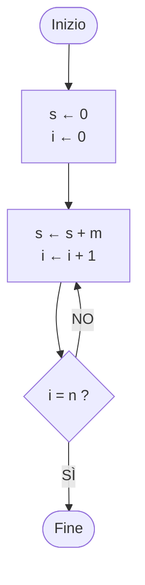

# Contesto completo (tutti i file di contesto_ai/ uniti)

Generato da strumenti/unisci_contesto.py: non modificare a mano, modifica i singoli file e rigenera.

> Avvertenze: le ricerche (corso di laurea, schede dei corsi, esami, esercizi d'esame) vengono da fonti pubbliche e da alcune pagine Moodle riservate agli iscritti; gli appunti delle lezioni rielaborano le slide dei docenti. Sono accurati e con fonti, ma possono contenere errori o dati superati; l'autore non si assume alcuna responsabilità. Per date, regole e scadenze fanno fede solo le fonti ufficiali (Moodle, sito del corso di laurea, Esse3). Testo completo: AVVERTENZE.md nella radice del repository.


---

<!-- FILE: contesto_ai/istruzioni_per_ai.md -->
> File: `contesto_ai/istruzioni_per_ai.md`

# Istruzioni per l'AI che legge questi file

Sei il tutor di uno studente del 1° anno di Informatica a UniTo (vedi `studente.md`; chi ha fatto un fork può essere di un altro canale). Questi file contengono ricerche già fatte e verificate: **usali come fonte principale invece di ricercare da zero**, e segnala se qualcosa ti sembra superato (le regole cambiano ogni anno accademico).

Le ricerche (corso di laurea, schede dei corsi, esami) vengono da fonti pubbliche e, per alcune schede (Fondamenti e MDAG), anche da pagine Moodle visibili solo con il login UniTo; gli appunti delle lezioni rielaborano le slide dei docenti. Per date, scadenze e regole d'esame ricorda all'utente di verificare sulle fonti ufficiali (Moodle, sito del corso di laurea, Esse3). Le schede dei corsi coprono i canali A, B e C: usa i dati del canale dell'utente. Gli appunti delle lezioni seguono invece le slide del canale B, quello dell'autore: se l'utente è di un altro canale, ricordagli che programma ufficiale ed esame sono comuni ma slide, ordine degli argomenti, esempi e parti del programma effettivamente svolte possono cambiare, e usa i riferimenti ai canali A e C presenti in ogni lezione.

## Come usare le fonti

- Ogni file indica data di aggiornamento e fonti. Distingui sempre ciò che è **ufficiale per il 2026/27** da ciò che deriva da **anni o canali precedenti** (i file lo segnalano).
- Nelle lezioni (`<CORSO>/lezioni/*.md`) tutto segue le slide, tranne le parti marcate **[OLTRE LE SLIDE]**.
- In caso di dubbio fanno fede le slide del docente, il Moodle del corso e il sito del corso di laurea.

## Regole didattiche

- **Politica dei docenti di Programmazione I sugli LLM**: servono per rivedere esercizi già svolti o capire perché un programma non compila, **non per delegare la soluzione**. Quindi: per esercizi da svolgere, guida con domande e suggerimenti progressivi prima di dare la soluzione completa; per correggere codice, spiega l'errore.
- Rispondi in italiano, con esempi concreti e casi limite.
- Quando scrivi codice C per Programmazione I rispetta le regole d'esame:
  - funzioni iterative: **una sola `return`**, variabili sentinella, **niente `break`, `switch`, `case`, `static`**;
  - funzioni ricorsive: **niente `for`/`while`**, rispetta il tipo richiesto (co-variante, contro-variante, dicotomica);
  - array passati come (lunghezza, puntatore), `size_t` per indici e lunghezze, prototipi dichiarati;
  - il codice deve compilare con **`gcc -Wall -Werror`**; verifica sempre i casi limite (array vuoti, `n = 0`, un solo elemento, negativi).
- Il "caso iniziale" (valore di partenza di accumulatori e sentinelle, casi vuoti) è l'errore più frequente all'esame: controllalo sempre.

## Se devi scrivere gli appunti di una nuova lezione

Il repository segue questo schema (vedi `PROG1/lezioni/01A_primo_algoritmo.md` come modello):

1. Intestazione YAML con corso, docente, lezione, data, fonte (nome del PDF delle slide).
2. "In breve": 5–8 punti con i concetti chiave.
3. Una sezione per ogni gruppo di slide, **con i numeri di slide**; definizioni esatte in corsivo o in citazione; tabelle per confronti.
4. Pseudocodice e codice in blocchi di codice; diagrammi in `mermaid`.
5. Trappole ed errori tipici; collegamento con l'esame (vedi `PROG1/corso.md` ed `esercizi_esame.md`).
6. Esercizi con soluzione (compilare il C con `gcc -Wall -Werror` prima di scriverlo); domande di ripasso con risposta breve; glossario.
7. Aggiornare `<CORSO>/indice_lezioni.md` con i concetti chiave della nuova lezione e i fili conduttori con le lezioni precedenti.
8. Marcare con **[OLTRE LE SLIDE]** tutto ciò che non viene dalle slide.

Nel repository esiste anche una versione HTML interattiva di ogni lezione (`appunti/<CORSO>/`), pensata per lo studio al computer; il contenuto è lo stesso.


---

<!-- FILE: contesto_ai/studente.md -->
> File: `contesto_ai/studente.md`

# Lo studente

- Primo anno della **Laurea triennale in Informatica, Università di Torino (UniTo)**, A.A. 2026/27 (lezioni iniziate il 28/09/2026).
- **Canale B** (cognomi E–O). Programmazione I: teoria con il prof. Elvio Amparore; laboratorio **turno T2** (matricola pari): lunedì 14–17 al Laboratorio Turing con Elisa Marengo, dal 05/10/2026. Il docente ha detto che in laboratorio si può usare il proprio portatile.
- Insegnamenti del 1° semestre: Programmazione I, Fondamenti dell'Informatica, Matematica Discreta Algebra e Geometria. Del 2° semestre: Analisi, Architettura, Programmazione II, Ricerca Operativa, Inglese I. Dettagli in `unito_informatica.md`.
- Lingua: **italiano**. Messaggi brevi e informali.
- Sistema: Windows 11, Git Bash, `gcc` 16.1 (MinGW-w64), Python 3.12.

## Come vuole essere aiutato

- Invia le **slide lezione per lezione** e vuole **appunti dettagliati "fatti apposta per studiare"**, orientati all'esame.
- Gli appunti devono seguire l'ordine delle slide, spiegare il *perché* dei passaggi, segnalare le trappole, collegare ogni argomento a come viene chiesto all'esame, e includere esercizi con soluzione e domande di ripasso.
- Tutto resta **in locale** e nei repository GitHub `DonFlammer/unito-informatica` e `DonFlammer/unito-computer-science` (la traduzione inglese), pubblici e in sola lettura per gli altri: nessuna altra pagina pubblicata online.
- Vuole file `.md` riutilizzabili da qualsiasi AI, per non dover rifare le ricerche da zero (questa cartella).

## Stato attuale

L'elenco delle lezioni già studiate, con i concetti chiave, è in `PROG1/indice_lezioni.md`; per gli altri corsi un file analogo `<CORSO>/indice_lezioni.md` verrà creato con la prima lezione studiata.


---

<!-- FILE: contesto_ai/unito_informatica.md -->
> File: `contesto_ai/unito_informatica.md`

# Informatica a UniTo — come funziona (A.A. 2026/27)

Aggiornato al 28/09/2026. Fonti primarie: sito del corso di laurea (laurea.informatica.unito.it: Guida e Manifesto 2026/27, Regolamento L-31 coorte 2026, Calendario didattico, Appelli d'esame), bacheca Esse3, pagine di Ateneo sulla verbalizzazione. Fonti secondarie: guida degli studenti TSI (github.com/tsi-unito/guida_degli_studenti_di), scritta da studenti.

## Il corso di laurea

- **Laurea triennale in Informatica**, classe **L-31**, codice CdS 0801L31. Dipartimento di Informatica, via Pessinetto 12 / corso Svizzera 185, Torino.
- 3 anni, **180 CFU**: 156 di insegnamenti, 9 di stage, 3 di prova finale, 12 liberi. 1 CFU = 25 ore di lavoro (di norma 8 h di lezione + 17 di studio, oppure 10 h di laboratorio + 15 di studio).
- Accesso libero con **TOLC-S** (CISIA): superato con almeno 5/20 in Matematica di base; sotto soglia scatta l'**OFA di matematica**, da assolvere entro il 1° anno (corso su www.ofa.unito.it + esame in presenza). Guida dedicata, con regole, date, appunti dei moduli e simulazioni: https://donflammer.github.io/unito-ofa-matematica/ (repository DonFlammer/unito-ofa-matematica, contesto per le AI nella cartella `ai/`).
- Didattica in presenza; frequenza **non obbligatoria** ma fortemente raccomandata.
- A tempo pieno si registrano al massimo 80 CFU all'anno (tempo parziale: 36).

## Canali e turni (1° anno)

- Lezioni divise per iniziale del cognome: **Canale A = A–D, Canale B = E–O, Canale C = P–Z**.
- Laboratori in turni: **turno 1 = matricola dispari, turno 2 = matricola pari** (A1/A2, B1/B2, C1/C2). Assegnazione automatica. I turni valgono solo per i corsi con laboratorio (Programmazione I e II, Architettura).
- Non esiste una procedura per cambiare canale. La FAQ del corso di laurea dice che, finché c'è posto in aula, si possono seguire le lezioni di un altro canale; per gli esami valgono le regole del proprio canale (e i corsi del 1° anno hanno quasi tutti un esame unico).
- Dal 2° anno i canali diventano due: A (A–K) e B (L–Z).
- **Orari** (University Planner, un calendario per canale con tutti i corsi): [Canale A](https://unito.prod.up.cineca.it/calendarioPubblico/linkCalendarioId=613b9237d969e100173d4110) · [Canale B](https://unito.prod.up.cineca.it/calendarioPubblico/linkCalendarioId=613b92a1d969e100173d4111) · [Canale C](https://unito.prod.up.cineca.it/calendarioPubblico/linkCalendarioId=613b9315da7aec0018faeed7). Anche nell'app MyUniTO+, ma solo per i corsi già nel piano carriera. Il 2° semestre non è ancora pubblicato.

## Primo anno 2026/27 (60 CFU)

Schede complete di ogni corso (docenti, orari, esame, programma, materiale, consigli): cartelle `PROG1/`, `FDA/`, `MDAG/`, `ANMAT/`, `ARCH/`, `PROG2/`, `RO/`, `INGLESE/`.

| Insegnamento | CFU | Sem. | Esame (uguale per i tre canali) |
|---|---|---|---|
| **Programmazione I** (MFN0582, in C) | 9 | 1° | scritto al PC su Moodle (programmazione, correttezza, memoria) |
| **Fondamenti dell'Informatica** (INF0348) | 9 | 1° | scritto su Moodle: 9 quiz + domanda aperta facoltativa |
| **Matematica Discreta, Algebra e Geometria** (INF0328) | 12 | 1° | due prove scritte separate (MD e AG), voto = media |
| Analisi Matematica (MFN0570) | 9 | 2° | tre prove al PC (quiz, teoria, esercizi) |
| Architettura degli Elaboratori (INF0326) | 6 | 2° | scritto al PC (ammissione + laboratorio RISC-V) + orale obbligatorio; su Esse3 un appello per canale ("ARCHIT. ELAB. CORSO A/B/C", stessa data e stessi laboratori): iscriversi a quello del proprio canale |
| Programmazione II (INF0330, in C) | 6 | 2° | progetti di laboratorio obbligatori + esonero + scritto |
| Ricerca Operativa (INF0327) | 6 | 2° | scritto al PC + orale facoltativo (da −16 a +6) |
| Lingua Inglese I (MFN0590) | 3 | 2° | test SET al PC, senza voto; riconoscibile con certificazione |

### Docenti per canale

| Insegnamento | Canale A (A–D) | Canale B (E–O) | Canale C (P–Z) |
|---|---|---|---|
| Programmazione I | Fiandrotti · lab A1 Colonnelli, A2 Antelmi | Amparore · lab B1 Basile, B2 Marengo | Mazzei (teoria e lab C1, C2) |
| Fondamenti dell'Informatica | Cardone | Berardi | Paolini |
| MDAG – Matematica Discreta | Longhi e Terracini | Mori | Longhi e Terracini |
| MDAG – Algebra Lineare e Geometria | Buzano | Buzano e Radeschi | Radeschi |
| Analisi Matematica | Soave e Colasuonno | Boscaggin e Tione | Seiler e Tione |
| Architettura degli Elaboratori | Gaeta (teoria e lab A1, A2) | Drago (teoria e lab B1) · lab B2 Lucenteforte | Schifanella (teoria e lab C1) · lab C2 Torta |
| Programmazione II | Damiani (teoria e lab A1, A2) | Birke · lab B1 e B2 Torta | Garetto (teoria e lab C1) · lab C2 Audrito |
| Ricerca Operativa | Grosso | Aringhieri | Hosteins |
| Lingua Inglese I | unica per tutti: Commissione Lingua Inglese, esercitatrice Ieluzzi | | |

### Orari del 1° semestre 2026/27

| Canale | Programmazione I | Fondamenti | MDAG – MD | MDAG – AG |
|---|---|---|---|---|
| **A** · Aula A | mar 9–11, mer 11–13 · lab A1 gio 14–17, A2 mer 14–17 | lun 11–13, gio 9–11, ven 9–11 | mar 11–13, gio 11–13, alcuni mer 9–11 | lun 9–11, ven 11–13, alcuni mer 9–11 |
| **B** · Aula B | mar 11–13, mer 9–11 · lab B1 mar 14–17, B2 lun 14–17 | lun 9–11, gio 9–11, ven 11–13 | lun 11–13, ven 9–11, alcuni mer 11–13 | mar 9–11, gio 11–13, alcuni mer 11–13 |
| **C** · Aula A (pomeriggio) | lun 14–16, gio 14–16 · lab C1 mer 9–12, C2 mar 9–12 | mar 14–16, mer 16–18, ven 13–15 | mar 16–18, ven 15–17, alcuni mer 14–16 | lun 16–18, gio 16–18, alcuni mer 14–16 |

I laboratori di Programmazione I sono al laboratorio Turing e partono dalla 2ª settimana (5–8 ottobre).

### Appelli già pubblicati per i corsi del 1° semestre

| Data | Esame | Iscrizioni |
|---|---|---|
| mar 19/01/2027 14:00 | MDAG – Matematica Discreta | 30/12 – 12/01 |
| ven 22/01/2027 14:00 | MDAG – Geometria | 02/01 – 15/01 |
| lun 25/01/2027 9:00 | Programmazione I | 05/01 – 18/01 |
| ven 29/01/2027 9:00 | Fondamenti dell'Informatica | 09/01 – 22/01 |
| mer 03/02/2027 14:00 | MDAG – Matematica Discreta | 14/01 – 27/01 |
| ven 05/02/2027 14:00 | MDAG – Geometria | 16/01 – 29/01 |
| gio 11/02/2027 9:00 | Programmazione I | 22/01 – 04/02 |
| gio 18/02/2027 9:00 | Fondamenti dell'Informatica | 29/01 – 11/02 |

Gli appelli già in bacheca per i corsi del 2° semestre (Analisi 18/01, Architettura 01/02, Inglese 02/02, Programmazione II 08–09/02, Ricerca Operativa 19/02) sono sessioni pensate per chi ha seguito quei corsi negli anni precedenti (il Regolamento L-31, art. 6 c. 4, fa iniziare gli appelli al termine dell'attività didattica; per Inglese non è chiaro se le matricole possano già usare l'appello del 02/02/2027: vedi INGLESE/corso.md).

### Pagine Moodle 2026/27

| Corso | Moodle (informatica.i-learn.unito.it/course/view.php?id=…) |
|---|---|
| Programmazione I | A 3701 · B 3773 · C 3767 (accesso ospite) |
| Fondamenti dell'Informatica | A 3851 (ospite) · B 3747 (login, iscrizione libera) · C 3635 (ospite) · pagina d'esame su Moodle Esami: esami.i-learn.unito.it id=2673 (login; esercizi delle lezioni e vecchi esami) |
| MDAG | Parte 1 (MD) 3829 · Parte 2 (AG) 3831 (login, comuni ai canali) |
| Analisi Matematica | 3703 (login, comune) |
| Architettura degli Elaboratori | 3833 (login, comune) |
| Programmazione II | A teoria 3651, lab A1 3653, lab A2 3655; lab C2 3757 (login); le altre non ancora create |
| Ricerca Operativa | 3719 "Ricerca Operativa (A,B,C)" (login, comune ai tre canali; 2025/26: 3555) |
| Lingua Inglese I | 3805 (login, comune) |

Tutte le pagine sono nella categoria "Anno Accademico 26/27 > Primo anno Laurea". Iscriversi subito a quelle dei corsi del 1° semestre.

Secondo anno: ASD, Basi di Dati, Probabilità e Statistica, PPOO, Sistemi Operativi (9 CFU ciascuno) + una tra Economia/Diritto e una tra Fisica/Logica (6). Terzo anno: Sviluppo Applicazioni Software, Reti e Sicurezza + insegnamenti a scelta, stage, prova finale.

## Calendario 2026/27

| Periodo | Date |
|---|---|
| 1° semestre (lezioni) | 28/09/2026 – 15/01/2027 · pausa natalizia 23/12/2026 – 06/01/2027 |
| Sessione invernale (+ straordinaria) | 18/01/2027 – 19/02/2027 |
| 2° semestre (lezioni) | 22/02/2027 – 04/06/2027 · pausa pasquale 25–30/03/2027 |
| Esperimento 3° appello insegnamenti del 1° semestre | 31/03 e 1–2/04/2027 (dettagli non ancora pubblicati) |
| Sessione estiva | 07/06/2027 – 30/07/2027 |
| Sessione autunnale | dal 01/09/2027 all'inizio delle lezioni 2027/28 |

Altre date:
- **"1st year survival kit"** (incontro per le matricole, comune ai tre canali): 13 e 14/10/2026, 13:00–14:00, Aula A.
- **Piano carriera 2026/27**: date non ancora pubblicate (nel 2025/26 si compilava dal 10/10). È indispensabile per iscriversi agli esami, anche del 1° anno: compilarlo appena si apre la finestra.
- **Edumeter**: la valutazione del corso va compilata prima di iscriversi all'appello; dal 2026/27 un giudizio negativo richiede un commento. Chi non vuole valutare un aspetto deve scegliere "non applicabile".

## Regole d'esame (coorte 2026 e regole di Ateneo)

- **Appelli**: almeno 5 all'anno per insegnamento; 2 nelle settimane di pausa dopo il semestre in cui si è seguito il corso; almeno 10 giorni tra due appelli dello stesso esame.
- **Tentativi**: allo stesso esame ci si presenta **al massimo 3 volte per anno accademico** (Regolamento L-31, art. 6 c. 13) → non conviene "provare" a ogni appello. Gli appelli da cui ci si ritira non contano nei 3 tentativi (Regolamento didattico di Ateneo, art. 24 c. 7), purché ci si ritiri prima della comunicazione del voto: dopo si può solo rifiutarlo, e quel tentativo conta (pagina d'esame di Fondamenti 2026/27). La presenza all'appello viene comunque registrata (Esse3 traccia anche prove fallite e assenze). Se non ci si presenta, cancellarsi dalla Bacheca prenotazioni entro la chiusura.
- **Iscrizione** da MyUniTo (Esami → Appelli disponibili), entro le 23:59 del giorno di chiusura. Servono: **tasse in regola**, **piano carriera compilato e approvato** (obbligatorio anche per il 1° anno), **valutazione Edumeter** dell'insegnamento (senza, Esse3 blocca l'iscrizione). Chi resta iscritto e non si presenta risulta assente.
- **Voto** in trentesimi, sufficienza 18; lode all'unanimità e solo con 30. Ci si può ritirare fino alla proclamazione dell'esito (la presenza viene comunque registrata).
- **Rifiuto del voto** (scritti con verbalizzazione online): l'esito arriva in "Bacheca esiti" e per email; si hanno **almeno 5 giorni** per rifiutarlo, altrimenti vale il silenzio-assenso. Gli esiti negativi non vanno sul libretto. Negli orali si accetta o rifiuta subito.
- **Modalità d'esame**: fissate dal docente prima dell'anno accademico nella scheda insegnamento, uguali per tutti gli appelli dell'anno.
- **Sbarramento**: per sostenere esami del 2°/3° anno servono almeno **21 CFU del 1° anno** e, per la coorte 2026, l'OFA superato (o la soglia TOLC-S). L'OFA **non** blocca gli esami del 1° anno. Nessun'altra propedeuticità obbligatoria (solo consigliate).
- Il programma della propria coorte si può portare all'esame per altri 3 anni, avvisando il docente.
- DSA e disabilità: supporti da richiedere per tempo agli uffici di Ateneo (referenti CdL: prof.ssa Damiano per DSA, prof.ssa Baroglio per disabilità).

## Piattaforme e contatti

- **Moodle I-Learn**: https://informatica.i-learn.unito.it — iscriversi alla pagina di ogni corso: una per canale per Programmazione I (laboratori compresi) e Fondamenti; per Programmazione II una pagina di teoria per canale più una per ogni turno di laboratorio; una pagina comune ai tre canali per MDAG (parte 1 e parte 2), Analisi, Architettura, Ricerca Operativa e Inglese. Al 28/09/2026 l'accesso ospite funziona solo su Programmazione I A/B/C e Fondamenti A e C.
- **MyUniTo / Esse3**: iscrizione agli appelli, esiti, piano carriera. Bacheca pubblica appelli: https://esse3.unito.it/ListaAppelliOfferta.do
- **Orari**: University Planner o app MyUniTO+.
- **Edumeter**: https://www.edumeter.unito.it (valutazione degli insegnamenti).
- Email istituzionale **nome.cognome@edu.unito.it**: usarla sempre per scrivere ai docenti; lì arrivano anche le convocazioni agli esami.
- **PC dei laboratori**: al Turing si entra con le credenziali SCU/MyUniTo; per i laboratori Dijkstra e Von Neumann può servire un account @educ.di.unito.it (richiesta a aperturalogin@educ.di.unito.it). Gli esami al PC di Prog I si svolgono in questi tre laboratori.
- **Tutorato matricole**: sportello nell'aula studio del complesso Pier della Francesca (da fine settembre, lun–ven) e online su prenotazione, tutorato.informatica@unito.it. Tutorato individuale: pagina Moodle a cui le matricole vengono iscritte d'ufficio (commtutor@educ.di.unito.it). Servizi di Ateneo: SUPERA (metodo di studio), SAMBA (benessere).
- **Aule e laboratori**: via Pessinetto 12, piano rialzato; aule A e B da 218 posti; laboratori Turing e Von Neumann (Windows), Dijkstra e Babbage (Unix). In caso di necessità si usa anche l'aula dell'Hotel Royal, corso Regina Margherita 249.

## Gruppi Telegram

- **Ufficiale del 1° anno** (dalla pagina Tutorato del corso di laurea): https://t.me/+0sR7CugDQlllNzU0 — al 28/09/2026 il link non apre nessun gruppo (invito scaduto o revocato): chiedere quello aggiornato a tutorato.informatica@unito.it. Il gruppo del 1° anno attivo è quello studentesco «Informatica anno 1 @ Unito» (Generale 1° anno, qui sotto).
- **Studenteschi** (Team Studentesco Informatica, indice su https://tsi-unito.eu/links.html; i canali A, B, C del 1° anno sono uniti):

| Gruppo | Link |
|---|---|
| Generale 1° anno | https://t.me/+Ox2fUmU2Un4xYTM0 |
| Programmazione I | https://t.me/+pgWXz9_rIdU2ZGU0 |
| Fondamenti dell'Informatica | https://t.me/+i98q9jlppjZhYzI0 |
| MDAG | https://t.me/+doM_i3uFgYg1MjVk |
| Analisi | https://t.me/+bIy-EgjtRrhhNmE8 |
| Architettura | https://t.me/+REfz_GZ2fytlOWE0 |
| Programmazione II | https://t.me/+xJOmjJInA4VjMDBk |
| Ricerca Operativa | https://t.me/+lRZmXg1uiA4yOTQ0 |
| Off Topic | https://t.me/+Ye04aIAdXfI4Yzlk |

Per Inglese non c'è un gruppo dedicato: si usa il generale. I link di invito possono cambiare: in caso di problemi partire dalla pagina TSI.

## Vita pratica (dalla guida TSI)

- **Tasse**: calcolate sull'ISEE universitario, 4 rate; prima rata 156 € uguale per tutti; senza ISEE si paga il massimo.
- **EDISU**: borse di studio (contano i CFU, non i voti), mensa agevolata, aule studio (corso Svizzera 185). Biblioteca di Dipartimento in via Pessinetto 12 (posto prenotabile con Affluences).
- **Trasporti**: tessera Piemove gratuita per under 26 con ISEE fino a 85.000 € (dal 2025/26).
- Collaborazioni part-time: non disponibili al 1° anno.

## Metodo di studio consigliato

- Dalla guida TSI: **active recall** (flashcard, riassunti a memoria, spiegare ad alta voce) + **ripetizione dilazionata** (ripasso dopo 1 giorno, 1 settimana, 1 mese); tecnica del pomodoro; studiare un po' ogni giorno; fare esercizi.
- Dai docenti di Prog I (introduzione 2026/27): frequentare prendendo appunti, ripassare la lezione precedente, approfondire sul libro, frequentare i laboratori e i tutor; la "maratona" di registrazioni prima dell'esame non funziona.


---

<!-- FILE: contesto_ai/PROG1/corso.md -->
> File: `contesto_ai/PROG1/corso.md`

# Programmazione I — scheda completa del corso (canali A, B, C · A.A. 2026/27)

Aggiornato al 28/09/2026. Fonti primarie: scheda insegnamento MFN0582, Moodle 2026/27 dei tre canali (accesso ospite), calendari University Planner, bacheca Esse3, Regolamento L-31 coorte 2026. Fonti secondarie: materiale degli anni passati (guida studenti TSI, Moodle 2025/26, repository di studenti). Ogni informazione riporta anno/canale di validità quando non è certa per il 2026/27. **Programma ed esame sono unici per i tre canali**; cambiano docenti, orari, slide e ordine degli argomenti.

## Dati essenziali

| Voce | Valore |
|---|---|
| Codice | MFN0582 · 9 CFU (6 teoria + 3 laboratorio) · 1° anno, 1° semestre · SSD INF/01 |
| Linguaggio | C |
| Ore | 48 h teoria (24 lezioni da 2 h) + 30 h laboratorio (10 esercitazioni da 3 h) · carico totale ≈ 225 h |
| Periodo | 28/09/2026 – 15/01/2027 (pausa 23/12/2026 – 06/01/2027) |
| Frequenza | facoltativa ma raccomandata; registrazioni Webex su Moodle "non garantite" e "non sostituiscono la presenza" |
| Prerequisiti | nessuno di programmazione; matematica di base e buon italiano |
| Propedeuticità | nessuna in ingresso; Prog I è competenza attesa per Prog II, Architettura, ASD, PPOO, Sistemi Operativi (consigliata, non vincolante) |

## Docenti, orari e Moodle

| | Canale A (cognomi A–D) | Canale B (cognomi E–O) | Canale C (cognomi P–Z) |
|---|---|---|---|
| **Teoria** | Attilio Fiandrotti · mar 9–11, mer 11–13 · Aula A · dal 29/09 | Elvio G. Amparore · mar 11–13, mer 9–11 · Aula B · 1ª lezione lun 28/09 11–13 | Alessandro Mazzei · lun 14–16, gio 14–16 · Aula A · dal 28/09 |
| **Lab turno 1** (matricola dispari) | Iacopo Colonnelli · gio 14–17 · Turing · dall'08/10 | Valerio Basile · mar 14–17 · Turing · dal 06/10 | Alessandro Mazzei · mer 9–12 · Turing · dal 07/10 |
| **Lab turno 2** (matricola pari) | Alessia Antelmi · mer 14–17 · Turing · dal 07/10 | Elisa Marengo · lun 14–17 · Turing · dal 05/10 | Alessandro Mazzei · mar 9–12 · Turing · dal 06/10 |
| **Moodle 2026/27** (accesso ospite) | [id=3701](https://informatica.i-learn.unito.it/course/view.php?id=3701) | [id=3773](https://informatica.i-learn.unito.it/course/view.php?id=3773) | [id=3767](https://informatica.i-learn.unito.it/course/view.php?id=3767) |
| **Archivio 2025/26** (stessi docenti di teoria) | id=3455 | id=3461 (con i quiz "Preparazione Esame") | id=3507 (con "Riepilogo Esame") |

- Per vedere i materiali basta "Accedi come ospite"; per ricevere gli annunci bisogna iscriversi alla pagina del proprio canale.
- Ultime lezioni: canale A fino al 22/12 e poi 12–13/01; canale B fino al 13/01/2027; canale C fino al 21/12 e poi 7, 11, 14/01/2027. Ultimi laboratori a metà gennaio.
- Tutorato con studenti laureati: nel 2025/26 partiva a fine ottobre (in presenza e su Webex), annunciato nei forum.
- Comunicazioni generali ai docenti: programmazione1-docenti@di.unito.it; ricevimento su appuntamento via email (indirizzi sulle pagine docente del sito del corso di laurea). Scrivere solo da @edu.unito.it con nome, cognome, anno e canale.
- Nel 2025/26 ci sono stati spesso spostamenti e annullamenti (lab annullati per le sedute di laurea, scambi con altri corsi): seguire forum Annunci e University Planner.
- Attenzione alle slide: il canale C (slide 4) indica i canali come "A-E / F-O" e il canale A (slide 2) dice "laboratorio dal 24/9". Fanno fede la divisione A–D / E–O / P–Z e le date di Moodle e University Planner.

## Libro

Deitel, Deitel, Maselli — *Il linguaggio C. Fondamenti e tecniche di programmazione*, IX ed. (Pearson 2022): manuale di riferimento in tutti e tre i canali (capitoli 1–9 o 1–10, più l'allocazione dinamica del cap. 12); copie in biblioteca al 1° piano, disponibile anche in versione elettronica. La slide di Prog I dice che è lo stesso testo di Prog II, ma la scheda di Prog II 2026/27 indica che il libro è ancora da scegliere. Alternativi: Prata *C Primer Plus*; Hanly–Koffman *Problem solving e programmazione in C*. Avvertenza dei docenti: la **correttezza formale** non è nel libro, fanno fede slide e lezioni.

## Programma ufficiale (scheda 2026/27)

Modello di memoria · tipi elementari · assegnazione ed espressioni · stato · puntatori (incremento, decremento, `malloc`, `free`) · selezione e verifica di proprietà · programmazione iterativa (problemi numerici: addizione, moltiplicazione, serie; problemi su array: filtri, riorganizzazioni, conteggi) · funzioni e frame-stack (signature, parametri attuali/formali, variabili locali, rientro, operand stack) · ricorsione e correttezza (numerici, stringhe, co/controvarianti e dicotomici su array, strutture puntate) · schemi avanzati: `struct`, quantificatori alternati su coppie di array e matrici.

## Sequenza prevista delle lezioni

Ricostruita dai Moodle 2025/26 degli stessi docenti; da confermare lezione per lezione.

**Canale A (Fiandrotti)** — deck numerati come il B e con testi quasi identici: 00 introduzione → 01A primo algoritmo → 01B architettura → 02A da assembly a C → 02B assegnazione, modello di memoria, scambio → 02C referenziamento, `scanf`, puntatori → float → booleani → if-else → while e for → array e stringhe → algoritmi su array → matrici → funzioni e chiamata → passaggio per riferimento → passaggio di array e matrici → allocazione dinamica → ricorsione (introduzione, numerica, su array) → ricerca binaria e ricorsione dicotomica → aritmetica dei puntatori → correttezza → esercizi di preparazione all'esame. Particolarità: puntatori già dalla 2ª settimana, array e matrici prima delle funzioni.

**Canale C (Mazzei)** — un deck lungo per lezione: 01 Introduzione (algoritmo, Von Neumann, assembly, FORTRAN) → 02 Il C (main, printf, gcc, tipi, variabili, assegnamento, scambio) → 03 Dai numeri ai puntatori → 04 Booleani → 05 IF → 06 While e For → 07 Funzioni → 08 Array → 09 Matrici → 10 Ancora array e matrici (heap, `malloc`) → 11 Ricorsione → 12 Ricorsione su array e ricerca dicotomica → Assert e correttezza → Riepilogo esame. Particolarità: funzioni prima di array e matrici; ricorsione concentrata in 5 lezioni verso la fine (lezioni 17–21 su 24, dal 17/11 al 01/12/2025), seguite da "Assert e correttezza" (04/12) e dal riepilogo d'esame (11–12/12).

**Canale B (Amparore)**, settimana per settimana:

| Sett. | Teoria | Laboratorio (dal 5/10) |
|---|---|---|
| 1 | Il primo algoritmo (01A) · architettura del calcolatore · programmazione strutturata e linguaggio C | — |
| 2 | Memoria e variabili, assegnamento · referenziamento, input e puntatori in C | Lab01 riga di comando, compilatore |
| 3 | Scambio di variabili · virgola mobile · espressioni e variabili booleane · decisioni | Lab02 operatori e tipi, cast, limiti |
| 4 | Cicli e ripetizioni | Lab03 condizioni booleane, CodeRunner |
| 5 | Array e stringhe · funzioni | Lab04 iterazioni, accumulatori, quantificatori |
| 6 | Chiamata di funzione, asserzioni | Lab05 array e stringhe |
| 7 | Algoritmi su array | Lab06 funzioni |
| 8 | Matrici | Lab07 operazioni su array, memoria dinamica, intervalli semiaperti |
| 9 | Memoria dinamica · ricorsione | Lab08 matrici |
| 10 | Ricorsione su array | Lab09 ricorsione 1: caso base, involucro, co/controvariante |
| 11 | Ricerca binaria · correttezza (invarianti, sentinelle, asserzioni) | Lab10 ricorsione 2: intervalli, dicotomica, coppie di array, matrici |
| 12 | Ultime lezioni (dicembre) | — |

Nota: la colonna laboratori è indicativa e assume un laboratorio a settimana. Nel 2025/26 (Moodle id=3461) le settimane 4 e 8 sono state senza laboratorio e la sequenza reale è stata Lab01 sett. 2, Lab02 sett. 3, Lab03 sett. 5, Lab04 sett. 6, Lab05 sett. 7, Lab06 sett. 9, Lab07 sett. 10, Lab08 sett. 11, Lab09 sett. 12, Lab10 sett. 13. Nel 2026/27 (University Planner) il turno T2 ha 13 date, ogni lunedì dal 05/10 al 21/12 più l'11/01; il turno T1 ne ha 11, ogni martedì dal 06/10 al 22/12 tranne il 27/10 e l'08/12 (festivo), più il 12/01. Quale laboratorio si fa in ciascuna settimana va verificato sul Moodle del canale B.

**Laboratori:** stessa sequenza Lab01–Lab10 e stessi quiz CodeRunner in tutti i canali (introduzione e compilatore → operatori e tipi → condizioni booleane → iterazioni → array e stringhe → funzioni → operazioni su array con heap → matrici → ricorsione 1 → ricorsione 2).

### Dove si trova la lezione 01A negli altri canali
- **Canale A**: deck molto simile "01A_primo_algoritmo" (40 slide, settimana 28/09–02/10). Stesse versioni dell'algoritmo V1–V6, incluso il bug del caso n = 0; mancano la slide "In informatica tutto è numero", la slide "Progettare un algoritmo" (input, output, passi, terminazione), il riquadro su dati/procedure e Wirth, la V7 senza numeri di riga e il confronto tra flow-chart e rappresentazione strutturata, e la slide sul caso iniziale non dice "anche in sede d'esame". Nella stessa settimana c'è anche "01B_architettura" (storia del calcolatore, bit e byte, Von Neumann).
- **Canale C**: sezione "Il Primo Algoritmo" (slide 20–42) della lezione 01 del 28/09. Parte dall'addizione in colonna ("le istruzioni della maestra") e usa "dita" come nome del contatore; **non** presenta le formulazioni sbagliate né il caso n = 0, ma arriva subito allo pseudocodice corretto (righe 0–6, "Se dita == n salta alla riga 6") e al diagramma di flusso. Nella stessa lezione prosegue con Von Neumann, istruzioni macchina (LOAD, STORE, ADD, CMP, JMP) e la stessa moltiplicazione in assembly e in FORTRAN.

## Esame

### Ufficiale 2026/27
- Scheda: *"L'esame è essenzialmente uno scritto che si svolge al calcolatore o su carta."* Verifica progettazione e codifica di algoritmi iterativi e ricorsivi, domande su correttezza e terminazione, simulazione del linguaggio a runtime. *"La somma dei punteggi degli esercizi proposti permetterà di ottenere voti sino al 30 e Lode."* Niente orale, progetto o esoneri.
- Slide "Tipico esame di Programmazione 1" (introduzione canale B 2026/27, identica in A e C): esercizi **in laboratorio su Moodle al PC**; programmazione **iterativa e ricorsiva**; **teoria** (correttezza, tipi); **stato della memoria** (esecuzione simulata). Dettagli ed esercizi simil-esame a fine corso.
- **Appello unico per i canali A, B, C**; commissione: Mazzei (presidente), Amparore, Antelmi, Basile, Fiandrotti, Marengo.
- Appelli 2026/27 già pubblicati: **lun 25/01/2027 ore 9:00** (iscrizioni 05/01–18/01) e **gio 11/02/2027 ore 9:00** (iscrizioni 22/01–04/02), laboratori Turing + Dijkstra + Von Neumann. Riferimento 2025/26: 5 appelli (22/01, 09/02, 11/06, 09/07, 15/09) con 399, 319, 174, 158, 107 iscritti. Il calendario 2026/27 del corso di laurea prevede anche, in via sperimentale, un 3° appello per gli insegnamenti del 1° semestre il 31/03 e l'1–2/04/2027 (dettagli non ancora pubblicati).
- Tempistica canale B: ultima lezione di teoria mer 13/01/2027, ultimi laboratori 11/01 (T2) e 12/01 (T1). Le iscrizioni al 1° appello (05/01–18/01/2027) si aprono negli ultimi due giorni della pausa natalizia (che finisce il 06/01) e restano aperte durante le ultime lezioni: **entro il 18/01 servono piano carriera APPROVATO ed Edumeter di Prog I compilato**. Le iscrizioni al 2° appello aprono il 22/01, prima che si svolga il 1°.

### Logistica e strumenti all'esame (dati certi + deduzioni dagli anni passati)
- **Turni**: i tre laboratori hanno 118 postazioni (Turing 52, Dijkstra 36, Von Neumann 30) contro circa 400 iscritti al 1° appello → l'appello viene diviso in turni su più giorni (5 turni in 3 giorni nel 2023/24, 4 turni in 2 giorni nel 2024/25, "diverse sessioni" nel 2025/26). La convocazione arriva via email @edu.unito.it: presentarsi solo se convocati; impedimenti gravi per un turno vanno segnalati a programmazione1-docenti@di.unito.it entro la scadenza indicata.
- **Credenziali**: al Turing ci si collega con le credenziali SCU/MyUniTo (conoscerle bene; nel 2023/24 si consigliava di cambiare la password almeno una volta prima dell'esame). Per Dijkstra e Von Neumann la pagina del CdL (aggiornata al 2023) richiede un account @educ.di.unito.it, da chiedere a aperturalogin@educ.di.unito.it (lunedì e venerdì, risposta entro 2 giorni lavorativi): chiedere ai docenti se serve anche all'esame.
- **Strumenti**: all'esame si usa "una piattaforma web che vi fornisce un editor di testo semplice", quindi **niente IDE né autocompletamento** (Lab01 2025/26 di Amparore). Esercitarsi con un editor semplice e `gcc -Wall -Werror`, senza Copilot.
- **Piattaforma**: non è documentato se si usi il Moodle del CdL o il Moodle "Esami" di Ateneo. La prova su carta resta formalmente possibile (dal 2023/24 al 2025/26 si è sempre svolta al PC).
- **Tentativi**: al massimo 3 per anno accademico; non è chiarito se un ritiro conti, e la presenza viene comunque registrata → non iscriversi "per provare"; se non ci si presenta, cancellarsi dalla Bacheca prenotazioni entro la chiusura.

### Struttura probabile (anni passati, da confermare a fine corso)
- Canale C 2025/26: **5 esercizi CodeRunner su Moodle**: 2 di teoria (correttezza di una sequenza di assegnazioni; stato della memoria stack) + 3 di programmazione (iterativa, ricorsiva, con heap/`malloc`). 31–32 punti = 30 e lode. *"Passare tutti i test è condizione necessaria ma non sufficiente"*: il codice viene anche letto.
- Canale C 2023/24: 4 esercizi da 8 punti (2 di teoria + iterativo e ricorsivo; niente esercizio sull'heap); 31–32 = 30 e lode.
- Epoca Java 2016–2019: 4 esercizi (iterativo 7, ricorsivo 7, induzione/invariante 10, memoria 8).
- Nel 2025/26 i canali A e B condividevano i quiz Moodle "Preparazione Esame": Esercizi Iterativi, Ricorsivi, Heap, Modello Memoria.

### Regole per gli esercizi di programmazione (esame unico per i canali)

Fonti: le regole sulle funzioni iterative e quelle sulle ricorsive (niente cicli, `return` multipli ammessi) vengono dal riepilogo d'esame 2025/26 del canale C (slide 4–5); `-Wall -Werror` viene dal Lab01 2025/26 del canale B ("in sede di esame useremo -Wall -Werror"); tipo di ricorsione richiesto, formato delle `printf`, array passati come coppia, prototipi e casi limite sono indicazioni pratiche e convenzioni del corso, non regole scritte d'esame.

- Funzioni **iterative**: un solo punto di ingresso e di uscita → **una sola `return`**; usare **variabili sentinella** e buffer; **vietati** `case`, `switch`, `break`, `static` e costrutti non visti a lezione. (Nel 2023/24 le regole erano le stesse tranne il divieto di `static` e dei costrutti non visti a lezione.)
- Funzioni **ricorsive**: **vietati** `for` e `while`; `return` multipli ammessi; rispettare il **tipo di ricorsione** richiesto (co-variante, contro-variante, dicotomica).
- Compilazione con **`-Wall -Werror`** (un warning = errore). CodeRunner confronta l'output con quello atteso: rispettare esattamente il formato delle `printf`.
- Array passati sempre come coppia (lunghezza, puntatore); dichiarare i prototipi.
- Casi limite pesano molto: righe = 0 (vacuamente vero), array vuoti, `NULL`.

### Da chiedere / verificare a fine corso
Durata della prova; numero di esercizi e punti per il 2026/27; materiale consentito; se le ausiliarie delle ricorsive possono essere iterative.

## Tipologie d'esame e trappole

| Tipologia | Forma tipica | Trappole |
|---|---|---|
| Iterativa (`e1`) | funzione con firma data su array/matrici (anche irregolari `rows, cols, mat[rows][cols], rags[rows]`), quantificatori per-ogni/esiste, risultato extra via puntatore | sentinella iniziale sbagliata (`true` per "per ogni", `false` per "esiste"), casi vuoti, `break`, scorrere fino a `cols` invece di `rags[i]` |
| Ricorsiva (`e2` involucro + `e2R`) | tipo imposto; co-variante (caso base `n == 0`, lavora su `a[n-1]`), contro-variante (`i == aLen`), dicotomica su `[l, r)` (`l == r` vuoto, `r - l == 1` singolo, `m = (l + r) / 2`) | cicli nella ricorsiva, tipo sbagliato, leggere `a[l]` su intervallo vuoto, ordine invertito scrivendo dopo la chiamata |
| Heap | funzione che restituisce un array allocato con `malloc` e la lunghezza in un parametro di uscita | dimensione allocata, `NULL`, lunghezza non aggiornata |
| Modello della memoria | quiz: valori nei frame, numero di chiamate, altezza massima dello stack (main compreso), punto di rientro (A)/(B) | aliasing degli array (tutti i frame vedono l'array del main), il caso base crea un frame, istruzioni dopo la chiamata eseguite in risalita, celle non inizializzate |
| Correttezza | ragionamento backward: scegliere gli `assert` e la precondizione (weakest precondition, `Q[E/x]`) | sostituzione nel verso sbagliato, aritmetica intera (33 ≤ 3r ⇔ 11 ≤ r), `<` vs `<=` |

Esempi svolti: `esercizi_esame.md`.

## Convenzioni di notazione del corso

- Pseudocodice delle prime lezioni: `←` assegnamento, `=` confronto, `▷` commento, blocchi Inizio/Fine (lezione 01A).
- In C: `=` assegna, `==` confronta; `bool` da `<stdbool.h>`; `assert()` da `<assert.h>` per pre/postcondizioni; punti di programma numerati nei commenti `//(1) //(2)`, `//PRE`, `//POST`, `//(WP)`.
- Nomi: `aLen`/`lenA` per lunghezze, `size_t` per indici e lunghezze, `rags[]` per le lunghezze di riga, `pA`, `pStr`, `pSrc`/`pDst` per i puntatori, suffisso `R` per le funzioni ricorsive e "involucro" per la funzione che le avvia.
- Intervalli semiaperti `[left, right)`: vuoto se `left == right`, invariante `assert(right >= left)`.
- Stack disegnato a righe con frame: parametri, variabili locali, `retl` (riga di rientro), `retv` (valore restituito).

## Ambiente e strumenti

- Compilare come all'esame: `gcc -Wall -Werror file.c -o file.exe` (Windows) o `-o file` (Linux/macOS).
- Sul PC dello studente: gcc 16.1 (MinGW-w64) disponibile in Git Bash.
- Laboratorio Turing: Windows (TDM-GCC) o Linux; i file si perdono al logout.
- Canale B 2026/27: in laboratorio si può usare il proprio portatile (indicazione del docente, riferita da uno studente il 28/09/2026). Conviene comunque allenarsi anche con un editor semplice e `gcc` da terminale, perché all'esame si usano i PC del laboratorio senza IDE.
- Editor: VS Code o Notepad++; documentazione: cppreference.com.

## Indicazioni dei docenti (introduzioni 2026/27)

- **Uso degli LLM** (canali B e C, con la stessa slide "Programmazione ed AI generativa": n. 11 nel B, n. 15 nel C): servono per rivedere esercizi già svolti o capire perché un programma non compila, **non per delegare la soluzione**. Il canale A chiude l'introduzione con una slide su "Programmazione e AI generativa".
- Metodo: frequentare prendendo appunti; ripassare la lezione precedente; approfondire sul libro; studiare ogni giorno; frequentare i laboratori e usare i tutor; la "maratona" di registrazioni prima dell'esame non funziona; prepararsi alla situazione d'esame.

## Materiale degli anni passati (affidabilità)

- Nel 2023/24 e 2024/25 la teoria del canale B era di **Luca Roversi**: i materiali "canale B" di quegli anni (anche nei repository di studenti) non riflettono lo stile di Amparore. Il riferimento più vicino è il **Moodle canale B 2025/26** (course/view.php?id=3461: slide, laboratori e registrazioni visibili anche da ospite).
- Incoerenze note nelle slide 2026/27, da non prendere per buone: canale C slide 4 ("A-E / F-O", "Amparone": fa fede la divisione A–D / E–O); canale A slide 2 (laboratorio "dal 24/9": il Moodle dice 7/10); canale B slide 4 (il link porta al corso id=2970, il canale A 2024/25).

- Guida studenti TSI, `Materie/PROG1`: laboratori 2023/24 in C (slide di Amparore), esercizi Moodle 2023/24 del canale C (quiz memoria/correttezza), fac-simili Java 2016–2019 (solo per la logica). Soluzioni .c di studenti con errori verificati (`media_seq.c`, `scambio4.c`, `aritmeticaR.c`).
- https://github.com/MrDionesalvi/PROG1 — testi `e1`/`e2` pre-esame 2023/24; soluzioni con bug (rifarle da zero).
- https://github.com/l0gic5/unito-prog1 — laboratori canale B 2024.
- Soluzioni ufficiali canale A 2025/26 (7/1/2026) con errori noti: in `e2_soluzione.c` l'accumulatore `s` di `e2R` non è inizializzato nel ramo ricorsivo e il test `a[n]%2==1` non conta i dispari negativi in posizione dispari (con {0, -3} restituisce 1 invece di 2 anche dopo aver inizializzato `s`); `e3_4_soluzione.c` non moltiplica per 2, usa anch'esso `a[i] % 2 == 1`, che esclude i dispari negativi, e non azzera `*bLen` all'inizio (funziona solo se il chiamante lo inizializza a 0). Verificare sempre con test e `-Wall -Werror`.


---

<!-- FILE: contesto_ai/PROG1/indice_lezioni.md -->
> File: `contesto_ai/PROG1/indice_lezioni.md`

# Programmazione I (canale B, 2026/27) — lezioni studiate

Scheda completa del corso: `corso.md`. Esercizi d'esame tipo: `esercizi_esame.md`. Sequenza prevista delle prossime lezioni: `corso.md` → "Sequenza prevista delle lezioni".

| # | Data | Titolo | File | Concetti chiave |
|---|---|---|---|---|
| 01A | 28/09/2026 | Un primo algoritmo | `lezioni/01A_primo_algoritmo.md` · HTML: `appunti/PROG1/01A_primo_algoritmo.html` | informatica = studio degli algoritmi (Dijkstra); definizione di algoritmo (ordinato, non ambiguo, effettivamente computabile, produce un risultato, termina); tutto è numero; programmazione imperativa; m × n per somme ripetute da 0; accumulatore `s` e contatore `i`; Wirth "Programma = Algoritmi + Strutture Dati"; 7 versioni dell'algoritmo; bug del caso n = 0 → **prima verificare, poi eseguire**; `←` vs `=`; salti condizionati/non condizionati; blocchi Inizio/Fine e indentazione; diagramma di flusso; basso/alto livello; implementare vs tradurre; prossimo: Von Neumann |

## Fili conduttori (da ricollegare nelle prossime lezioni)

- **Caso iniziale / casi limite** (n = 0, array vuoti, valore iniziale delle sentinelle) — slide 01A-20: "tipica fonte di errori, anche in sede d'esame".
- **Programmazione strutturata → regole d'esame**: nelle funzioni iterative una sola `return`, variabili sentinella, niente `break`, `switch`, `case` (nel 2025/26 anche niente `static`); nelle ricorsive niente cicli `for`/`while`, mentre i `return` multipli sono ammessi. Dal ciclo si esce solo tramite la condizione (V7 della 01A).
- **Accumulatore e contatore** → cicli `for`/`while`, quantificatori con sentinella (`true` per "per ogni", `false` per "esiste").
- **Invariante `s = m × i`, pre/postcondizioni** → correttezza con `assert` e ragionamento all'indietro.
- **Traccia di esecuzione** → modello della memoria (stack di frame) negli esercizi d'esame.
- `while (i != n)` ↔ V7; `do-while` ↔ V2 (corpo eseguito almeno una volta).


---

<!-- FILE: contesto_ai/PROG1/esercizi_esame.md -->
> File: `contesto_ai/PROG1/esercizi_esame.md`

# Programmazione I — esercizi d'esame tipo (con soluzioni)

Raccolta ragionata dagli anni passati (esercizi Moodle 2023/24 del canale C, testi pre-esame 2023/24, schema del canale C 2025/26) più un esempio costruito per la tipologia "heap". Serve per esercitarsi e per generare nuovi esercizi nello **stesso stile** dell'esame.

**Le soluzioni delle sezioni C, D, E sono state compilate con `gcc -Wall -Werror` (C11, C17, C23) e testate**, casi limite compresi (array vuoti, stringa vuota, righe senza elementi validi). Le risposte dei quiz B1 e B2 sono state verificate eseguendo i programmi, quelle di B3 e B4 a mano. I quiz della sezione B sono frammenti da leggere, non da compilare così come sono.

Regole da rispettare nelle soluzioni (come all'esame): funzioni iterative con **una sola `return`**, **niente `break`/`switch`/`case`/`static`**, variabili sentinella; funzioni ricorsive **senza cicli**. Array sempre passati come (lunghezza, puntatore).

---

## A. Correttezza: ragionamento all'indietro (weakest precondition)

**Testo (Moodle 2023/24, "Corr. Ass. 1").** *Dato il seguente sorgente C, usando il ragionamento backward, scegliere dai menù a tendina: 1. il predicato da asserire in ogni `assert`; 2. la pre-condizione; affinché la verità della pre-condizione implichi la verità della post-condizione.*
```c
// post-condizione: 33 <= r && r <= 39
assert(?);      // (WP) pre-condizione
r = r + 2;
assert(?);
r = r * 3;
assert(?);
```
**Metodo.** Si parte dalla post-condizione e si risale: prima di `x = E` vale `Q[E/x]` (nella condizione `Q` si sostituisce `x` con l'espressione `E`).

**Soluzione.**
- Ultimo `assert`: la post-condizione `33 <= r && r <= 39`.
- Prima di `r = r * 3`: `33 <= r*3 && r*3 <= 39`, cioè `11 <= r && r <= 13`.
- Prima di `r = r + 2`: `33 <= (r+2)*3 && (r+2)*3 <= 39`, cioè `9 <= r && r <= 11`.
- Pre-condizione tra le opzioni: `33 <= (r+2)*3 && r <= 11`.

Varianti viste: post `33 <= r` → pre `9 <= r`; post `r == 33` → `r*3 == 33` → `r == 11` → pre `r == 9`.
Trappole: sostituire nel verso sbagliato; arrotondamenti interi (`33 <= 3r` ⇔ `11 <= r`, ma `34 <= 3r` ⇔ `12 <= r`); confondere `<` e `<=` (le opzioni differiscono proprio lì).

---

## B. Modello della memoria (stack di frame)

Come si svolge: disegnare un frame per ogni chiamata (parametri, variabili locali, punto di rientro, valore restituito); ricordare che **gli array passati sono quelli del chiamante** (tutti i frame vedono e modificano la stessa memoria) e che **anche il caso base crea un frame**.

### B1 — valori restituiti e aliasing (Moodle 2023/24, "Allocazione mem 1")
```c
#define DIM (size_t)(3)
int ric(size_t lenA, int a[], size_t i);
int main(void) {
    int v[DIM] = {10, 5, 1};
    int r = ric(DIM, v, 0);   // (A)
    return 0;
}
int ric(size_t lenA, int a[], size_t i) {
    if (i < lenA) {
        int n = a[i];
        a[i] = 0;
        return n + ric(lenA, a, i + 1);   // (B)
    } else {
        return 0;
    }
}
```
Domande: valore restituito dal frame con `i == 2`? con `i == 1`? valore di `n` prima della linea (B) nel frame con `i == 1`? valore di `v[2]` subito dopo (A)?
**Soluzione.** Frame: main, ric(0), ric(1), ric(2), ric(3). ric(3) → 0; ric(2) → 1 + 0 = **1**; ric(1) → 5 + 1 = **6**; `n` nel frame `i == 1` = **5**; `v[2]` = **0** (ogni frame azzera `a[i]`, cioè l'array del main). In più `r = 16`.

### B2 — istruzioni eseguite in risalita (ExMem-03)
```c
#define DIM 3
void m(int aLen, int a[], int i) {
    if (i < aLen) {
        int x = a[i];
        m(aLen, a, i + 1);          // (B)
        a[aLen - (i + 1)] = x;
    }
}
// main: int a[DIM] = {1, 2, 3}; m(DIM, a, 0);   // (A)
```
Domande: `a[2]` appena prima della disallocazione del frame con `i == 0`; quanti frame (main escluso) hanno scritto in `a` prima della disallocazione del frame con `i == 2`; `a[0]` in quell'istante; `a[1]` prima della disallocazione del main.
**Soluzione.** Le `x` si salvano scendendo (1, 2, 3), le scritture avvengono **risalendo**: `i=2` scrive `a[0]=3`, `i=1` scrive `a[1]=2`, `i=0` scrive `a[2]=1`. Risposte: **1**; **1 frame**; **3**; **2**. Risultato: array invertito `{3, 2, 1}`.

### B3 — numero di chiamate e punto di rientro (ExMem-04)
```c
#define DIM 2
void m(int lenX, int x[], int i) {
    if (i < lenX) {
        x[i]++;
        m(lenX, x, i + 1);          // (B)
    }
}
// main: int x[DIM] = {1, 2}; m(DIM, x, 0);   // (A)
```
**Soluzione.** Chiamate con `i = 0, 1, 2` → **3** (il caso base conta). `x` diventa `{2, 3}`: `x[1] = 3`, `x[0] = 2`. Il frame con `i == 1` è stato chiamato dal frame `i == 0` alla linea (B), quindi **rientra in (B)**.

### B4 — celle non inizializzate (Moodle 2023/24, riproposto nel canale B 2024)
```c
#define ROWS (size_t)(2)
#define COLS (size_t)(3)
void x(int l, size_t aRows, size_t aCols, bool a[aRows][aCols], size_t aRags[aRows]) {
    aRags[l - 1] = l;
    for (int i = l - 1; i >= 0; i--) {
        a[l - 1][i] = !(l % 2 == 0);   // (B)
    }
}
// main: bool a[ROWS][COLS]; size_t aRags[ROWS];
//       for (size_t j = 0; j < ROWS; j++) x(j + 1, ROWS, COLS, a, aRags);   // (A)
```
**Soluzione.** l = 1: `aRags[0] = 1`, `a[0][0] = true`. l = 2: `aRags[1] = 2`, `a[1][1] = a[1][0] = false`. Chiamate: **2**; `false`: **2**; `aRags[1]` = **2**; `true`: **1**. Trappola: le altre celle non sono mai scritte (valore indeterminato); si contano solo le celle valide secondo `aRags`.

---

## C. Programmazione iterativa (`e1`)

**Testo (pre-esame 2023/24).** *Scrivere una funzione iterativa `e1` che riceve una matrice irregolare VLA (`rows`, `cols`, `mat`, `rags`) di interi; `e1` determina se le righe sono tutte lunghe almeno quanto `rows` e se in ciascuna riga esiste un elemento multiplo di 7. In questo caso ritorna la somma dei primi multipli di 7 (quelli più a sinistra) di ciascuna riga, altrimenti ritorna 0.*

Schema: formula con quantificatori → **per ogni** riga (sentinella `ok = true`) **esiste** un multiplo di 7 (sentinella `found = false`). Le condizioni dei cicli includono le sentinelle, quindi niente `break`.
```c
int e1(size_t rows, size_t cols, const int mat[rows][cols], const size_t rags[rows]) {
    int sum = 0;
    bool ok = true;                        // "per ogni riga": parte da true
    for (size_t i = 0; i < rows && ok; i++) {
        ok = rags[i] >= rows;
        bool found = false;                // "esiste un multiplo di 7": parte da false
        for (size_t j = 0; j < rags[i] && ok && !found; j++) {
            if (mat[i][j] % 7 == 0) {
                sum = sum + mat[i][j];
                found = true;
            }
        }
        ok = ok && found;
    }
    if (!ok) {
        sum = 0;
    }
    return sum;                            // una sola return
}
```
Testato: somma corretta; riga corta → 0; riga senza multipli di 7 → 0; `rows == 0` → 0 (vacuamente vero, somma vuota). Trappole: scorrere fino a `cols` invece di `rags[i]`; dimenticare di azzerare il risultato quando la proprietà fallisce (una soluzione pubblicata da studenti ha proprio questo bug).

---

## D. Programmazione ricorsiva (`e2` involucro + `e2R`)

Schemi da sapere: **co-variante** (indice decrescente, caso base `n == 0`, lavora su `a[n-1]`); **contro-variante** (indice crescente, caso base `i == aLen`); **dicotomica** su `[l, r)` (vuoto `l == r`, un elemento `r - l == 1`, divisione in `m = l + (r - l) / 2`). Il tipo richiesto va rispettato: una soluzione funzionante del tipo sbagliato non vale.

### D1 — contro-variante con capacità (pre-esame 2023/24)
*`e2` prende un array (`aLen`, `a`), un secondo array (`*p_bLen`, `b`) e un valore `val`; è un involucro che chiama la ricorsiva `e2R`. `e2R` considera ciascun elemento di `a`: se è strettamente maggiore di `val` copia in `b` la differenza con `val`. Al più `*p_bLen` elementi vengono scritti; alla fine `*p_bLen` contiene il numero di elementi effettivamente scritti.*
```c
void e2R(size_t aLen, const int a[], size_t *p_bLen, size_t cap, int b[], int val, size_t i) {
    if (i < aLen) {
        if (a[i] > val && *p_bLen < cap) {
            b[*p_bLen] = a[i] - val;
            *p_bLen = *p_bLen + 1;
        }
        e2R(aLen, a, p_bLen, cap, b, val, i + 1);
    }
}
void e2(size_t aLen, const int a[], size_t *p_bLen, int b[], int val) {
    size_t cap = *p_bLen;      // capacità di b in ingresso
    *p_bLen = 0;               // caso iniziale: nessun elemento scritto
    e2R(aLen, a, p_bLen, cap, b, val, 0);
}
```

### D2 — dicotomica (pre-esame 2023/24)
*`e2R` esegue una ricorsione dicotomica e ritorna la somma degli elementi di `a` compresi tra `-val` e `+val`, estremi inclusi; 0 se l'array è vuoto.*
```c
int e2R(const int a[], size_t l, size_t r, int val) {
    if (l == r) {
        return 0;                                  // intervallo vuoto
    }
    if (r - l == 1) {
        return (a[l] >= -val && a[l] <= val) ? a[l] : 0;
    }
    size_t m = l + (r - l) / 2;
    return e2R(a, l, m, val) + e2R(a, m, r, val);
}
int e2(size_t aLen, const int a[], int val) {
    return e2R(a, 0, aLen, val);
}
```
Trappola: trattare `l == r` come "un elemento" legge `a[0]` anche con array vuoto (bug presente in soluzioni pubblicate da studenti).

### D3 — stringa filtrata in-place (pre-esame 2023/24)
*`e2R` modifica in-place la stringa: un carattere `c` viene mantenuto solo se non esistono altre occorrenze di `c` nel resto della stringa; la stringa va terminata con `'\0'`.*
```c
bool esisteR(const char *s, char c) {
    if (*s == '\0') {
        return false;
    }
    if (*s == c) {
        return true;
    }
    return esisteR(s + 1, c);
}
void e2R(char *w, const char *r) {           // w: dove scrivo, r: dove leggo (w <= r)
    if (*r == '\0') {
        *w = '\0';
    } else if (esisteR(r + 1, *r)) {
        e2R(w, r + 1);                        // c ricompare dopo: lo scarto
    } else {
        *w = *r;                              // nessuna occorrenza successiva: lo tengo
        e2R(w + 1, r + 1);
    }
}
void e2(char *s) {
    e2R(s, s);
}
```
Esempio: `"banana"` → `"bna"`. "Nel resto della stringa" significa *dopo* `c`. Anche l'ausiliaria è ricorsiva (niente cicli nelle ricorsive).

---

## E. Heap (`malloc`) — esempio costruito

Tipologia presente nel canale C 2025/26 (funzione che restituisce un array allocato e la lunghezza in un parametro di uscita). Il testo seguente è un esempio nello stesso stile, **non** un testo d'esame reale.

*`e3` riceve un array (`aLen`, `a`) e restituisce un nuovo array allocato sullo heap con gli elementi pari di `a`, nell'ordine; la lunghezza va scritta in `*out_len`.*
```c
int *e3(size_t aLen, const int a[], size_t *out_len) {
    size_t cnt = 0;
    for (size_t i = 0; i < aLen; i++) {
        if (a[i] % 2 == 0) {
            cnt = cnt + 1;
        }
    }
    int *b = malloc(cnt * sizeof(int));
    size_t k = 0;
    if (b != NULL) {
        for (size_t i = 0; i < aLen; i++) {
            if (a[i] % 2 == 0) {
                b[k] = a[i];
                k = k + 1;
            }
        }
    }
    *out_len = k;
    return b;                              // chi chiama dovrà fare free()
}
```
Trappola: per i **dispari** non usare `a[i] % 2 == 1`, perché con i negativi `-3 % 2 == -1`; usare `a[i] % 2 != 0` (errore trovato nelle soluzioni ufficiali del canale A 2025/26).

---

## F. Epoca Java (2016–2019) — solo per la logica

Formato: 4 esercizi, 32 punti — iterativo (7, al PC), ricorsivo con tipo imposto (7, al PC), dimostrazione per induzione o invariante (2+2+3+3, a mano), stato della memoria stack+heap (8, a mano). I testi (in `guida_degli_studenti_di/Materie/PROG1/FacSimili/`) sono buoni allenamenti se riscritti in C con `(len, array)` al posto degli array Java.


---

<!-- FILE: contesto_ai/PROG1/lezioni/01A_primo_algoritmo.md -->
> File: `contesto_ai/PROG1/lezioni/01A_primo_algoritmo.md`

```yaml
corso: Programmazione I (MFN0582) — Teoria, Canale B, A.A. 2026/27
docente: Elvio G. Amparore
lezione: 01A — Un primo algoritmo
data: 2026-09-28 (prima lezione)
fonte: slide "01A_primo_algoritmo.pdf", 30 pagine (Moodle canale B)
appunti_html: appunti/PROG1/01A_primo_algoritmo.html
note: le parti marcate [OLTRE LE SLIDE] sono aggiunte per collegare la lezione al resto del corso; tutto il resto segue le slide.
```

# 01A — Un primo algoritmo

## In breve (7 punti)

1. L'informatica studia gli **algoritmi**, non i computer (frase attribuita a Dijkstra: il computer sta all'informatica come il telescopio all'astronomia).
2. **Algoritmo** = insieme **ordinato** di operazioni **non ambigue** ed **effettivamente computabili** che, quando eseguito, **produce un risultato** e **si arresta in un tempo finito**.
3. Esempio guida: calcolare `m × n` (interi, `n ≥ 0`) con una macchina che sa solo **sommare, assegnare, confrontare** → **somme ripetute** partendo dall'elemento neutro 0.
4. Servono un **accumulatore** `s` (somma parziale) e un **contatore** `i` (addizioni già fatte).
5. Principio di progetto del corso: **prima verificare le condizioni, poi eseguire**. Controllando `i = n` *dopo* la somma, con `n = 0` l'algoritmo non termina. Slide 20: *"La gestione del caso iniziale è una tipica fonte di errori, anche in sede d'esame."*
6. Notazione: `←` assegnamento, `=` confronto; salti condizionati/non condizionati → blocchi **Inizio/Fine** annidati + indentazione (programmazione strutturata).
7. Diagramma di flusso = rappresentazione del flusso di controllo. Obiettivo del corso: tradurre in **C** algoritmi descritti in italiano; modello di calcolo: **macchina di Von Neumann** (lezione successiva).

## Se sei del canale A o C

- **Canale A (Fiandrotti):** deck molto simile "01A_primo_algoritmo" (40 slide, settimana 28/09–02/10). Stesse versioni dell'algoritmo V1–V6, compreso il bug del caso n = 0. Rispetto al canale B mancano la slide "In informatica tutto è numero" (B6), la slide "Progettare un algoritmo" con input/output/passi/terminazione (B8), il riquadro su dati/procedure e Wirth "Programma = Algoritmi + Strutture Dati" (B14), la V7 senza numeri di riga (B26) e il confronto tra flow-chart e rappresentazione strutturata (B28); la slide sul caso iniziale (A23) non dice "anche in sede d'esame". Nella stessa settimana c'è anche "01B_architettura" (storia del calcolatore, bit e byte, macchina di Von Neumann).
- **Canale C (Mazzei):** sezione "Il Primo Algoritmo" (slide 20–42) della lezione 01 del 28/09. Parte dall'addizione in colonna ("le istruzioni della maestra") e chiama "dita" il contatore. **Non** presenta le versioni sbagliate né il caso n = 0: arriva subito allo pseudocodice corretto (righe 0–6, "Se dita == n salta alla riga 6") e al diagramma di flusso. Nella stessa lezione prosegue con Von Neumann, istruzioni macchina (LOAD, STORE, ADD, CMP, JMP) e la stessa moltiplicazione in assembly e in FORTRAN.
- L'esame è unico per i tre canali: le parti su caso iniziale, "prima verificare, poi eseguire" e programmazione strutturata (§7–§8, §14) valgono per tutti.

---

## §1 Che cos'è l'informatica (slide 2–4)

- **Calcolatore / computer**: in origine una *persona* che eseguiva calcoli a mano (carta, penna, calcolatrici meccaniche); dagli anni '50 un *dispositivo elettromeccanico programmabile* per calcoli anche complessi. Foto nelle slide: una sala di calcolatori umani e la **Olivetti Programma 101** (1965, "the do-it-yourself computer").
- Citazione (slide 3, attribuita a E. W. Dijkstra): *"L'informatica non è la scienza dei calcolatori. Non più di quanto l'astronomia sia la scienza dei telescopi o la chirurgia la scienza dei bisturi."* → l'informatica studia gli algoritmi, non i dispositivi.
- **Informatica = studio degli algoritmi** (slide 4), che comprende:
  | Aspetto | Contenuto | [OLTRE LE SLIDE] Dove si ritrova |
  |---|---|---|
  | Proprietà formali e matematiche | algoritmi corretti ed efficienti | Algoritmi e Strutture Dati, corsi di matematica/logica |
  | Realizzazione fisica | progettare e costruire computer che li eseguono | Architettura degli Elaboratori |
  | Realizzazione linguistica | progettare linguaggi di programmazione | Programmazione I/II, Linguaggi Formali e Traduttori |
  | Applicazioni | software (algoritmi implementati) per problemi importanti | Basi di Dati, Reti, Sistemi Operativi… |

## §2 Algoritmo: definizioni e proprietà (slide 5)

- **Definizione intuitiva**: procedimento di calcolo ben definito, eseguibile **meccanicamente** da un essere umano o da una macchina, per ottenere un risultato (**output**) a partire da dati di partenza (**input**).
- **Definizione precisa (da memorizzare)**: *un insieme ordinato di operazioni non ambigue ed effettivamente computabili che, quando eseguito, produce un risultato e si arresta in un tempo finito.*

| Proprietà | Significato | Controesempio [OLTRE LE SLIDE] |
|---|---|---|
| Ordinato | sequenza precisa: dopo ogni passo si sa quale viene dopo | istruzioni in ordine sparso |
| Non ambiguo | una sola interpretazione possibile | "aggiungi sale q.b." |
| Effettivamente computabile | ogni operazione è davvero eseguibile dall'esecutore | "calcola m × n" per una macchina che sa solo sommare; "dividi per 0" |
| Produce un risultato | c'è un output | procedura che non restituisce nulla |
| Si arresta in tempo finito | termina per **ogni** input ammesso | la versione V2 con n = 0 (§8) |

- "Eseguibile meccanicamente" = non servono intuito o creatività: per questo si può affidare a una macchina.
- **Etimologia**: dal matematico persiano **al-Khwārizmī** (circa anno 800), il cui libro sui *calcoli con i numerali indiani* descrive procedure per l'aritmetica. [OLTRE LE SLIDE] Traduzione latina "Algoritmi de numero Indorum"; da un altro suo libro (*al-jabr*) deriva "algebra".

## §3 Tutto è numero; programmazione imperativa (slide 6–7)

- Ogni informazione (testi, immagini, suoni, istruzioni) in memoria è codificata come **numero**, cioè come **sequenza di bit**. [OLTRE LE SLIDE] `'A'` = 65 = `01000001` in ASCII.
- Un programma **imperativo** lavora modificando valori numerici memorizzati nello **stato** della macchina. **Programmare** = descrivere come trasformare questi valori passo dopo passo.
- **Programmazione imperativa**: programma = sequenza ordinata di istruzioni, **una riga = una istruzione**; finita la riga *n* si esegue la *n+1*, **se non specificato diversamente**.
- Istruzioni tipiche della macchina: **assegnare** un valore a una variabile; **sommare** due variabili e memorizzare il risultato in una terza; **confrontare** due variabili; **saltare** a una riga diversa dalla successiva (eventualmente sotto condizione).
- **Variabile**: contenitore con un nome il cui valore può cambiare; l'insieme dei valori = stato.

## §4 Progettare un algoritmo: il problema (slide 8)

Problema: `m × n`, con `m, n` interi e `n ≥ 0`. Bisogna definire:
- **Input**: `m`, `n` · **Output**: `m × n` · **Passi**: sequenza non ambigua di operazioni eseguibili dalla macchina · **Terminazione**: si raggiunge l'output e ci si arresta dopo un numero finito di passi.
- Ipotesi: la macchina **non sa moltiplicare**; sa fare **somma, assegnamento, confronto**.
- Progettare = **costruire il risultato usando solo le operazioni disponibili** (ricondurre la moltiplicazione all'addizione).
- [OLTRE LE SLIDE] `n ≥ 0` è la **precondizione**; su `m` nessun vincolo (può essere negativo).

## §5 L'idea: somme ripetute (slide 9–13)

```
m × n = m + m + … + m          (n addendi: sommo m a sé stesso n−1 volte)
s     = 0 + m + m + … + m      (parto dall'elemento neutro 0: sommo m esattamente n volte)
```
Perché partire da 0 (elemento neutro della somma): tutti i passi sono uguali (`s ← s + m`); il caso `n = 0` è gestito da solo (s = 0); le addizioni sono esattamente `n`. Resta da stabilire **come eseguire esattamente n addizioni e poi fermarsi** → serve un contatore.

Esempio slide 10–13 (m = 4, n = 3), con le dita che contano le addizioni fatte:

| Dita alzate (addizioni fatte) | Operazione | s |
|---|---|---|
| 0 (pugno chiuso) | parziale iniziale | 0 |
| 1 | 0 + 4 | 4 |
| 2 | 4 + 4 | 8 |
| 3 → mi fermo | 8 + 4 | 12 |

## §6 Accumulatore, contatore, Wirth (slide 14)

- **Accumulatore** `s`: tiene la somma parziale (≈ il foglio su cui faccio le addizioni).
- **Contatore** `i`: tiene il numero di addizioni fatte (≈ le dita della mano).
- Due concetti essenziali: **DATI** (valori e loro organizzazione) e **PROCEDURE** (operazioni che li trasformano).
- **Niklaus Wirth**: *Programma = Algoritmi + Strutture Dati*. [OLTRE LE SLIDE] È la formula del titolo del suo libro del 1976, *Algorithms + Data Structures = Programs*; Wirth ha creato il Pascal.
- [OLTRE LE SLIDE] Schemi ricorrenti: accumulatore inizializzato all'elemento neutro (0 per somme/conteggi, 1 per prodotti); ciclo controllato da contatore.

## §7 Le sette versioni dell'algoritmo (slide 15–26)

**V1 — idea a parole (slide 15)**
```
1. Imposta l'accumulatore s al valore neutro 0 e il contatore i a 0.
2. Somma m a s esattamente n volte, aggiornando contemporaneamente i e s.
```
Difetto: il punto 2 è *semanticamente complesso* (nasconde ripetizione e controllo).

**V2 — passi elementari, controllo alla fine (slide 16) — SBAGLIATA per n = 0**
```
1. s ← 0, i ← 0
2. somma m all'accumulatore s
3. somma 1 al contatore i
4. se i = n: fine (s è il totale), altrimenti ripeti dal punto 2
```

**V3 — prima il controllo (slide 21)**
```
[1] imposta s a 0 e i a 0
[2] se i = n le addizioni sono finite e s è il totale: terminiamo; altrimenti continuiamo
[3] somma m all'accumulatore s
[4] somma 1 al contatore i
[5] ritorna alla riga 2
```

**V4 — notazione formale (slide 22)**: `←` assegnamento, `=` confronto, `▷` commento; il **rientro** di [3]–[5] indica che dipendono dalla condizione in [2].
```
[1] s ← 0,  i ← 0
[2] se i = n l'algoritmo termina, altrimenti
[3]     s ← s + m        ▷ somma m ad s
[4]     i ← i + 1        ▷ incrementa di 1 il contatore i
[5]     ritorna alla riga 2
```

**V5 — istruzione Fine e salti (slide 22–24)**: "termina" è troppo forte, perché dopo la moltiplicazione potremmo voler eseguire altro.
```
[1] s ← 0,  i ← 0
[2] se i = n allora salta alla riga 6, altrimenti
[3]     s ← s + m
[4]     i ← i + 1
[5]     salta alla riga 2
[6] Fine
```

**V6 — blocchi Inizio/Fine (slide 25)**: salto **condizionato** (riga 3 → 7, solo se `i = n`) e **non condizionato** (riga 6 → 3, sempre).
```
[1] Inizio Algoritmo
[2]     s ← 0,  i ← 0
[3]     Inizio Ripetizione Condizionata
            se i = n allora salta alla riga 7, altrimenti      ▷ salto condizionato
[4]         s ← s + m
[5]         i ← i + 1
[6]         salta alla riga 3                                ▷ salto non condizionato
[7]     Fine Ripetizione Condizionata
[8] Fine Algoritmo
```

**V7 — versione strutturata senza numeri di riga (slide 26)**
```
Inizio Algoritmo
    s ← 0,  i ← 0
    Inizio Ripetizione Condizionata
    se i = n salta alla Fine Ripetizione Condizionata, altrimenti
        s ← s + m
        i ← i + 1
        salta all'Inizio Ripetizione Condizionata
    Fine Ripetizione Condizionata
Fine Algoritmo
```
La struttura (blocchi annidabili) elimina i numeri di riga; l'indentazione rende visibile la gerarchia e l'appartenenza di ogni istruzione al proprio blocco. È la forma del `while` in C.

## §8 Il bug del caso n = 0 (slide 17–20)

L'algoritmo V2 è stato sviluppato su valori "di prova" (m = 4, n = 3). Verifica su un caso particolare: `n = 0`, risultato atteso 0.

| Passo | Istruzione (V2) | s | i | Verifica |
|---|---|---|---|---|
| 1 | s ← 0, i ← 0 | 0 | 0 | — |
| 2 | s ← s + m | 4 | 0 | — |
| 3 | i ← i + 1 | 4 | 1 | — |
| 4 | se i = n … | 4 | 1 | 1 = 0? NO → ripeti |
| 7 | se i = n … | 8 | 2 | 2 = 0? NO → ripeti |
| … | … | … | … | i > n per sempre: **non termina** |

- Causa: V2 prima aggiorna `s` e `i`, poi confronta. Con `n = 0` vale sempre `i > n`.
- Correzione: prima verificare che il contatore sia inferiore a `n`, e solo dopo eseguire l'addizione (V3). Con V3 e n = 0: `0 = 0? SÌ` → fine con `s = 0`.
- **Paradigma di progetto del corso** (slide 20): *"prima verificare le condizioni e solo dopo eseguire (la prima di una serie di) operazioni"* — "ci accompagnerà nel resto di questo insegnamento".
- **Slide 20**: *"La gestione del caso iniziale è una tipica fonte di errori, anche in sede d'esame."*
- [OLTRE LE SLIDE] Casi limite da provare sempre: n = 0, n = 1, m = 0, m negativo, precondizione violata (n < 0).

## §9 Diagramma di flusso (slide 28–29)

- Rappresentazione intermedia prima del linguaggio vero; mette in evidenza il **flusso di controllo** (le possibili sequenze di esecuzione).
- A differenza della rappresentazione strutturata **non rende esplicito l'annidamento dei blocchi**: segue i collegamenti tra istruzioni.
- Storicamente molto usato, a volte utile; i linguaggi moderni preferiscono strutture di controllo annidate.
- Simboli: ovale = Inizio/Fine; rettangolo = operazioni; rombo = condizione (uscite SÌ/NO); frecce = flusso.

Diagramma della slide 29 (versione corretta, verifica prima):


[OLTRE LE SLIDE] Versione V2 (verifica dopo): il corpo è eseguito almeno una volta.


## §10 Programmi, linguaggi, obiettivo del corso (slide 27, 30)

- **Programma**: descrizione di un algoritmo attraverso un linguaggio di programmazione.
- **Linguaggio di programmazione**: insieme di parole e regole, definite in modo formale, per programmare un calcolatore affinché esegua compiti predeterminati.
- Linguaggi di **basso livello** (linguaggio macchina, assembly) vs **alto livello**, vicini al linguaggio naturale (FORTRAN, C, Java, Python).
- Scopo del corso: implementare algoritmi elementari in **C**, cioè **tradurre in C algoritmi specificati in italiano**.
  - *Implementare* = realizzare concretamente una procedura in un linguaggio di programmazione partendo dalla sua definizione logica.
  - Nell'esame di *Algoritmi* lo scopo sarà invece **analizzare e progettare nuovi algoritmi**.
- Modello di calcolo: **macchina di Von Neumann**. [OLTRE LE SLIDE] Memoria con dati *e* istruzioni; CPU che ripete preleva–decodifica–esegui; il *program counter* indica la prossima istruzione ("riga n+1"); un salto cambia il program counter.

## §11 [OLTRE LE SLIDE] La moltiplicazione in C

Verificato con `gcc -Wall -Werror` (output `4 x 3 = 12`; corretto anche con 5×0, 0×7, −2×3).
```c
#include <stdio.h>
#include <assert.h>

int main(void) {
    int m = 4, n = 3;      // input (per ora fissati nel codice)
    assert(n >= 0);        // precondizione
    int s = 0;             // accumulatore: parte dall'elemento neutro
    int i = 0;             // contatore delle addizioni fatte

    while (i != n) {       // prima verifico la condizione...
        assert(s == m * i);// invariante: vale a ogni controllo
        s = s + m;         // ...poi eseguo: s <- s + m
        i = i + 1;         // i <- i + 1
    }
    assert(s == m * n);    // postcondizione

    printf("%d x %d = %d\n", m, n, s);
    return 0;
}
```
| Pseudocodice | C | Nota |
|---|---|---|
| `s ← 0` | `s = 0;` | in C `=` è l'assegnamento |
| `i = n` (confronto) | `i == n` | trappola: `if (i = n)` assegna invece di confrontare |
| Inizio … Fine | `{ … }` | blocco |
| Ripetizione condizionata "se i = n salta alla fine" | `while (i != n) { … }` | il while ripete finché la condizione è vera: la condizione di uscita va negata |
| salta all'inizio della ripetizione | `}` | implicito a fine blocco |

- `while (i < n)` equivale a `i != n` se n ≥ 0; con n < 0 termina subito (risultato sbagliato) invece di non terminare.
- La V2 corrisponde a `do { … } while (…);` (corpo eseguito almeno una volta).

## §12 [OLTRE LE SLIDE] Perché funziona: invariante, terminazione, costo

- **Invariante** (vero a ogni controllo della condizione): `s = m × i`. Inizio: `0 = m × 0`. Passo: `s + m = m × (i + 1)`. Uscita (`i = n`): `s = m × n`.
- **Terminazione**: `n − i` parte da `n ≥ 0` e cala di 1 a ogni giro → dopo n giri vale 0. Con `n < 0` non termina (precondizione necessaria).
- **Costo**: condizione valutata `n + 1` volte, corpo eseguito `n` volte.

## §13 Trappole ed errori tipici

1. Controllare la condizione **dopo** il corpo quando il corpo potrebbe non dover essere eseguito (caso n = 0).
2. Non inizializzare accumulatore/contatore (in C: valore indeterminato).
3. Elemento neutro sbagliato: 0 per somme e conteggi, 1 per prodotti.
4. Errori "di uno": n addendi = n − 1 addizioni; partendo da 0 sono n.
5. Confondere assegnamento e confronto (`←`/`=`; in C `=`/`==`).
6. Ignorare la precondizione (n < 0 → non termina).
7. Testare solo il caso di prova: provare n = 0, n = 1, m = 0, m negativo.
8. Invertire l'ordine delle istruzioni nel corpo quando una usa il valore aggiornato dall'altra.

## §14 Collegamento con l'esame

Tipico esame (slide del canale B 2026/27): esercizi su Moodle al PC in laboratorio — programmazione iterativa e ricorsiva, teoria (correttezza, tipi), stato della memoria (esecuzione simulata). Dettagli in `contesto_ai/PROG1/corso.md`.

| Tipologia | Legame con 01A |
|---|---|
| Funzione iterativa | accumulatore/contatore; valore iniziale della sentinella (= caso iniziale) |
| Funzione ricorsiva | caso base = caso iniziale; terminazione |
| Modello della memoria | traccia di esecuzione passo passo |
| Correttezza | precondizione `n ≥ 0`, postcondizione `s = m × n`, invariante `s = m × i` |

Regole d'esame (anni passati; riepilogo d'esame 2025/26): funzioni iterative con **una sola `return`**, variabili sentinella, niente `break`/`switch`/`case`/`static` né altri costrutti non visti a lezione; funzioni ricorsive senza cicli (`return` multipli ammessi). È la programmazione strutturata della V7: dal ciclo si esce solo tramite la condizione (es. `while (i < aLen && !esiste)`).

## §15 Esercizi (con soluzioni)

**1. Traccia (base).** Esegui V6 con m = 5, n = 2.
Soluzione: righe eseguite 1,2,3,4,5,6,3,4,5,6,3,7,8 (13 passi); s: 0 → 5 → 10; condizione valutata 3 volte (n+1), addizioni 2 (n); risultato 10.

**2. Caccia al bug (base).** V2 con m = 3, n = 1 e n = 0.
Soluzione: n = 1 → s = 3 corretto; n = 0 → s = 3, i = 1, 1 ≠ 0, … non termina. V2 esegue il corpo almeno una volta: corretto solo se n ≥ 1.

**3. Numeri negativi (medio).** (a) m = −2, n = 3? (b) m = 2, n = −3? (c) estendere a n qualsiasi sapendo calcolare `x ← −x`.
Soluzione: (a) s = −6 corretto. (b) non termina (precondizione violata). (c) premettere `se n < 0 allora m ← −m, n ← −n` (perché `m × n = (−m) × (−n)`), poi l'algoritmo normale.

**4. Divisione intera per sottrazioni ripetute (medio).** Dati m ≥ 0, n > 0, calcolare quoziente q e resto r.
```
Inizio Algoritmo
    q ← 0,  r ← m
    Inizio Ripetizione Condizionata
    se r < n salta alla Fine Ripetizione Condizionata, altrimenti
        r ← r − n
        q ← q + 1
        salta all'Inizio Ripetizione Condizionata
    Fine Ripetizione Condizionata
Fine Algoritmo
```
14 ÷ 4: (q, r) = (0,14) → (1,10) → (2,6) → (3,2) → q = 3, r = 2. Con n = 0 non termina (divisione per zero). Invariante: `m = q × n + r`.

**5. Potenza (medio → difficile).** (a) `p = mⁿ` con moltiplicazione disponibile: `p ← 1` (elemento neutro del prodotto), ciclo n volte `p ← p × m`. (b) Solo somme (m ≥ 0): sostituire `p ← p × m` con un ciclo interno che somma `p` per `m` volte (`s ← 0, j ← 0; finché j ≠ m: s ← s + p, j ← j + 1; p ← s`) → cicli annidati, secondo contatore e secondo accumulatore azzerati a ogni giro esterno.

**6. Somma 1 + 2 + … + n (medio).** `s ← 0, i ← 0; finché i ≠ n: i ← i + 1, s ← s + i`. Con n = 4 → 10. Invertendo le due istruzioni si somma 0 + 1 + … + (n−1): errore "di uno".

**7. Diagramma di flusso (base).** Per l'esercizio 4: Inizio → [q ← 0, r ← m] → ◇ r < n ? — SÌ → Fine (salto condizionato); NO → [r ← r − n, q ← q + 1] → torna al rombo (salto non condizionato).

**8. Meno addizioni (difficile).** Con m, n ≥ 0 fare min(m, n) addizioni: se n > m scambiare m e n prima del ciclo, con variabile d'appoggio (`t ← m; m ← n; n ← t`). `m ← n; n ← m` non funziona: entrambe diventano il vecchio n.

## §16 Domande di ripasso (con risposta breve)

1. *Cos'è un algoritmo?* → Insieme ordinato di operazioni non ambigue ed effettivamente computabili che produce un risultato e termina in tempo finito.
2. *Cosa intende la frase sui telescopi?* → L'informatica studia gli algoritmi; il computer è lo strumento. Quattro aspetti: proprietà formali, realizzazione fisica, realizzazione linguistica, applicazioni.
3. *Origine della parola?* → al-Khwārizmī (circa 800), libro sui calcoli con i numerali indiani.
4. *"Tutto è numero"?* → Ogni informazione è codificata in bit; un programma imperativo trasforma valori numerici dello stato.
5. *Programmazione imperativa?* → Sequenza ordinata di istruzioni, una per riga, esecuzione sequenziale salvo salti; istruzioni: assegna, somma, confronta, salta.
6. *Cosa definire per progettare un algoritmo?* → Input, output, passi (operazioni disponibili), terminazione.
7. *Perché s parte da 0?* → Elemento neutro: n addizioni tutte uguali, caso n = 0 gestito da solo.
8. *Accumulatore vs contatore?* → Somma parziale (foglio) vs numero di addizioni fatte (dita).
9. *Programma = Algoritmi + Strutture Dati?* → Wirth: dati + procedure che li trasformano.
10. *Perché V2 è sbagliata?* → Controlla dopo aver eseguito: con n = 0 non termina. Principio: prima verificare, poi eseguire.
11. *Salto condizionato vs non condizionato?* → V6 riga 3 → 7 solo se i = n (nel diagramma: uscita SÌ del rombo); riga 6 → 3 sempre (freccia di ritorno).
12. *Perché "termina" è troppo forte?* → La moltiplicazione può essere parte di un algoritmo più grande: si salta alla Fine del blocco.
13. *Inizio/Fine e indentazione?* → Delimitano blocchi annidabili; eliminano i numeri di riga; l'indentazione mostra la gerarchia.
14. *Flow-chart vs strutturata?* → Il flow-chart mostra il flusso di controllo ma non l'annidamento.
15. *Basso vs alto livello?* → Macchina/assembly vs FORTRAN, C, Java, Python.
16. *Prog I vs Algoritmi?* → Prog I: implementare/tradurre in C algoritmi dati; Algoritmi: analizzare e progettare nuovi algoritmi.

## §17 Glossario

Algoritmo · Input/Output · Istruzione · Variabile · Stato · Assegnamento (`←`, in C `=`) · Confronto (`=`, in C `==`) · Accumulatore · Contatore · Elemento neutro (0 somma, 1 prodotto) · Terminazione · Caso iniziale/limite · Salto condizionato · Salto non condizionato · Blocco · Indentazione (rientro) · Programmazione strutturata · Diagramma di flusso · Programma · Linguaggio di programmazione · Basso/alto livello · Implementare · Macchina di Von Neumann.

## Collegamenti

- Lezione successiva prevista: architettura del calcolatore / macchina di Von Neumann, programmazione strutturata e linguaggio C (sequenza canale B 2025/26).
- Fili conduttori: caso iniziale → sentinelle e casi vuoti; programmazione strutturata → regole d'esame; invariante → correttezza; traccia → modello della memoria.


---

<!-- FILE: contesto_ai/FDA/corso.md -->
> File: `contesto_ai/FDA/corso.md`

# Fondamenti dell'Informatica — scheda del corso (canali A, B, C · A.A. 2026/27)

Aggiornato al 28/09/2026. Fonti: scheda INF0348 (https://laurea.informatica.unito.it/do/corsi.pl/Show?_id=fbib), calendari University Planner dei tre canali, Moodle 2026/27 dei tre canali (A e C con accesso ospite; B con login, consultato il 28/09/2026), pagina d'esame comune su Moodle Esami (id=2673, con le regole ufficiali), bacheca Esse3, guida degli studenti TSI.

## Dati essenziali

| Voce | Valore |
|---|---|
| Codice | INF0348 · 9 CFU · attività di base, INF/01 · 1° anno, 1° semestre |
| Ore | 72 h di lezione in aula; alcune lezioni sono esercitazioni. **Nessun laboratorio e nessun turno** |
| Periodo | 28/09/2026 – 15/01/2027 |
| Frequenza | facoltativa; lezioni registrate "ove possibile" (Webex, su Moodle) |
| Lingua | italiano (il corso è segnato "English-friendly": per il corso di laurea, materiale in inglese per preparare l'esame e possibilità di sostenerlo in inglese; https://laurea.informatica.unito.it/do/home.pl/View?doc=International_students.html) |
| Esame | scritto su Moodle Esami con Safe Exam Browser, **unico per i tre canali**: 9 quiz (max 27) + domanda aperta facoltativa (da −1 a 6), fino a 33 = 30 e lode |
| Libro (obbligatorio) | R. Johnsonbaugh, J. G. Brookshear, D. Brylow, *Fondamenti dell'Informatica*, Pearson, **testo personalizzato per il corso**: raccolta in inglese del cap. 1 di Brookshear *Computer Science: an overview* e dei capp. 1, 2, 3, 5, 11, 12 di Johnsonbaugh *Discrete Mathematics*. **Edizione 2026: ISBN 9788891939456**, in formato digitale *Assignable eTextbook* da 24,90 € (presentazione Pearson pubblicata sui Moodle dei canali il 28/09/2026). È diverso dall'ISBN 9788891935519 citato in altre fonti: fa fede quello della presentazione. Dopo l'acquisto **non** scegliere "Studio autonomo": con "Cambia corso" si inserisce il codice del proprio docente (è nella presentazione su Moodle) e si controlla che il corso sia quello del proprio canale. Scheda dell'editore (edizione 2026): https://he.pearson.it/bundle/6719; il link https://he.pearson.it/catalogo/1701, citato dalla scheda ufficiale e dai Moodle B e C, al 28/09/2026 non mostra il libro. Copie in biblioteca. Il docente del canale B raccomanda di leggerlo in inglese, anche se il cap. 1 esiste in parte in traduzione italiana |

Il corso esiste dal 2023/24 e raccoglie argomenti che prima stavano in altri corsi (per esempio gli automi, prima in Linguaggi Formali e Traduttori).

## Docenti, orari e Moodle

| Canale | Docente (lezioni ed esercitazioni) | Orario 2026/27 | Moodle 2026/27 |
|---|---|---|---|
| **A** (cognomi A–D) | Felice Cardone | lun 11–13, gio 9–11, ven 9–11 · Aula A | [id=3851](https://informatica.i-learn.unito.it/course/view.php?id=3851) · accesso ospite, diario delle lezioni con registrazioni |
| **B** (cognomi E–O) | Stefano Berardi | lun 9–11, gio 9–11, ven 11–13 · Aula B | [id=3747](https://informatica.i-learn.unito.it/course/view.php?id=3747) · serve il login UniTo; iscrizione libera, senza chiave |
| **C** (cognomi P–Z) | Luca Paolini | mar 14–16, mer 16–18, ven 13–15 · Aula A (nella 1ª settimana anche lun 28/09 e gio 01/10, 16–18) | [id=3635](https://informatica.i-learn.unito.it/course/view.php?id=3635) · accesso ospite |

- Contatti e ricevimento: sulle pagine dei docenti nel sito del corso di laurea.
- Si può seguire un altro canale se c'è posto in aula; l'esame è comunque l'appello unico.
- Orari aggiornati: University Planner del proprio canale (link in `../unito_informatica.md`).

## Esame (uguale per A, B, C)

**Scheda ufficiale (identica dal 2023/24):** "Esame scritto costituito da domande ed esercizi erogati attraverso la piattaforma Moodle, e diviso in due parti, il superamento della prima parte è condizione necessaria per accedere alla seconda." Punteggio in trentesimi, somma degli esercizi. **Nessun orale.** La prova si svolge sulla piattaforma Moodle Esami (esami.i-learn.unito.it, login di Ateneo). La **pagina d'esame** è unica per i tre canali: "Esami di Fondamenti di Informatica Corsi A+B+C (Gennaio – Settembre 2027)", [id=2673](https://esami.i-learn.unito.it/course/view.php?id=2673) (login di Ateneo, chiusa agli ospiti). Lì si svolge l'esame e ci sono regole, avvisi, esercizi e vecchi esami.

**Regole ufficiali** (pagina d'esame, consultata il 28/09/2026; valgono per gli appelli da gennaio a settembre 2027):

| Parte | Contenuto | Tempo | Punti | Soglia |
|---|---|---|---|---|
| 1 | 9 quiz a risposta chiusa | 45 min | 3 ciascuno (max 27) | **almeno 18** per passare (17,5 viene arrotondato a 18) |
| 2 (facoltativa) | 1 domanda a risposta libera | 30 min | **da −1 a 6** | accesso solo con **almeno 24** nella parte 1, **prima** dell'arrotondamento |

- **Arrotondamento** all'intero più vicino, le metà per eccesso: da 17 a meno di 17,5 si arrotonda a 17 (insufficiente), da 17,5 a meno di 18 si arrotonda a 18 (sufficiente).
- **Domanda aperta:** −1 per le risposte particolarmente errate, 0 se lasciata vuota. Chi non la fa, o non ha 24 nei quiz, prende il voto dei quiz (al massimo 27). Le slide introduttive del canale A 2026/27 (p. 25) scrivono ancora che la domanda aperta "vale al massimo 4 punti", ma nella stessa frase parlano di un totale "fino a 33", che si raggiunge solo con 6: fa fede la pagina d'esame comune (da −1 a 6); nel dubbio chiedere al docente.
- **Lode:** quiz più domanda aperta arrivano fino a 27 + 6 = 33; qualunque punteggio sopra 30, anche solo di una frazione, vale **30 e lode**.
- Domande diverse possono essere corrette con criteri di severità diversi: la scelta fa parte del metodo di valutazione del docente.
- **Tentativi:** al massimo 3 esami valutati per anno accademico (decreto rettorale 4758, art. 24). Il ritiro non conta se avviene prima della comunicazione del voto; dopo si può solo rifiutare il voto.
- **Rifiuto del voto:** va fatto esplicitamente entro 5 giorni dalla pubblicazione, che può arrivare qualche giorno dopo l'esame (tempo di correggere le domande aperte). Poi vale il silenzio-assenso e l'esame non si può più ripetere.
- **5 appelli all'anno** (gennaio, febbraio, giugno, luglio, settembre), mai due volte nella stessa sessione (slide del canale A).

**Appelli 2026/27 già pubblicati:** ven 29/01/2027 ore 9:00 (iscrizioni 09/01–22/01) · gio 18/02/2027 ore 9:00 (iscrizioni 29/01–11/02), nei laboratori Turing, Dijkstra e Von Neumann. Commissione: Cardone (presidente), Berardi, Paolini.
Riferimento 2025/26 (iscritti): 19/01 (309), 13/02 (441), 04/06 (132), 02/07 (106), 21/09 (72).

**Il giorno dell'esame** (pagina d'esame):
- Si usa **Safe Exam Browser (SEB)**: una volta entrati nella pagina dell'esame **non si può cambiare pagina**, altrimenti SEB blocca la prova. Il docente non ha la password per sbloccarla e non sempre c'è un tecnico.
- **Aula Turing:** accendere il PC se è spento, entrare con le credenziali SCU, cliccare il pulsante quadrato giallo in alto a sinistra "Esame 1" e aspettare che SEB si carichi (ci vuole un po'), poi entrare nella piattaforma esami, corso di Fondamenti, sempre con le credenziali SCU. Alla fine spegnere con il tasto sul davanti dello schermo. **Aule Dijkstra e Von Neumann:** non accendere il PC, ci pensano i tecnici.
- **Turni:** hanno la precedenza gli iscritti a quel turno, poi gli iscritti ad altri turni; chi non è iscritto regolarmente entra solo se resta posto, senza garanzie. Gli orari di convocazione escono nella sezione "Turni e Orari" (a giugno 2026, per esempio, bisognava presentarsi alle 13:55).
- **Vietati** smartphone, smartwatch, occhiali smart e ogni altro dispositivo non autorizzato. I docenti segnalano le violazioni, che possono portare a sanzioni fino all'esclusione temporanea dall'Ateneo.
- Iscriversi solo se si intende partecipare e cancellarsi se si cambia idea: i turni si organizzano sul numero di iscritti.

**Argomenti dei quiz** visti nelle simulazioni 2023/24 (vero/falso o menù a tendina, spesso più voci per domanda): distanza di Hamming; virgola mobile con troncamento e notazione in eccesso; complemento a 2; valore di verità di formule; formula booleana da tabella di verità (mintermini); circuito combinatorio o sequenziale e funzione calcolata; macchine a stati finiti; proprietà di relazioni e funzioni; stringhe generate da una grammatica; automi (stringhe accettate, linguaggio regolare, DFA/NFA); formalizzazione di frasi con quantificatori; invarianti di ciclo; principio di induzione.

## Programma ufficiale 2026/27 (comune)

- **Codifica dell'informazione**: bit, byte, notazione posizionale; naturali e interi in binario, ottale, esadecimale, complemento a 1 e a 2; reali in virgola mobile.
- **Logica digitale**: porte logiche, tavole di verità, espressioni booleane e forme normali, circuiti combinatori, cenni ai circuiti sequenziali.
- **Insiemi, relazioni, funzioni**: insieme potenza, prodotto cartesiano, somma disgiunta, insieme delle funzioni; equivalenze insiemistiche e loro dimostrazione.
- **Tecniche di dimostrazione**: diretta, per assurdo, per contrapposizione; dualità dei quantificatori; induzione (nelle slide del canale A).
- **Logica**: tavole di verità e conseguenza logica proposizionale, cenni sulla semantica dei quantificatori (tra le conoscenze attese anche la deduzione naturale).
- **Linguaggi formali**: alfabeto, parole, operazioni su linguaggi; automi a stati finiti e circuiti sequenziali; automi non deterministici e teorema di Rabin-Scott; espressioni regolari e teorema di Kleene; proprietà dei linguaggi regolari (tra i risultati attesi: dimostrare la non regolarità).

**Mappa sul libro** (pagina Moodle "Argomenti del corso e dove trovarli", firmata dai tre docenti): Parte 1 cap. 1 (§1.1–1.10) · Parte 2 capp. 1 (§1.1–1.6), 2 (§2.1–2.5, dimostrazioni e induzione), 3 (§3.1–3.4), 11 (§11.1–11.5, algebre di Boole e circuiti), 12 (§12.1–12.5, automi, grammatiche, linguaggi).

**Programma del canale B** (Moodle B 2026/27, voce "Programma per il 2026"; il testo è in parte al passato, forse ripreso dall'anno scorso): tutto il libro **tranne** §1.8 (linguaggio Python), §2.3 (risoluzione), il cap. 3 salvo §3.2 (sequenze e stringhe), l'intero cap. 5 (teoria dei numeri) e, in §12.3, l'Example 12.3.9 e le grammatiche di Lindenmayer (dalla Definition 12.3.17 in poi). Il dettaglio arriva con i riassunti delle singole lezioni su Moodle.

**Attenzione per il canale B:** la mappa comune include §1.8, §2.3 e §3.1–3.4; la stessa pagina B elenca le proprietà delle relazioni tra gli argomenti del corso; i quiz degli anni passati chiedono proprietà di relazioni e funzioni. Dato che l'esame è unico, non saltare queste parti senza averlo chiesto al docente.

## Sequenza tipica (canale A 2025/26, lezioni dal 18/09 al 15/12/2025)

1. Settimane 1–3 (18/09–02/10): rappresentazione dei dati e aritmetica, struttura del calcolatore, compressione e codici correttori.
2. Settimane 4–6 (06/10–24/10): logica proposizionale e dei predicati, regole di inferenza, tecniche di dimostrazione.
3. Settimane 6–8 (24/10–07/11): induzione, ricorsione, correttezza dei programmi (invarianti, terminazione).
4. Settimane 9–10 (10/11–20/11): relazioni, funzioni, sequenze e parole.
5. Settimane 10–11 (21/11–28/11): circuiti combinatori ed espressioni booleane.
6. Settimane 11–13 (28/11–12/12): circuiti sequenziali, macchine a stati finiti, automi, grammatiche, NFA, linguaggi regolari.
7. Ultima lezione (15/12/2025): esercizi riassuntivi. Nel 2026/27 le lezioni durano fino al 15/01/2027.

Il canale C è partito con le slide "Azzeramento" e "Rappresentazione", in linea con A. Il canale B segue il libro con le omissioni indicate sopra; l'ordine si vedrà dai riassunti delle lezioni su Moodle (il 28/09 è uscita la presentazione del libro di testo).

## Materiale

- **Moodle canale A** (ospite): diario, registrazioni, lucidi, dispense (conseguenza logica, tecniche di dimostrazione, induzione), soluzioni di esercizi del libro, quiz di autovalutazione. Anni precedenti, sempre con accesso ospite: 2025/26 id=3413, 2024/25 id=2908, 2023/24 id=2696.
- **Moodle canale B** (login, iscrizione libera): link a orari, scheda ufficiale, pagina d'esame e scheda del libro sul sito Pearson; presentazione del libro di testo (PDF del 28/09/2026, con istruzioni per acquisto e uso), forum Annunci, pagina delle registrazioni 2026/27, riassunti delle lezioni man mano che si svolgono.
- **Pagina d'esame su Moodle Esami** (id=2673, login, comune ai tre canali): quiz di ripasso divisi per lezione, da fare durante il corso in aggiunta ai quiz del libro; soluzioni di una selezione di esercizi del libro (al 28/09 queste due sezioni non mostravano ancora attività); simulazioni d'esame ed esami del 2024, 2025 e 2026, con una selezione di turni per anno e, per ogni turno, i quiz e le domande aperte assegnati. Durante gli appelli quiz, simulazioni e vecchi esami vengono oscurati. Avvertenza dei docenti: i vecchi esami da soli non bastano, all'esame possono uscire domande su argomenti mai chiesti prima; si studia sul libro.
- **Moodle canale C**: slide "Azzeramento" e "Slides integrative sulla Rappresentazione", guida all'eBook Pearson, autovalutazione, registrazioni. **Attenzione:** il Moodle del canale C vieta di condividere o divulgare materiale e registrazioni senza l'autorizzazione del docente.
- **Guida TSI** (`Materie/FDA`, 2023/24): 2 simulazioni d'esame con soluzioni scritte da studenti (non verificate), appunti manoscritti molto pesanti.

## Consigli e trappole

- L'esame è unico e basato sul libro: studia seguendo la mappa "Argomenti del corso e dove trovarli", qualunque sia il tuo canale.
- Se compri l'eText, iscriviti al corso Pearson del tuo docente (codice nella presentazione su Moodle) e non a "Studio autonomo": lì trovi le letture della settimana e le assegnazioni del docente.
- Le soglie contano: 18 punti per passare (bastano 17,5), 24 **prima dell'arrotondamento** per la domanda aperta, cioè 8 quiz pieni su 9 o l'equivalente con i punteggi parziali.
- Nella domanda aperta una risposta molto sbagliata vale −1: se non sai cosa scrivere, lasciala vuota (vale 0).
- Durante l'esame non cambiare mai pagina: SEB blocca la prova e non si può riaprire.
- 45 minuti per 9 quiz sono pochi: allenati a fare velocemente conversioni di base, complemento a 2, virgola mobile ed eccesso-k, tavole di verità, verifica di stringhe su automi e grammatiche.
- Molti quiz hanno più voci da valutare e il punteggio può essere frazionario: ogni voce conta.
- Il Moodle del canale A è aperto a tutti e ha diario e registrazioni: utile anche per chi segue B o C.
- I quiz di ripasso sulla pagina d'esame (Moodle Esami, id=2673) sono in italiano, mentre il libro è in inglese: falli lezione per lezione, sono anche un allenamento sulla piattaforma dell'esame. Simulazioni e vecchi esami tienili per la fine del corso.
- Pianifica con gli appelli di Programmazione I (25/01, 11/02) e MDAG (Matematica Discreta 19/01 e 03/02, Geometria 22/01 e 05/02).


---

<!-- FILE: contesto_ai/MDAG/corso.md -->
> File: `contesto_ai/MDAG/corso.md`

# Matematica Discreta, Algebra e Geometria (MDAG) — scheda del corso (canali A, B, C · A.A. 2026/27)

Aggiornato al 28/09/2026. Fonti: scheda INF0328 (https://laurea.informatica.unito.it/do/corsi.pl/Show?_id=fvug), calendari University Planner dei tre canali (ricontrollati il 28/09/2026), Moodle 2026/27 MDAG1 e MDAG2 (login, consultati il 28/09/2026), Moodle 2025/26 (regole d'esame, testi e soluzioni degli appelli), bacheca Esse3, guida degli studenti TSI. Al 28/09/2026 le regole d'esame 2026/27 non sono ancora pubblicate: come riferimento valgono quelle del 2025/26.

## Dati essenziali

| Voce | Valore |
|---|---|
| Codice | INF0328 · 12 CFU · attività di base, MAT/02 e MAT/03 · 1° anno, 1° semestre |
| Ore | 64 h di lezione + 40 h di esercitazioni (dentro l'orario delle lezioni). **Nessun laboratorio e nessun turno**. Tutorato facoltativo di 2 h a settimana secondo la scheda ufficiale, senza divisione tra MD e AG (nel 2025/26 era un unico tutorato "per Matematica Discreta e Algebra Lineare", con orari sul Moodle del tutorato, accessibile solo con login) |
| Periodo | 28/09/2026 – 15/01/2027 |
| Struttura | **due moduli** con docenti, orari, Moodle ed esami separati: **MD = Matematica Discreta** (MDAG1; in Esse3 l'appello si chiama "M.D.A.G- PARTE DI MATEMATICA DISCRETA", nelle regole d'esame "M.D.A.G.1"; "modA" in University Planner) e **AG = Algebra Lineare e Geometria** (MDAG2; in Esse3 "M.D.A.G- PARTE DI GEOMETRIA", nelle regole "M.D.A.G.2"; "modB") |
| Voto | media delle due prove, arrotondata per eccesso |

## Docenti, orari e Moodle

| Canale | MD (modA) | AG (modB) |
|---|---|---|
| **A** (cognomi A–D) · Aula A | Ignazio Longhi e Lea Terracini · mar 11–13, gio 11–13, alcuni mer 9–11 · dal 29/09 | Reto Buzano · lun 9–11, ven 11–13, alcuni mer 9–11 · dal 28/09 |
| **B** (cognomi E–O) · Aula B | Andrea Mori · lun 11–13, ven 9–11, alcuni mer 11–13 · **prima lezione mer 30/09** | Reto Buzano e Marco Radeschi · mar 9–11, gio 11–13, alcuni mer 11–13 · dal 01/10 |
| **C** (cognomi P–Z) · Aula A, pomeriggio | Ignazio Longhi e Lea Terracini · mar 16–18, ven 15–17, alcuni mer 14–16 · dal 29/09 | Marco Radeschi · lun 16–18, gio 16–18, alcuni mer 14–16 · **prima lezione lun 05/10** |

- **Mercoledì**, che si alternano tra MD e AG (University Planner al 28/09/2026, tutto il semestre):

  | Canale | MD | AG |
  |---|---|---|
  | A | 07/10, 21/10, 04/11, 18/11, 02/12, 16/12, 13/01 | 14/10, 28/10, 11/11, 25/11, 09/12 |
  | B | 30/09, 14/10, 28/10, 11/11, 25/11, 09/12 | 07/10, 21/10, 04/11, 18/11, 02/12, 16/12, 13/01 |
  | C | 14/10, 28/10, 11/11, 25/11, 09/12 | 07/10, 21/10, 04/11, 18/11, 02/12, 16/12, 13/01 |

- **Attenzione:** la pagina Moodle di AG (28/09/2026) descrive un calendario diverso: prima settimana A lunedì, B mercoledì, C martedì; poi lunedì e mercoledì, più alcuni venerdì (23/10, 30/10, 13/11, 20/11). Avverte anche che i cambi d'orario vengono annunciati su Moodle e a lezione, non sempre nell'orario ufficiale. University Planner conferma la tabella sopra: in caso di dubbio seguire gli annunci di Moodle e chiedere a lezione.
- Moodle 2026/27, comuni ai tre canali: **MDAG1 (MD)** [id=3829](https://informatica.i-learn.unito.it/course/view.php?id=3829) e **MDAG2 (AG)** [id=3831](https://informatica.i-learn.unito.it/course/view.php?id=3831). Serve il login UniTo; iscrizione libera, senza chiave: iscriversi subito. Al 28/09 MDAG1 ha annunci, forum di discussione, informazioni sulle prove individualizzate e una sezione per canale (ancora vuote); MDAG2 ha annunci (anche i cambi d'orario), forum per domande, tutorato e prove d'esame ("informazioni seguono"), fogli di esercizi caricati man mano, argomenti con il libro di riferimento, dispense 2026 e appunti manoscritti e video. Le pagine 2025/26, aperte agli ospiti, restano un ottimo archivio: MDAG1 [id=3501](https://informatica.i-learn.unito.it/course/view.php?id=3501), MDAG2 [id=3503](https://informatica.i-learn.unito.it/course/view.php?id=3503).
- Nei canali A e C la divisione delle lezioni di MD tra Longhi e Terracini non è indicata (nel 2025/26 la prima parte era di un altro docente e poi subentrava Terracini).

## Esame (uguale per A, B, C)

**Scheda ufficiale:** due parti, Matematica Discreta e Algebra lineare e Geometria, **sostenibili anche in appelli diversi**; prove scritte (orale solo su richiesta motivata dei docenti); voto in trentesimi = media delle due parti. Le prove sono comuni ai tre canali, preparate e corrette insieme; escono in più versioni (A–D, più una in inglese su richiesta) assegnate a caso.

Al 28/09/2026 le regole 2026/27 non sono ancora uscite: su MDAG2 la sezione "Prove d'esame" dice "informazioni seguono". Sotto, le regole 2025/26.

**Struttura di ciascuna prova** (regole 2025/26, uguale per MD e AG):

| Parte | Contenuto | Punti |
|---|---|---|
| Quiz | 10 domande a risposta multipla, 5 opzioni, una corretta | 1 per risposta giusta (max 10) |
| Problemi | 2 problemi a risposta aperta con sottodomande | 11 ciascuno (max 22) |

- Durata **120 minuti**, massimo 32 punti; prova superata con **almeno 18**.
- **Sbarramento: con meno di 6 punti nel quiz i problemi non vengono corretti.**
- Lode: le regole 2025/26 non ne parlano; nel 2023/24 almeno 31 in una prova valeva 30 e lode. Da verificare per il 2026/27.

**Materiale ammesso — diverso nelle due prove:**
- **MD**: libro di testo e/o appunti del corso, calcolatrice non programmabile.
- **AG**: solo un foglio protocollo o due A4 (**4 facciate scritte a mano**) con formulario ed esercizi; **nessuna calcolatrice**, nessun dispositivo, niente libri.

**Regole pratiche (2025/26):**
- Iscrizione su MyUniTo all'appello giusto: **M.D.A.G.1 = MD, M.D.A.G.2 = AG** (nella bacheca Esse3 gli appelli si chiamano "M.D.A.G- PARTE DI MATEMATICA DISCRETA" e "M.D.A.G- PARTE DI GEOMETRIA", tutti sotto [INF0328]). Le iscrizioni chiudono circa una settimana prima, senza eccezioni.
- Nelle note dell'iscrizione vanno segnalati crediti riconosciuti, tempo aggiuntivo (DSA/disabilità, almeno 15 giorni prima) o richiesta della prova in inglese.
- Convocazione per email, appello nominale con documento; penna blu o nera; solo i fogli consegnati; smartphone spento (se squilla si viene espulsi); non si esce e rientra.
- Una prova superata vale **per sempre** (conviene salvare uno screenshot dell'esito). Il voto della singola prova non si accetta né si rifiuta.
- **Rifare una prova annulla il voto precedente anche se va peggio**; solo il ritiro in aula lo lascia valido.
- Quando entrambe le prove sono superate i docenti propongono il voto finale, che si può rifiutare (poi si possono ripetere una o entrambe le prove).
- Dopo ogni appello vengono pubblicati testi e soluzioni ed è previsto un incontro per vedere i compiti.

**Appelli 2026/27 già pubblicati** (tutti alle 14:00, aule A, B, C, D, F):

| Data | Prova | Iscrizioni |
|---|---|---|
| mar 19/01/2027 | **Matematica Discreta** | 30/12/2026 – 12/01/2027 |
| ven 22/01/2027 | **Geometria (AG)** | 02/01 – 15/01/2027 |
| mer 03/02/2027 | **Matematica Discreta** | 14/01 – 27/01/2027 |
| ven 05/02/2027 | **Geometria (AG)** | 16/01 – 29/01/2027 |

Riferimento 2025/26 (iscritti): MD 13/01 (340), 03/02 (325), 08/06 (127), 01/07 (156), 10/09 (150); AG 15/01 (414), 05/02 (321), 03/06 (194), 03/07 (195), 07/09 (233).

## Programma ufficiale (comune)

**Parte 1 — Matematica Discreta**
- Insiemi: vuoto, sottoinsiemi, unione, intersezione, complementare, insieme delle parti.
- Relazioni e funzioni: relazioni d'ordine e di equivalenza, partizioni, composizione e inversione, iniettività, suriettività, invertibilità.
- Combinatoria: principi della somma e del prodotto, disposizioni e combinazioni (anche con ripetizione), binomio e triangolo di Tartaglia, inclusione-esclusione.
- Strutture algebriche: semigruppi, monoidi (anche delle parole), gruppi e morfismi, gruppo delle biiezioni, gruppi ciclici, teorema di Lagrange, corpi e campi.
- Aritmetica modulare: Z e Z_n, divisione, algoritmo di Euclide, identità di Bézout, equazioni diofantee, teorema di Eulero-Fermat.
- Permutazioni: composizione, potenze e inverse, cicli disgiunti, trasposizioni, parità, sottogruppi.

**Parte 2 — Algebra Lineare e Geometria**
- Polinomi, numeri reali e complessi.
- Spazi vettoriali, indipendenza lineare, basi, dimensione; spazio euclideo.
- Sistemi lineari: Gauss-Jordan, Rouché-Capelli.
- Rette, piani, iperpiani (forma parametrica e cartesiana).
- Matrici e determinante; applicazioni lineari (nucleo, immagine, matrice associata, cambi di base, similitudine).
- Autovalori e autovettori, diagonalizzazione; prodotti scalari, complemento ortogonale, forme quadratiche; teorema spettrale.

**Sequenze 2025/26:** AG in 26 lezioni comuni (reali, complessi, polinomi, spazi vettoriali, matrici, sistemi, applicazioni lineari, autovalori, prodotti scalari, spazio euclideo, teorema spettrale). MD canale B (Mori) nell'ordine del suo libro: insiemi, relazioni, funzioni, combinatoria, permutazioni, interi e Bézout, congruenze, gruppi, Lagrange, omomorfismi, cenni di RSA. MD canali A e C: insiemi, funzioni, combinatoria, poi permutazioni, interi, congruenze, gruppi. Stessi argomenti, ordine diverso.

## Testi e materiale

- A. Mori, *Lezioni di Matematica Discreta*, 2ª ed. (testo del canale B); A. Facchini, *Algebra e Matematica discreta*; J. R. Durbin, *Modern Algebra*; S. Lang, *Algebra Lineare*.
- **B. Martelli, *Geometria e algebra lineare***, gratuito online (https://people.dm.unipi.it/martelli/Alg%20Lin.pdf): testo di riferimento di AG (capitoli 1–5, 7–9, 11; confermato sul Moodle 2026/27). Si può anche comprare stampato.
- **Moodle MDAG2 2026/27**: dispense 2026 del corso (L01–L26, basate su Martelli), fogli di esercizi del tutorato caricati man mano, appunti manoscritti e video.
- **Moodle 2025/26 (aperti agli ospiti)**: regole d'esame; testi e soluzioni di tutti gli appelli MD e AG fino a settembre 2026; cartella "Quiz 2021/25"; dispense AG complete (L01–L26); videolezioni; fogli di esercizi del tutorato.
- **Guida TSI** (`Materie/MD`, `Materie/AG`): raccolte di esami con soluzioni (MD dal 2017/18 al 2023/24), formulari (quello di Alessandro Salerno ha anche la classificazione dei problemi d'esame per tipo), appunti. Le regole d'esame 2023/24 lì contenute sono superate.

## Consigli e trappole

- MD e AG sono in pratica due esami separati: puoi farli in qualsiasi ordine e in sessioni diverse.
- Il quiz è uno sbarramento: allenati molto con i quiz degli anni passati (Moodle 2025/26).
- In AG prepara con cura il foglio da 4 facciate: è l'unico materiale ammesso.
- Esercizi ricorrenti in MD: decomposizione in cicli, tipo, periodo e numero di permutazioni di un tipo; sottogruppi generati e Lagrange; inversi modulo n con Euclide/Bézout; congruenze lineari; isomorfismi con Z_n.
- Esercizi ricorrenti in AG: cambi di base e matrici associate, autovalori, Gram-Schmidt, proiezioni, distanze e angoli tra rette e piani, rango, Rouché-Capelli con parametro.
- Non ripresentarti a una prova già superata se il voto ti va bene: la nuova prova annulla la vecchia.


---

<!-- FILE: contesto_ai/ANMAT/corso.md -->
> File: `contesto_ai/ANMAT/corso.md`

# Analisi Matematica — scheda del corso (canali A, B, C · A.A. 2026/27)

Aggiornato al 28/09/2026. Fonti: scheda MFN0570 (https://laurea.informatica.unito.it/do/corsi.pl/Show?_id=orob, aggiornata al 29/08/2026), bacheca Esse3, calendari University Planner 2025/26, Moodle 2024/25 (accesso ospite), guida degli studenti TSI. Il corso è nel 2° semestre: orari e Moodle 2026/27 non sono ancora consultabili.

## Dati essenziali

| Voce | Valore |
|---|---|
| Codice | MFN0570 · 9 CFU · attività di base, MAT/05 · 1° anno, **2° semestre** |
| Ore | 48 h di lezione + 30 h di esercitazioni; tutorato settimanale comune ai tre canali (nel 2025/26 venerdì 14–17, Centro Congressi Informatica). **Nessun laboratorio** |
| Periodo | 22/02/2027 – 04/06/2027 (pausa 25–30/03) |
| Frequenza | facoltativa ma "fortemente consigliata" |
| Esame | tre prove al computer nei laboratori, **uniche per i tre canali**; nessun orale |
| Libro | W. Dambrosio, *Analisi Matematica – Fare e comprendere*, Zanichelli (riferimento); estratti di Bramanti, Pagani, Salsa, *Analisi Matematica 1*, per le successioni per ricorrenza |

## Docenti e Moodle

| Canale | Docenti 2026/27 (scheda) | Nota |
|---|---|---|
| **A** (cognomi A–D) | Nicola Soave e Francesca Colasuonno | negli anni scorsi Soave lezioni, Colasuonno esercitazioni |
| **B** (cognomi E–O) | Alberto Boscaggin e Riccardo Tione | probabilmente Boscaggin lezioni, Tione esercitazioni (deduzione) |
| **C** (cognomi P–Z) | Joerg Seiler e Riccardo Tione | negli anni scorsi Seiler lezioni, Tione esercitazioni |

- **Moodle unico** per i tre canali: AnMat2627, [id=3703](https://informatica.i-learn.unito.it/course/view.php?id=3703) (serve il login UniTo). Archivio 2024/25 con accesso ospite: [id=2972](https://informatica.i-learn.unito.it/course/view.php?id=2972).
- **Orari 2026/27 non ancora pubblicati.** Riferimento 2025/26: A mar 11–13, gio 9–11, ven 9–11 (Aula A); B mar 11–13, mer 9–11, gio 11–13 (Aula B); C lun 14–16, mer 16–18, gio 16–18 (Aula B).
- Prerequisiti deboli: quiz "Prerequisiti" su Moodle e corso di riallineamento online su Orient@mente / ofa.unito.it (lo stesso che serve per l'OFA). Un pre-corso in presenza a inizio semestre è citato nelle slide per le matricole, ma non compare nel calendario 2025/26: da verificare.

## Esame (uguale per A, B, C)

**Scheda 2026/27:** tre prove informatizzate al computer, tutte obbligatorie; nessuno strumento elettronico, niente testi né appunti; **calcolatrice scientifica (non grafica, non programmabile) solo nella terza prova**; nessun orale. Nel 2026 le prove si sono svolte alle 8:30 nei laboratori Turing, Dijkstra e Von Neumann, divise in turni.

| Prova | Contenuto | Durata (Moodle 2024/25) | Soglia 2026/27 |
|---|---|---|---|
| 1 · Quiz preliminare | 5 domande a scelta multipla sulle basi | 15 min | **almeno 4/5**, altrimenti ci si ferma |
| 2 · Teoria | definizioni, enunciati, dimostrazioni | 45 min | **almeno 14/30** |
| 3 · Esercizi | problemi strutturati | 60 min | **almeno 14/30** |

- **Voto finale** = media delle prove 2 e 3 arrotondata all'intero più vicino, **+1 se il quiz è 4/5, +2 se è 5/5**. Superato con almeno 18.
- Le soglie cambiano spesso (2024/25–2025/26: 16 e 16 senza bonus; prima 15 e 18): non fidarsi di simulazioni vecchie.
- Iscrizione su Esse3 obbligatoria, chiude 7 giorni prima; turni comunicati pochi giorni prima; chi ripete l'esame segue le regole dell'anno in corso.

**Appelli:** per le matricole 2026/27 i primi saranno nella sessione estiva 2027 (non ancora pubblicati). Nel 2026 sono stati 18/06 (268 iscritti), 16/07 (272), 04/09 (130), 23/09 (211), più uno a gennaio per chi aveva già seguito.

## Programma ufficiale (comune)

1. Funzioni, grafici e modelli; trasformazioni geometriche dei grafici; funzioni composte.
2. Limiti di funzioni e di successioni; teoremi sui limiti; successioni per ricorrenza; confronti di crescita e simboli di Landau (anche per la complessità, es. Merge Sort).
3. Calcolo differenziale: derivata, primitive, monotonia e convessità, Taylor/Mac-Laurin.
4. Risoluzione approssimata di equazioni: esistenza degli zeri e bisezione, metodo di Newton.
5. Calcolo integrale: integrale definito, teorema fondamentale, Torricelli-Barrow, integrali impropri, formula del punto medio con stima dell'errore.
6. Serie numeriche: geometrica, armonica generalizzata, criteri di convergenza, confronto con gli integrali impropri.

Taglio molto grafico e applicativo (pendenza, velocità, modelli di popolazione): il corso parte da derivata e integrale in modo intuitivo e solo dopo introduce i limiti.

**Dimostrazioni richieste** (programma d'esame 2024/25): permanenza del segno e confronto; continuità delle funzioni derivabili; funzioni con derivata nulla o derivata seconda nulla, caratterizzazione delle primitive; test di monotonia e di convessità; limite di una ricorrenza convergente = punto fisso; esistenza degli zeri; convergenza del metodo di Newton; condizione necessaria di convergenza di una serie; media integrale; Torricelli-Barrow (dimostrazione vista a lezione, diversa dal libro); teorema fondamentale; criterio del confronto integrale per le serie.

## Materiale

- **Moodle 2024/25** (ospite): calendario per canale, programma d'esame, appunti delle lezioni, 11 questionari teorici, **simulazioni delle tre prove** con video di svolgimento, applet GeoGebra, videolezioni 2020/21.
- **Guida TSI** (`Materie/ANMAT`): appunti manoscritti di Boscaggin (prime 3 lezioni, 2022/23) e appunti non ufficiali di Alessandro Salerno dal canale C 2024/25 (lezioni 1–18; attenzione, i nomi dei file non corrispondono al contenuto).
- Software utile: GeoGebra (gratuito) per controllare grafici, derivate e integrali.

## Consigli e trappole

- Il quiz iniziale è uno sbarramento ma vale anche fino a +2: preparalo bene su grafici elementari, trasformazioni e lettura di grafici.
- La teoria vale metà del voto: studia tutte le dimostrazioni dell'elenco, alcune sugli appunti delle lezioni.
- Porta la calcolatrice scientifica per la terza prova.
- Allenati con le simulazioni Moodle a tempo (15' / 45' / 60').
- Il 2° semestre è pieno (Architettura, Programmazione II, Ricerca Operativa, Inglese): conviene puntare al primo appello di giugno.


---

<!-- FILE: contesto_ai/ARCH/corso.md -->
> File: `contesto_ai/ARCH/corso.md`

# Architettura degli Elaboratori — scheda del corso (canali A, B, C · A.A. 2026/27)

Aggiornato al 28/09/2026. Fonti: scheda INF0326 (https://laurea.informatica.unito.it/do/corsi.pl/Show?_id=7x2d, aggiornata al 21/08/2026) e schede storiche, bacheca Esse3, calendari University Planner 2025/26, guida degli studenti TSI. Corso del 2° semestre: orari e Moodle 2026/27 non ancora consultabili (il Moodle richiede il login).

## Dati essenziali

| Voce | Valore |
|---|---|
| Codice | INF0326 · 6 CFU (4 teoria + 2 laboratorio) · caratterizzante, INF/01 · 1° anno, **2° semestre** |
| Ore | 32 h di teoria + 20 h di laboratorio di programmazione **assembly RISC-V**; laboratorio in turni (1 = matricola dispari, 2 = pari) |
| Periodo | 22/02/2027 – 04/06/2027 |
| Esame | **scritto al computer + orale obbligatorio**, uguale per i tre canali |
| Lingua | italiano; il corso è segnato "English-friendly" (per il corso di laurea: materiale in inglese per preparare l'esame e possibilità di sostenerlo in inglese; https://laurea.informatica.unito.it/do/home.pl/View?doc=International_students.html) |
| Competenze attese | Programmazione I e Fondamenti dell'Informatica (1° semestre) |
| Libro | D. A. Patterson, J. L. Hennessy, *Struttura e progetto dei calcolatori – Progettare con RISC-V*, 2ª ed., Zanichelli 2023 |
| Simulatore | **ARES** (https://ares-sim.github.io), nel browser, RISC-V a 32 bit, dal 2025/26; fino al 2024/25 si usava RARS (a 64 bit) |

## Docenti e Moodle

| Canale | Teoria | Laboratorio turno 1 (dispari) | Laboratorio turno 2 (pari) |
|---|---|---|---|
| **A** (cognomi A–D) | Rossano Gaeta | Rossano Gaeta | Rossano Gaeta |
| **B** (cognomi E–O) | Idilio Drago | Idilio Drago | Maurizio Lucenteforte |
| **C** (cognomi P–Z) | Claudio Schifanella | Claudio Schifanella | Gianluca Torta |

- **Moodle unico** "Architettura degli Elaboratori (A, B, C)": [id=3833](https://informatica.i-learn.unito.it/course/view.php?id=3833), serve il login UniTo. Regole d'esame, soglie e materiali sono lì.
- **Orari 2026/27 non ancora pubblicati.** Riferimento 2025/26: 2 blocchi di teoria da 2 h a settimana per canale e 1 blocco di laboratorio da 2 h per turno al laboratorio Turing; laboratori dalla 3ª settimana (primi laboratori tra il 02/03 e il 05/03/2026, con il semestre iniziato il 16/02/2026).

## Esame (uguale per A, B, C)

**Scheda 2026/27:** prove scritte e una prova orale, voto in trentesimi con lode. **Tutte le parti vanno superate.**

| Parte | Contenuto | Punti |
|---|---|---|
| Ammissione | competenze elementari, domande a correzione automatica | 10 |
| Teoria | enunciare e descrivere proprietà e tecniche, applicarle a esempi (scritto e/o orale) | 14 |
| Laboratorio | programma assembly RISC-V, corretto sia nella sintassi sia nell'algoritmo, verificato con i simulatori | 8 |

- Totale 32. Le soglie di ciascuna parte non sono sulla scheda: vengono pubblicate su Moodle.
- Nel 2023/24 (punteggi 8/10/14) il flusso era: quiz Moodle (soglia 4/8) e laboratorio su Moodle (soglia 5/10, almeno 1 punto per esercizio) lo stesso giorno, poi **orale su tutto il programma**; superato con totale ≥ 18. È probabile che oggi sia analogo con i nuovi punteggi: verificare su Moodle.
- All'appello ogni canale ha il **proprio turno Esse3** ("ARCHIT. ELAB. CORSO A/B/C"), con stessa data, ora e laboratori (appello del 01/10/2026: tutti e tre alle 9:00 nei laboratori Turing, Dijkstra e Von Neumann, verificato su Esse3 il 28/09/2026): iscriversi a quello del proprio canale. Iscrizioni aperte circa 20 giorni prima, chiuse 7 giorni prima.

**Appelli:** per le matricole 2026/27 i primi saranno nella sessione estiva 2027 (non ancora pubblicati). Riferimento 2025/26: 08/06, 03/07, 14/09, 01/10/2026 (circa 250–290 iscritti ai primi due).

## Programma ufficiale (comune)

**Teoria:** calcolatori, astrazioni e tecnologia · ISA RISC-V (bit, byte, parole, operandi, indirizzi, rappresentazione delle istruzioni, assembler, linker, loader, virgola mobile) · processore RISC-V (ALU, registri, temporizzazione, datapath, implementazione semplice) · bus e I/O (arbitraggio, polling, interrupt, DMA, eccezioni RISC-V) · gerarchia delle memorie (località, tecnologie, cache).

**Laboratorio:** linguaggio assembly RISC-V; operandi in memoria, indirizzi, registri; operazioni logiche; if-then-else e cicli; procedure (registri, stack, heap); compilazione e traduzione; simulazione di una ALU.

## Materiale

- **Guida TSI** (`Materie/ARCH`, 2023/24): appunti digitati di Davide Trapani dalle lezioni di Schifanella (84 pagine, tutto il programma: il file più utile); cheat sheet svolti per la prova di ammissione (prestazioni, CPI, cache a mappatura diretta, ALU) e per il laboratorio (formati delle istruzioni); soluzioni dei laboratori L01–L09 in assembly. **Attenzione:** quel materiale usa RARS a 64 bit (`ld`/`sd`, offset di 8 byte); con ARES a 32 bit si usano `lw`/`sw` e offset di 4 byte.
- Gruppo Telegram studentesco del corso: vedi `../unito_informatica.md`.

## Consigli e trappole

- Iscriviti al Moodle comune appena parte il semestre: regole e soglie sono solo lì.
- Tutte le parti devono essere superate: un laboratorio insufficiente fa fallire l'esame anche con una buona teoria.
- Usa ARES fin da subito, compreso il controllo delle convenzioni di chiamata: errori tipici sono non salvare `ra` e i registri `s*` sullo stack, disallineare `sp`, confondere registri caller-saved e callee-saved.
- Prova di ammissione: esercitati su prestazioni (CPI, frequenza, tempo), codifica delle istruzioni, esecuzione passo passo, cache, uscite della ALU.
- Per l'orale prepara definizioni precise di tutti gli argomenti (bus sincrono/asincrono, arbitraggio, località, tipi di cache, interrupt e DMA, eccezioni, assembler a due passate, linker e loader).
- Consolida già adesso cicli, array e ricorsione in C (Programmazione I) e binario, esadecimale e complemento a 2 (Fondamenti).


---

<!-- FILE: contesto_ai/PROG2/corso.md -->
> File: `contesto_ai/PROG2/corso.md`

# Programmazione II — scheda del corso (canali A, B, C · A.A. 2026/27)

Aggiornato al 28/09/2026. Fonti: scheda INF0330 (https://laurea.informatica.unito.it/do/corsi.pl/Show?_id=dm23, aggiornata al 18/04/2026) e schede storiche, bacheca Esse3, calendari University Planner 2025/26, elenco delle pagine Moodle, guida degli studenti TSI. Corso del 2° semestre: orari non ancora pubblicati, Moodle chiusi agli ospiti.

## Dati essenziali

| Voce | Valore |
|---|---|
| Codice | INF0330 · 6 CFU · caratterizzante, INF/01 · 1° anno, **2° semestre** |
| Linguaggio | **C** (prosegue Programmazione I) |
| Ore | 32 h di teoria in aula (senza computer) + 20 h di laboratorio in turni (1 = matricola dispari, 2 = pari); tutorato facoltativo |
| Periodo | 22/02/2027 – 04/06/2027 |
| Esame | **progetti di laboratorio obbligatori + esonero + scritto**, uguale per i tre canali |
| Prerequisiti | tutto Programmazione I: assegnamenti, condizionali, cicli, array, struct, stringhe, **puntatori**, funzioni, ricorsione, I/O |
| Libro | la scheda dice che la scelta del libro "è in corso": nessun testo ufficiale per ora (la slide di Prog I indica il Deitel come testo comune, ma non è confermato) |

## Docenti e Moodle

| Canale | Teoria | Laboratorio turno 1 (dispari) | Laboratorio turno 2 (pari) |
|---|---|---|---|
| **A** (cognomi A–D) | Ferruccio Damiani | Ferruccio Damiani | Ferruccio Damiani |
| **B** (cognomi E–O) | Robert Birke | Gianluca Torta | Gianluca Torta |
| **C** (cognomi P–Z) | Michele Garetto | Michele Garetto | Giorgio Audrito |

- Pagine Moodle 2026/27 già create (serve il login): canale A teoria [id=3651](https://informatica.i-learn.unito.it/course/view.php?id=3651), lab A1 id=3653, lab A2 id=3655; lab C2 id=3757. Le pagine di B e di teoria C/lab C1 non sono ancora uscite.
- **Orari 2026/27 non ancora pubblicati.** Riferimento 2025/26: teoria 2 volte a settimana in Aula A/B, laboratori al Turing.

## Esame (uguale per A, B, C)

Tre fasi, uguali per tutti i canali: gli studenti dei tre canali sostengono insieme lo stesso esonero e poi, in un altro giorno, lo stesso scritto (due prove distinte, con due iscrizioni Esse3):

1. **Progetti di laboratorio** (obbligatori, senza voto): consegnati su Moodle con test automatici. **Tutti** i progetti devono essere consegnati con **tutti i test superati** per essere ammessi a esonero ed esame. Si possono fare da soli o in coppia (in coppia consegnano entrambi). Contano solo le consegne fatte entro la chiusura delle iscrizioni all'esonero; le consegne vengono chiuse nei periodi d'esame. I test verdi sono necessari ma non sufficienti: i docenti possono segnalare altri problemi.
2. **Esonero**: un esercizio di programmazione sulla Piattaforma Esami in laboratorio (e/o su carta). Esito: insufficiente (da ripetere) oppure **sufficiente = 1, buono = 2, ottimo = 3 punti**. Vale **un anno solare**.
3. **Esame scritto** ("TEORIA"): domande a risposta chiusa e aperta, 0–30, superato con **almeno 17** (nel 2025/26 serviva 18).

- **Voto finale = esonero (1–3) + scritto (17–30)**; 31 o più diventa **30 e lode**.
- Su Esse3 sono **due appelli distinti**, "PROGRAMMAZIONE II- ESONERO" e "PROGRAMMAZIONE II-TEORIA", entrambi da prenotare (chiudono una settimana prima). Nel 2025/26 l'esonero era il giorno prima della teoria, alle 9:00 nei laboratori Turing, Dijkstra e Von Neumann, con turni se gli iscritti sono molti.
- **Appelli:** per le matricole 2026/27 i primi saranno nella sessione estiva 2027 (non ancora pubblicati). Riferimento 2025/26: quattro coppie esonero + teoria (esonero il giorno prima della teoria): 15–16/06, 20–21/07, 09–10/09 e 28–29/09/2026.

## Programma ufficiale (comune)

1. Ripasso della programmazione imperativa e del C.
2. Leggere e capire una consegna.
3. Gestione esplicita della memoria: `malloc`/`free`.
4. Strutture dinamiche lineari (liste collegate, anche ordinate), con approccio iterativo e ricorsivo.
5. Tipi di dato astratti pila e coda, con array e con liste.
6. Programmi su più file, header e compilazione.
7. Alberi binari.
8. Tipi `union`.
9. I/O formattato su file (`fopen`, `fscanf`, `fprintf`, `fclose`).

## Materiale

- **Guida TSI** (`Materie/PROG2`): la "Bibbia-PROG2" con 9 esercizi in C capitati agli esami (liste `IntList` e alberi `IntTree`, iterativi e ricorsivi, spesso "senza allocare nuova memoria"), ciascuno con test automatici e Makefile: ottimo allenamento per l'esonero. Più un file di domande di teoria con risposte scritte da studenti (non tutte affidabili). Gli appunti Notion e gli esercizi Java della cartella riguardano il **vecchio** Programmazione II in Java: non usarli.

## Consigli e trappole

- **I progetti sono il vero sbarramento**: consegnali durante il semestre, prima della sessione estiva.
- Servono **due iscrizioni separate** (esonero e teoria): chi ne dimentica una non entra.
- Esonero "ottimo" (3) + scritto 28 = 30 e lode: l'esonero pesa.
- Per la teoria allenati su tipi e puntatori (`typedef struct`, puntatori a puntatori, `.` e `->`), `union` ed `enum`, tracing di codice con accessi fuori limite e cicli che non terminano.
- Arriva a febbraio con i puntatori di Programmazione I ben solidi: sono il prerequisito dichiarato.
- Prova il codice anche con `-Wall -Wextra` e con strumenti come valgrind o i sanitizer per trovare errori di memoria (consiglio, non requisito ufficiale).


---

<!-- FILE: contesto_ai/RO/corso.md -->
> File: `contesto_ai/RO/corso.md`

# Ricerca Operativa — scheda del corso (canali A, B, C · A.A. 2026/27)

Aggiornato al 28/09/2026. Fonti: scheda INF0327 (https://laurea.informatica.unito.it/do/corsi.pl/Show?_id=nw57, aggiornata al 09/07/2026) e schede storiche, bacheca Esse3, calendari University Planner 2025/26, guida degli studenti TSI. Corso del 2° semestre: orari 2026/27 non ancora pubblicati (University Planner senza eventi dopo il 15/01/2027); la pagina Moodle 2026/27 esiste già (id=3719, serve il login).

## Dati essenziali

| Voce | Valore |
|---|---|
| Codice | INF0327 · 6 CFU · affine/integrativo, MAT/09 · 1° anno, **2° semestre** |
| Ore | 32 h di lezione + 20 h di esercitazioni in aula; tutorato (nel 2025/26 6 incontri per canale da metà aprile). **Nessun laboratorio** |
| Periodo | 22/02/2027 – 04/06/2027 |
| Esame | scritto al computer (almeno 1,5 ore) + **orale facoltativo**, uguale per i tre canali |
| Prerequisiti | vettori, matrici, sistemi lineari, indipendenza lineare, basi (da MDAG, 1° semestre) |
| Testi | obbligatori: appunti e lecture notes dei docenti su Moodle; facoltativo: R. J. Vanderbei, *Linear Programming: Foundations and Extensions*, Springer |

## Docenti

| Canale | Docente (lezioni ed esercitazioni) | Orario di riferimento 2025/26 |
|---|---|---|
| **A** (cognomi A–D) | Andrea Grosso | mar 9–11, ven 11–13 · Aula A |
| **B** (cognomi E–O) | Roberto Aringhieri | lun 11–13, mer 11–13 · Aula B |
| **C** (cognomi P–Z) | Pierre Hosteins | mar 16–18, gio 14–16 · Aula B |

- **Moodle unico** "Ricerca Operativa (A,B,C)" 2026/27 (nome breve RO-26-27): [id=3719](https://informatica.i-learn.unito.it/course/view.php?id=3719), serve il login UniTo (iscrizione spontanea). Pagina 2025/26: id=3555 (anch'essa con login).
- Gli esami si svolgono su Moodle Esami (esami.i-learn.unito.it): l'iscrizione alla pagina la fanno i docenti a partire dagli iscritti all'appello su Esse3.

## Esame (uguale per A, B, C)

- **Scritto** da 0 a 33 punti, al computer in laboratorio (Turing, Von Neumann, Dijkstra). Il formato preciso dei quesiti al computer non è pubblico.
- **Orale facoltativo da −16 a +6 punti**, che si sommano allo scritto: dopo l'orale il voto può anche diventare insufficiente.
- Il voto di una prova vale per l'anno accademico in cui è stata sostenuta. **Presentarsi a un nuovo appello annulla il voto precedente, anche se ci si ritira.**
- **Appelli:** per le matricole 2026/27 i primi saranno nella sessione estiva 2027 (non ancora pubblicati). Schema tipico: 2 appelli giugno-luglio, 1–2 a settembre-ottobre, uno straordinario in inverno. Giugno e luglio sono i più affollati (250–280 iscritti).

Struttura tipica degli scritti del vecchio corso CMRO (raccolta ufficiale 2012–2019, su 33 punti), utile come riferimento: modellazione PL/PLI (10–12 punti), programma lineare con metodo grafico, simplesso, duale e scarti complementari (11–13 punti), più esercizi di algebra lineare che oggi **non** fanno più parte di RO.

## Programma ufficiale (comune)

1. Introduzione alla Ricerca Operativa e cenni di complessità.
2. Modelli di Programmazione Lineare a variabili continue e intere, a partire da problemi reali.
3. Algoritmo del simplesso.
4. Dualità lineare e simplesso duale.
5. Programmazione a variabili intere: Branch and Bound.
6. Flussi su reti e cammino minimo.

## Materiale

- **Guida TSI** (`Materie/CMRO`): la **raccolta ufficiale di Aringhieri e Grosso con testi e tracce di soluzione 2012–2019** (la risorsa più utile per modellazione, simplesso e dualità; salta Gauss-Jordan e le dimostrazioni di algebra lineare, che appartengono al vecchio corso); appunti, esercitazioni e tutorati RO 2023/24 del canale A (Branch and Bound, grafi, flussi).
- La cartella si chiama CMRO perché fino al 2021/22 il corso era "Calcolo Matriciale e Ricerca Operativa": ignora la parte di calcolo matriciale.

## Consigli e trappole

- Vai all'orale solo se sei preparato sulla teoria: può togliere fino a 16 punti.
- Non presentarti "per provare" se hai già un voto che ti va bene: lo perdi anche ritirandoti.
- Allenati a eseguire il simplesso con precisione e a scrivere i risultati in modo ordinato: lo scritto è al computer.
- Per modellazione (variabili binarie, big-M, vincoli logici, obiettivi min-max) usa la raccolta 2012–2019; per Branch and Bound, flussi e cammino minimo usa il materiale del corso.
- Arriva al 2° semestre con matrici, sistemi e basi di MDAG ben solidi.
- Segui i tutorati di aprile-maggio: sono il modo più diretto per esercitarsi.


---

<!-- FILE: contesto_ai/INGLESE/corso.md -->
> File: `contesto_ai/INGLESE/corso.md`

# Lingua Inglese I — scheda del corso (unica per i canali A, B, C · A.A. 2026/27)

Aggiornato al 28/09/2026. Fonti: scheda MFN0590 (https://laurea.informatica.unito.it/do/corsi.pl/Show?_id=ykib), pagina della Scuola di Scienze della Natura sul test SET, Moodle 2024/25 (accesso ospite), pagina "Riconoscimento crediti" del corso di laurea (procedura valida dal 01/10/2026), pagina di Ateneo sulle certificazioni, bacheca Esse3.

## Dati essenziali

| Voce | Valore |
|---|---|
| Codice | MFN0590 · 3 CFU · L-LIN/12 · 1° anno, **2° semestre** |
| Voto | **nessuno**: idoneità ("superato") |
| Ore | 30 h di esercitazioni **online** (Webex), in inglese; nel 2025/26 il martedì sera |
| Canali | **nessuna divisione**: un unico corso per A, B e C, gestito dalla Commissione Lingua Inglese del Dipartimento |
| Livello | **B1** di grammatica (la scheda parla di B1–B2 per grammatica e lettura); parlato e scritto non sono valutati |
| Libro | R. Murphy, *English Grammar in Use* (with answers), Cambridge University Press |
| Moodle | [id=3805](https://informatica.i-learn.unito.it/course/view.php?id=3805) (serve il login); archivio con accesso ospite: id=2900 (2024/25) |
| Contatto | commissione-inglese@di.unito.it (non scrivere ai singoli docenti) |

## Esame: test SET (Scientific English Test)

Si svolge al computer nei laboratori del Dipartimento, con valutazione automatica ed esito immediato.

| Parte | Contenuto | Tempo | Superamento (Moodle 2024/25) |
|---|---|---|---|
| **A** | grammatica e lessico generali, adattiva a batterie da 19 domande | fino a 60 min | 1ª batteria: ≥ 13 superata, < 7 non superata, 7–12 si prosegue; poi soglie cumulative (≥ 24 dopo due batterie, ≥ 29 dopo tre) |
| **B** | comprensione di due testi tecnico-scientifici, 8 domande ciascuno | 30 min | **almeno 9 risposte giuste su 16** |

- La parte A va superata per accedere alla B; chi ha già superato la A in un appello precedente rifà solo la B (sulla scadenza della A le fonti si contraddicono: chiedere alla commissione).
- **Dizionari cartacei ammessi e consigliati**; traduttori online vietati. Portare la tessera universitaria.
- Verificare **nei giorni prima** che il login ai PC del laboratorio funzioni: il giorno dell'esame non si sbloccano account.
- Moodle 2024/25: al massimo 3 tentativi per anno accademico, al massimo 2 nella stessa sessione.
- Iscrizione su MyUniTo (servono piano carriera ed Edumeter). Appello già pubblicato: 02/02/2027 (iscrizioni 13/01–26/01), ma non è chiaro se sia utilizzabile da chi segue le esercitazioni solo nel 2° semestre 2027. Nel 2025/26 gli appelli sono stati gennaio, giugno, luglio, due a settembre.

## Programma (14 lezioni di grammatica)

Verb patterns (-ing/to), make/do · pronomi relativi, comparativi · have something done, must/have to · present simple, avverbi di frequenza, present continuous, preposizioni e phrasal verbs · gerundio, past simple e continuous · linkers, condizioni (provided, unless), used to · futuri, primo condizionale · countable/uncountable, present perfect · past perfect, future perfect · modali, acronimi · passivo · discorso indiretto · Social English e tipi di domande della parte B · articoli, pronomi, possessivi.

Materiale utile: PDF "Per superare il SETA" della Scuola (le 70 strutture della parte A) ed "Esempio test SET"; dispense Lesson 1–14 ed esempi di test sul Moodle 2024/25.

## Riconoscimento di una certificazione (procedura dal 01/10/2026)

- **B2 o superiore** da un ente riconosciuto, conseguita di norma negli ultimi 5 anni (per il 2026/27 dal 01/10/2021): ticket su https://hdstudenti.unito.it/ con il modulo di riconoscimento e il certificato; nessuna delibera del corso di laurea; domanda in qualsiasi momento dell'anno. Costi e tempi: secondo la pagina di Ateneo si paga solo l'imposta di bollo e la registrazione avviene entro 30 giorni; secondo la pagina "Riconoscimento crediti" del corso di laurea (iter valido dal 01/10/2026, aggiornata al 22/09/2026) la Segreteria Studenti addebita il contributo istanze e inserisce la convalida nel libretto solo dopo il pagamento e con il piano carriera compilato. Le due pagine non coincidono: chiedere conferma alla Segreteria Studenti.
  Certificati validi a livello B2+: IELTS 5.5+ (non la versione Online), Cambridge B2 First, C1 Advanced, C2 Proficiency, Business Vantage/Higher, TOEFL iBT 4–4,5 (B2) e oltre sulla scala attuale 1–6 (72–94 e oltre sulla scala precedente 0–120), Trinity ISE II–IV, Oxford Test of English 111+, Pearson PTE General 3 / PTE Academic 59+ (non Online), LanguageCert Communicator/Expert/Mastery, Gatehouse Awards.
- **B1 con tutte e 4 le abilità**: Google Form di richiesta convalida del corso di laurea (dalla pagina "Riconoscimento crediti"); il corso di laurea delibera, poi si paga il contributo istanze. Serve il piano carriera compilato.
- Prima della domanda si può chiedere un parere a informatica@educ.di.unito.it allegando il certificato.

## Consigli

- Se hai già un B2 certificato, fai il riconoscimento invece dell'esame.
- Il livello richiesto è B1: chi ha fatto bene l'inglese alle superiori può spesso provare l'esame anche senza seguire le esercitazioni, che sono facoltative.
- Per la parte B allenati a leggere testi di informatica in inglese.
