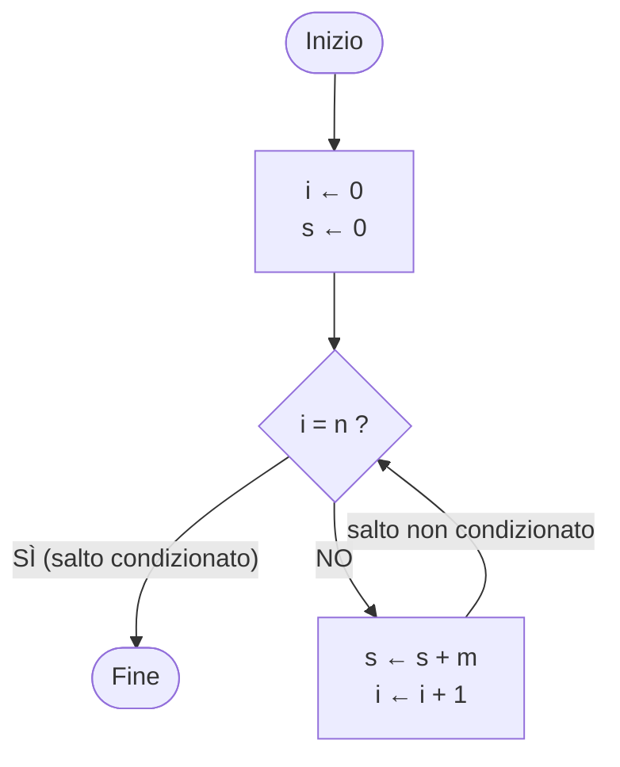

# Contesto completo (tutti i file di contesto_ai/ uniti)

Generato da strumenti/unisci_contesto.py: non modificare a mano, modifica i singoli file e rigenera.

> Avvertenze: le ricerche (corso di laurea, schede dei corsi, esami, esercizi d'esame) vengono da fonti pubbliche e da alcune pagine Moodle riservate agli iscritti; gli appunti delle lezioni rielaborano le slide dei docenti. Sono accurati e con fonti, ma possono contenere errori o dati superati; io, DonFlammer, che curo questa raccolta, non mi assumo alcuna responsabilità. Per date, regole e scadenze fanno fede solo le fonti ufficiali (Moodle, sito del corso di laurea, Esse3). Testo completo: AVVERTENZE.md nella radice del repository.


---

<!-- FILE: contesto_ai/istruzioni_per_ai.md -->
> File: `contesto_ai/istruzioni_per_ai.md`

# Istruzioni per l'AI che legge questi file

Sei il tutor di uno studente del 1° anno di Informatica a UniTo (vedi `studente.md`; chi ha fatto un fork può essere di un altro canale). Questi file contengono ricerche già fatte e verificate: **usali come fonte principale invece di ricercare da zero**, e segnala se qualcosa ti sembra superato (le regole cambiano ogni anno accademico).

Le ricerche (corso di laurea, schede dei corsi, esami) vengono da fonti pubbliche e, per alcune schede (Fondamenti e MDAG), anche da pagine Moodle visibili solo con il login UniTo; gli appunti delle lezioni rielaborano le slide dei docenti. Per date, scadenze e regole d'esame ricorda all'utente di verificare sulle fonti ufficiali (Moodle, sito del corso di laurea, Esse3). Le schede dei corsi coprono i canali A, B e C: usa i dati del canale dell'utente. Gli appunti delle lezioni seguono invece le slide del canale B, quello che seguo io (sono DonFlammer e curo questa raccolta): se l'utente è di un altro canale, ricordagli che programma ufficiale ed esame sono comuni ma slide, ordine degli argomenti, esempi e parti del programma effettivamente svolte possono cambiare, e usa i riferimenti ai canali A e C presenti in ogni lezione.

## Come usare le fonti

- Ogni file indica data di aggiornamento e fonti. Distingui sempre ciò che è **ufficiale per il 2026/27** da ciò che deriva da **anni o canali precedenti** (i file lo segnalano).
- Nelle lezioni (`<CORSO>/lezioni/*.md`) tutto segue le slide o le dispense del corso, tranne le parti marcate **[OLTRE LE SLIDE]** (lezioni più vecchie) o i riquadri `> [!OLTRE]` (lezioni più recenti). Riquadri, quiz, esercizi e formule sono spiegati in `formato_lezioni.md`.
- In caso di dubbio fanno fede le slide del docente, il Moodle del corso e il sito del corso di laurea.

## Regole didattiche

- **Politica dei docenti di Programmazione I sugli LLM**: servono per rivedere esercizi già svolti o capire perché un programma non compila, **non per delegare la soluzione**. Quindi: per esercizi da svolgere, guida con domande e suggerimenti progressivi prima di dare la soluzione completa; per correggere codice, spiega l'errore.
- Rispondi in italiano, con esempi concreti e casi limite. In matematica spiega passo per passo, partendo da un esempio con numeri piccoli, e scrivi tutti i passaggi dei conti.
- Quando scrivi codice C per Programmazione I rispetta le regole d'esame:
  - funzioni iterative: **una sola `return`**, variabili sentinella, **niente `break`, `switch`, `case`, `static`**;
  - funzioni ricorsive: **niente `for`/`while`**, rispetta il tipo richiesto (co-variante, contro-variante, dicotomica);
  - array passati come (lunghezza, puntatore), `size_t` per indici e lunghezze, prototipi dichiarati;
  - il codice deve compilare con **`gcc -Wall -Werror`**; verifica sempre i casi limite (array vuoti, `n = 0`, un solo elemento, negativi).
- Il "caso iniziale" (valore di partenza di accumulatori e sentinelle, casi vuoti) è l'errore più frequente all'esame: controllalo sempre.

## Se devi scrivere gli appunti di una nuova lezione

Le lezioni nuove si scrivono nel formato di `formato_lezioni.md` (modelli: `PROG1/lezioni/02A_da_assembly_a_c.md` e `MDAG/lezioni/L01_numeri_reali.md`), da cui viene generata la pagina HTML. In sostanza:

1. Intestazione YAML con corso, docente, lezione, data, fonte (nome del PDF delle slide).
2. "In breve": 5–8 punti con i concetti chiave.
3. Una sezione per ogni gruppo di slide, **con i numeri di slide**; definizioni esatte in corsivo o in citazione; tabelle per confronti.
4. Pseudocodice e codice in blocchi di codice; formule in LaTeX; figure e strumenti interattivi con i blocchi `grafico` e `widget`.
5. Trappole ed errori tipici; collegamento con l'esame (vedi `PROG1/corso.md` ed `esercizi_esame.md`).
6. Esercizi con soluzione (compilare il C con `gcc -Wall -Werror` prima di scriverlo); domande di ripasso con risposta breve; glossario.
7. Aggiornare `<CORSO>/indice_lezioni.md` con i concetti chiave della nuova lezione e i fili conduttori con le lezioni precedenti.
8. Mettere in un riquadro `OLTRE` tutto ciò che non viene dalle slide o dalle dispense.

Nel repository esiste anche una versione HTML interattiva di ogni lezione (`appunti/<CORSO>/`), pensata per lo studio al computer; il contenuto è lo stesso.


---

<!-- FILE: contesto_ai/formato_lezioni.md -->
> File: `contesto_ai/formato_lezioni.md`

# Formato dei file delle lezioni

I file delle lezioni più recenti (`<CORSO>/lezioni/*.md` con `genera_html: true` nell'intestazione) sono la fonte da cui viene generata la pagina HTML della lezione sul sito, con `strumenti/lezioni.mjs`. Il contenuto è lo stesso; il Markdown ha in più qualche convenzione, spiegata qui per chi lo legge (persone o AI).

## Intestazione YAML

`corso`, `modulo` (per MDAG: `MD` Matematica Discreta, `AG` Algebra lineare e Geometria), `lezione` (codice, per esempio `01B` o `L05`), `titolo`, `data` (solo per le lezioni già svolte), `docenti`, `fonte` (slide o dispense usate), `scheda` (i dati mostrati in cima alla pagina), `materiale` (`slide` o `dispense`), più i campi tecnici per la pagina (`descrizione`, `lede`, `file_en`, `appunti_html`, `genera_html`).

## Struttura

- `## In breve`: i punti chiave della lezione.
- Sezioni `## Titolo (slide 2–5)` o `## Titolo (pp. 20–21)`: tra parentesi le slide o le pagine delle dispense da cui viene la sezione.
- `## Verso l'esame`, `## Quiz`, `## Esercizi`, `## Domande di ripasso`, `## Glossario`, `## Checklist`, `## Fonti`.

## Formule

LaTeX tra `$…$` (nel testo) e `$$…$$` (in un blocco a sé). Abbreviazioni: `\R \N \Z \Q \C \K` per gli insiemi numerici e il campo, `\rk` rango, `\Span`, `\Ker` nucleo, `\Imm` immagine, `\tr` traccia, `\Mat`, `\sgn`, `\id`. `{}^tA` è la trasposta.

## Riquadri

Righe che cominciano con `> [!TIPO] titolo`:

| Tipo | Significato |
|---|---|
| `DEF` | definizione da sapere |
| `PROP`, `TEOREMA`, `LEMMA`, `COROLLARIO` | enunciati, con la numerazione delle dispense o delle slide |
| `ESEMPIO` | esempio svolto |
| `IDEA`, `METODO` | l'idea intuitiva, il procedimento passo per passo |
| `TRAPPOLA` | errore tipico |
| `ESAME` | conta all'esame |
| `OLTRE` | **non** viene dal materiale del corso: aggiunta degli appunti (esempi, collegamenti, richiami) |
| `NOTA`, `OSSERVAZIONE` | osservazioni |
| `DIM` | dimostrazione |
| `CANALI` | differenze e corrispondenze tra i canali A, B e C |

Tutto ciò che sta fuori da un riquadro `OLTRE` (o da una sezione con «oltre le slide/dispense» nel titolo) segue le slide o le dispense. Le lezioni più vecchie, come `PROG1/lezioni/01A_primo_algoritmo.md`, usano ancora il segno **[OLTRE LE SLIDE]**.

## Esercizi, domande, quiz

- `::: esercizio livello titolo` … `::: soluzione` … `:::`, con livello `base`, `medio`, `difficile` o `esame`.
- `::: domanda testo della domanda` … risposta … `:::`.
- Blocco `quiz`: `D:` domanda; `+` risposta giusta, `-` risposta sbagliata (nella pagina l'ordine viene mescolato); `N:` risposta numerica; `=` spiegazione.

## Altri blocchi

- `glossario`: una riga per termine, `Termine | definizione`.
- `checklist`: le voci «So …» da spuntare.
- `grafico`: una figura statica (punti, vettori, rette, poligoni, cerchi), una riga per elemento.
- `widget`: uno strumento interattivo della pagina HTML (piano complesso, vettori, matrici 2×2, calcolatrice di Gauss, Ruffini, spazio in 3D, simulatore della macchina di Von Neumann). Nel Markdown restano solo i parametri iniziali.


---

<!-- FILE: contesto_ai/studente.md -->
> File: `contesto_ai/studente.md`

# Chi sono

- Io, DonFlammer, che curo questa raccolta, sono al primo anno della **Laurea triennale in Informatica, Università di Torino (UniTo)**, A.A. 2026/27 (lezioni iniziate il 28/09/2026).
- **Canale B** (cognomi E–O). Programmazione I: teoria con il prof. Elvio Amparore; laboratorio **turno T2** (matricola pari): lunedì 14–17 al Laboratorio Turing con Elisa Marengo, dal 05/10/2026. Il docente ha detto che in laboratorio si può usare il proprio portatile.
- Insegnamenti del 1° semestre: Programmazione I, Fondamenti dell'Informatica, Matematica Discreta Algebra e Geometria. Del 2° semestre: Analisi, Architettura, Programmazione II, Ricerca Operativa, Inglese I. Dettagli in `unito_informatica.md`.
- Lingua: **italiano**. Messaggi brevi e informali.
- Sistema: Windows 11, Git Bash, `gcc` 16.1 (MinGW-w64), Python 3.12.

## Come voglio essere aiutato

- Invio le **slide lezione per lezione** e voglio **appunti dettagliati "fatti apposta per studiare"**, orientati all'esame.
- Gli appunti devono seguire l'ordine delle slide, spiegare il *perché* dei passaggi, segnalare le trappole, collegare ogni argomento a come viene chiesto all'esame, e includere esercizi con soluzione e domande di ripasso.
- Tutto resta **in locale** e nei repository GitHub `DonFlammer/unito-informatica` e `DonFlammer/unito-computer-science` (la traduzione inglese), pubblici e in sola lettura per gli altri: nessuna altra pagina pubblicata online.
- Voglio file `.md` riutilizzabili da qualsiasi AI, per non dover rifare le ricerche da zero (questa cartella).

## Stato attuale

L'elenco delle lezioni già studiate, con i concetti chiave, è in `PROG1/indice_lezioni.md`; per gli altri corsi un file analogo `<CORSO>/indice_lezioni.md` verrà creato con la prima lezione studiata.


---

<!-- FILE: contesto_ai/unito_informatica.md -->
> File: `contesto_ai/unito_informatica.md`

# Informatica a UniTo — come funziona (A.A. 2026/27)

Aggiornato al 28/09/2026. Fonti primarie: sito del corso di laurea (laurea.informatica.unito.it: Guida e Manifesto 2026/27, Regolamento L-31 coorte 2026, Calendario didattico, Appelli d'esame), bacheca Esse3, pagine di Ateneo sulla verbalizzazione. Fonti secondarie: guida degli studenti TSI (github.com/tsi-unito/guida_degli_studenti_di), scritta da studenti.

## Il corso di laurea

- **Laurea triennale in Informatica**, classe **L-31**, codice CdS 0801L31. Dipartimento di Informatica, via Pessinetto 12 / corso Svizzera 185, Torino.
- 3 anni, **180 CFU**: 156 di insegnamenti, 9 di stage, 3 di prova finale, 12 liberi. 1 CFU = 25 ore di lavoro (di norma 8 h di lezione + 17 di studio, oppure 10 h di laboratorio + 15 di studio).
- Accesso libero con **TOLC-S** (CISIA): superato con almeno 5/20 in Matematica di base; sotto soglia scatta l'**OFA di matematica**, da assolvere entro il 1° anno (corso su www.ofa.unito.it + esame in presenza). Guida dedicata, con regole, date, appunti dei moduli e simulazioni: https://donflammer.github.io/unito-ofa-matematica/ (repository DonFlammer/unito-ofa-matematica, contesto per le AI nella cartella `ai/`).
- Didattica in presenza; frequenza **non obbligatoria** ma fortemente raccomandata.
- A tempo pieno si registrano al massimo 80 CFU all'anno (tempo parziale: 36).

## Canali e turni (1° anno)

- Lezioni divise per iniziale del cognome: **Canale A = A–D, Canale B = E–O, Canale C = P–Z**.
- Laboratori in turni: **turno 1 = matricola dispari, turno 2 = matricola pari** (A1/A2, B1/B2, C1/C2). Assegnazione automatica. I turni valgono solo per i corsi con laboratorio (Programmazione I e II, Architettura).
- Non esiste una procedura per cambiare canale. La FAQ del corso di laurea dice che, finché c'è posto in aula, si possono seguire le lezioni di un altro canale; per gli esami valgono le regole del proprio canale (e i corsi del 1° anno hanno quasi tutti un esame unico).
- Dal 2° anno i canali diventano due: A (A–K) e B (L–Z).
- **Orari** (University Planner, un calendario per canale con tutti i corsi): [Canale A](https://unito.prod.up.cineca.it/calendarioPubblico/linkCalendarioId=613b9237d969e100173d4110) · [Canale B](https://unito.prod.up.cineca.it/calendarioPubblico/linkCalendarioId=613b92a1d969e100173d4111) · [Canale C](https://unito.prod.up.cineca.it/calendarioPubblico/linkCalendarioId=613b9315da7aec0018faeed7). Anche nell'app MyUniTO+, ma solo per i corsi già nel piano carriera. Il 2° semestre non è ancora pubblicato.

## Primo anno 2026/27 (60 CFU)

Schede complete di ogni corso (docenti, orari, esame, programma, materiale, consigli): cartelle `PROG1/`, `FDA/`, `MDAG/`, `ANMAT/`, `ARCH/`, `PROG2/`, `RO/`, `INGLESE/`.

| Insegnamento | CFU | Sem. | Esame (uguale per i tre canali) |
|---|---|---|---|
| **Programmazione I** (MFN0582, in C) | 9 | 1° | scritto al PC su Moodle (programmazione, correttezza, memoria) |
| **Fondamenti dell'Informatica** (INF0348) | 9 | 1° | scritto su Moodle: 9 quiz + domanda aperta facoltativa |
| **Matematica Discreta, Algebra e Geometria** (INF0328) | 12 | 1° | due prove scritte separate (MD e AG), voto = media |
| Analisi Matematica (MFN0570) | 9 | 2° | tre prove al PC (quiz, teoria, esercizi) |
| Architettura degli Elaboratori (INF0326) | 6 | 2° | scritto al PC (ammissione + laboratorio RISC-V) + orale obbligatorio; su Esse3 un appello per canale ("ARCHIT. ELAB. CORSO A/B/C", stessa data e stessi laboratori): iscriversi a quello del proprio canale |
| Programmazione II (INF0330, in C) | 6 | 2° | progetti di laboratorio obbligatori + esonero + scritto |
| Ricerca Operativa (INF0327) | 6 | 2° | scritto al PC + orale facoltativo (da −16 a +6) |
| Lingua Inglese I (MFN0590) | 3 | 2° | test SET al PC, senza voto; riconoscibile con certificazione |

### Docenti per canale

| Insegnamento | Canale A (A–D) | Canale B (E–O) | Canale C (P–Z) |
|---|---|---|---|
| Programmazione I | Fiandrotti · lab A1 Colonnelli, A2 Antelmi | Amparore · lab B1 Basile, B2 Marengo | Mazzei (teoria e lab C1, C2) |
| Fondamenti dell'Informatica | Cardone | Berardi | Paolini |
| MDAG – Matematica Discreta | Longhi e Terracini | Mori | Longhi e Terracini |
| MDAG – Algebra Lineare e Geometria | Buzano | Buzano e Radeschi | Radeschi |
| Analisi Matematica | Soave e Colasuonno | Boscaggin e Tione | Seiler e Tione |
| Architettura degli Elaboratori | Gaeta (teoria e lab A1, A2) | Drago (teoria e lab B1) · lab B2 Lucenteforte | Schifanella (teoria e lab C1) · lab C2 Torta |
| Programmazione II | Damiani (teoria e lab A1, A2) | Birke · lab B1 e B2 Torta | Garetto (teoria e lab C1) · lab C2 Audrito |
| Ricerca Operativa | Grosso | Aringhieri | Hosteins |
| Lingua Inglese I | unica per tutti: Commissione Lingua Inglese, esercitatrice Ieluzzi | | |

### Orari del 1° semestre 2026/27

| Canale | Programmazione I | Fondamenti | MDAG – MD | MDAG – AG |
|---|---|---|---|---|
| **A** · Aula A | mar 9–11, mer 11–13 · lab A1 gio 14–17, A2 mer 14–17 | lun 11–13, gio 9–11, ven 9–11 | mar 11–13, gio 11–13, alcuni mer 9–11 | lun 9–11, ven 11–13, alcuni mer 9–11 |
| **B** · Aula B | mar 11–13, mer 9–11 · lab B1 mar 14–17, B2 lun 14–17 | lun 9–11, gio 9–11, ven 11–13 | lun 11–13, ven 9–11, alcuni mer 11–13 | mar 9–11, gio 11–13, alcuni mer 11–13 |
| **C** · Aula A (pomeriggio) | lun 14–16, gio 14–16 · lab C1 mer 9–12, C2 mar 9–12 | mar 14–16, mer 16–18, ven 13–15 | mar 16–18, ven 15–17, alcuni mer 14–16 | lun 16–18, gio 16–18, alcuni mer 14–16 |

I laboratori di Programmazione I sono al laboratorio Turing e partono dalla 2ª settimana (5–8 ottobre).

### Appelli già pubblicati per i corsi del 1° semestre

| Data | Esame | Iscrizioni |
|---|---|---|
| mar 19/01/2027 14:00 | MDAG – Matematica Discreta | 30/12 – 12/01 |
| ven 22/01/2027 14:00 | MDAG – Geometria | 02/01 – 15/01 |
| lun 25/01/2027 9:00 | Programmazione I | 05/01 – 18/01 |
| ven 29/01/2027 9:00 | Fondamenti dell'Informatica | 09/01 – 22/01 |
| mer 03/02/2027 14:00 | MDAG – Matematica Discreta | 14/01 – 27/01 |
| ven 05/02/2027 14:00 | MDAG – Geometria | 16/01 – 29/01 |
| gio 11/02/2027 9:00 | Programmazione I | 22/01 – 04/02 |
| gio 18/02/2027 9:00 | Fondamenti dell'Informatica | 29/01 – 11/02 |

Gli appelli già in bacheca per i corsi del 2° semestre (Analisi 18/01, Architettura 01/02, Inglese 02/02, Programmazione II 08–09/02, Ricerca Operativa 19/02) sono sessioni pensate per chi ha seguito quei corsi negli anni precedenti (il Regolamento L-31, art. 6 c. 4, fa iniziare gli appelli al termine dell'attività didattica; per Inglese non è chiaro se le matricole possano già usare l'appello del 02/02/2027: vedi INGLESE/corso.md).

### Pagine Moodle 2026/27

| Corso | Moodle (informatica.i-learn.unito.it/course/view.php?id=…) |
|---|---|
| Programmazione I | A 3701 · B 3773 · C 3767 (accesso ospite) |
| Fondamenti dell'Informatica | A 3851 (ospite) · B 3747 (login, iscrizione libera) · C 3635 (ospite) · pagina d'esame su Moodle Esami: esami.i-learn.unito.it id=2673 (login; esercizi delle lezioni e vecchi esami) |
| MDAG | Parte 1 (MD) 3829 · Parte 2 (AG) 3831 (login, comuni ai canali) |
| Analisi Matematica | 3703 (login, comune) |
| Architettura degli Elaboratori | 3833 (login, comune) |
| Programmazione II | A teoria 3651, lab A1 3653, lab A2 3655; lab C2 3757 (login); le altre non ancora create |
| Ricerca Operativa | 3719 "Ricerca Operativa (A,B,C)" (login, comune ai tre canali; 2025/26: 3555) |
| Lingua Inglese I | 3805 (login, comune) |

Tutte le pagine sono nella categoria "Anno Accademico 26/27 > Primo anno Laurea". Iscriversi subito a quelle dei corsi del 1° semestre.

Secondo anno: ASD, Basi di Dati, Probabilità e Statistica, PPOO, Sistemi Operativi (9 CFU ciascuno) + una tra Economia/Diritto e una tra Fisica/Logica (6). Terzo anno: Sviluppo Applicazioni Software, Reti e Sicurezza + insegnamenti a scelta, stage, prova finale.

## Calendario 2026/27

| Periodo | Date |
|---|---|
| 1° semestre (lezioni) | 28/09/2026 – 15/01/2027 · pausa natalizia 23/12/2026 – 06/01/2027 |
| Sessione invernale (+ straordinaria) | 18/01/2027 – 19/02/2027 |
| 2° semestre (lezioni) | 22/02/2027 – 04/06/2027 · pausa pasquale 25–30/03/2027 |
| Esperimento 3° appello insegnamenti del 1° semestre | 31/03 e 1–2/04/2027 (dettagli non ancora pubblicati) |
| Sessione estiva | 07/06/2027 – 30/07/2027 |
| Sessione autunnale | dal 01/09/2027 all'inizio delle lezioni 2027/28 |

Altre date:
- **"1st year survival kit"** (incontro per le matricole, comune ai tre canali): 13 e 14/10/2026, 13:00–14:00, Aula A.
- **Piano carriera 2026/27**: date non ancora pubblicate (nel 2025/26 si compilava dal 10/10). È indispensabile per iscriversi agli esami, anche del 1° anno: compilarlo appena si apre la finestra.
- **Edumeter**: la valutazione del corso va compilata prima di iscriversi all'appello; dal 2026/27 un giudizio negativo richiede un commento. Chi non vuole valutare un aspetto deve scegliere "non applicabile".

## Regole d'esame (coorte 2026 e regole di Ateneo)

- **Appelli**: almeno 5 all'anno per insegnamento; 2 nelle settimane di pausa dopo il semestre in cui si è seguito il corso; almeno 10 giorni tra due appelli dello stesso esame.
- **Tentativi**: allo stesso esame ci si presenta **al massimo 3 volte per anno accademico** (Regolamento L-31, art. 6 c. 13) → non conviene "provare" a ogni appello. Gli appelli da cui ci si ritira non contano nei 3 tentativi (Regolamento didattico di Ateneo, art. 24 c. 7), purché ci si ritiri prima della comunicazione del voto: dopo si può solo rifiutarlo, e quel tentativo conta (pagina d'esame di Fondamenti 2026/27). La presenza all'appello viene comunque registrata (Esse3 traccia anche prove fallite e assenze). Se non ci si presenta, cancellarsi dalla Bacheca prenotazioni entro la chiusura.
- **Iscrizione** da MyUniTo (Esami → Appelli disponibili), entro le 23:59 del giorno di chiusura. Servono: **tasse in regola**, **piano carriera compilato e approvato** (obbligatorio anche per il 1° anno), **valutazione Edumeter** dell'insegnamento (senza, Esse3 blocca l'iscrizione). Chi resta iscritto e non si presenta risulta assente.
- **Voto** in trentesimi, sufficienza 18; lode all'unanimità e solo con 30. Ci si può ritirare fino alla proclamazione dell'esito (la presenza viene comunque registrata).
- **Rifiuto del voto** (scritti con verbalizzazione online): l'esito arriva in "Bacheca esiti" e per email; si hanno **almeno 5 giorni** per rifiutarlo, altrimenti vale il silenzio-assenso. Gli esiti negativi non vanno sul libretto. Negli orali si accetta o rifiuta subito.
- **Modalità d'esame**: fissate dal docente prima dell'anno accademico nella scheda insegnamento, uguali per tutti gli appelli dell'anno.
- **Sbarramento**: per sostenere esami del 2°/3° anno servono almeno **21 CFU del 1° anno** e, per la coorte 2026, l'OFA superato (o la soglia TOLC-S). L'OFA **non** blocca gli esami del 1° anno. Nessun'altra propedeuticità obbligatoria (solo consigliate).
- Il programma della propria coorte si può portare all'esame per altri 3 anni, avvisando il docente.
- DSA e disabilità: supporti da richiedere per tempo agli uffici di Ateneo (referenti CdL: prof.ssa Damiano per DSA, prof.ssa Baroglio per disabilità).

## Piattaforme e contatti

- **Moodle I-Learn**: https://informatica.i-learn.unito.it (tutti i corsi del primo anno 2026/27: https://informatica.i-learn.unito.it/course/index.php?categoryid=485) — iscriversi alla pagina di ogni corso: una per canale per Programmazione I (laboratori compresi) e Fondamenti; per Programmazione II una pagina di teoria per canale più una per ogni turno di laboratorio; una pagina comune ai tre canali per MDAG (parte 1 e parte 2), Analisi, Architettura, Ricerca Operativa e Inglese. Al 28/09/2026 l'accesso ospite funziona solo su Programmazione I A/B/C e Fondamenti A e C.
- **MyUniTo / Esse3**: iscrizione agli appelli, esiti, piano carriera. Bacheca pubblica appelli: https://esse3.unito.it/ListaAppelliOfferta.do
- **Orari**: University Planner o app MyUniTO+.
- **Edumeter**: https://www.edumeter.unito.it (valutazione degli insegnamenti).
- Email istituzionale **nome.cognome@edu.unito.it**: usarla sempre per scrivere ai docenti; lì arrivano anche le convocazioni agli esami.
- **PC dei laboratori**: al Turing si entra con le credenziali SCU/MyUniTo; per i laboratori Dijkstra e Von Neumann può servire un account @educ.di.unito.it (richiesta a aperturalogin@educ.di.unito.it). Gli esami al PC di Prog I si svolgono in questi tre laboratori.
- **Tutorato matricole**: sportello nell'aula studio del complesso Pier della Francesca (da fine settembre, lun–ven) e online su prenotazione, tutorato.informatica@unito.it. Tutorato individuale: pagina Moodle a cui le matricole vengono iscritte d'ufficio (commtutor@educ.di.unito.it). Servizi di Ateneo: SUPERA (metodo di studio), SAMBA (benessere).
- **Aule e laboratori**: via Pessinetto 12, piano rialzato; aule A e B da 218 posti; laboratori Turing e Von Neumann (Windows), Dijkstra e Babbage (Unix). In caso di necessità si usa anche l'aula dell'Hotel Royal, corso Regina Margherita 249.

## Gruppi Telegram

- **Ufficiale del 1° anno** (dalla pagina Tutorato del corso di laurea): https://t.me/+0sR7CugDQlllNzU0 — al 28/09/2026 il link non apre nessun gruppo (invito scaduto o revocato): chiedere quello aggiornato a tutorato.informatica@unito.it. Il gruppo del 1° anno attivo è quello studentesco «Informatica anno 1 @ Unito» (Generale 1° anno, qui sotto).
- **Studenteschi** (Team Studentesco Informatica, indice su https://tsi-unito.eu/links.html; i canali A, B, C del 1° anno sono uniti):

| Gruppo | Link |
|---|---|
| Generale 1° anno | https://t.me/+Ox2fUmU2Un4xYTM0 |
| Programmazione I | https://t.me/+pgWXz9_rIdU2ZGU0 |
| Fondamenti dell'Informatica | https://t.me/+i98q9jlppjZhYzI0 |
| MDAG | https://t.me/+doM_i3uFgYg1MjVk |
| Analisi | https://t.me/+bIy-EgjtRrhhNmE8 |
| Architettura | https://t.me/+REfz_GZ2fytlOWE0 |
| Programmazione II | https://t.me/+xJOmjJInA4VjMDBk |
| Ricerca Operativa | https://t.me/+lRZmXg1uiA4yOTQ0 |
| Off Topic | https://t.me/+Ye04aIAdXfI4Yzlk |

Per Inglese non c'è un gruppo dedicato: si usa il generale. I link di invito possono cambiare: in caso di problemi partire dalla pagina TSI.

## Vita pratica (dalla guida TSI)

- **Tasse**: calcolate sull'ISEE universitario, 4 rate; prima rata 156 € uguale per tutti; senza ISEE si paga il massimo.
- **EDISU**: borse di studio (contano i CFU, non i voti), mensa agevolata, aule studio (corso Svizzera 185). Biblioteca di Dipartimento in via Pessinetto 12 (posto prenotabile con Affluences).
- **Trasporti**: tessera Piemove gratuita per under 26 con ISEE fino a 85.000 € (dal 2025/26).
- Collaborazioni part-time: non disponibili al 1° anno.

## Metodo di studio consigliato

- Dalla guida TSI: **active recall** (flashcard, riassunti a memoria, spiegare ad alta voce) + **ripetizione dilazionata** (ripasso dopo 1 giorno, 1 settimana, 1 mese); tecnica del pomodoro; studiare un po' ogni giorno; fare esercizi.
- Dai docenti di Prog I (introduzione 2026/27): frequentare prendendo appunti, ripassare la lezione precedente, approfondire sul libro, frequentare i laboratori e i tutor; la "maratona" di registrazioni prima dell'esame non funziona.


---

<!-- FILE: contesto_ai/PROG1/corso.md -->
> File: `contesto_ai/PROG1/corso.md`

# Programmazione I — scheda completa del corso (canali A, B, C · A.A. 2026/27)

Aggiornato al 28/09/2026. Fonti primarie: scheda insegnamento MFN0582, Moodle 2026/27 dei tre canali (accesso ospite), calendari University Planner, bacheca Esse3, Regolamento L-31 coorte 2026. Fonti secondarie: materiale degli anni passati (guida studenti TSI, Moodle 2025/26, repository di studenti). Ogni informazione riporta anno/canale di validità quando non è certa per il 2026/27. **Programma ed esame sono unici per i tre canali**; cambiano docenti, orari, slide e ordine degli argomenti.

## Dati essenziali

| Voce | Valore |
|---|---|
| Codice | MFN0582 · 9 CFU (6 teoria + 3 laboratorio) · 1° anno, 1° semestre · SSD INF/01 |
| Linguaggio | C |
| Ore | 48 h teoria (24 lezioni da 2 h) + 30 h laboratorio (10 esercitazioni da 3 h) · carico totale ≈ 225 h |
| Periodo | 28/09/2026 – 15/01/2027 (pausa 23/12/2026 – 06/01/2027) |
| Frequenza | facoltativa ma raccomandata; registrazioni Webex su Moodle "non garantite" e "non sostituiscono la presenza" |
| Prerequisiti | nessuno di programmazione; matematica di base e buon italiano |
| Propedeuticità | nessuna in ingresso; Prog I è competenza attesa per Prog II, Architettura, ASD, PPOO, Sistemi Operativi (consigliata, non vincolante) |

## Docenti, orari e Moodle

| | Canale A (cognomi A–D) | Canale B (cognomi E–O) | Canale C (cognomi P–Z) |
|---|---|---|---|
| **Teoria** | Attilio Fiandrotti · mar 9–11, mer 11–13 · Aula A · dal 29/09 | Elvio G. Amparore · mar 11–13, mer 9–11 · Aula B · 1ª lezione lun 28/09 11–13 | Alessandro Mazzei · lun 14–16, gio 14–16 · Aula A · dal 28/09 |
| **Lab turno 1** (matricola dispari) | Iacopo Colonnelli · gio 14–17 · Turing · dall'08/10 | Valerio Basile · mar 14–17 · Turing · dal 06/10 | Alessandro Mazzei · mer 9–12 · Turing · dal 07/10 |
| **Lab turno 2** (matricola pari) | Alessia Antelmi · mer 14–17 · Turing · dal 07/10 | Elisa Marengo · lun 14–17 · Turing · dal 05/10 | Alessandro Mazzei · mar 9–12 · Turing · dal 06/10 |
| **Moodle 2026/27** (accesso ospite) | [id=3701](https://informatica.i-learn.unito.it/course/view.php?id=3701) | [id=3773](https://informatica.i-learn.unito.it/course/view.php?id=3773) | [id=3767](https://informatica.i-learn.unito.it/course/view.php?id=3767) |
| **Archivio 2025/26** (stessi docenti di teoria) | id=3455 | id=3461 (con i quiz "Preparazione Esame") | id=3507 (con "Riepilogo Esame") |

- Per vedere i materiali basta "Accedi come ospite"; per ricevere gli annunci bisogna iscriversi alla pagina del proprio canale.
- Ultime lezioni: canale A fino al 22/12 e poi 12–13/01; canale B fino al 13/01/2027; canale C fino al 21/12 e poi 7, 11, 14/01/2027. Ultimi laboratori a metà gennaio.
- Tutorato con studenti laureati: nel 2025/26 partiva a fine ottobre (in presenza e su Webex), annunciato nei forum.
- Comunicazioni generali ai docenti: programmazione1-docenti@di.unito.it; ricevimento su appuntamento via email (indirizzi sulle pagine docente del sito del corso di laurea). Scrivere solo da @edu.unito.it con nome, cognome, anno e canale.
- Nel 2025/26 ci sono stati spesso spostamenti e annullamenti (lab annullati per le sedute di laurea, scambi con altri corsi): seguire forum Annunci e University Planner.
- Attenzione alle slide: il canale C (slide 4) indica i canali come "A-E / F-O" e il canale A (slide 2) dice "laboratorio dal 24/9". Fanno fede la divisione A–D / E–O / P–Z e le date di Moodle e University Planner.

## Libro

Deitel, Deitel, Maselli — *Il linguaggio C. Fondamenti e tecniche di programmazione*, IX ed. (Pearson 2022): manuale di riferimento in tutti e tre i canali (capitoli 1–9 o 1–10, più l'allocazione dinamica del cap. 12); copie in biblioteca al 1° piano, disponibile anche in versione elettronica. La slide di Prog I dice che è lo stesso testo di Prog II, ma la scheda di Prog II 2026/27 indica che il libro è ancora da scegliere. Alternativi: Prata *C Primer Plus*; Hanly–Koffman *Problem solving e programmazione in C*. Avvertenza dei docenti: la **correttezza formale** non è nel libro, fanno fede slide e lezioni.

## Programma ufficiale (scheda 2026/27)

Modello di memoria · tipi elementari · assegnazione ed espressioni · stato · puntatori (incremento, decremento, `malloc`, `free`) · selezione e verifica di proprietà · programmazione iterativa (problemi numerici: addizione, moltiplicazione, serie; problemi su array: filtri, riorganizzazioni, conteggi) · funzioni e frame-stack (signature, parametri attuali/formali, variabili locali, rientro, operand stack) · ricorsione e correttezza (numerici, stringhe, co/controvarianti e dicotomici su array, strutture puntate) · schemi avanzati: `struct`, quantificatori alternati su coppie di array e matrici.

## Sequenza prevista delle lezioni

Ricostruita dai Moodle 2025/26 degli stessi docenti; da confermare lezione per lezione.

**Canale A (Fiandrotti)** — deck numerati come il B e con testi quasi identici: 00 introduzione → 01A primo algoritmo → 01B architettura → 02A da assembly a C → 02B assegnazione, modello di memoria, scambio → 02C referenziamento, `scanf`, puntatori → float → booleani → if-else → while e for → array e stringhe → algoritmi su array → matrici → funzioni e chiamata → passaggio per riferimento → passaggio di array e matrici → allocazione dinamica → ricorsione (introduzione, numerica, su array) → ricerca binaria e ricorsione dicotomica → aritmetica dei puntatori → correttezza → esercizi di preparazione all'esame. Particolarità: puntatori già dalla 2ª settimana, array e matrici prima delle funzioni.

**Canale C (Mazzei)** — un deck lungo per lezione: 01 Introduzione (algoritmo, Von Neumann, assembly, FORTRAN) → 02 Il C (main, printf, gcc, tipi, variabili, assegnamento, scambio) → 03 Dai numeri ai puntatori → 04 Booleani → 05 IF → 06 While e For → 07 Funzioni → 08 Array → 09 Matrici → 10 Ancora array e matrici (heap, `malloc`) → 11 Ricorsione → 12 Ricorsione su array e ricerca dicotomica → Assert e correttezza → Riepilogo esame. Particolarità: funzioni prima di array e matrici; ricorsione concentrata in 5 lezioni verso la fine (lezioni 17–21 su 24, dal 17/11 al 01/12/2025), seguite da "Assert e correttezza" (04/12) e dal riepilogo d'esame (11–12/12).

**Canale B (Amparore)**, settimana per settimana:

| Sett. | Teoria | Laboratorio (dal 5/10) |
|---|---|---|
| 1 | Il primo algoritmo (01A) · architettura del calcolatore · programmazione strutturata e linguaggio C | — |
| 2 | Memoria e variabili, assegnamento · referenziamento, input e puntatori in C | Lab01 riga di comando, compilatore |
| 3 | Scambio di variabili · virgola mobile · espressioni e variabili booleane · decisioni | Lab02 operatori e tipi, cast, limiti |
| 4 | Cicli e ripetizioni | Lab03 condizioni booleane, CodeRunner |
| 5 | Array e stringhe · funzioni | Lab04 iterazioni, accumulatori, quantificatori |
| 6 | Chiamata di funzione, asserzioni | Lab05 array e stringhe |
| 7 | Algoritmi su array | Lab06 funzioni |
| 8 | Matrici | Lab07 operazioni su array, memoria dinamica, intervalli semiaperti |
| 9 | Memoria dinamica · ricorsione | Lab08 matrici |
| 10 | Ricorsione su array | Lab09 ricorsione 1: caso base, involucro, co/controvariante |
| 11 | Ricerca binaria · correttezza (invarianti, sentinelle, asserzioni) | Lab10 ricorsione 2: intervalli, dicotomica, coppie di array, matrici |
| 12 | Ultime lezioni (dicembre) | — |

Nota: la colonna laboratori è indicativa e assume un laboratorio a settimana. Nel 2025/26 (Moodle id=3461) le settimane 4 e 8 sono state senza laboratorio e la sequenza reale è stata Lab01 sett. 2, Lab02 sett. 3, Lab03 sett. 5, Lab04 sett. 6, Lab05 sett. 7, Lab06 sett. 9, Lab07 sett. 10, Lab08 sett. 11, Lab09 sett. 12, Lab10 sett. 13. Nel 2026/27 (University Planner) il turno T2 ha 13 date, ogni lunedì dal 05/10 al 21/12 più l'11/01; il turno T1 ne ha 11, ogni martedì dal 06/10 al 22/12 tranne il 27/10 e l'08/12 (festivo), più il 12/01. Quale laboratorio si fa in ciascuna settimana va verificato sul Moodle del canale B.

**Laboratori:** stessa sequenza Lab01–Lab10 e stessi quiz CodeRunner in tutti i canali (introduzione e compilatore → operatori e tipi → condizioni booleane → iterazioni → array e stringhe → funzioni → operazioni su array con heap → matrici → ricorsione 1 → ricorsione 2).

### Dove si trova la lezione 01A negli altri canali
- **Canale A**: deck molto simile "01A_primo_algoritmo" (40 slide, settimana 28/09–02/10). Stesse versioni dell'algoritmo V1–V6, incluso il bug del caso n = 0; mancano la slide "In informatica tutto è numero", la slide "Progettare un algoritmo" (input, output, passi, terminazione), il riquadro su dati/procedure e Wirth, la V7 senza numeri di riga e il confronto tra flow-chart e rappresentazione strutturata, e la slide sul caso iniziale non dice "anche in sede d'esame". Nella stessa settimana c'è anche "01B_architettura" (storia del calcolatore, bit e byte, Von Neumann).
- **Canale C**: sezione "Il Primo Algoritmo" (slide 20–42) della lezione 01 del 28/09. Parte dall'addizione in colonna ("le istruzioni della maestra") e usa "dita" come nome del contatore; **non** presenta le formulazioni sbagliate né il caso n = 0, ma arriva subito allo pseudocodice corretto (righe 0–6, "Se dita == n salta alla riga 6") e al diagramma di flusso. Nella stessa lezione prosegue con Von Neumann, istruzioni macchina (LOAD, STORE, ADD, CMP, JMP) e la stessa moltiplicazione in assembly e in FORTRAN.

## Esame

### Ufficiale 2026/27
- Scheda: *"L'esame è essenzialmente uno scritto che si svolge al calcolatore o su carta."* Verifica progettazione e codifica di algoritmi iterativi e ricorsivi, domande su correttezza e terminazione, simulazione del linguaggio a runtime. *"La somma dei punteggi degli esercizi proposti permetterà di ottenere voti sino al 30 e Lode."* Niente orale, progetto o esoneri.
- Slide "Tipico esame di Programmazione 1" (introduzione canale B 2026/27, identica in A e C): esercizi **in laboratorio su Moodle al PC**; programmazione **iterativa e ricorsiva**; **teoria** (correttezza, tipi); **stato della memoria** (esecuzione simulata). Dettagli ed esercizi simil-esame a fine corso.
- **Appello unico per i canali A, B, C**; commissione: Mazzei (presidente), Amparore, Antelmi, Basile, Fiandrotti, Marengo.
- Appelli 2026/27 già pubblicati: **lun 25/01/2027 ore 9:00** (iscrizioni 05/01–18/01) e **gio 11/02/2027 ore 9:00** (iscrizioni 22/01–04/02), laboratori Turing + Dijkstra + Von Neumann. Riferimento 2025/26: 5 appelli (22/01, 09/02, 11/06, 09/07, 15/09) con 399, 319, 174, 158, 107 iscritti. Il calendario 2026/27 del corso di laurea prevede anche, in via sperimentale, un 3° appello per gli insegnamenti del 1° semestre il 31/03 e l'1–2/04/2027 (dettagli non ancora pubblicati).
- Tempistica canale B: ultima lezione di teoria mer 13/01/2027, ultimi laboratori 11/01 (T2) e 12/01 (T1). Le iscrizioni al 1° appello (05/01–18/01/2027) si aprono negli ultimi due giorni della pausa natalizia (che finisce il 06/01) e restano aperte durante le ultime lezioni: **entro il 18/01 servono piano carriera APPROVATO ed Edumeter di Prog I compilato**. Le iscrizioni al 2° appello aprono il 22/01, prima che si svolga il 1°.

### Logistica e strumenti all'esame (dati certi + deduzioni dagli anni passati)
- **Turni**: i tre laboratori hanno 118 postazioni (Turing 52, Dijkstra 36, Von Neumann 30) contro circa 400 iscritti al 1° appello → l'appello viene diviso in turni su più giorni (5 turni in 3 giorni nel 2023/24, 4 turni in 2 giorni nel 2024/25, "diverse sessioni" nel 2025/26). La convocazione arriva via email @edu.unito.it: presentarsi solo se convocati; impedimenti gravi per un turno vanno segnalati a programmazione1-docenti@di.unito.it entro la scadenza indicata.
- **Credenziali**: al Turing ci si collega con le credenziali SCU/MyUniTo (conoscerle bene; nel 2023/24 si consigliava di cambiare la password almeno una volta prima dell'esame). Per Dijkstra e Von Neumann la pagina del CdL (aggiornata al 2023) richiede un account @educ.di.unito.it, da chiedere a aperturalogin@educ.di.unito.it (lunedì e venerdì, risposta entro 2 giorni lavorativi): chiedere ai docenti se serve anche all'esame.
- **Strumenti**: all'esame si usa "una piattaforma web che vi fornisce un editor di testo semplice", quindi **niente IDE né autocompletamento** (Lab01 2025/26 di Amparore). Esercitarsi con un editor semplice e `gcc -Wall -Werror`, senza Copilot.
- **Piattaforma**: non è documentato se si usi il Moodle del CdL o il Moodle "Esami" di Ateneo. La prova su carta resta formalmente possibile (dal 2023/24 al 2025/26 si è sempre svolta al PC).
- **Tentativi**: al massimo 3 per anno accademico; non è chiarito se un ritiro conti, e la presenza viene comunque registrata → non iscriversi "per provare"; se non ci si presenta, cancellarsi dalla Bacheca prenotazioni entro la chiusura.

### Struttura probabile (anni passati, da confermare a fine corso)
- Canale C 2025/26: **5 esercizi CodeRunner su Moodle**: 2 di teoria (correttezza di una sequenza di assegnazioni; stato della memoria stack) + 3 di programmazione (iterativa, ricorsiva, con heap/`malloc`). 31–32 punti = 30 e lode. *"Passare tutti i test è condizione necessaria ma non sufficiente"*: il codice viene anche letto.
- Canale C 2023/24: 4 esercizi da 8 punti (2 di teoria + iterativo e ricorsivo; niente esercizio sull'heap); 31–32 = 30 e lode.
- Epoca Java 2016–2019: 4 esercizi (iterativo 7, ricorsivo 7, induzione/invariante 10, memoria 8).
- Nel 2025/26 i canali A e B condividevano i quiz Moodle "Preparazione Esame": Esercizi Iterativi, Ricorsivi, Heap, Modello Memoria.

### Regole per gli esercizi di programmazione (esame unico per i canali)

Fonti: le regole sulle funzioni iterative e quelle sulle ricorsive (niente cicli, `return` multipli ammessi) vengono dal riepilogo d'esame 2025/26 del canale C (slide 4–5); `-Wall -Werror` viene dal Lab01 2025/26 del canale B ("in sede di esame useremo -Wall -Werror"); tipo di ricorsione richiesto, formato delle `printf`, array passati come coppia, prototipi e casi limite sono indicazioni pratiche e convenzioni del corso, non regole scritte d'esame.

- Funzioni **iterative**: un solo punto di ingresso e di uscita → **una sola `return`**; usare **variabili sentinella** e buffer; **vietati** `case`, `switch`, `break`, `static` e costrutti non visti a lezione. (Nel 2023/24 le regole erano le stesse tranne il divieto di `static` e dei costrutti non visti a lezione.)
- Funzioni **ricorsive**: **vietati** `for` e `while`; `return` multipli ammessi; rispettare il **tipo di ricorsione** richiesto (co-variante, contro-variante, dicotomica).
- Compilazione con **`-Wall -Werror`** (un warning = errore). CodeRunner confronta l'output con quello atteso: rispettare esattamente il formato delle `printf`.
- Array passati sempre come coppia (lunghezza, puntatore); dichiarare i prototipi.
- Casi limite pesano molto: righe = 0 (vacuamente vero), array vuoti, `NULL`.

### Da chiedere / verificare a fine corso
Durata della prova; numero di esercizi e punti per il 2026/27; materiale consentito; se le ausiliarie delle ricorsive possono essere iterative.

## Tipologie d'esame e trappole

| Tipologia | Forma tipica | Trappole |
|---|---|---|
| Iterativa (`e1`) | funzione con firma data su array/matrici (anche irregolari `rows, cols, mat[rows][cols], rags[rows]`), quantificatori per-ogni/esiste, risultato extra via puntatore | sentinella iniziale sbagliata (`true` per "per ogni", `false` per "esiste"), casi vuoti, `break`, scorrere fino a `cols` invece di `rags[i]` |
| Ricorsiva (`e2` involucro + `e2R`) | tipo imposto; co-variante (caso base `n == 0`, lavora su `a[n-1]`), contro-variante (`i == aLen`), dicotomica su `[l, r)` (`l == r` vuoto, `r - l == 1` singolo, `m = (l + r) / 2`) | cicli nella ricorsiva, tipo sbagliato, leggere `a[l]` su intervallo vuoto, ordine invertito scrivendo dopo la chiamata |
| Heap | funzione che restituisce un array allocato con `malloc` e la lunghezza in un parametro di uscita | dimensione allocata, `NULL`, lunghezza non aggiornata |
| Modello della memoria | quiz: valori nei frame, numero di chiamate, altezza massima dello stack (main compreso), punto di rientro (A)/(B) | aliasing degli array (tutti i frame vedono l'array del main), il caso base crea un frame, istruzioni dopo la chiamata eseguite in risalita, celle non inizializzate |
| Correttezza | ragionamento backward: scegliere gli `assert` e la precondizione (weakest precondition, `Q[E/x]`) | sostituzione nel verso sbagliato, aritmetica intera (33 ≤ 3r ⇔ 11 ≤ r), `<` vs `<=` |

Esempi svolti: `esercizi_esame.md`.

## Convenzioni di notazione del corso

- Pseudocodice delle prime lezioni: `←` assegnamento, `=` confronto, `▷` commento, blocchi Inizio/Fine (lezione 01A).
- In C: `=` assegna, `==` confronta; `bool` da `<stdbool.h>`; `assert()` da `<assert.h>` per pre/postcondizioni; punti di programma numerati nei commenti `//(1) //(2)`, `//PRE`, `//POST`, `//(WP)`.
- Nomi: `aLen`/`lenA` per lunghezze, `size_t` per indici e lunghezze, `rags[]` per le lunghezze di riga, `pA`, `pStr`, `pSrc`/`pDst` per i puntatori, suffisso `R` per le funzioni ricorsive e "involucro" per la funzione che le avvia.
- Intervalli semiaperti `[left, right)`: vuoto se `left == right`, invariante `assert(right >= left)`.
- Stack disegnato a righe con frame: parametri, variabili locali, `retl` (riga di rientro), `retv` (valore restituito).

## Ambiente e strumenti

- Compilare come all'esame: `gcc -Wall -Werror file.c -o file.exe` (Windows) o `-o file` (Linux/macOS).
- Sul mio PC (sono DonFlammer e curo questa raccolta): gcc 16.1 (MinGW-w64) disponibile in Git Bash.
- Laboratorio Turing: Windows (TDM-GCC) o Linux; i file si perdono al logout.
- Canale B 2026/27: in laboratorio si può usare il proprio portatile (indicazione del docente, riferita da me il 28/09/2026). Conviene comunque allenarsi anche con un editor semplice e `gcc` da terminale, perché all'esame si usano i PC del laboratorio senza IDE.
- Editor: VS Code o Notepad++; documentazione: cppreference.com.

## Indicazioni dei docenti (introduzioni 2026/27)

- **Uso degli LLM** (canali B e C, con la stessa slide "Programmazione ed AI generativa": n. 11 nel B, n. 15 nel C): servono per rivedere esercizi già svolti o capire perché un programma non compila, **non per delegare la soluzione**. Il canale A chiude l'introduzione con una slide su "Programmazione e AI generativa".
- Metodo: frequentare prendendo appunti; ripassare la lezione precedente; approfondire sul libro; studiare ogni giorno; frequentare i laboratori e usare i tutor; la "maratona" di registrazioni prima dell'esame non funziona; prepararsi alla situazione d'esame.

## Materiale degli anni passati (affidabilità)

- Nel 2023/24 e 2024/25 la teoria del canale B era di **Luca Roversi**: i materiali "canale B" di quegli anni (anche nei repository di studenti) non riflettono lo stile di Amparore. Il riferimento più vicino è il **Moodle canale B 2025/26** (course/view.php?id=3461: slide, laboratori e registrazioni visibili anche da ospite).
- Incoerenze note nelle slide 2026/27, da non prendere per buone: canale C slide 4 ("A-E / F-O", "Amparone": fa fede la divisione A–D / E–O); canale A slide 2 (laboratorio "dal 24/9": il Moodle dice 7/10); canale B slide 4 (il link porta al corso id=2970, il canale A 2024/25).

- Guida studenti TSI, `Materie/PROG1`: laboratori 2023/24 in C (slide di Amparore), esercizi Moodle 2023/24 del canale C (quiz memoria/correttezza), fac-simili Java 2016–2019 (solo per la logica). Soluzioni .c di studenti con errori verificati (`media_seq.c`, `scambio4.c`, `aritmeticaR.c`).
- https://github.com/MrDionesalvi/PROG1 — testi `e1`/`e2` pre-esame 2023/24; soluzioni con bug (rifarle da zero).
- https://github.com/l0gic5/unito-prog1 — laboratori canale B 2024.
- Soluzioni ufficiali canale A 2025/26 (7/1/2026) con errori noti: in `e2_soluzione.c` l'accumulatore `s` di `e2R` non è inizializzato nel ramo ricorsivo e il test `a[n]%2==1` non conta i dispari negativi in posizione dispari (con {0, -3} restituisce 1 invece di 2 anche dopo aver inizializzato `s`); `e3_4_soluzione.c` non moltiplica per 2, usa anch'esso `a[i] % 2 == 1`, che esclude i dispari negativi, e non azzera `*bLen` all'inizio (funziona solo se il chiamante lo inizializza a 0). Verificare sempre con test e `-Wall -Werror`.


---

<!-- FILE: contesto_ai/PROG1/indice_lezioni.md -->
> File: `contesto_ai/PROG1/indice_lezioni.md`

# Programmazione I (canale B, 2026/27) — lezioni studiate

Scheda completa del corso: `corso.md`. Esercizi d'esame tipo: `esercizi_esame.md`. Sequenza prevista delle prossime lezioni: `corso.md` → "Sequenza prevista delle lezioni".

| # | Data | Titolo | File | Concetti chiave |
|---|---|---|---|---|
| 01A | 28/09/2026 | Un primo algoritmo | `lezioni/01A_primo_algoritmo.md` · HTML: `appunti/PROG1/01A_primo_algoritmo.html` | informatica = studio degli algoritmi (Dijkstra); definizione di algoritmo (ordinato, non ambiguo, effettivamente computabile, produce un risultato, termina); tutto è numero; programmazione imperativa; m × n per somme ripetute da 0; accumulatore `s` e contatore `i`; Wirth "Programma = Algoritmi + Strutture Dati"; 7 versioni dell'algoritmo; bug del caso n = 0 → **prima verificare, poi eseguire**; `←` vs `=`; salti condizionati/non condizionati; blocchi Inizio/Fine e indentazione; diagramma di flusso; basso/alto livello; implementare vs tradurre; prossimo: Von Neumann |
| 01B | 29/09/2026 | Architettura del calcolatore | `lezioni/01B_architettura.md` · HTML: `appunti/PROG1/01B_architettura.html` | abaco e Pascalina (riporto meccanico); calcolatori cablati vs **programmabili** (operazioni elementari + sequenza codificata con numeri); Babbage (macchina analitica, schede perforate, salti condizionati), Turing 1936 (macchina universale); ENIAC (decimale, cavi) → **EDVAC** (programma memorizzato, memoria unificata, binario); bit, byte, $2^N$; **architettura di Von Neumann** (CPU = unità di controllo + ALU + registri, RAM, memoria secondaria, bus); memoria come fila di byte con **indirizzi** da 0, **parole** da 32 bit; ciclo prelievo–decodifica–esecuzione, **PC** e **IR**; determinismo |
| 02A | 30/09/2026 | Dal linguaggio macchina al C | `lezioni/02A_da_assembly_a_c.md` · HTML: `appunti/PROG1/02A_da_assembly_a_c.html` | linguaggio macchina vs **assembly** (mnemonici, assembler, non portabili); addizione in assembly (`LOAD`, `ADD`, `STORE`, `@A` = contenuto all'indirizzo A, PC 0-4-8-12); moltiplicazione in assembly (`CMP`, `JMPEQ`, `INC`, `JMP`) = versione V6 della 01A; FORTRAN e linguaggi di alto livello (compilatore, ricompilare = portabilità); storia del C (Thompson, Ritchie, Unix, K&R 1972, C89…C23); C compilato, imperativo, strutturato, tipizzato; radiografia di `Buongiorno dal C.`: commenti, `#include <stdio.h>`, `main`, blocchi, `;`, stringhe, **sequenze di escape**; identificatori e parole chiave; stadi di gcc (preprocessore, compilatore, assemblatore, linker); `gcc -Wall -Werror`; errori di compilazione, a runtime, logici |

## Fili conduttori (da ricollegare nelle prossime lezioni)

- **Caso iniziale / casi limite** (n = 0, array vuoti, valore iniziale delle sentinelle) — slide 01A-20: "tipica fonte di errori, anche in sede d'esame".
- **Programmazione strutturata → regole d'esame**: nelle funzioni iterative una sola `return`, variabili sentinella, niente `break`, `switch`, `case` (nel 2025/26 anche niente `static`); nelle ricorsive niente cicli `for`/`while`, mentre i `return` multipli sono ammessi. Dal ciclo si esce solo tramite la condizione (V7 della 01A).
- **Accumulatore e contatore** → cicli `for`/`while`, quantificatori con sentinella (`true` per "per ogni", `false` per "esiste").
- **Invariante `s = m × i`, pre/postcondizioni** → correttezza con `assert` e ragionamento all'indietro.
- **Traccia di esecuzione** → modello della memoria (stack di frame) negli esercizi d'esame.
- `while (i != n)` ↔ V7; `do-while` ↔ V2 (corpo eseguito almeno una volta).
- **Salti e program counter** (01B, 02A): il «salta alla riga» della V6 è una scrittura nel PC; in assembly il ciclo è `CMP` + `JMPEQ` (uscita) + `JMP` (ritorno), e anche gcc compila `while` saltando prima al controllo.
- **Stato della macchina e traccia** (01A, 01B, 02A): eseguire = passare da uno stato della memoria al successivo, istruzione per istruzione; è la base degli esercizi d'esame sullo stato della memoria.
- **Indirizzi da 0** (01B): memoria come fila di byte numerati da 0 → indirizzi delle variabili e puntatori (settimana 2), indici degli array.
- **`-Wall -Werror` e messaggi del compilatore** (02A): allenarsi a leggere riga, colonna e descrizione dell'errore, come all'esame.


---

<!-- FILE: contesto_ai/PROG1/esercizi_esame.md -->
> File: `contesto_ai/PROG1/esercizi_esame.md`

# Programmazione I — esercizi d'esame tipo (con soluzioni)

Raccolta ragionata dagli anni passati (esercizi Moodle 2023/24 del canale C, testi pre-esame 2023/24, schema del canale C 2025/26) più un esempio costruito per la tipologia "heap". Serve per esercitarsi e per generare nuovi esercizi nello **stesso stile** dell'esame.

**Le soluzioni delle sezioni C, D, E sono state compilate con `gcc -Wall -Werror` (C11, C17, C23) e testate**, casi limite compresi (array vuoti, stringa vuota, righe senza elementi validi). Le risposte dei quiz B1 e B2 sono state verificate eseguendo i programmi, quelle di B3 e B4 a mano. I quiz della sezione B sono frammenti da leggere, non da compilare così come sono.

Regole da rispettare nelle soluzioni (come all'esame): funzioni iterative con **una sola `return`**, **niente `break`/`switch`/`case`/`static`**, variabili sentinella; funzioni ricorsive **senza cicli**. Array sempre passati come (lunghezza, puntatore).

---

## A. Correttezza: ragionamento all'indietro (weakest precondition)

**Testo (Moodle 2023/24, "Corr. Ass. 1").** *Dato il seguente sorgente C, usando il ragionamento backward, scegliere dai menù a tendina: 1. il predicato da asserire in ogni `assert`; 2. la pre-condizione; affinché la verità della pre-condizione implichi la verità della post-condizione.*
```c
// post-condizione: 33 <= r && r <= 39
assert(?);      // (WP) pre-condizione
r = r + 2;
assert(?);
r = r * 3;
assert(?);
```
**Metodo.** Si parte dalla post-condizione e si risale: prima di `x = E` vale `Q[E/x]` (nella condizione `Q` si sostituisce `x` con l'espressione `E`).

**Soluzione.**
- Ultimo `assert`: la post-condizione `33 <= r && r <= 39`.
- Prima di `r = r * 3`: `33 <= r*3 && r*3 <= 39`, cioè `11 <= r && r <= 13`.
- Prima di `r = r + 2`: `33 <= (r+2)*3 && (r+2)*3 <= 39`, cioè `9 <= r && r <= 11`.
- Pre-condizione tra le opzioni: `33 <= (r+2)*3 && r <= 11`.

Varianti viste: post `33 <= r` → pre `9 <= r`; post `r == 33` → `r*3 == 33` → `r == 11` → pre `r == 9`.
Trappole: sostituire nel verso sbagliato; arrotondamenti interi (`33 <= 3r` ⇔ `11 <= r`, ma `34 <= 3r` ⇔ `12 <= r`); confondere `<` e `<=` (le opzioni differiscono proprio lì).

---

## B. Modello della memoria (stack di frame)

Come si svolge: disegnare un frame per ogni chiamata (parametri, variabili locali, punto di rientro, valore restituito); ricordare che **gli array passati sono quelli del chiamante** (tutti i frame vedono e modificano la stessa memoria) e che **anche il caso base crea un frame**.

### B1 — valori restituiti e aliasing (Moodle 2023/24, "Allocazione mem 1")
```c
#define DIM (size_t)(3)
int ric(size_t lenA, int a[], size_t i);
int main(void) {
    int v[DIM] = {10, 5, 1};
    int r = ric(DIM, v, 0);   // (A)
    return 0;
}
int ric(size_t lenA, int a[], size_t i) {
    if (i < lenA) {
        int n = a[i];
        a[i] = 0;
        return n + ric(lenA, a, i + 1);   // (B)
    } else {
        return 0;
    }
}
```
Domande: valore restituito dal frame con `i == 2`? con `i == 1`? valore di `n` prima della linea (B) nel frame con `i == 1`? valore di `v[2]` subito dopo (A)?
**Soluzione.** Frame: main, ric(0), ric(1), ric(2), ric(3). ric(3) → 0; ric(2) → 1 + 0 = **1**; ric(1) → 5 + 1 = **6**; `n` nel frame `i == 1` = **5**; `v[2]` = **0** (ogni frame azzera `a[i]`, cioè l'array del main). In più `r = 16`.

### B2 — istruzioni eseguite in risalita (ExMem-03)
```c
#define DIM 3
void m(int aLen, int a[], int i) {
    if (i < aLen) {
        int x = a[i];
        m(aLen, a, i + 1);          // (B)
        a[aLen - (i + 1)] = x;
    }
}
// main: int a[DIM] = {1, 2, 3}; m(DIM, a, 0);   // (A)
```
Domande: `a[2]` appena prima della disallocazione del frame con `i == 0`; quanti frame (main escluso) hanno scritto in `a` prima della disallocazione del frame con `i == 2`; `a[0]` in quell'istante; `a[1]` prima della disallocazione del main.
**Soluzione.** Le `x` si salvano scendendo (1, 2, 3), le scritture avvengono **risalendo**: `i=2` scrive `a[0]=3`, `i=1` scrive `a[1]=2`, `i=0` scrive `a[2]=1`. Risposte: **1**; **1 frame**; **3**; **2**. Risultato: array invertito `{3, 2, 1}`.

### B3 — numero di chiamate e punto di rientro (ExMem-04)
```c
#define DIM 2
void m(int lenX, int x[], int i) {
    if (i < lenX) {
        x[i]++;
        m(lenX, x, i + 1);          // (B)
    }
}
// main: int x[DIM] = {1, 2}; m(DIM, x, 0);   // (A)
```
**Soluzione.** Chiamate con `i = 0, 1, 2` → **3** (il caso base conta). `x` diventa `{2, 3}`: `x[1] = 3`, `x[0] = 2`. Il frame con `i == 1` è stato chiamato dal frame `i == 0` alla linea (B), quindi **rientra in (B)**.

### B4 — celle non inizializzate (Moodle 2023/24, riproposto nel canale B 2024)
```c
#define ROWS (size_t)(2)
#define COLS (size_t)(3)
void x(int l, size_t aRows, size_t aCols, bool a[aRows][aCols], size_t aRags[aRows]) {
    aRags[l - 1] = l;
    for (int i = l - 1; i >= 0; i--) {
        a[l - 1][i] = !(l % 2 == 0);   // (B)
    }
}
// main: bool a[ROWS][COLS]; size_t aRags[ROWS];
//       for (size_t j = 0; j < ROWS; j++) x(j + 1, ROWS, COLS, a, aRags);   // (A)
```
**Soluzione.** l = 1: `aRags[0] = 1`, `a[0][0] = true`. l = 2: `aRags[1] = 2`, `a[1][1] = a[1][0] = false`. Chiamate: **2**; `false`: **2**; `aRags[1]` = **2**; `true`: **1**. Trappola: le altre celle non sono mai scritte (valore indeterminato); si contano solo le celle valide secondo `aRags`.

---

## C. Programmazione iterativa (`e1`)

**Testo (pre-esame 2023/24).** *Scrivere una funzione iterativa `e1` che riceve una matrice irregolare VLA (`rows`, `cols`, `mat`, `rags`) di interi; `e1` determina se le righe sono tutte lunghe almeno quanto `rows` e se in ciascuna riga esiste un elemento multiplo di 7. In questo caso ritorna la somma dei primi multipli di 7 (quelli più a sinistra) di ciascuna riga, altrimenti ritorna 0.*

Schema: formula con quantificatori → **per ogni** riga (sentinella `ok = true`) **esiste** un multiplo di 7 (sentinella `found = false`). Le condizioni dei cicli includono le sentinelle, quindi niente `break`.
```c
int e1(size_t rows, size_t cols, const int mat[rows][cols], const size_t rags[rows]) {
    int sum = 0;
    bool ok = true;                        // "per ogni riga": parte da true
    for (size_t i = 0; i < rows && ok; i++) {
        ok = rags[i] >= rows;
        bool found = false;                // "esiste un multiplo di 7": parte da false
        for (size_t j = 0; j < rags[i] && ok && !found; j++) {
            if (mat[i][j] % 7 == 0) {
                sum = sum + mat[i][j];
                found = true;
            }
        }
        ok = ok && found;
    }
    if (!ok) {
        sum = 0;
    }
    return sum;                            // una sola return
}
```
Testato: somma corretta; riga corta → 0; riga senza multipli di 7 → 0; `rows == 0` → 0 (vacuamente vero, somma vuota). Trappole: scorrere fino a `cols` invece di `rags[i]`; dimenticare di azzerare il risultato quando la proprietà fallisce (una soluzione pubblicata da studenti ha proprio questo bug).

---

## D. Programmazione ricorsiva (`e2` involucro + `e2R`)

Schemi da sapere: **co-variante** (indice decrescente, caso base `n == 0`, lavora su `a[n-1]`); **contro-variante** (indice crescente, caso base `i == aLen`); **dicotomica** su `[l, r)` (vuoto `l == r`, un elemento `r - l == 1`, divisione in `m = l + (r - l) / 2`). Il tipo richiesto va rispettato: una soluzione funzionante del tipo sbagliato non vale.

### D1 — contro-variante con capacità (pre-esame 2023/24)
*`e2` prende un array (`aLen`, `a`), un secondo array (`*p_bLen`, `b`) e un valore `val`; è un involucro che chiama la ricorsiva `e2R`. `e2R` considera ciascun elemento di `a`: se è strettamente maggiore di `val` copia in `b` la differenza con `val`. Al più `*p_bLen` elementi vengono scritti; alla fine `*p_bLen` contiene il numero di elementi effettivamente scritti.*
```c
void e2R(size_t aLen, const int a[], size_t *p_bLen, size_t cap, int b[], int val, size_t i) {
    if (i < aLen) {
        if (a[i] > val && *p_bLen < cap) {
            b[*p_bLen] = a[i] - val;
            *p_bLen = *p_bLen + 1;
        }
        e2R(aLen, a, p_bLen, cap, b, val, i + 1);
    }
}
void e2(size_t aLen, const int a[], size_t *p_bLen, int b[], int val) {
    size_t cap = *p_bLen;      // capacità di b in ingresso
    *p_bLen = 0;               // caso iniziale: nessun elemento scritto
    e2R(aLen, a, p_bLen, cap, b, val, 0);
}
```

### D2 — dicotomica (pre-esame 2023/24)
*`e2R` esegue una ricorsione dicotomica e ritorna la somma degli elementi di `a` compresi tra `-val` e `+val`, estremi inclusi; 0 se l'array è vuoto.*
```c
int e2R(const int a[], size_t l, size_t r, int val) {
    if (l == r) {
        return 0;                                  // intervallo vuoto
    }
    if (r - l == 1) {
        return (a[l] >= -val && a[l] <= val) ? a[l] : 0;
    }
    size_t m = l + (r - l) / 2;
    return e2R(a, l, m, val) + e2R(a, m, r, val);
}
int e2(size_t aLen, const int a[], int val) {
    return e2R(a, 0, aLen, val);
}
```
Trappola: trattare `l == r` come "un elemento" legge `a[0]` anche con array vuoto (bug presente in soluzioni pubblicate da studenti).

### D3 — stringa filtrata in-place (pre-esame 2023/24)
*`e2R` modifica in-place la stringa: un carattere `c` viene mantenuto solo se non esistono altre occorrenze di `c` nel resto della stringa; la stringa va terminata con `'\0'`.*
```c
bool esisteR(const char *s, char c) {
    if (*s == '\0') {
        return false;
    }
    if (*s == c) {
        return true;
    }
    return esisteR(s + 1, c);
}
void e2R(char *w, const char *r) {           // w: dove scrivo, r: dove leggo (w <= r)
    if (*r == '\0') {
        *w = '\0';
    } else if (esisteR(r + 1, *r)) {
        e2R(w, r + 1);                        // c ricompare dopo: lo scarto
    } else {
        *w = *r;                              // nessuna occorrenza successiva: lo tengo
        e2R(w + 1, r + 1);
    }
}
void e2(char *s) {
    e2R(s, s);
}
```
Esempio: `"banana"` → `"bna"`. "Nel resto della stringa" significa *dopo* `c`. Anche l'ausiliaria è ricorsiva (niente cicli nelle ricorsive).

---

## E. Heap (`malloc`) — esempio costruito

Tipologia presente nel canale C 2025/26 (funzione che restituisce un array allocato e la lunghezza in un parametro di uscita). Il testo seguente è un esempio nello stesso stile, **non** un testo d'esame reale.

*`e3` riceve un array (`aLen`, `a`) e restituisce un nuovo array allocato sullo heap con gli elementi pari di `a`, nell'ordine; la lunghezza va scritta in `*out_len`.*
```c
int *e3(size_t aLen, const int a[], size_t *out_len) {
    size_t cnt = 0;
    for (size_t i = 0; i < aLen; i++) {
        if (a[i] % 2 == 0) {
            cnt = cnt + 1;
        }
    }
    int *b = malloc(cnt * sizeof(int));
    size_t k = 0;
    if (b != NULL) {
        for (size_t i = 0; i < aLen; i++) {
            if (a[i] % 2 == 0) {
                b[k] = a[i];
                k = k + 1;
            }
        }
    }
    *out_len = k;
    return b;                              // chi chiama dovrà fare free()
}
```
Trappola: per i **dispari** non usare `a[i] % 2 == 1`, perché con i negativi `-3 % 2 == -1`; usare `a[i] % 2 != 0` (errore trovato nelle soluzioni ufficiali del canale A 2025/26).

---

## F. Epoca Java (2016–2019) — solo per la logica

Formato: 4 esercizi, 32 punti — iterativo (7, al PC), ricorsivo con tipo imposto (7, al PC), dimostrazione per induzione o invariante (2+2+3+3, a mano), stato della memoria stack+heap (8, a mano). I testi (in `guida_degli_studenti_di/Materie/PROG1/FacSimili/`) sono buoni allenamenti se riscritti in C con `(len, array)` al posto degli array Java.


---

<!-- FILE: contesto_ai/PROG1/lezioni/01A_primo_algoritmo.md -->
> File: `contesto_ai/PROG1/lezioni/01A_primo_algoritmo.md`

```yaml
corso: Programmazione I (MFN0582) — Teoria, Canale B, A.A. 2026/27
docente: Elvio G. Amparore
lezione: 01A — Un primo algoritmo
data: 2026-09-28 (prima lezione)
fonte: slide "01A_primo_algoritmo.pdf", 30 pagine (Moodle canale B)
appunti_html: appunti/PROG1/01A_primo_algoritmo.html
note: le parti marcate [OLTRE LE SLIDE] sono aggiunte per collegare la lezione al resto del corso; tutto il resto segue le slide.
```

# 01A — Un primo algoritmo

## In breve (7 punti)

1. L'informatica studia gli **algoritmi**, non i computer (frase attribuita a Dijkstra: il computer sta all'informatica come il telescopio all'astronomia).
2. **Algoritmo** = insieme **ordinato** di operazioni **non ambigue** ed **effettivamente computabili** che, quando eseguito, **produce un risultato** e **si arresta in un tempo finito**.
3. Esempio guida: calcolare `m × n` (interi, `n ≥ 0`) con una macchina che sa solo **sommare, assegnare, confrontare** → **somme ripetute** partendo dall'elemento neutro 0.
4. Servono un **accumulatore** `s` (somma parziale) e un **contatore** `i` (addizioni già fatte).
5. Principio di progetto del corso: **prima verificare le condizioni, poi eseguire**. Controllando `i = n` *dopo* la somma, con `n = 0` l'algoritmo non termina. Slide 20: *"La gestione del caso iniziale è una tipica fonte di errori, anche in sede d'esame."*
6. Notazione: `←` assegnamento, `=` confronto; salti condizionati/non condizionati → blocchi **Inizio/Fine** annidati + indentazione (programmazione strutturata).
7. Diagramma di flusso = rappresentazione del flusso di controllo. Obiettivo del corso: tradurre in **C** algoritmi descritti in italiano; modello di calcolo: **macchina di Von Neumann** (lezione successiva).

## Se sei del canale A o C

- **Canale A (Fiandrotti):** deck molto simile "01A_primo_algoritmo" (40 slide, settimana 28/09–02/10). Stesse versioni dell'algoritmo V1–V6, compreso il bug del caso n = 0. Rispetto al canale B mancano la slide "In informatica tutto è numero" (B6), la slide "Progettare un algoritmo" con input/output/passi/terminazione (B8), il riquadro su dati/procedure e Wirth "Programma = Algoritmi + Strutture Dati" (B14), la V7 senza numeri di riga (B26) e il confronto tra flow-chart e rappresentazione strutturata (B28); la slide sul caso iniziale (A23) non dice "anche in sede d'esame". Nella stessa settimana c'è anche "01B_architettura" (storia del calcolatore, bit e byte, macchina di Von Neumann).
- **Canale C (Mazzei):** sezione "Il Primo Algoritmo" (slide 20–42) della lezione 01 del 28/09. Parte dall'addizione in colonna ("le istruzioni della maestra") e chiama "dita" il contatore. **Non** presenta le versioni sbagliate né il caso n = 0: arriva subito allo pseudocodice corretto (righe 0–6, "Se dita == n salta alla riga 6") e al diagramma di flusso. Nella stessa lezione prosegue con Von Neumann, istruzioni macchina (LOAD, STORE, ADD, CMP, JMP) e la stessa moltiplicazione in assembly e in FORTRAN.
- L'esame è unico per i tre canali: le parti su caso iniziale, "prima verificare, poi eseguire" e programmazione strutturata (§7–§8, §14) valgono per tutti.

---

## §1 Che cos'è l'informatica (slide 2–4)

- **Calcolatore / computer**: in origine una *persona* che eseguiva calcoli a mano (carta, penna, calcolatrici meccaniche); dagli anni '50 un *dispositivo elettromeccanico programmabile* per calcoli anche complessi. Foto nelle slide: una sala di calcolatori umani e la **Olivetti Programma 101** (1965, "the do-it-yourself computer").
- Citazione (slide 3, attribuita a E. W. Dijkstra): *"L'informatica non è la scienza dei calcolatori. Non più di quanto l'astronomia sia la scienza dei telescopi o la chirurgia la scienza dei bisturi."* → l'informatica studia gli algoritmi, non i dispositivi.
- **Informatica = studio degli algoritmi** (slide 4), che comprende:
  | Aspetto | Contenuto | [OLTRE LE SLIDE] Dove si ritrova |
  |---|---|---|
  | Proprietà formali e matematiche | algoritmi corretti ed efficienti | Algoritmi e Strutture Dati, corsi di matematica/logica |
  | Realizzazione fisica | progettare e costruire computer che li eseguono | Architettura degli Elaboratori |
  | Realizzazione linguistica | progettare linguaggi di programmazione | Programmazione I/II, Linguaggi Formali e Traduttori |
  | Applicazioni | software (algoritmi implementati) per problemi importanti | Basi di Dati, Reti, Sistemi Operativi… |

## §2 Algoritmo: definizioni e proprietà (slide 5)

- **Definizione intuitiva**: procedimento di calcolo ben definito, eseguibile **meccanicamente** da un essere umano o da una macchina, per ottenere un risultato (**output**) a partire da dati di partenza (**input**).
- **Definizione precisa (da memorizzare)**: *un insieme ordinato di operazioni non ambigue ed effettivamente computabili che, quando eseguito, produce un risultato e si arresta in un tempo finito.*

| Proprietà | Significato | Controesempio [OLTRE LE SLIDE] |
|---|---|---|
| Ordinato | sequenza precisa: dopo ogni passo si sa quale viene dopo | istruzioni in ordine sparso |
| Non ambiguo | una sola interpretazione possibile | "aggiungi sale q.b." |
| Effettivamente computabile | ogni operazione è davvero eseguibile dall'esecutore | "calcola m × n" per una macchina che sa solo sommare; "dividi per 0" |
| Produce un risultato | c'è un output | procedura che non restituisce nulla |
| Si arresta in tempo finito | termina per **ogni** input ammesso | la versione V2 con n = 0 (§8) |

- "Eseguibile meccanicamente" = non servono intuito o creatività: per questo si può affidare a una macchina.
- **Etimologia**: dal matematico persiano **al-Khwārizmī** (circa anno 800), il cui libro sui *calcoli con i numerali indiani* descrive procedure per l'aritmetica. [OLTRE LE SLIDE] Traduzione latina "Algoritmi de numero Indorum"; da un altro suo libro (*al-jabr*) deriva "algebra".

## §3 Tutto è numero; programmazione imperativa (slide 6–7)

- Ogni informazione (testi, immagini, suoni, istruzioni) in memoria è codificata come **numero**, cioè come **sequenza di bit**. [OLTRE LE SLIDE] `'A'` = 65 = `01000001` in ASCII.
- Un programma **imperativo** lavora modificando valori numerici memorizzati nello **stato** della macchina. **Programmare** = descrivere come trasformare questi valori passo dopo passo.
- **Programmazione imperativa**: programma = sequenza ordinata di istruzioni, **una riga = una istruzione**; finita la riga *n* si esegue la *n+1*, **se non specificato diversamente**.
- Istruzioni tipiche della macchina: **assegnare** un valore a una variabile; **sommare** due variabili e memorizzare il risultato in una terza; **confrontare** due variabili; **saltare** a una riga diversa dalla successiva (eventualmente sotto condizione).
- **Variabile**: contenitore con un nome il cui valore può cambiare; l'insieme dei valori = stato.

## §4 Progettare un algoritmo: il problema (slide 8)

Problema: `m × n`, con `m, n` interi e `n ≥ 0`. Bisogna definire:
- **Input**: `m`, `n` · **Output**: `m × n` · **Passi**: sequenza non ambigua di operazioni eseguibili dalla macchina · **Terminazione**: si raggiunge l'output e ci si arresta dopo un numero finito di passi.
- Ipotesi: la macchina **non sa moltiplicare**; sa fare **somma, assegnamento, confronto**.
- Progettare = **costruire il risultato usando solo le operazioni disponibili** (ricondurre la moltiplicazione all'addizione).
- [OLTRE LE SLIDE] `n ≥ 0` è la **precondizione**; su `m` nessun vincolo (può essere negativo).

## §5 L'idea: somme ripetute (slide 9–13)

```
m × n = m + m + … + m          (n addendi: sommo m a sé stesso n−1 volte)
s     = 0 + m + m + … + m      (parto dall'elemento neutro 0: sommo m esattamente n volte)
```
Perché partire da 0 (elemento neutro della somma): tutti i passi sono uguali (`s ← s + m`); il caso `n = 0` è gestito da solo (s = 0); le addizioni sono esattamente `n`. Resta da stabilire **come eseguire esattamente n addizioni e poi fermarsi** → serve un contatore.

Esempio slide 10–13 (m = 4, n = 3), con le dita che contano le addizioni fatte:

| Dita alzate (addizioni fatte) | Operazione | s |
|---|---|---|
| 0 (pugno chiuso) | parziale iniziale | 0 |
| 1 | 0 + 4 | 4 |
| 2 | 4 + 4 | 8 |
| 3 → mi fermo | 8 + 4 | 12 |

## §6 Accumulatore, contatore, Wirth (slide 14)

- **Accumulatore** `s`: tiene la somma parziale (≈ il foglio su cui faccio le addizioni).
- **Contatore** `i`: tiene il numero di addizioni fatte (≈ le dita della mano).
- Due concetti essenziali: **DATI** (valori e loro organizzazione) e **PROCEDURE** (operazioni che li trasformano).
- **Niklaus Wirth**: *Programma = Algoritmi + Strutture Dati*. [OLTRE LE SLIDE] È la formula del titolo del suo libro del 1976, *Algorithms + Data Structures = Programs*; Wirth ha creato il Pascal.
- [OLTRE LE SLIDE] Schemi ricorrenti: accumulatore inizializzato all'elemento neutro (0 per somme/conteggi, 1 per prodotti); ciclo controllato da contatore.

## §7 Le sette versioni dell'algoritmo (slide 15–26)

**V1 — idea a parole (slide 15)**
```
1. Imposta l'accumulatore s al valore neutro 0 e il contatore i a 0.
2. Somma m a s esattamente n volte, aggiornando contemporaneamente i e s.
```
Difetto: il punto 2 è *semanticamente complesso* (nasconde ripetizione e controllo).

**V2 — passi elementari, controllo alla fine (slide 16) — SBAGLIATA per n = 0**
```
1. s ← 0, i ← 0
2. somma m all'accumulatore s
3. somma 1 al contatore i
4. se i = n: fine (s è il totale), altrimenti ripeti dal punto 2
```

**V3 — prima il controllo (slide 21)**
```
[1] imposta s a 0 e i a 0
[2] se i = n le addizioni sono finite e s è il totale: terminiamo; altrimenti continuiamo
[3] somma m all'accumulatore s
[4] somma 1 al contatore i
[5] ritorna alla riga 2
```

**V4 — notazione formale (slide 22)**: `←` assegnamento, `=` confronto, `▷` commento; il **rientro** di [3]–[5] indica che dipendono dalla condizione in [2].
```
[1] s ← 0,  i ← 0
[2] se i = n l'algoritmo termina, altrimenti
[3]     s ← s + m        ▷ somma m ad s
[4]     i ← i + 1        ▷ incrementa di 1 il contatore i
[5]     ritorna alla riga 2
```

**V5 — istruzione Fine e salti (slide 22–24)**: "termina" è troppo forte, perché dopo la moltiplicazione potremmo voler eseguire altro.
```
[1] s ← 0,  i ← 0
[2] se i = n allora salta alla riga 6, altrimenti
[3]     s ← s + m
[4]     i ← i + 1
[5]     salta alla riga 2
[6] Fine
```

**V6 — blocchi Inizio/Fine (slide 25)**: salto **condizionato** (riga 3 → 7, solo se `i = n`) e **non condizionato** (riga 6 → 3, sempre).
```
[1] Inizio Algoritmo
[2]     s ← 0,  i ← 0
[3]     Inizio Ripetizione Condizionata
            se i = n allora salta alla riga 7, altrimenti      ▷ salto condizionato
[4]         s ← s + m
[5]         i ← i + 1
[6]         salta alla riga 3                                ▷ salto non condizionato
[7]     Fine Ripetizione Condizionata
[8] Fine Algoritmo
```

**V7 — versione strutturata senza numeri di riga (slide 26)**
```
Inizio Algoritmo
    s ← 0,  i ← 0
    Inizio Ripetizione Condizionata
    se i = n salta alla Fine Ripetizione Condizionata, altrimenti
        s ← s + m
        i ← i + 1
        salta all'Inizio Ripetizione Condizionata
    Fine Ripetizione Condizionata
Fine Algoritmo
```
La struttura (blocchi annidabili) elimina i numeri di riga; l'indentazione rende visibile la gerarchia e l'appartenenza di ogni istruzione al proprio blocco. È la forma del `while` in C.

## §8 Il bug del caso n = 0 (slide 17–20)

L'algoritmo V2 è stato sviluppato su valori "di prova" (m = 4, n = 3). Verifica su un caso particolare: `n = 0`, risultato atteso 0.

| Passo | Istruzione (V2) | s | i | Verifica |
|---|---|---|---|---|
| 1 | s ← 0, i ← 0 | 0 | 0 | — |
| 2 | s ← s + m | 4 | 0 | — |
| 3 | i ← i + 1 | 4 | 1 | — |
| 4 | se i = n … | 4 | 1 | 1 = 0? NO → ripeti |
| 7 | se i = n … | 8 | 2 | 2 = 0? NO → ripeti |
| … | … | … | … | i > n per sempre: **non termina** |

- Causa: V2 prima aggiorna `s` e `i`, poi confronta. Con `n = 0` vale sempre `i > n`.
- Correzione: prima verificare che il contatore sia inferiore a `n`, e solo dopo eseguire l'addizione (V3). Con V3 e n = 0: `0 = 0? SÌ` → fine con `s = 0`.
- **Paradigma di progetto del corso** (slide 20): *"prima verificare le condizioni e solo dopo eseguire (la prima di una serie di) operazioni"* — "ci accompagnerà nel resto di questo insegnamento".
- **Slide 20**: *"La gestione del caso iniziale è una tipica fonte di errori, anche in sede d'esame."*
- [OLTRE LE SLIDE] Casi limite da provare sempre: n = 0, n = 1, m = 0, m negativo, precondizione violata (n < 0).

## §9 Diagramma di flusso (slide 28–29)

- Rappresentazione intermedia prima del linguaggio vero; mette in evidenza il **flusso di controllo** (le possibili sequenze di esecuzione).
- A differenza della rappresentazione strutturata **non rende esplicito l'annidamento dei blocchi**: segue i collegamenti tra istruzioni.
- Storicamente molto usato, a volte utile; i linguaggi moderni preferiscono strutture di controllo annidate.
- Simboli: ovale = Inizio/Fine; rettangolo = operazioni; rombo = condizione (uscite SÌ/NO); frecce = flusso.

Diagramma della slide 29 (versione corretta, verifica prima):


[OLTRE LE SLIDE] Versione V2 (verifica dopo): il corpo è eseguito almeno una volta.


## §10 Programmi, linguaggi, obiettivo del corso (slide 27, 30)

- **Programma**: descrizione di un algoritmo attraverso un linguaggio di programmazione.
- **Linguaggio di programmazione**: insieme di parole e regole, definite in modo formale, per programmare un calcolatore affinché esegua compiti predeterminati.
- Linguaggi di **basso livello** (linguaggio macchina, assembly) vs **alto livello**, vicini al linguaggio naturale (FORTRAN, C, Java, Python).
- Scopo del corso: implementare algoritmi elementari in **C**, cioè **tradurre in C algoritmi specificati in italiano**.
  - *Implementare* = realizzare concretamente una procedura in un linguaggio di programmazione partendo dalla sua definizione logica.
  - Nell'esame di *Algoritmi* lo scopo sarà invece **analizzare e progettare nuovi algoritmi**.
- Modello di calcolo: **macchina di Von Neumann**. [OLTRE LE SLIDE] Memoria con dati *e* istruzioni; CPU che ripete preleva–decodifica–esegui; il *program counter* indica la prossima istruzione ("riga n+1"); un salto cambia il program counter.

## §11 [OLTRE LE SLIDE] La moltiplicazione in C

Verificato con `gcc -Wall -Werror` (output `4 x 3 = 12`; corretto anche con 5×0, 0×7, −2×3).
```c
#include <stdio.h>
#include <assert.h>

int main(void) {
    int m = 4, n = 3;      // input (per ora fissati nel codice)
    assert(n >= 0);        // precondizione
    int s = 0;             // accumulatore: parte dall'elemento neutro
    int i = 0;             // contatore delle addizioni fatte

    while (i != n) {       // prima verifico la condizione...
        assert(s == m * i);// invariante: vale a ogni controllo
        s = s + m;         // ...poi eseguo: s <- s + m
        i = i + 1;         // i <- i + 1
    }
    assert(s == m * n);    // postcondizione

    printf("%d x %d = %d\n", m, n, s);
    return 0;
}
```
| Pseudocodice | C | Nota |
|---|---|---|
| `s ← 0` | `s = 0;` | in C `=` è l'assegnamento |
| `i = n` (confronto) | `i == n` | trappola: `if (i = n)` assegna invece di confrontare |
| Inizio … Fine | `{ … }` | blocco |
| Ripetizione condizionata "se i = n salta alla fine" | `while (i != n) { … }` | il while ripete finché la condizione è vera: la condizione di uscita va negata |
| salta all'inizio della ripetizione | `}` | implicito a fine blocco |

- `while (i < n)` equivale a `i != n` se n ≥ 0; con n < 0 termina subito (risultato sbagliato) invece di non terminare.
- La V2 corrisponde a `do { … } while (…);` (corpo eseguito almeno una volta).

## §12 [OLTRE LE SLIDE] Perché funziona: invariante, terminazione, costo

- **Invariante** (vero a ogni controllo della condizione): `s = m × i`. Inizio: `0 = m × 0`. Passo: `s + m = m × (i + 1)`. Uscita (`i = n`): `s = m × n`.
- **Terminazione**: `n − i` parte da `n ≥ 0` e cala di 1 a ogni giro → dopo n giri vale 0. Con `n < 0` non termina (precondizione necessaria).
- **Costo**: condizione valutata `n + 1` volte, corpo eseguito `n` volte.

## §13 Trappole ed errori tipici

1. Controllare la condizione **dopo** il corpo quando il corpo potrebbe non dover essere eseguito (caso n = 0).
2. Non inizializzare accumulatore/contatore (in C: valore indeterminato).
3. Elemento neutro sbagliato: 0 per somme e conteggi, 1 per prodotti.
4. Errori "di uno": n addendi = n − 1 addizioni; partendo da 0 sono n.
5. Confondere assegnamento e confronto (`←`/`=`; in C `=`/`==`).
6. Ignorare la precondizione (n < 0 → non termina).
7. Testare solo il caso di prova: provare n = 0, n = 1, m = 0, m negativo.
8. Invertire l'ordine delle istruzioni nel corpo quando una usa il valore aggiornato dall'altra.

## §14 Collegamento con l'esame

Tipico esame (slide del canale B 2026/27): esercizi su Moodle al PC in laboratorio — programmazione iterativa e ricorsiva, teoria (correttezza, tipi), stato della memoria (esecuzione simulata). Dettagli in `contesto_ai/PROG1/corso.md`.

| Tipologia | Legame con 01A |
|---|---|
| Funzione iterativa | accumulatore/contatore; valore iniziale della sentinella (= caso iniziale) |
| Funzione ricorsiva | caso base = caso iniziale; terminazione |
| Modello della memoria | traccia di esecuzione passo passo |
| Correttezza | precondizione `n ≥ 0`, postcondizione `s = m × n`, invariante `s = m × i` |

Regole d'esame (anni passati; riepilogo d'esame 2025/26): funzioni iterative con **una sola `return`**, variabili sentinella, niente `break`/`switch`/`case`/`static` né altri costrutti non visti a lezione; funzioni ricorsive senza cicli (`return` multipli ammessi). È la programmazione strutturata della V7: dal ciclo si esce solo tramite la condizione (es. `while (i < aLen && !esiste)`).

## §15 Esercizi (con soluzioni)

**1. Traccia (base).** Esegui V6 con m = 5, n = 2.
Soluzione: righe eseguite 1,2,3,4,5,6,3,4,5,6,3,7,8 (13 passi); s: 0 → 5 → 10; condizione valutata 3 volte (n+1), addizioni 2 (n); risultato 10.

**2. Caccia al bug (base).** V2 con m = 3, n = 1 e n = 0.
Soluzione: n = 1 → s = 3 corretto; n = 0 → s = 3, i = 1, 1 ≠ 0, … non termina. V2 esegue il corpo almeno una volta: corretto solo se n ≥ 1.

**3. Numeri negativi (medio).** (a) m = −2, n = 3? (b) m = 2, n = −3? (c) estendere a n qualsiasi sapendo calcolare `x ← −x`.
Soluzione: (a) s = −6 corretto. (b) non termina (precondizione violata). (c) premettere `se n < 0 allora m ← −m, n ← −n` (perché `m × n = (−m) × (−n)`), poi l'algoritmo normale.

**4. Divisione intera per sottrazioni ripetute (medio).** Dati m ≥ 0, n > 0, calcolare quoziente q e resto r.
```
Inizio Algoritmo
    q ← 0,  r ← m
    Inizio Ripetizione Condizionata
    se r < n salta alla Fine Ripetizione Condizionata, altrimenti
        r ← r − n
        q ← q + 1
        salta all'Inizio Ripetizione Condizionata
    Fine Ripetizione Condizionata
Fine Algoritmo
```
14 ÷ 4: (q, r) = (0,14) → (1,10) → (2,6) → (3,2) → q = 3, r = 2. Con n = 0 non termina (divisione per zero). Invariante: `m = q × n + r`.

**5. Potenza (medio → difficile).** (a) `p = mⁿ` con moltiplicazione disponibile: `p ← 1` (elemento neutro del prodotto), ciclo n volte `p ← p × m`. (b) Solo somme (m ≥ 0): sostituire `p ← p × m` con un ciclo interno che somma `p` per `m` volte (`s ← 0, j ← 0; finché j ≠ m: s ← s + p, j ← j + 1; p ← s`) → cicli annidati, secondo contatore e secondo accumulatore azzerati a ogni giro esterno.

**6. Somma 1 + 2 + … + n (medio).** `s ← 0, i ← 0; finché i ≠ n: i ← i + 1, s ← s + i`. Con n = 4 → 10. Invertendo le due istruzioni si somma 0 + 1 + … + (n−1): errore "di uno".

**7. Diagramma di flusso (base).** Per l'esercizio 4: Inizio → [q ← 0, r ← m] → ◇ r < n ? — SÌ → Fine (salto condizionato); NO → [r ← r − n, q ← q + 1] → torna al rombo (salto non condizionato).

**8. Meno addizioni (difficile).** Con m, n ≥ 0 fare min(m, n) addizioni: se n > m scambiare m e n prima del ciclo, con variabile d'appoggio (`t ← m; m ← n; n ← t`). `m ← n; n ← m` non funziona: entrambe diventano il vecchio n.

## §16 Domande di ripasso (con risposta breve)

1. *Cos'è un algoritmo?* → Insieme ordinato di operazioni non ambigue ed effettivamente computabili che produce un risultato e termina in tempo finito.
2. *Cosa intende la frase sui telescopi?* → L'informatica studia gli algoritmi; il computer è lo strumento. Quattro aspetti: proprietà formali, realizzazione fisica, realizzazione linguistica, applicazioni.
3. *Origine della parola?* → al-Khwārizmī (circa 800), libro sui calcoli con i numerali indiani.
4. *"Tutto è numero"?* → Ogni informazione è codificata in bit; un programma imperativo trasforma valori numerici dello stato.
5. *Programmazione imperativa?* → Sequenza ordinata di istruzioni, una per riga, esecuzione sequenziale salvo salti; istruzioni: assegna, somma, confronta, salta.
6. *Cosa definire per progettare un algoritmo?* → Input, output, passi (operazioni disponibili), terminazione.
7. *Perché s parte da 0?* → Elemento neutro: n addizioni tutte uguali, caso n = 0 gestito da solo.
8. *Accumulatore vs contatore?* → Somma parziale (foglio) vs numero di addizioni fatte (dita).
9. *Programma = Algoritmi + Strutture Dati?* → Wirth: dati + procedure che li trasformano.
10. *Perché V2 è sbagliata?* → Controlla dopo aver eseguito: con n = 0 non termina. Principio: prima verificare, poi eseguire.
11. *Salto condizionato vs non condizionato?* → V6 riga 3 → 7 solo se i = n (nel diagramma: uscita SÌ del rombo); riga 6 → 3 sempre (freccia di ritorno).
12. *Perché "termina" è troppo forte?* → La moltiplicazione può essere parte di un algoritmo più grande: si salta alla Fine del blocco.
13. *Inizio/Fine e indentazione?* → Delimitano blocchi annidabili; eliminano i numeri di riga; l'indentazione mostra la gerarchia.
14. *Flow-chart vs strutturata?* → Il flow-chart mostra il flusso di controllo ma non l'annidamento.
15. *Basso vs alto livello?* → Macchina/assembly vs FORTRAN, C, Java, Python.
16. *Prog I vs Algoritmi?* → Prog I: implementare/tradurre in C algoritmi dati; Algoritmi: analizzare e progettare nuovi algoritmi.

## §17 Glossario

Algoritmo · Input/Output · Istruzione · Variabile · Stato · Assegnamento (`←`, in C `=`) · Confronto (`=`, in C `==`) · Accumulatore · Contatore · Elemento neutro (0 somma, 1 prodotto) · Terminazione · Caso iniziale/limite · Salto condizionato · Salto non condizionato · Blocco · Indentazione (rientro) · Programmazione strutturata · Diagramma di flusso · Programma · Linguaggio di programmazione · Basso/alto livello · Implementare · Macchina di Von Neumann.

## Collegamenti

- Lezione successiva prevista: architettura del calcolatore / macchina di Von Neumann, programmazione strutturata e linguaggio C (sequenza canale B 2025/26).
- Fili conduttori: caso iniziale → sentinelle e casi vuoti; programmazione strutturata → regole d'esame; invariante → correttezza; traccia → modello della memoria.


---

<!-- FILE: contesto_ai/PROG1/lezioni/01B_architettura.md -->
> File: `contesto_ai/PROG1/lezioni/01B_architettura.md`

```yaml
corso: PROG1
lezione: 01B
titolo: Architettura del calcolatore
data: 2026-09-29
docenti: Elvio Amparore
sopratitolo: Programmazione I · Teoria · Canale B · Lezione 01B
descrizione: >-
  Appunti della lezione 01B di Programmazione I (canale B): storia del calcolo automatico, calcolatori cablati e
  programmabili, Babbage, Turing, ENIAC ed EDVAC, bit e byte, architettura di Von Neumann, modello della memoria,
  funzionamento della CPU, con esercizi e domande di ripasso.
lede: >-
  Dall'abaco alla macchina di Von Neumann: perché un calcolatore diventa «programmabile», che cosa cambia con il
  programma memorizzato dell'EDVAC, come si rappresentano le informazioni con i bit, com'è fatta la memoria vista dalla
  CPU e come la CPU esegue un'istruzione dopo l'altra con il program counter. È il modello di macchina su cui si
  appoggia tutto il corso.
materiale: slide
scheda:
  Slide: 01B_architettura · 19 pagine
  Corso: Prof. Elvio Amparore · A.A. 2026/27
  Tempo di studio: 45–60 minuti
fonte: >-
  Slide «Storia e principi del calcolo automatico» (01B_architettura), Programmazione I – Teoria, canale B, A.A. 2026/27
file_en: 01B_computer_architecture.html
appunti_html: appunti/PROG1/01B_architettura.html
genera_html: true
```

## In breve

- I primi strumenti (abaco, Pascalina) **aiutano** a calcolare, ma la logica la mette chi li usa. I **calcolatori cablati** sanno fare solo le operazioni costruite nel loro hardware.
- L'idea decisiva è separare **che cosa** la macchina sa fare (poche operazioni elementari) dall'**ordine** in cui farle, e scrivere quest'ordine con dei **numeri**: nasce il **calcolatore programmabile**.
- Babbage (macchina analitica, circa 1840) e Turing (macchina universale, 1936) sono le tappe teoriche; ENIAC (1943–46) è il primo computer *general purpose*, ma si programma spostando cavi.
- Con l'**EDVAC** arrivano tre idee che usiamo ancora: **programma memorizzato** in memoria, **stessa memoria** per istruzioni e dati, numeri in **binario**.
- Un **bit** vale 0 o 1; con $N$ bit si distinguono $2^N$ informazioni; 8 bit formano un **byte** (256 valori).
- **Architettura di Von Neumann**: CPU (unità di controllo, ALU, registri), memoria principale (RAM) con programma e dati, memoria secondaria, tutto collegato dal **bus di sistema**.
- La memoria è una fila di byte, ognuno con il suo **indirizzo**; i numeri stanno in **parole** (per esempio da 32 bit, cioè 4 byte).
- La CPU **preleva** un'istruzione, la **decodifica**, la **esegue**; il **program counter** (PC) dice dove sta la prossima, l'**instruction register** (IR) contiene quella in corso. Stesso programma e stesso stato iniziale danno sempre lo stesso risultato.

> [!CANALI] Sei del canale A o C?
> **Canale A (Fiandrotti):** il deck «Architettura del computer» (18 slide) è praticamente identico a questo: stessi titoli e stessi contenuti, dall'abaco al funzionamento della CPU.
>
> **Canale C (Mazzei):** gli stessi argomenti sono nella lezione 01 «Introduzione» (slide 43–66). In più ci sono due slide sulla **macchina di Turing** (universale perché calcola tutte le funzioni calcolabili; esistono problemi che nessun algoritmo risolve), una tabella dei multipli del byte e l'elenco delle istruzioni della CPU (LOAD, STORE, ADD, CMP, JMP, JEQ…), che nel canale B arrivano nella lezione 02A.
>
> L'esame è unico per i tre canali.

## Dal calcolo a mano alle prime macchine (slide 2–5)

La slide 2 mette in fila le tappe principali su una linea del tempo. Eccole in una tabella:

| Quando | Che cosa |
|---|---|
| 30000–20000 a.C. | ossa intagliate per contare |
| 3500 a.C. | gettoni di argilla per la contabilità (Mesopotamia) |
| 595 d.C. | numerazione posizionale (le cifre che usiamo oggi) |
| 780–840 d.C. | al-Khwārizmī, da cui viene la parola «algoritmo» (lezione 01A) |
| 1652 | Pascal: la Pascalina |
| 1673 | Leibniz: una macchina che sa anche moltiplicare |
| 1822 e 1837 | Babbage: *Difference Engine* e *Analytical Engine* |
| 1936 | Turing: la macchina universale |
| 1945 | l'architettura di Von Neumann |
| 1946 | ENIAC |
| 1975 | il personal computer |
| 1984 | Apple Macintosh |
| 1990 | info.cern.ch, il primo sito web |

### L'abaco (slide 3)

È la prima «macchina» di calcolo conosciuta, dall'antichità. Ma attenzione a che cosa fa davvero: **tiene traccia di quanto è già stato fatto** (le palline spostate ricordano i numeri parziali). La **logica** dell'operazione e la sua **correttezza** dipendono interamente da chi lo usa: se sposti la pallina sbagliata, l'abaco non se ne accorge.

### La Pascalina (slide 4)

Inventata dal matematico francese Blaise Pascal nel 1642 (sulla linea del tempo compare il 1652, anno di uno degli esemplari successivi). È fatta di ingranaggi: su ognuno sono scritte le cifre da 0 a 9. Funziona come un abaco, con una differenza importante: il **riporto** dell'addizione lo fa **la macchina**, con una leva tra un ingranaggio e il successivo. Quando le unità passano da 9 a 0, la leva fa avanzare di un passo l'ingranaggio delle decine. Per la prima volta un pezzo di logica (il riporto) sta dentro la macchina.

### I calcolatori cablati (slide 5)

Le prime macchine erano **cablate** (in inglese *hardwired*):

- sapevano fare un insieme **limitato** di operazioni specifiche, di solito addizione e sottrazione;
- la **logica di funzionamento era costruita nell'hardware**: i collegamenti fisici decidevano che cosa faceva la macchina;
- per aggiungere una funzione nuova, come un **confronto** o un **salto condizionato**, bisognava **modificare o riprogettare l'hardware**;
- operazioni più complesse come moltiplicazione e divisione erano difficili da realizzare con le tecnologie dell'epoca.

> [!IDEA] · un'immagine
> Una macchina cablata è come un frullatore: fa bene una cosa sola, quella per cui è stata costruita. Se vuoi che faccia altro, devi smontarla e ricostruirla.

## L'idea decisiva: il calcolatore programmabile (slide 6–8)

La slide 6 contiene l'idea più importante della lezione. Invece di costruire una macchina diversa per ogni compito:

1. si sceglie un **insieme base di operazioni elementari**, per esempio addizione e confronto, che l'hardware sa fare direttamente;
2. si **combinano** queste operazioni, anche **ripetendole**, per ottenere operazioni più complesse, come la moltiplicazione;
3. l'**ordine** delle operazioni, il **numero di ripetizioni** e i loro **argomenti** si possono **codificare con numeri interi**;
4. quindi il comportamento della macchina si descrive con **dati numerici** che dicono quali operazioni eseguire.

> [!DEF] Calcolatore programmabile · slide 6
> La **stessa macchina** può eseguire **compiti diversi** cambiando la **sequenza di istruzioni**, senza modificarne l'hardware.

È esattamente ciò che hai fatto nella lezione 01A: la macchina sapeva solo sommare, assegnare e confrontare, e la moltiplicazione l'hai ottenuta **combinando e ripetendo** somme. Il programma (le righe [1]–[8] della versione V6) dice alla macchina in che ordine fare le operazioni.

### La macchina analitica di Babbage (slide 7)

Descritta da **Charles Babbage** intorno al 1840, è il **primo esempio di macchina di calcolo programmabile**:

- dati e istruzioni erano memorizzati su **schede perforate** (cartoncini con i buchi, come quelli dei telai tessili);
- il suo linguaggio era simile all'**assembly** (lo vedrai nella lezione 02A), **salti condizionati compresi**;
- a posteriori sappiamo che era **Turing-completa**: in linea di principio poteva calcolare tutto ciò che è calcolabile.

Non fu mai costruita per intero: la meccanica dell'epoca non bastava.

> [!OLTRE] · il primo programma
> Per la macchina analitica **Ada Lovelace** scrisse nel 1843 un procedimento per calcolare i numeri di Bernoulli: è considerato il primo programma della storia, scritto per una macchina che ancora non esisteva.

### Alan Turing (slide 8)

**Alan Turing**, matematico inglese, è considerato l'inventore della **teoria della calcolabilità** (e, secondo alcuni, dell'informatica).

- Nel **1936** introduce la **macchina universale**: un **modello astratto** di calcolatore, cioè una macchina immaginaria descritta con precisione matematica.
- Turing la usa per studiare **quali funzioni si possono calcolare in modo automatico**, cioè con un algoritmo.
- Diversi tentativi di costruire davvero un calcolatore **Turing-completo** si scontrano con i limiti tecnologici dell'epoca.

> [!OLTRE] · Turing-completo, in parole
> Un sistema è **Turing-completo** se può calcolare tutto quello che calcola una macchina universale di Turing. Il C, come quasi tutti i linguaggi di programmazione, lo è: in teoria qualsiasi cosa calcolabile si può scrivere in C (con memoria sufficiente).

## ENIAC ed EDVAC (slide 9–10)

### ENIAC (slide 9)

L'**Electronic Numerical Integrator and Computer** fu progettato nel 1943 da John Mauchly e J. Presper Eckert (nella slide «John Adam Presper»: il nome completo è John Adam Presper Eckert Jr.) e presentato nel 1946.

- È il **primo computer *general purpose***: non fatto per un solo compito, ma adattabile a problemi diversi.
- Rappresentava i numeri in **decimale**.
- Le operazioni erano svolte da diversi **blocchi funzionali**.
- Per **programmarlo** bisognava **configurare interruttori e collegare i blocchi con dei cavi**.
- Quindi **cambiare programma** richiedeva una **riconfigurazione manuale complessa**, che poteva richiedere giorni.

La foto della slide 2 mostra quattro programmatrici con schede di ENIAC, EDVAC, ORDVAC e BRLESC.

### EDVAC (slide 10)

L'**Electronic Discrete Variable Automatic Calculator** fu progettato nel 1944 dagli stessi autori di ENIAC. Introduce tre idee fondamentali:

1. **programma memorizzato** nella memoria centrale;
2. **memoria unificata** per istruzioni e dati;
3. **rappresentazione binaria** dei numeri.

La conseguenza è enorme: il programma **non si realizza più ricollegando fisicamente la macchina**, ma **si memorizza e si modifica come un dato**. Cambiare programma diventa come cambiare un numero in memoria.

| | ENIAC | EDVAC |
|---|---|---|
| Numeri | decimali | binari |
| Programma | cavi e interruttori | in memoria, come un dato |
| Istruzioni e dati | separati | nella stessa memoria |
| Cambiare programma | riconfigurazione manuale | si carica un altro programma |

> [!ESAME] Perché ti interessa
> «Programma e dati nella stessa memoria» è la base di tutto il corso: una variabile C sta in memoria a un certo **indirizzo**, e le domande d'esame sullo **stato della memoria** ti chiedono proprio di seguire come cambiano quei valori, istruzione dopo istruzione.

## Il bit e il byte (slide 11–12)

### Perché il binario (slide 11)

L'elemento base dell'informazione è il **bit**; la slide lo spiega come *Binary Information Token*. Un bit può stare in **due stati soltanto**: acceso/spento, vero/falso, sì/no, 1/0.

Due stati sono facili da costruire con dispositivi fisici diversi: **relè**, **valvole**, **transistor**. Basta distinguere «passa corrente» da «non passa corrente». Per questo i calcolatori moderni usano il binario, invece della rappresentazione decimale dei primi calcolatori fino a ENIAC (distinguere dieci livelli diversi è molto più fragile che distinguerne due).

> [!OLTRE] · il nome
> La spiegazione più diffusa del nome «bit» è *binary digit*, cioè **cifra binaria**.

### Quante informazioni con N bit (slide 12)

Combinando più bit si rappresentano più informazioni. Ogni bit in più **raddoppia** le possibilità, perché ogni combinazione vecchia si può continuare con uno 0 o con un 1.

| Bit | Combinazioni possibili | Quante |
|---|---|---|
| 1 | 0, 1 | $2^1 = 2$ |
| 2 | 00, 01, 10, 11 | $2^2 = 4$ |
| 3 | 000, 001, 010, 011, 100, 101, 110, 111 | $2^3 = 8$ |
| 4 | da 0000 a 1111 | $2^4 = 16$ |
| 8 | da 00000000 a 11111111 | $2^8 = 256$ |
| $N$ | | $2^N$ |

> [!DEF] Bit e byte · slide 12
> Con $N$ bit si rappresentano $2^N$ informazioni. Un gruppo di **8 bit** si chiama **byte** e rappresenta $2^8 = 256$ informazioni. Simboli: **b** per il bit, **B** per il byte.

Per esempio con un byte puoi contare da 0 a 255: sono 256 numeri, perché lo 0 conta.

> [!OLTRE] · da binario a decimale
> In binario ogni posizione vale il doppio di quella alla sua destra: da destra verso sinistra 1, 2, 4, 8, 16, 32, 64, 128. Per leggere un byte sommi i valori delle posizioni dove c'è un 1:
> $$00001100_2 = 8 + 4 = 12, \qquad 11111111_2 = 128 + 64 + 32 + 16 + 8 + 4 + 2 + 1 = 255.$$
> Lo rivedrai quando in C parlerai di tipi e di limiti dei numeri (laboratorio 02).

> [!TRAPPOLA] Bit e byte, b e B
> 1 B = 8 b. Una connessione da «100 Mb/s» trasferisce 100 milioni di **bit** al secondo, cioè 12,5 milioni di **byte** al secondo.

## L'architettura di Von Neumann (slide 13–15)

### Com'era fatto l'EDVAC (slide 13)

- Una **memoria primaria** di 1024 **parole** da 44 bit: $1024 \cdot 44 = 45\,056$ bit, cioè $5632$ byte, circa **5,5 KB**.
- Uno **storage secondario** a nastro magnetico, per leggere e scrivere.
- Una **CPU** (*Central Processing Unit*, unità centrale di elaborazione), composta a sua volta da:
  - un'**unità di controllo**, che pilota i componenti della CPU e il bus di sistema;
  - una **ALU**, che esegue operazioni aritmetiche e logiche sui registri (la slide la chiama *Algebraic Logic Unit*; di solito si dice *Arithmetic Logic Unit*, **unità aritmetico-logica**);
  - i **registri**, piccole celle di memoria dentro la CPU, che contengono dati dell'utente oppure informazioni di stato e di controllo della macchina.
- Tutto è collegato dal **bus di sistema**, il «canale» su cui viaggiano dati e indirizzi.

```grafico
titolo: Lo schema delle slide 13–15: la CPU, la memoria principale e quella secondaria, collegate dal bus di sistema
assi: no
griglia: no
x: 0 12
y: 0 8
poligono: 0.3 0.4 6 0.4 6 7.6 0.3 7.6 | blu
testo: 3.15 7.2 | blu | "CPU"
poligono: 0.7 5.3 5.6 5.3 5.6 6.7 0.7 6.7 | accento
testo: 3.15 6 | "Unità di controllo"
poligono: 0.7 3.4 5.6 3.4 5.6 4.8 0.7 4.8 | ambra
testo: 3.15 4.1 | "ALU"
poligono: 0.7 0.8 5.6 0.8 5.6 2.9 0.7 2.9 | viola
testo: 3.15 2.45 | "Registri"
testo: 3.15 1.45 | "R0 R1 IR PC SP SR"
segmento: 7.1 0.8 7.1 7.2 | grigio | spesso
testo: 7.1 7.55 | grigio | "bus"
segmento: 6 4 7.1 4 | grigio | spesso
poligono: 7.9 4.5 11.7 4.5 11.7 7 7.9 7 | verde
testo: 9.8 6.1 | "RAM"
testo: 9.8 5.3 | "programma e dati"
segmento: 7.1 5.75 7.9 5.75 | grigio | spesso
poligono: 7.9 1 11.7 1 11.7 3.5 7.9 3.5 | grigio
testo: 9.8 2.6 | "Disco"
testo: 9.8 1.8 | "memoria secondaria"
segmento: 7.1 2.25 7.9 2.25 | grigio | spesso
```

### Perché si chiama «di Von Neumann» (slide 14)

**John von Neumann**, matematico e consulente del progetto EDVAC, fu il **primo a descrivere e pubblicare** questa architettura, nel 1945. Da qui il nome usato ancora oggi, «architettura di Von Neumann»; la slide nota che sarebbe più corretto dire «**architettura EDVAC**», perché l'idea nacque nel gruppo di lavoro dell'EDVAC.

### I principi (slide 15)

> [!DEF] Architettura di Von Neumann · slide 15
> - **Dati e istruzioni** sono memorizzati nella **stessa memoria principale** (RAM).
> - Una **CPU** esegue operazioni sui dati in memoria e **salva il risultato in memoria**.
> - CPU, memoria primaria e storage secondario sono **connessi tramite un bus di sistema**.
> - La macchina **modifica l'area dati** della memoria seguendo le istruzioni del programma e secondo i dati di input.

Quasi tutti i computer di oggi, dal telefono al portatile, seguono ancora questo schema.

> [!OLTRE] · RAM e disco
> La **RAM** (memoria principale) è veloce ma si cancella quando spegni il computer; il **disco** (memoria secondaria) è più lento ma conserva i dati. Per questo un programma sta su disco finché non lo lanci, e viene copiato in RAM per essere eseguito (slide 18).

## Un primo modello della memoria (slide 16–17)

### Una fila di byte con un indirizzo (slide 16)

La CPU vede la memoria come una **lunga fila di byte**:

- ogni byte può contenere un **piccolo valore numerico** (da 0 a 255);
- per raggiungere un singolo byte, ognuno ha un numero che lo identifica: il suo **indirizzo**, come il numero civico di una casa;
- il **byte è l'unità base di indirizzamento**: ogni indirizzo indica un byte.

Nell'esempio della slide la memoria ha 1024 byte, con indirizzi da **0 a 1023**: i primi 256 per il **programma**, gli altri 768 per i **dati**.

> [!TRAPPOLA] Si comincia da zero
> Con 1024 byte gli indirizzi vanno da 0 a **1023**, non fino a 1024. È lo stesso schema degli array in C, dove il primo elemento ha indice 0.

### Le parole (slide 17)

Un solo byte (al massimo 255) di solito **non basta** per i numeri dei calcoli di tutti i giorni. Per questo la memoria è organizzata in **parole** (*words*) di 16, 32 o 64 bit, a seconda dell'architettura. È una scelta di **efficienza**: per il processore è più veloce e naturale lavorare su una parola intera che su un byte alla volta.

Nell'esempio della slide le parole sono da **32 bit = 4 byte**:

| Zona | Indirizzi | Byte | Parole da 32 bit |
|---|---|---|---|
| Programma | 0–255 | 256 | $256 : 4 = 64$ |
| Dati | 256–1023 | 768 | $768 : 4 = 192$ |
| Tutta la memoria | 0–1023 | 1024 | 256 |

Una parola da 4 byte occupa quattro indirizzi consecutivi e si indica con l'indirizzo del suo **primo** byte: la prima parola dei dati sta agli indirizzi 256, 257, 258, 259 e si chiama «parola all'indirizzo 256»; la successiva è all'indirizzo 260, poi 264, e così via, di 4 in 4.

> [!ESAME] Da qui ai puntatori
> Nella settimana 2 (lezione «referenziamento, input e puntatori in C») scoprirai che in C puoi chiedere l'**indirizzo** di una variabile. È proprio questo numero: il «numero civico» del primo byte in cui la variabile è memorizzata.

## Come funziona la macchina (slide 18–19)

### Dal disco all'esecuzione (slide 18)

1. Un **programma di controllo** (un tempo chiamato *monitor*, oggi **sistema operativo**) **carica** programma e dati dalla memoria secondaria nella memoria principale, in posizioni precise identificate da **indirizzi**.
2. La CPU esegue, **una dopo l'altra**, le **istruzioni macchina** del programma. Ogni istruzione può leggere o modificare dati, e così **trasforma progressivamente lo stato della macchina** (i valori in memoria e nei registri).
3. Alla fine il **risultato** del programma è nello **stato finale della memoria**, per esempio in una posizione di memoria nota.
4. Fissati il programma e lo stato iniziale, l'esecuzione produce **sempre lo stesso stato finale**: il comportamento della macchina è **deterministico**.

> [!IDEA] · lo stato
> Lo **stato** è la «fotografia» di tutti i valori in memoria e nei registri in un certo istante. Eseguire un programma vuol dire passare da una fotografia alla successiva, un'istruzione alla volta: è la stessa **traccia** che hai fatto a mano nella lezione 01A, con le colonne $s$ e $i$.

### Dentro la CPU (slide 19)

- L'**unità di controllo** **preleva** dalla memoria e **decodifica** un'istruzione alla volta.
- A seconda dell'istruzione, **attiva** le parti giuste della **ALU** per svolgere le operazioni elementari.
- La **ALU** esegue operazioni semplici fra i **registri** della CPU: addizioni, confronti.
- Tra i registri c'è il **program counter** (**PC**), che contiene l'**indirizzo della prossima istruzione**. Di solito il PC viene **incrementato**, per passare all'istruzione successiva; oppure viene **modificato** per fare un **salto**, condizionato o no.
- Un altro registro importante è l'**instruction register** (**IR**): contiene l'**istruzione in esecuzione**, appena caricata dalla memoria.

> [!METODO] · il ciclo della CPU, da ricordare
> 1. **Prelievo** (*fetch*): l'unità di controllo legge l'istruzione all'indirizzo scritto nel PC e la copia nell'IR.
> 2. **Decodifica** (*decode*): capisce che cosa chiede l'istruzione.
> 3. **Esecuzione** (*execute*): la ALU fa l'operazione sui registri, oppure si leggono o scrivono dati in memoria.
> 4. Il PC passa all'istruzione successiva, oppure salta dove dice l'istruzione. Si ricomincia dal punto 1.

Il «**salta alla riga 3**» della versione V6 della lezione 01A, per la macchina, vuol dire proprio: **scrivi nel PC l'indirizzo della riga 3**. Nella lezione 02A vedrai questo ciclo all'opera, istruzione per istruzione, con un simulatore.

> [!OLTRE] · SP e SR
> Nello schema compaiono anche due registri che le slide non spiegano ancora. **SP** (*stack pointer*) indica la cima della **pila** (*stack*): servirà per le chiamate di funzione e il modello della memoria a «stack di frame». **SR** (*status register*, registro di stato) conserva informazioni sull'ultima operazione, per esempio l'esito di un **confronto**: un salto condizionato legge proprio lì se la condizione è vera.

## Verso l'esame

Questa lezione è di cultura generale e di vocabolario: all'esame di Programmazione I (al PC, su Moodle con CodeRunner, unico per i canali A, B e C) nessuno ti chiederà in che anno è nato l'EDVAC. Ma le idee della lezione tornano in molti punti:

| Idea della lezione | Dove ritorna |
|---|---|
| memoria come fila di byte con indirizzi | variabili, indirizzi e puntatori (settimana 2), array (indice che parte da 0) |
| stato della macchina che cambia istruzione dopo istruzione | esercizi d'esame sullo **stato della memoria** (esecuzione simulata a mano) |
| programma memorizzato, istruzioni in sequenza, PC e salti | cicli `while` e `for`, e perché le regole d'esame vietano `break` (lezione 01A) |
| $N$ bit → $2^N$ valori | tipi del C e loro limiti (laboratorio 02 «operatori e tipi, cast, limiti») |
| determinismo | stesso input, stesso output: i test automatici dell'esame si basano su questo |

> [!ESAME] Cosa fare già da questa settimana
> - Il laboratorio parte il 5/10 (turno 2, matricola pari, lunedì 14–17) e il 6/10 (turno 1, matricola dispari, martedì 14–17), al laboratorio Turing: il primo laboratorio è su riga di comando e compilatore (vedi la lezione 02A).
> - Ripassa la traccia a mano della lezione 01A: è la stessa abilità che servirà per lo stato della memoria.

## Esercizi

::: esercizio base Quante informazioni con N bit
Quante informazioni diverse si rappresentano con 1, 4, 10, 16 e 32 bit?
::: soluzione
Con $N$ bit ci sono $2^N$ combinazioni:

| Bit | Informazioni |
|---|---|
| 1 | $2^1 = 2$ |
| 4 | $2^4 = 16$ |
| 10 | $2^{10} = 1024$ |
| 16 | $2^{16} = 65\,536$ |
| 32 | $2^{32} = 4\,294\,967\,296$ (circa 4,3 miliardi) |

Il 1024 di 10 bit spiega perché «1 KB» a volte vale 1024 byte invece di 1000.
:::

::: esercizio base Quanti bit servono
Quanti bit servono al minimo per dare un codice diverso a: (a) le 26 lettere minuscole; (b) 100 colori; (c) 1000 studenti?
::: soluzione
Cerco la **più piccola** potenza di 2 che sia almeno grande quanto il numero di oggetti.

(a) $2^4 = 16 < 26 \le 32 = 2^5$: servono **5 bit**.

(b) $2^6 = 64 < 100 \le 128 = 2^7$: servono **7 bit**.

(c) $2^9 = 512 < 1000 \le 1024 = 2^{10}$: servono **10 bit**.

Con un bit in meno le combinazioni non bastano; con uno in più ne avanzano, ma è uno spreco.
:::

::: esercizio base La memoria dell'EDVAC
L'EDVAC aveva 1024 parole da 44 bit. Quanti bit sono in tutto? Quanti byte? Quanti KB, con 1 KB = 1024 byte?
::: soluzione
- Bit: $1024 \cdot 44 = 45\,056$.
- Byte: $45\,056 : 8 = 5632$.
- KB: $5632 : 1024 = 5{,}5$.

Sono i «circa 5,5 KB» della slide 13. Un telefono di oggi ha qualche miliardo di byte di RAM.
:::

::: esercizio medio Indirizzi e parole
Nel modello della slide 17 (programma agli indirizzi 0–255, dati agli indirizzi 256–1023, parole da 32 bit):
(a) a che indirizzo comincia la parola numero $k$ dell'area dati, contando da $k = 0$?
(b) E la decima parola dei dati?
(c) In quale parola dell'area dati si trova il byte 1000?
::: soluzione
(a) Ogni parola occupa 4 byte e i dati cominciano a 256, quindi la parola $k$ comincia a $256 + 4k$.

(b) La decima parola ha $k = 9$ (si parte da 0): $256 + 4 \cdot 9 = 256 + 36 = 292$. Occupa i byte 292, 293, 294, 295.

(c) Risolvo $256 + 4k \le 1000 < 256 + 4(k + 1)$: $1000 - 256 = 744$ e $744 : 4 = 186$ esatto. Quindi il byte 1000 è il **primo** byte della parola $k = 186$ (byte 1000–1003).
:::

::: esercizio medio Cablato o programmabile?
Per ciascuno, di' se è uno strumento in cui la logica la mette l'utente, una macchina cablata o una macchina programmabile, e perché: abaco; Pascalina; ENIAC; EDVAC; il tuo computer.
::: soluzione
- **Abaco**: la logica e la correttezza dipendono interamente dall'utente; l'abaco tiene solo traccia dei numeri.
- **Pascalina**: macchina **cablata**: fa addizioni (con il riporto automatico) e basta.
- **ENIAC**: **programmabile**, ma il programma si realizza ricollegando cavi e interruttori.
- **EDVAC**: programmabile con **programma memorizzato**: il programma sta in memoria come un dato.
- **Il tuo computer**: architettura di Von Neumann, come l'EDVAC: esegue qualsiasi programma tu gli carichi in memoria.
:::

::: esercizio medio Il PC durante la versione V6
Riprendi la versione V6 della moltiplicazione (lezione 01A, righe [1]–[8]) e immagina che ogni riga sia un'istruzione da 4 byte, con la riga 1 all'indirizzo 0. Scrivi la sequenza dei valori del PC eseguendo l'algoritmo con $n = 1$.
::: soluzione
La riga $r$ sta all'indirizzo $4(r - 1)$: riga 1 → 0, riga 2 → 4, riga 3 → 8, riga 4 → 12, riga 5 → 16, riga 6 → 20, riga 7 → 24, riga 8 → 28.

Con $n = 1$ le righe eseguite sono: 1, 2, 3 (controllo: $0 = 1$? no), 4, 5, 6 (salta a 3), 3 (controllo: $1 = 1$? sì, salta a 7), 7, 8.

Valori del PC: **0, 4, 8, 12, 16, 20, 8, 24, 28**. Il PC non cresce sempre di 4: dopo la riga 6 **torna** a 8 (salto non condizionato), dopo il secondo controllo **salta** a 24 (salto condizionato).
:::

::: esercizio base Da binario a decimale
Converti in decimale i byte $00000101$, $00001100$, $10000000$ e $11111111$.
::: soluzione
Valori delle posizioni da destra a sinistra: 1, 2, 4, 8, 16, 32, 64, 128.

- $00000101 = 4 + 1 = 5$
- $00001100 = 8 + 4 = 12$
- $10000000 = 128$
- $11111111 = 255$, il valore più grande di un byte (256 valori, da 0 a 255).
:::

::: esercizio difficile Il programma è un dato
Spiega con parole tue perché l'idea dell'EDVAC di memorizzare il programma «come un dato» rende possibile un programma che **scrive altri programmi**, come il compilatore che userai dalla prossima lezione.
::: soluzione
Se il programma è un insieme di numeri in memoria, allora un altro programma può **produrre quei numeri** come suo risultato, esattamente come produce qualsiasi altro dato. Un compilatore fa proprio questo: legge un testo (il programma in C, che per lui è un dato di input) e scrive in un file le istruzioni macchina corrispondenti (il suo output). Poi il sistema operativo carica quelle istruzioni in memoria e la CPU le esegue. Con ENIAC sarebbe stato impossibile: il programma erano cavi e interruttori, non numeri che un altro programma potesse scrivere.
:::

## Domande di ripasso

::: domanda Che cosa fa davvero un abaco? Che cosa aggiunge la Pascalina?
L'abaco tiene traccia dei calcoli già fatti, ma la logica e la correttezza dell'operazione dipendono da chi lo usa. La Pascalina fa il riporto dell'addizione da sola, con una leva tra un ingranaggio e il successivo.
:::

::: domanda Che cos'è un calcolatore cablato e qual è il suo limite?
Una macchina la cui logica di funzionamento è costruita nell'hardware: sa fare un insieme limitato di operazioni (tipicamente addizione e sottrazione) e per aggiungere funzioni nuove, come confronti o salti condizionati, bisogna modificare o riprogettare l'hardware.
:::

::: domanda Qual è l'idea che porta al calcolatore programmabile?
Separare le operazioni elementari che l'hardware sa fare dall'ordine in cui eseguirle, combinarle e ripeterle per ottenere operazioni complesse, e codificare ordine, ripetizioni e argomenti con numeri. Così la stessa macchina fa compiti diversi cambiando la sequenza di istruzioni, senza toccare l'hardware.
:::

::: domanda Che cosa hanno fatto Babbage e Turing?
Babbage descrisse intorno al 1840 la macchina analitica, primo esempio di macchina programmabile, con dati e istruzioni su schede perforate e salti condizionati. Turing nel 1936 introdusse la macchina universale, un modello astratto di calcolatore usato per studiare quali funzioni si possono calcolare in modo automatico.
:::

::: domanda Come si programmava l'ENIAC e che cosa cambia con l'EDVAC?
L'ENIAC si programmava configurando interruttori e collegando blocchi con dei cavi: cambiare programma era una riconfigurazione manuale. L'EDVAC introduce il programma memorizzato nella memoria centrale, la memoria unificata per istruzioni e dati e la rappresentazione binaria: il programma si memorizza e si modifica come un dato.
:::

::: domanda Perché i calcolatori usano il binario?
Perché un bit ha solo due stati (acceso/spento, 1/0), facili da realizzare con relè, valvole o transistor; distinguere due livelli è molto più semplice e affidabile che distinguerne dieci.
:::

::: domanda Quante informazioni si rappresentano con N bit? Che cos'è un byte?
$2^N$. Un byte è un gruppo di 8 bit e rappresenta $2^8 = 256$ informazioni, per esempio i numeri da 0 a 255.
:::

::: domanda Quali sono i componenti dell'architettura di Von Neumann?
La CPU (unità di controllo, ALU e registri), la memoria principale (RAM) che contiene sia i dati sia le istruzioni, la memoria secondaria (storage), tutte collegate dal bus di sistema.
:::

::: domanda Perché si dice «di Von Neumann» e quale nome sarebbe più corretto?
Perché John von Neumann, consulente del progetto, fu il primo a descriverla e pubblicarla nel 1945. Sarebbe più corretto dire «architettura EDVAC».
:::

::: domanda Come vede la memoria la CPU? Che cos'è una parola?
Come una sequenza di byte, ognuno con un indirizzo; il byte è l'unità base di indirizzamento. Una parola è un gruppo di byte (16, 32 o 64 bit) su cui il processore lavora in un colpo solo, perché un byte da solo non basta per i numeri dei calcoli.
:::

::: domanda Che cosa fanno il program counter e l'instruction register?
Il PC contiene l'indirizzo della prossima istruzione: di solito viene incrementato, oppure modificato per fare un salto. L'IR contiene l'istruzione in esecuzione, appena caricata dalla memoria.
:::

::: domanda Che cosa vuol dire che la macchina è deterministica?
Che, fissati il programma e lo stato iniziale, l'esecuzione produce sempre lo stesso stato finale.
:::

## Glossario

```glossario
Calcolatore cablato | Macchina con la logica di funzionamento costruita nell'hardware (hardwired): fa solo le operazioni previste.
Calcolatore programmabile | La stessa macchina esegue compiti diversi cambiando la sequenza di istruzioni, senza modificare l'hardware.
Macchina analitica | Macchina programmabile descritta da Babbage intorno al 1840: schede perforate, salti condizionati.
Macchina universale | Modello astratto di calcolatore introdotto da Turing nel 1936 per studiare che cosa è calcolabile.
Turing-completo | Capace di calcolare tutto ciò che calcola una macchina universale di Turing.
ENIAC | Primo computer general purpose (1943–1946): numeri decimali, programmato con cavi e interruttori.
EDVAC | Progettato nel 1944: programma memorizzato, memoria unificata per istruzioni e dati, numeri binari.
Bit | L'unità minima di informazione: due stati, 0 o 1. Simbolo b.
Byte | 8 bit, 256 valori possibili. Simbolo B. È l'unità base di indirizzamento della memoria.
Parola (word) | Gruppo di 16, 32 o 64 bit su cui il processore lavora in un colpo solo.
Indirizzo | Numero che identifica un byte della memoria.
CPU | Unità centrale di elaborazione: unità di controllo, ALU e registri.
Unità di controllo | Parte della CPU che preleva e decodifica le istruzioni e pilota gli altri componenti.
ALU | Unità aritmetico-logica: fa somme, confronti e altre operazioni elementari sui registri.
Registro | Piccola cella di memoria dentro la CPU (R0, R1, PC, IR, SP, SR…).
Program counter (PC) | Registro con l'indirizzo della prossima istruzione.
Instruction register (IR) | Registro con l'istruzione in esecuzione.
Bus di sistema | Collegamento tra CPU, memoria principale e memoria secondaria.
RAM | Memoria principale: veloce, contiene programma e dati durante l'esecuzione.
Sistema operativo | Il programma di controllo (un tempo «monitor») che carica programmi e dati in memoria.
Stato della macchina | L'insieme dei valori in memoria e nei registri in un certo istante.
Deterministico | Stesso programma e stesso stato iniziale danno sempre lo stesso stato finale.
```

## Checklist

```checklist
- So spiegare la differenza tra abaco, Pascalina e calcolatore cablato.
- So spiegare con parole mie che cos'è un calcolatore programmabile e perché la moltiplicazione della lezione 01A ne è un esempio.
- So dire che cosa hanno fatto Babbage e Turing.
- So elencare le tre idee dell'EDVAC e perché «il programma è un dato» è così importante.
- So quante informazioni rappresentano N bit e che cos'è un byte.
- So disegnare lo schema di Von Neumann con CPU (controllo, ALU, registri), RAM, memoria secondaria e bus.
- So che cos'è un indirizzo, perché si parte da 0 e che cos'è una parola da 32 bit.
- So descrivere il ciclo prelievo, decodifica, esecuzione e il ruolo di PC e IR.
- So che cosa vuol dire che la macchina è deterministica.
```

## Fonti

- **Slide della lezione**: «Storia e principi del calcolo automatico. Storia e architettura dei calcolatori dalle macchine cablate alla macchina di Von Neumann» (01B_architettura), Programmazione I – Teoria, canale B, A.A. 2026/27, 19 pagine; il numero di slide è accanto a ogni titolo.
- **Canali A e C**: deck «Architettura del computer» del canale A e lezione 01 «Introduzione» del canale C sulle pagine Moodle 2026/27 ([canale A](https://informatica.i-learn.unito.it/course/view.php?id=3701), [canale C](https://informatica.i-learn.unito.it/course/view.php?id=3767)), consultate il 30/09/2026.
- **Laboratori e orari**: [scheda del corso](https://github.com/DonFlammer/unito-informatica/blob/main/contesto_ai/PROG1/corso.md).
- Le parti **«Oltre le slide»** (Ada Lovelace, Turing-completezza, binario, RAM e disco, SP e SR, ciclo della CPU) e gli esercizi sono aggiunte di questi appunti.


---

<!-- FILE: contesto_ai/PROG1/lezioni/02A_da_assembly_a_c.md -->
> File: `contesto_ai/PROG1/lezioni/02A_da_assembly_a_c.md`

```yaml
corso: PROG1
lezione: 02A
titolo: Dal linguaggio macchina al C
data: 2026-09-30
docenti: Elvio Amparore
sopratitolo: Programmazione I · Teoria · Canale B · Lezione 02A
descrizione: >-
  Appunti della lezione 02A di Programmazione I (canale B): linguaggio macchina e assembly, addizione e moltiplicazione
  in assembly con un simulatore della macchina di Von Neumann, FORTRAN e linguaggi di alto livello, storia e
  caratteristiche del C, il primo programma, printf e sequenze di escape, sintassi, identificatori, compilazione con
  gcc, errori di compilazione, a runtime e logici.
lede: >-
  Dai bit nei registri al primo programma in C. Prima si programma la macchina di Von Neumann in assembly, istruzione
  per istruzione, e si capisce perché è faticoso; poi si passa ai linguaggi di alto livello, dal FORTRAN al C. Infine la
  «radiografia» del primo programma C, le regole di sintassi e il percorso dal file sorgente all'eseguibile con gcc,
  con i messaggi d'errore veri del compilatore.
materiale: slide
scheda:
  Slide: 02A_da_assembly_a_c · 50 pagine
  Corso: Prof. Elvio Amparore · A.A. 2026/27
  Tempo di studio: 90–120 minuti
fonte: >-
  Slide «Dal linguaggio macchina al C» (02A_da_assembly_a_c), Programmazione I – Teoria, canale B, A.A. 2026/27
file_en: 02A_from_assembly_to_c.html
appunti_html: appunti/PROG1/02A_da_assembly_a_c.html
genera_html: true
```

## In breve

- Il **linguaggio macchina** è fatto di numeri (sequenze di bit) che il processore esegue direttamente; ogni architettura ha il suo *instruction set*, quindi **non è portabile**.
- L'**assembly** scrive le stesse istruzioni con nomi leggibili (`LOAD`, `ADD`, `STORE`…); un programma chiamato **assembler** lo traduce in linguaggio macchina.
- Nell'esempio delle slide un'addizione richiede **4 istruzioni** e la moltiplicazione della lezione 01A ne richiede **10**, con `CMP` e i salti `JMPEQ` e `JMP`.
- Programmare in assembly è lungo, facile da sbagliare, legato alla CPU: dagli anni '50 nascono i **linguaggi di alto livello**, a partire dal **FORTRAN**, che un **compilatore** traduce per la macchina.
- Il **C** nasce nel 1972 (Dennis Ritchie, Bell Labs) per riscrivere Unix: efficiente e **portabile**. È **compilato**, **imperativo**, **strutturato** e **tipizzato**.
- Il primo programma: commenti `//`, direttiva `#include <stdio.h>`, la funzione `main`, un blocco tra graffe, `printf` con le **sequenze di escape** (`\n`, `\t`, `\\`, `\"`, `\0`); ogni istruzione finisce con `;`.
- Si compila con `gcc -Wall -Werror sorgente.c -o eseguibile`: **preprocessore**, **compilatore**, **assemblatore**, **linker**.
- Tre tipi di errore: di **compilazione** (sintassi), a **runtime** (per esempio divisione per zero) e **logici** (il programma gira ma fa la cosa sbagliata).

> [!CANALI] Sei del canale A o C?
> **Canale A (Fiandrotti):** il deck «Dal linguaggio assembly al C» (52 slide) ha gli stessi contenuti. Aggiunge un esempio che carica un solo dato dalla memoria (slide 5) e la stessa moltiplicazione nel linguaggio **BASIC**, scritta con i numeri di riga e i `GOTO`, come esempio di linguaggio **non strutturato** (slide 23).
>
> **Canale C (Mazzei):** assembly, moltiplicazione in assembly e FORTRAN sono alla fine della lezione 01 «Introduzione» (slide 67–83), con istruzioni leggermente diverse (per esempio `JEQ` al posto di `JMPEQ`). La parte sul C (`main`, `printf`, gcc) è nella lezione 02 «Il C», non ancora pubblicata al 30/09/2026.
>
> L'esame è unico per i tre canali.

## Linguaggio macchina e assembly (slide 2–4)

I primi computer si programmavano direttamente in **linguaggio macchina**, cambiando i bit dei registri con **interruttori** o **schede perforate**. È un po' come l'esecuzione passo per passo che si usa ancora oggi per controllare l'hardware mentre lo si progetta.

> [!DEF] Linguaggio macchina · slide 3
> È il linguaggio **direttamente eseguibile dal processore**:
> - è fatto di **codici numerici** (sequenze di bit) che identificano istruzioni e operandi;
> - ogni architettura definisce il proprio insieme di istruzioni macchina (*instruction set*);
> - quindi **dipende dal processore** e **non è portabile** tra architetture diverse.

> [!DEF] Linguaggio assembly · slide 3
> È una **rappresentazione testuale e simbolica** del linguaggio macchina:
> - usa **mnemonici** come `mov`, `add`, `ldr` al posto dei codici numerici;
> - viene tradotto in linguaggio macchina da un programma chiamato **assembler**;
> - è più leggibile per chi programma, ma resta **strettamente legato all'architettura** hardware.

In pratica ogni riga di assembly corrisponde a **una** istruzione macchina: l'assembler sostituisce ogni nome con il suo codice numerico (slide 4).

| Assembly (per le persone) | Linguaggio macchina (per la CPU) |
|---|---|
| `LOAD, R0, @A` | `0010000110010000` |
| `LOAD, R1, @B` | `0010010110010010` |
| `ADD, R0, R1` | `0100000100000000` |
| `STORE, R0, @A` | `0011000100000000` |

> [!TRAPPOLA] Portabile non vuol dire «che funziona ovunque così com'è»
> Un programma in linguaggio macchina scritto per una CPU non gira su una CPU con un *instruction set* diverso: va **riscritto**. È il problema che i linguaggi di alto livello risolvono (più avanti in questa lezione).

## L'addizione in assembly, passo per passo (slide 5–14)

**Il problema**: sommare due numeri interi che stanno in memoria agli indirizzi $A = 400$ e $B = 404$, e mettere il risultato nella cella all'indirizzo $A$. Il linguaggio è un assembly di tipo RISC, come quello del processore MIPS32. Il programma fa quattro cose:

1. definisce gli indirizzi `A` e `B`;
2. carica i due numeri nei registri `R0` e `R1` della CPU, con due istruzioni `LOAD`;
3. li somma con un'istruzione `ADD` tra i registri `R0` e `R1`;
4. copia il risultato dal registro `R0` all'indirizzo `A` della memoria, con un'istruzione `STORE`.

```text
ADDR  A = 400        ; definisce l'indirizzo A
ADDR  B = 404        ; definisce l'indirizzo B
LOAD,  R0, @A        ; carica in R0 il numero all'indirizzo A
LOAD,  R1, @B        ; carica in R1 il numero all'indirizzo B
ADD,   R0, R1        ; R0 ← R0 + R1
STORE, R0, @A        ; copia R0 all'indirizzo A
```

Il simbolo `@A` vuol dire «**il contenuto della memoria all'indirizzo A**», non il numero 400. Le righe `ADDR` non diventano istruzioni: servono solo a dare un nome agli indirizzi.

### Che cosa succede nella macchina (slide 7–14)

In memoria il programma occupa i byte 0–15 (4 istruzioni da 4 byte), i dati stanno a 400 (il numero 12) e a 404 (il numero $-8$). Le slide seguono l'esecuzione con due passi per istruzione: prima il **prelievo** («carica la prossima istruzione leggendo il program counter nell'instruction register»), poi l'**esecuzione** («decodifica IR ed esegue l'istruzione elementare»).

| Istruzione | PC | IR | R0 | R1 | memoria[400] |
|---|--:|---|--:|--:|--:|
| (inizio) | 0 | — | — | — | 12 |
| `LOAD, R0, @A` | 0 | LOAD | **12** | — | 12 |
| `LOAD, R1, @B` | 4 | LOAD | 12 | **−8** | 12 |
| `ADD, R0, R1` | 8 | ADD | **4** | −8 | 12 |
| `STORE, R0, @A` | 12 | STORE | 4 | −8 | **4** |

Il PC avanza di 4 in 4 (0, 4, 8, 12), perché ogni istruzione occupa una parola da 32 bit. Alla fine all'indirizzo 400 non c'è più 12 ma $4 = 12 + (-8)$: il risultato è nello **stato finale della memoria**, come diceva la lezione 01B.

```widget macchina
programma: addizione
titolo: Simulatore della macchina di Von Neumann: premi «Passo» e guarda PC, IR, registri e memoria
```

> [!IDEA] · perché passare dai registri
> La ALU lavora solo sui **registri** (lezione 01B): non sa sommare direttamente due celle di memoria. Per questo servono `LOAD` (memoria → registro), `ADD` (registro + registro) e `STORE` (registro → memoria).

## La moltiplicazione in assembly (slide 15–16)

Ora la stessa **moltiplicazione per somme ripetute** della lezione 01A. I numeri stanno agli indirizzi simbolici `m` e `n`; il risultato va all'indirizzo `m`. Si usano l'accumulatore $s$ (nel registro `R0`) e il contatore $i$ (in `R1`).

```text
 1.  LOAD,  R0, 0         // inizializza R0 come accumulatore s
 2.  LOAD,  R1, 0         // inizializza R1 come contatore i
 3.  LOAD,  R2, @m        // carica il valore all'indirizzo m in R2
 4.  LOAD,  R3, @n        // carica il valore all'indirizzo n in R3
 5.  CMP    R1, R3        // confronta R1 ed R3, cioè i ed n
 6.  JMPEQ  <riga 10>     // se i = n salta alla riga 10, altrimenti continua
 7.  ADD,   R0, R2        // R0 ← R0 + R2, cioè s ← s + m
 8.  INC,   R1            // R1 ← R1 + 1, cioè i ← i + 1
 9.  JMP    <riga 5>      // salto incondizionato alla riga 5
10.  STORE, R0, @m        // salva R0, cioè il risultato s, all'indirizzo di m
```

Le istruzioni nuove:

| Istruzione | Che cosa fa |
|---|---|
| `LOAD, R0, 0` | mette nel registro il **numero** 0 (senza `@`: è un valore, non un indirizzo) |
| `CMP R1, R3` | **confronta** i due registri; l'esito (uguali o no) resta nella CPU, nel registro di stato |
| `JMPEQ <riga 10>` | **salto condizionato**: salta alla riga 10 solo se l'ultimo confronto ha dato «uguali» (*jump if equal*) |
| `INC R1` | aggiunge 1 al registro (*increment*) |
| `JMP <riga 5>` | **salto incondizionato**: salta sempre alla riga 5 |

È **esattamente** la versione V6 della lezione 01A, riga per riga:

| Lezione 01A, versione V6 | Assembly |
|---|---|
| `s ← 0, i ← 0` | righe 1–2 |
| (i dati $m$, $n$ sono già noti) | righe 3–4: si caricano nei registri |
| `se i = n allora salta alla riga 7` | righe 5–6: `CMP` + `JMPEQ` (salto condizionato) |
| `s ← s + m` | riga 7: `ADD` |
| `i ← i + 1` | riga 8: `INC` |
| `salta alla riga 3` | riga 9: `JMP` (salto non condizionato) |
| `Fine` | riga 10: il risultato va in memoria |

> [!ESAME] Prima verificare, poi eseguire
> Anche qui il confronto (riga 5) viene **prima** della somma (riga 7): con $n = 0$ si salta subito alla riga 10 e il risultato è 0. È il principio della lezione 01A, «tipica fonte di errori, anche in sede d'esame».

Prova il simulatore con $m = 4$, $n = 3$ e poi con $n = 0$: conta quante volte viene eseguita la riga 5.

```widget macchina
programma: moltiplicazione
m: 4
n: 3
titolo: La moltiplicazione per somme ripetute, eseguita dalla macchina
```

> [!NOTA] Due piccole differenze nella slide 20
> Nella slide 20 lo stesso programma compare con `ADD, R1, 1` al posto di `INC, R1` (fa la stessa cosa: aggiunge 1) e con `STORE, R0, A` alla riga 10.

## Verso i linguaggi di alto livello (slide 17–22)

### Perché l'assembly non basta (slide 17)

- È **faticoso** e **facile sbagliare**: 4 righe per un'addizione, 10 per una moltiplicazione.
- Richiede di **conoscere l'architettura della CPU** (registri, istruzioni).
- **Non si vede la struttura** del codice né la logica: dove comincia e dove finisce la ripetizione?
- Il codice scritto per la CPU X va **riscritto da capo** per la CPU Y, se i linguaggi macchina sono diversi.

Per questo, dagli anni '50, si sviluppano **linguaggi di programmazione** con istruzioni di **livello semantico** più vicino al linguaggio **matematico e naturale**, che permettono di **astrarre** il programma dalle caratteristiche dell'hardware.

### Il FORTRAN (slide 18–20)

All'inizio degli anni '50 IBM progetta il calcolatore **modello 704** per i calcoli scientifici, con due requisiti:

- gli scienziati devono potersi concentrare sulla **programmazione di formule**, ignorando i dettagli della CPU;
- i programmi devono potersi **trasportare** sui futuri modelli IBM **senza riscriverli** da capo.

Per il 704 nasce il **FORTRAN** (*FORmula TRANslator*):

- un **compilatore** traduce ogni istruzione FORTRAN in **una o più** istruzioni assembly della macchina usata;
- se cambia la macchina, **basta ricompilare** il programma;
- insieme a LISP, ALGOL e COBOL è tra i capostipiti dei **linguaggi di terza generazione**, la famiglia del C originario che studierai in questo corso;
- le versioni moderne (FORTRAN 90) hanno costrutti come `if` e `while`.

La moltiplicazione in FORTRAN (slide 20):

```text
Program Hello
INTEGER :: m
INTEGER :: n
INTEGER :: s
INTEGER :: i

WRITE(*,*) 'Inserisci m:'
READ(*,*) m
WRITE(*,*) 'Inserisci n:'
READ(*,*) n

s = 0
i = 0
do while (i<n)
    s = s + m
    i = i + 1
end do

WRITE(*,*) "Risultato :",s
End Program Hello
```

Le 10 righe di assembly diventano 6 righe leggibili (da `s = 0` a `end do`): la ripetizione è un blocco `do while … end do` e **i salti non si vedono più**, li scrive il compilatore. In più il programma chiede $m$ e $n$ a chi lo usa (`READ`) e stampa il risultato (`WRITE`).

### L'albero dei linguaggi (slide 21–22)

La slide 21 mostra come i linguaggi discendono uno dall'altro, dal 1956 al 2004: dal **Fortran I** e da **ALGOL 60** nasce, tra gli altri, il **C** (versione K&R, fine anni '70), da cui discendono **C++**, e poi **Java**, **C#**, e in parte **Python**. Imparare il C vuol dire imparare la base di molti linguaggi usati oggi.

Punti chiave della prima parte (slide 22):

- abbiamo scritto un semplice algoritmo per moltiplicare interi come **somma ripetuta**;
- si può programmare la macchina **a basso livello** (assembly), ma scrivere programmi è **lungo e difficile**;
- i linguaggi di **alto livello** come il C **nascondono** molti dettagli dell'hardware sottostante.

> [!OLTRE] · che cosa scrive davvero il compilatore
> Ecco la moltiplicazione in C e un pezzo dell'assembly x86-64 che gcc ne ricava con `gcc -S` (compilatore gcc 16.1, senza ottimizzazioni):
>
> ```c
> while (i < n) {
>     s = s + m;
>     i = i + 1;
> }
> ```
>
> ```text
>         jmp  .L2                      ; salta subito al controllo
> .L3:    mov  eax, DWORD PTR -12[rbp]  ; carica m (LOAD)
>         add  DWORD PTR -4[rbp], eax   ; s ← s + m (ADD)
>         add  DWORD PTR -8[rbp], 1     ; i ← i + 1 (INC)
> .L2:    mov  eax, DWORD PTR -8[rbp]   ; carica i
>         cmp  eax, DWORD PTR -16[rbp]  ; confronta i con n (CMP)
>         jl   .L3                      ; se i < n torna al corpo (salto condizionato)
> ```
>
> Le istruzioni hanno nomi diversi, ma l'idea è quella delle slide: caricare, sommare, confrontare, saltare. E il compilatore rispetta «prima verificare, poi eseguire»: la prima istruzione salta al controllo.

## Il linguaggio C: un po' di storia (slide 23–26)

- **1969**: Ken Thompson (Bell Labs, AT&T) sviluppa il sistema operativo **Unix** per il minicomputer PDP-7, scritto inizialmente in **assembly**.
- L'esperienza mostra che l'assembly rende lo sviluppo di un sistema operativo **oneroso e poco flessibile**.
- **Dennis Ritchie** progetta allora il **linguaggio C**, pensato per unire **efficienza** e **portabilità**.
- Unix viene riscritto progressivamente in C: si diffonde (a partire dalle università) e influenza in modo decisivo la storia dell'informatica.
- **1972**: prima versione del C, per uso interno sui PDP-7 e PDP-11, oggi nota come **K&R C** (dalle iniziali di Kernighan e Ritchie, autori del libro che lo descrisse).
- Alla **fine degli anni '80** il C viene **standardizzato** da ANSI e ISO (**ANSI C**, **C89**), per usarlo su hardware molto diversi.
- Lo standard è stato aggiornato più volte: **C99, C11, C17, C23**. Il libro di testo del corso fa riferimento al **C11**.

Nonostante l'età, il C è ancora centrale: è il linguaggio di riferimento per **sistemi operativi**, **compilatori**, **driver**, **librerie di basso livello**, applicazioni ad **alte prestazioni** e **sistemi embedded/IoT**. Offre un **controllo diretto** su hardware e memoria, restando molto più astratto dell'assembly.

## Le caratteristiche del C (slide 27)

| Il C è… | Che cosa vuol dire | Esempio |
|---|---|---|
| **compilato** | un **compilatore** traduce i sorgenti C nel linguaggio macchina del computer | `gcc` produce un eseguibile |
| **imperativo** | il programma è un insieme di **istruzioni**, pensate come ordini | `s = s + m;` è un ordine: «aggiorna s» |
| **strutturato** | il codice è organizzato in **blocchi** racchiusi da delimitatori | le graffe `{ … }` (lezione 01A, blocchi Inizio/Fine) |
| **fortemente tipizzato** | chi programma deve **specificare il tipo** di ogni variabile | `int s = 0;` dice che `s` è un intero |

## La radiografia del primo programma (slide 28–36)

```c
// Un primo programma in C
#include <stdio.h>

// La funzione "main" e' il punto di ingresso del programma
int main(void) {
    printf("Buongiorno dal C.\n");
}
// fine della funzione main
```

Compilato con `gcc -Wall -Werror` stampa `Buongiorno dal C.` e va a capo. Vediamolo pezzo per pezzo.

### Commenti (slide 28)

Le righe che iniziano con `//` sono **commenti**: non sono istruzioni e il compilatore le **ignora**. Servono a chi legge: un commento prima di una funzione o di un gruppo di istruzioni ne chiarisce lo **scopo** (slide 32). Il codice deve essere comprensibile per un programmatore, non solo per il compilatore.

> [!OLTRE] · l'altro tipo di commento
> Il C ha anche i commenti su più righe, tra `/*` e `*/`: `/* questo è un commento */`.

### La direttiva `#include` (slide 29)

- Le righe che iniziano con `#` sono **direttive per il preprocessore** (argomento che si vedrà poco qui e meglio in Programmazione II).
- `#include <stdio.h>` **include** nel programma il file `stdio.h` (*standard input/output header*) e ne importa le definizioni.
- I file `.h` si chiamano **file di intestazione** (*header*): contengono le **dichiarazioni** di funzioni, per esempio quelle delle librerie di sistema (`printf()` sta nella libreria C, `libc`).
- `stdio.h` dichiara funzioni come `printf()` e `scanf()`.
- Nelle slide a volte gli `#include` sono omessi, solo per ragioni di spazio.

> [!TRAPPOLA] Senza `#include <stdio.h>`
> Se lo dimentichi e usi `printf`, gcc 16 si ferma con un errore: `implicit declaration of function 'printf'`, e ti suggerisce `include '<stdio.h>'`.

### La funzione `main` (slide 30–31)

- I programmi C sono organizzati in moduli chiamati **funzioni**, che contengono le istruzioni da eseguire. Ogni funzione ha un **input** e un **output**.
- La funzione **`main`** è **obbligatoria**: è il punto da cui **comincia l'esecuzione**.
- `(void)` vuol dire che `main` riceve un **input vuoto**.
- `int` vuol dire che `main` restituisce un **intero**: un codice di successo o di errore per il sistema operativo (nel corso non lo useremo). Il compilatore permette di ometterlo, ma si può scrivere esplicitamente `return 0;` prima della graffa finale.
- Per ora tutto il codice va **dentro il `main`**.

### Blocchi e programmazione strutturata (slide 32–33)

- Le parentesi **graffe** `{ }` delimitano il **corpo** (*body*) della funzione, cioè un **blocco** di istruzioni. Devono essere **sempre bilanciate**: ogni `{` ha la sua `}`.
- Un blocco è un'**unità logica** e può contenere: **dichiarazioni** di dati (le **variabili**), **comandi**, **chiamate** di altre funzioni e **altri blocchi** (annidati, sempre tra graffe).
- Per convenzione il codice C si **indenta** con le tabulazioni (il tasto Tab).

Sono i blocchi Inizio/Fine della versione V6 della lezione 01A, scritti con le graffe.

### Programmare per la chiarezza (slide 34)

> «Il codice è letto molto più spesso di quanto venga scritto: programmate per la chiarezza, non per la brevità.» (citazione attribuita a Donald Knuth nella slide 34)

Per mantenere il codice chiaro:

- **indentazione corretta**, che mostri la struttura logica;
- **commenti significativi**, soprattutto per funzioni e parti complesse;
- **nomi descrittivi** per variabili e funzioni, così che il codice si spieghi da solo;
- **blocchi non troppo lunghi**: meglio spezzare in funzioni più piccole e riutilizzabili (lo vedrai più avanti).

### `printf`, istruzioni e stringhe (slide 35–36)

- `printf(…)` è una **chiamata di funzione** (*function call*): si chiama la funzione passandole i **parametri** di input tra parentesi.
- Ogni istruzione (*statement*) termina con il **punto e virgola** `;`.
- Una **stringa** è un pezzo di testo tra **doppi apici** `"…"`.
- Dentro le stringhe possono comparire **sequenze di escape** (sequenze speciali), che cominciano con la barra rovesciata `\` (*backslash*).

| Sequenza | Che cosa produce |
|---|---|
| `\n` | nuova riga: va a capo |
| `\t` | tabulazione (Tab) |
| `\\` | il carattere backslash `\` |
| `\"` | il doppio apice `"` |
| `\0` | il terminatore della stringa (lo userai più avanti) |

Per ora `printf` si usa solo con testo tra doppi apici. Per esempio:

```c
printf("Ha detto \"ciao\"\n");     // stampa: Ha detto "ciao"
printf("C:\\corso\\lab1\n");        // stampa: C:\corso\lab1
printf("nome\tvoto\n");             // stampa nome e voto separati da una tabulazione
```

> [!TRAPPOLA] Il backslash da solo
> Un `\` isolato in una stringa inizia sempre una sequenza di escape. Per stampare un backslash ne servono **due**: `\\`. E per stampare un doppio apice serve `\"`, altrimenti il compilatore crede che la stringa finisca lì.

## Sintassi, identificatori e indentazione (slide 37–41)

### Sintassi e token (slide 37–38)

Il C va **compilato**: il codice sorgente, che è testo, viene tradotto in linguaggio macchina. Durante la compilazione l'**analizzatore lessicale** (*parser*) divide il codice in **token**, le unità sintattiche: parole chiave, identificatori, operatori, punteggiatura, stringhe, costanti. Come una lingua naturale, un linguaggio di programmazione ha una **sintassi**, più formale, con le regole per scrivere programmi corretti. Se una regola non è rispettata, il compilatore segnala un **errore di compilazione** e **non** produce il programma.

Tre regole da sapere subito:

1. **Ogni istruzione termina con `;`**. Errore tipico: dimenticarlo. gcc risponde `expected ';' before …`.
2. Un'istruzione può occupare **più righe**: si può andare a capo **ovunque sia ammesso uno spazio**. Due stringhe una dopo l'altra vengono unite:
   ```c
   printf("Questo è un messaggio "
          "spezzato su più righe\n");
   ```
3. **Non** si va a capo **dentro una stringa** senza chiuderla: errore `missing terminating " character`.

### Identificatori (slide 39–40)

Gli **identificatori** sono i **nomi** che dai agli elementi del programma (variabili, funzioni, costanti, tipi…), per poterli riconoscere e usare.

- Maiuscole e minuscole **contano** (*case-sensitive*): `Var`, `var` e `VAR` sono tre identificatori diversi.
- Scegli nomi **chiari**: evita nomi troppo simili tra loro o senza significato. Esempi: `somma`, `accumulatore`.
- **Non** si possono usare le **parole chiave** del linguaggio:

  `auto break case char const continue default do double else enum extern float for goto if int long register return short signed sizeof static struct switch typedef union unsigned void volatile while`

- **Non** usare i nomi delle funzioni della libreria standard, come `main` e `printf` (anche se non le usi, come `sin` e `cos`), né i nomi definiti nei file di intestazione.

> [!OLTRE] · quali caratteri sono ammessi
> Un identificatore contiene **lettere**, **cifre** e il trattino basso `_`, e **non comincia con una cifra**: `x2` e `conto_totale` vanno bene, `2x` e `conto-totale` no (il trattino è il segno meno). Gli spazi non sono ammessi. Evita anche i nomi che cominciano con `_`: sono riservati in molti casi.

### Indentazione (slide 41)

Le istruzioni di un blocco (**non** le graffe) si scrivono **rientrate** di un numero fisso di spazi (per esempio 4) o, meglio, con il carattere Tab. L'indentazione aiuta a capire il flusso del programma, e va fatta **mentre si programma**, non dopo.

```c
if (a > 15) {
    x = 5;
    y = 2;
    z = a + b;
}
```

L'`if` arriverà nelle prossime settimane: qui conta la forma, con le tre istruzioni rientrate dentro le graffe.

## Dal sorgente all'eseguibile (slide 42–45)

Il percorso (slide 42): i **file sorgente** (`.c`, il codice in forma di testo; ognuno è un'**unità di compilazione**) includono i **file di intestazione** (`.h`). Preprocessore, compilatore e assemblatore trasformano ogni sorgente in un **file oggetto** (linguaggio macchina); il **collegatore** (*linker*) unisce i file oggetto in un **programma eseguibile**.

Il compilatore del corso è **gcc** (la slide dice GNU C Compiler; oggi il nome è *GNU Compiler Collection*): libero, conforme agli standard, disponibile per i principali sistemi operativi, capace di produrre codice per molte architetture. È un *frontend* per un sistema di compilazione a più stadi (slide 43–44):

| Stadio | Programma | Che cosa fa |
|---|---|---|
| 1. preprocessore | `cpp` | elabora le direttive `#include`, `#define`… e produce un sorgente intermedio |
| 2. compilatore | `cc` | traduce il C in assembly, con opzioni per ottimizzare velocità o dimensione, oppure senza ottimizzazione per il debug (opzione `-g`) |
| 3. assemblatore | `as` | produce il file oggetto `.o` in linguaggio macchina |
| 4. linker | `ld` | unisce i file oggetto dei sorgenti C, altri file oggetto (anche da altri linguaggi) e le **librerie** (input/output, matematica, rete…) in un eseguibile |

### Compilare ed eseguire (slide 45)

Per ora si compila così:

```text
Unix:     gcc -Wall -Werror sorgente.c -o eseguibile
Windows:  gcc -Wall -Werror sorgente.c -o eseguibile.exe
```

- `-Wall` attiva gli **avvisi** (*warning*) più utili;
- `-Werror` trasforma ogni avviso in **errore**: con un solo avviso il programma non viene prodotto;
- `-o eseguibile` sceglie il **nome** del file prodotto.

Poi si esegue: `./buongiorno` nella shell di Unix, `buongiorno` nel Prompt dei comandi di Windows.

> [!ESAME] Le opzioni dell'esame
> `-Wall -Werror` sono le opzioni usate all'esame negli anni scorsi: allenati da subito così. Un programma che non compila non passa nessun test.

## Errori di compilazione, a runtime e logici (slide 46–48)

Un programma può **compilare** senza errori di sintassi e contenere lo stesso errori che si vedono solo **durante l'esecuzione** (*runtime*). Le cause possono essere:

- una **progettazione sbagliata** dell'algoritmo, per esempio eseguire un ciclo **prima** di verificarne la condizione di terminazione (è il bug della versione V2 della lezione 01A);
- una **realizzazione sbagliata** del programma, per esempio una divisione per zero o un accesso non valido alla memoria.

| Tipo | Quando si vede | Esempio |
|---|---|---|
| **di compilazione** | subito, lo segnala il compilatore | manca un `;`, stringa non chiusa |
| **a runtime** | durante l'esecuzione | divisione per zero |
| **logico** | mai da solo: il programma gira ma fa la cosa sbagliata | somma da 0 a $n - 1$ invece che da 1 a $n$ |

### Un errore di compilazione (slide 47)

```c
#include <stdio.h>

int main(void) {
    printf("Buongiorno dal C.\n")
}
```

Manca il `;` alla riga 4. gcc 16.1 risponde così (verificato):

```text
manca.c:4:34: error: expected ';' before '}' token
```

I numeri `4:34` sono **riga** e **colonna**: il compilatore dice dove si è accorto del problema. A volte è la riga **dopo** l'errore vero, perché se ne accorge solo quando trova il simbolo successivo (qui la `}` della riga 5): guarda sempre anche la riga prima.

### Un errore a runtime (slide 48)

```c
#include <stdio.h>
int main(void) {
    int x = 5;
    int y = 0;
    printf("5/2 uguale a %d\n", x/y);
}
```

Il programma **compila senza errori** anche con `-Wall -Werror`, ma all'esecuzione divide per zero. Nella slide, su Linux, il programma si interrompe con il messaggio `Eccezione in virgola mobile` (anche se la divisione è tra interi: il nome del segnale è storico). Su Windows il programma si interrompe in modo anomalo senza stampare il risultato. Il `%d` dentro la stringa serve a stampare un numero intero: lo vedrai presto.

> [!TRAPPOLA] «Compila» non vuol dire «funziona»
> Il compilatore controlla la **sintassi**, non la **logica**. Dopo averlo compilato, un programma va **provato** (test), anche sui casi limite come $n = 0$.

## Come si sviluppa un programma C (slide 49–50)

1. **Scrivi o modifica** il sorgente con un editor di testo (per esempio Notepad++).
2. **Salva** il file con estensione `.c` in una cartella.
3. **Compila** con gcc.
4. **Analizza e correggi** gli errori di sintassi: **leggi con attenzione che cosa dice il compilatore**.
5. **Esegui** il programma.
6. **Verifica** che si comporti in modo corretto (test).
7. Se qualcosa non va, **correggi** e ricomincia.

Prerequisiti: saper scrivere e gestire file di testo, muoversi tra le cartelle, usare la **linea di comando** (shell) per le cose essenziali. Sul tuo PC dovrai installare un ambiente con il compilatore gcc (se ne occupano i laboratori). Per iniziare senza installare niente c'è l'ambiente online [pythontutor.com/c.html](https://pythontutor.com/c.html#mode=edit), che mostra anche lo stato della memoria passo per passo.

## Verso l'esame

L'esame di Programmazione I è al PC su Moodle, con esercizi in C corretti anche da **test automatici** (CodeRunner), comune ai canali A, B e C. Questa lezione ti dà gli strumenti di base:

- **compilare sempre con `-Wall -Werror`**, come all'esame: anche un solo avviso blocca la compilazione;
- **leggere i messaggi del compilatore**: riga, colonna e descrizione (`expected ';'`, `missing terminating " character`, `implicit declaration of function`);
- all'esame si scrive in un **editor di testo semplice**, senza IDE né completamento automatico: esercitati così, anche con Notepad++;
- **provare** i programmi su più casi, compresi quelli limite: i test automatici lo faranno;
- il modello «istruzione dopo istruzione» dell'assembly è la base degli esercizi sullo **stato della memoria**.

> [!ESAME] Cosa fare già da questa settimana
> - Primo laboratorio (Lab01, riga di comando e compilatore): turno 2 (matricola pari) lunedì 5/10, turno 1 (matricola dispari) martedì 6/10, 14–17, laboratorio Turing.
> - Copia il programma «Buongiorno dal C.», compilalo con `gcc -Wall -Werror` e poi **rompilo di proposito** (togli un `;`, una graffa, una virgoletta) per imparare a riconoscere i messaggi d'errore.

## Esercizi

::: esercizio base Traccia dell'addizione con altri dati
Esegui a mano il programma dell'addizione (slide 5–14) con 7 all'indirizzo $A = 400$ e 5 all'indirizzo $B = 404$. Scrivi dopo ogni istruzione il PC, R0, R1 e il contenuto dell'indirizzo 400. Controlla con il simulatore.
::: soluzione
| Istruzione | PC | R0 | R1 | memoria[400] |
|---|--:|--:|--:|--:|
| `LOAD, R0, @A` | 0 | 7 | — | 7 |
| `LOAD, R1, @B` | 4 | 7 | 5 | 7 |
| `ADD, R0, R1` | 8 | 12 | 5 | 7 |
| `STORE, R0, @A` | 12 | 12 | 5 | **12** |

Dopo l'ultima istruzione il PC vale 16 e il programma è finito: all'indirizzo 400 c'è $7 + 5 = 12$. Nota che il valore 5 all'indirizzo 404 non cambia.
:::

::: esercizio base Quante istruzioni per una moltiplicazione
Quante istruzioni esegue il programma della moltiplicazione (slide 16) con $n = 3$? E con $n = 0$? Trova una formula per $n$ qualsiasi.
::: soluzione
Contiamo le righe eseguite:
- righe 1–4 una volta sola: **4**;
- per ogni giro del ciclo le righe 5, 6, 7, 8, 9: **5 per giro**, e i giri sono $n$;
- alla fine le righe 5 e 6 un'ultima volta (il confronto che fa uscire) e la riga 10: **3**.

Totale: $4 + 5n + 3 = 5n + 7$.
- $n = 3$: $5 \cdot 3 + 7 = 22$ istruzioni (44 passi nel simulatore, che conta prelievo ed esecuzione separati).
- $n = 0$: $7$ istruzioni: righe 1–4, 5, 6 (salto) e 10.
:::

::: esercizio medio Il doppio di un numero in assembly
Con le istruzioni delle slide (`LOAD`, `STORE`, `ADD`, `INC`, `CMP`, `JMPEQ`, `JMP`) scrivi un programma che calcola $2m$ e lo salva all'indirizzo di $m$.
::: soluzione
```text
1.  LOAD,  R0, @m        // R0 ← m
2.  ADD,   R0, R0        // R0 ← R0 + R0 = 2m
3.  STORE, R0, @m        // salva il risultato all'indirizzo di m
```
Un registro si può sommare a sé stesso. Una soluzione più lunga ma corretta carica $m$ in due registri e poi li somma.
:::

::: esercizio medio Somma dei primi n numeri in assembly
Scrivi in assembly un programma che calcola $1 + 2 + \dots + n$ (con $n \ge 0$ all'indirizzo `n`) e salva il risultato all'indirizzo di `n`. Suggerimento: è l'esercizio 6 della lezione 01A.
::: soluzione
```text
1.  LOAD,  R0, 0         // s ← 0
2.  LOAD,  R1, 0         // i ← 0
3.  LOAD,  R3, @n        // R3 ← n
4.  CMP    R1, R3        // i = n ?
5.  JMPEQ  <riga 9>      // se sì, fine del ciclo
6.  INC,   R1            // i ← i + 1   (prima avanzo il contatore...)
7.  ADD,   R0, R1        // s ← s + i   (...poi lo sommo)
8.  JMP    <riga 4>      // torna al confronto
9.  STORE, R0, @n        // salva s
```
Traccia con $n = 3$: $(i, s) = (0, 0) \to (1, 1) \to (2, 3) \to (3, 6)$, poi $3 = 3$ e salto alla riga 9: il risultato è 6. Con $n = 0$ si salta subito e il risultato è 0. Se scambi le righe 6 e 7 sommi $0 + 1 + 2 = 3$: il solito errore «di uno».
:::

::: esercizio base Trova gli errori
Il programma seguente non compila. Trova i due errori e scrivi che cosa dice gcc.
```c
#include <stdio.h>

int main(void) {
    printf("Ciao\n")
    printf("Seconda riga\n);
}
```
::: soluzione
1. Riga 4: manca il `;`. gcc: `4:21: error: expected ';' before 'printf'` (se ne accorge quando trova il `printf` della riga dopo).
2. Riga 5: la stringa non è chiusa, manca il `"` prima di `)`. gcc: `5:12: error: missing terminating " character`.

Versione corretta:
```c
#include <stdio.h>

int main(void) {
    printf("Ciao\n");
    printf("Seconda riga\n");
}
```
:::

::: esercizio base Sequenze di escape
Scrivi le istruzioni `printf` che stampano esattamente queste tre righe (nella terza, tra `nome` e `voto` c'è una tabulazione):
```text
Il file si trova in C:\corso\lab1
Ha detto "ciao"
nome	voto
```
::: soluzione
```c
printf("Il file si trova in C:\\corso\\lab1\n");
printf("Ha detto \"ciao\"\n");
printf("nome\tvoto\n");
```
Ogni `\` da stampare diventa `\\`, ogni `"` diventa `\"`, la tabulazione è `\t`, e ogni riga finisce con `\n`. Verificato con `gcc -Wall -Werror`.
:::

::: esercizio base Identificatori validi
Quali di questi sono identificatori validi e adatti? `somma`, `Somma`, `2x`, `x2`, `int`, `conto-totale`, `conto_totale`, `printf`.
::: soluzione
| Nome | Valido? | Perché |
|---|---|---|
| `somma` | sì | |
| `Somma` | sì | ma è **diverso** da `somma` (maiuscole e minuscole contano): meglio evitare nomi così simili |
| `2x` | no | comincia con una cifra |
| `x2` | sì | |
| `int` | no | è una parola chiave |
| `conto-totale` | no | il `-` è il segno meno: il compilatore legge «conto meno totale» |
| `conto_totale` | sì | il trattino basso è ammesso |
| `printf` | da non usare | è il nome di una funzione della libreria standard (slide 40) |
:::

::: esercizio medio Quale stadio si lamenta?
Per ciascun errore di' quale stadio della compilazione lo segnala: (a) `#include <stdoi.h>` (nome del file sbagliato); (b) un `;` mancante; (c) una funzione dichiarata e chiamata, ma mai scritta:
```c
void saluta(void);
int main(void) { saluta(); return 0; }
```
::: soluzione
(a) Il **preprocessore**, che cerca il file da includere: `fatal error: stdoi.h: No such file or directory`.

(b) Il **compilatore**, che controlla la sintassi: `expected ';' before …`.

(c) Il **linker**: il compilatore accetta la chiamata perché la funzione è dichiarata, ma al momento di unire i pezzi il linker non trova il suo codice: `undefined reference to 'saluta'` e poi `ld returned 1 exit status`.

Tutti e tre i messaggi sono quelli di gcc 16.1.
:::

::: esercizio medio Dal FORTRAN al C
Riscrivi in C la moltiplicazione FORTRAN della slide 20, con $m = 4$ e $n = 3$ fissati nel codice (la lettura dei numeri arriverà con `scanf`). Stampa il risultato con `printf("%d x %d = %d\n", m, n, s);`.
::: soluzione
```c
#include <stdio.h>

int main(void) {
    int m = 4, n = 3;
    int s = 0;          // accumulatore
    int i = 0;          // contatore
    while (i < n) {     // do while (i<n)
        s = s + m;
        i = i + 1;
    }                   // end do
    printf("%d x %d = %d\n", m, n, s);
    return 0;
}
```
Stampa `4 x 3 = 12` (verificato con `gcc -Wall -Werror`). Il `while` del C corrisponde al `do while … end do` del FORTRAN e alle righe 5–9 dell'assembly.
:::

::: esercizio difficile Un errore logico che compila
Questa versione compila senza avvisi e con $m = 4$, $n = 3$ stampa 12. Che cosa succede con $n = 0$? Che tipo di errore è?
```c
int s = 0, i = 0;
do {
    s = s + m;
    i = i + 1;
} while (i != n);
```
::: soluzione
Il `do … while` esegue il corpo **prima** di controllare la condizione, come la versione V2 della lezione 01A. Con $n = 0$: dopo il primo giro $i = 1$, e la condizione $i \ne 0$ resta vera per sempre: il ciclo non termina (dopo miliardi di giri `i` supererebbe il valore massimo di un `int`, e in C quello è un comportamento non definito). È un **errore logico** (di progettazione): il compilatore non può accorgersene, perché la sintassi è corretta. Correzione: controllare prima, con `while (i != n) { … }`.
:::

## Domande di ripasso

::: domanda Che differenza c'è tra linguaggio macchina e assembly?
Il linguaggio macchina è fatto di codici numerici (bit) eseguiti direttamente dal processore e dipende dall'architettura. L'assembly scrive le stesse istruzioni con nomi simbolici (mnemonici) più leggibili; un assembler lo traduce in linguaggio macchina. Anche l'assembly resta legato all'architettura.
:::

::: domanda Quali istruzioni servono per sommare due numeri in memoria, e perché?
Due `LOAD` per portare i numeri dalla memoria nei registri, una `ADD` tra registri (la ALU lavora solo sui registri) e una `STORE` per riportare il risultato in memoria.
:::

::: domanda Che cosa vuol dire `@A` e che differenza c'è con `LOAD, R0, 0`?
`@A` indica il contenuto della memoria all'indirizzo A. In `LOAD, R0, 0` lo 0 è un valore: il registro viene messo a zero.
:::

::: domanda Come si realizza un ciclo in assembly?
Con un confronto (`CMP`) seguito da un salto condizionato (`JMPEQ`) che esce dal ciclo quando la condizione è vera, e da un salto incondizionato (`JMP`) alla fine del corpo che torna al confronto.
:::

::: domanda Perché sono nati i linguaggi di alto livello?
Perché l'assembly è faticoso, facile da sbagliare, richiede di conoscere la CPU, non mostra la struttura del programma e va riscritto per ogni architettura. I linguaggi di alto livello usano istruzioni vicine al linguaggio matematico e naturale e un compilatore li traduce per ogni macchina.
:::

::: domanda Che cosa ha di nuovo il FORTRAN?
È un linguaggio per scrivere formule, nato per l'IBM 704: un compilatore traduce ogni istruzione in una o più istruzioni assembly; se cambia la macchina basta ricompilare. È tra i capostipiti dei linguaggi di terza generazione.
:::

::: domanda Perché è nato il C e chi l'ha progettato?
Dennis Ritchie lo progettò ai Bell Labs per riscrivere Unix, che Ken Thompson aveva scritto in assembly: serviva un linguaggio efficiente e portabile. La prima versione è del 1972 (K&R C); fu standardizzato alla fine degli anni '80 (C89) e poi aggiornato (C99, C11, C17, C23).
:::

::: domanda Quali sono le quattro caratteristiche del C secondo la slide 27?
Compilato (un compilatore lo traduce in linguaggio macchina), imperativo (istruzioni come ordini), strutturato (blocchi tra graffe), fortemente tipizzato (bisogna dichiarare il tipo di ogni variabile).
:::

::: domanda Che cosa fanno `#include <stdio.h>` e la funzione `main`?
La direttiva chiede al preprocessore di includere l'header stdio.h, che dichiara funzioni come printf e scanf. `main` è la funzione obbligatoria da cui parte l'esecuzione: `int main(void)` non riceve input e restituisce un intero al sistema operativo.
:::

::: domanda Quali sono le sequenze di escape principali?
`\n` nuova riga, `\t` tabulazione, `\\` backslash, `\"` doppio apice, `\0` terminatore della stringa.
:::

::: domanda Quali regole valgono per gli identificatori?
Distinguono maiuscole e minuscole; non possono essere parole chiave né nomi della libreria standard; devono essere chiari e non troppo simili tra loro. In più: solo lettere, cifre e trattino basso, senza cominciare con una cifra.
:::

::: domanda Quali sono gli stadi della compilazione con gcc?
Preprocessore (direttive come #include), compilatore (dal C all'assembly), assemblatore (dall'assembly al file oggetto in linguaggio macchina), linker (unisce file oggetto e librerie in un eseguibile).
:::

::: domanda Che cosa fanno le opzioni `-Wall` e `-Werror`?
`-Wall` attiva i principali avvisi del compilatore; `-Werror` li trasforma in errori, così con un solo avviso il programma non viene prodotto. Sono le opzioni dell'esame.
:::

::: domanda Che differenza c'è tra errori di compilazione, a runtime e logici?
Quelli di compilazione violano la sintassi e li trova subito il compilatore; quelli a runtime emergono durante l'esecuzione (divisione per zero, accesso non valido alla memoria); quelli logici lasciano girare il programma, che però fa la cosa sbagliata.
:::

## Glossario

```glossario
Linguaggio macchina | Istruzioni in forma numerica (bit), eseguite direttamente dal processore; diverso per ogni architettura.
Instruction set | L'insieme delle istruzioni macchina di un'architettura.
Assembly | Rappresentazione simbolica del linguaggio macchina, con mnemonici come LOAD, ADD, STORE.
Assembler | Programma che traduce l'assembly in linguaggio macchina.
LOAD / STORE | Copiano un dato dalla memoria a un registro / da un registro alla memoria.
CMP | Confronta due registri; l'esito resta nella CPU (registro di stato).
Salto condizionato / incondizionato | JMPEQ salta solo se l'ultimo confronto ha dato «uguali»; JMP salta sempre.
Linguaggio di alto livello | Linguaggio con istruzioni vicine al linguaggio matematico e naturale, indipendente dall'hardware.
Compilatore | Programma che traduce un linguaggio di alto livello in linguaggio macchina (o in assembly).
Portabilità | Possibilità di usare lo stesso programma su macchine diverse, ricompilandolo.
FORTRAN | FORmula TRANslator, linguaggio IBM degli anni '50 per il calcolo scientifico.
Commento | Testo ignorato dal compilatore: da `//` a fine riga, oppure tra `/*` e `*/`.
Direttiva del preprocessore | Riga che inizia con #, come #include.
File di intestazione (header) | File .h con dichiarazioni di funzioni, come stdio.h.
Funzione main | La funzione obbligatoria da cui comincia l'esecuzione.
Blocco | Gruppo di istruzioni tra graffe { }; i blocchi si possono annidare.
Istruzione (statement) | Un comando del programma; in C termina con ;.
Stringa | Testo tra doppi apici.
Sequenza di escape | Coppia di caratteri che inizia con la barra rovesciata e rappresenta un carattere speciale: `\n`, `\t`, `\\`, `\"`, `\0`.
Token | Unità sintattica in cui il parser divide il codice: parole chiave, identificatori, operatori, stringhe, costanti.
Identificatore | Nome di una variabile, funzione, costante o tipo; distingue maiuscole e minuscole.
Parola chiave (keyword) | Parola riservata del C, come int, while, return.
File oggetto | Unità di compilazione tradotta in linguaggio macchina (.o).
Linker | Unisce file oggetto e librerie in un programma eseguibile.
gcc | Il compilatore del corso (GNU Compiler Collection).
Errore a runtime | Errore che si manifesta durante l'esecuzione.
Errore logico | Il programma gira ma non fa ciò che dovrebbe.
```

## Checklist

```checklist
- So spiegare la differenza tra linguaggio macchina e assembly e perché nessuno dei due è portabile.
- So eseguire a mano il programma dell'addizione, con PC, registri e memoria dopo ogni istruzione.
- So leggere il programma della moltiplicazione in assembly e collegarlo riga per riga alla versione V6 della lezione 01A.
- So spiegare CMP, JMPEQ e JMP e come formano un ciclo.
- So dire perché sono nati i linguaggi di alto livello e che cosa fa un compilatore.
- So raccontare in breve la nascita del C e le sue quattro caratteristiche.
- So spiegare ogni riga del programma «Buongiorno dal C.».
- So usare le sequenze di escape `\n`, `\t`, `\\`, `\"` in `printf`.
- So riconoscere un identificatore valido e le parole chiave.
- So elencare gli stadi della compilazione e compilare con gcc -Wall -Werror.
- So distinguere errori di compilazione, a runtime e logici, e leggere un messaggio di gcc.
```

## Fonti

- **Slide della lezione**: «Dal linguaggio macchina al C. Dai bit e registri alla programmazione strutturata di alto livello e portabile» (02A_da_assembly_a_c), Programmazione I – Teoria, canale B, A.A. 2026/27, 50 pagine; il numero di slide è accanto a ogni titolo.
- **Canali A e C**: deck «Dal linguaggio assembly al C» del canale A e lezione 01 «Introduzione» del canale C sulle pagine Moodle 2026/27 ([canale A](https://informatica.i-learn.unito.it/course/view.php?id=3701), [canale C](https://informatica.i-learn.unito.it/course/view.php?id=3767)), consultate il 30/09/2026.
- **Messaggi del compilatore e assembly**: ottenuti con gcc 16.1 (MinGW-w64) compilando gli esempi con `-Wall -Werror`; l'assembly con `gcc -S -O0 -masm=intel`.
- **Esame e laboratori**: [scheda del corso](https://github.com/DonFlammer/unito-informatica/blob/main/contesto_ai/PROG1/corso.md).
- Le parti **«Oltre le slide»** (assembly prodotto da gcc, commenti su più righe, caratteri degli identificatori) e gli esercizi sono aggiunte di questi appunti.


---

<!-- FILE: contesto_ai/FDA/corso.md -->
> File: `contesto_ai/FDA/corso.md`

# Fondamenti dell'Informatica — scheda del corso (canali A, B, C · A.A. 2026/27)

Aggiornato al 28/09/2026. Fonti: scheda INF0348 (https://laurea.informatica.unito.it/do/corsi.pl/Show?_id=fbib), calendari University Planner dei tre canali, Moodle 2026/27 dei tre canali (A e C con accesso ospite; B con login, consultato il 28/09/2026), pagina d'esame comune su Moodle Esami (id=2673, con le regole ufficiali), bacheca Esse3, guida degli studenti TSI.

## Dati essenziali

| Voce | Valore |
|---|---|
| Codice | INF0348 · 9 CFU · attività di base, INF/01 · 1° anno, 1° semestre |
| Ore | 72 h di lezione in aula; alcune lezioni sono esercitazioni. **Nessun laboratorio e nessun turno** |
| Periodo | 28/09/2026 – 15/01/2027 |
| Frequenza | facoltativa; lezioni registrate "ove possibile" (Webex, su Moodle) |
| Lingua | italiano (il corso è segnato "English-friendly": per il corso di laurea, materiale in inglese per preparare l'esame e possibilità di sostenerlo in inglese; https://laurea.informatica.unito.it/do/home.pl/View?doc=International_students.html) |
| Esame | scritto su Moodle Esami con Safe Exam Browser, **unico per i tre canali**: 9 quiz (max 27) + domanda aperta facoltativa (da −1 a 6), fino a 33 = 30 e lode |
| Libro (obbligatorio) | R. Johnsonbaugh, J. G. Brookshear, D. Brylow, *Fondamenti dell'Informatica*, Pearson, **testo personalizzato per il corso**: raccolta in inglese del cap. 1 di Brookshear *Computer Science: an overview* e dei capp. 1, 2, 3, 5, 11, 12 di Johnsonbaugh *Discrete Mathematics*. **Edizione 2026: ISBN 9788891939456**, in formato digitale *Assignable eTextbook* da 24,90 € (presentazione Pearson pubblicata sui Moodle dei canali il 28/09/2026). È diverso dall'ISBN 9788891935519 citato in altre fonti: fa fede quello della presentazione. Dopo l'acquisto **non** scegliere "Studio autonomo": con "Cambia corso" si inserisce il codice del proprio docente (è nella presentazione su Moodle) e si controlla che il corso sia quello del proprio canale. Scheda dell'editore (edizione 2026): https://he.pearson.it/bundle/6719; il link https://he.pearson.it/catalogo/1701, citato dalla scheda ufficiale e dai Moodle B e C, al 28/09/2026 non mostra il libro. Copie in biblioteca. Il docente del canale B raccomanda di leggerlo in inglese, anche se il cap. 1 esiste in parte in traduzione italiana |

Il corso esiste dal 2023/24 e raccoglie argomenti che prima stavano in altri corsi (per esempio gli automi, prima in Linguaggi Formali e Traduttori).

## Docenti, orari e Moodle

| Canale | Docente (lezioni ed esercitazioni) | Orario 2026/27 | Moodle 2026/27 |
|---|---|---|---|
| **A** (cognomi A–D) | Felice Cardone | lun 11–13, gio 9–11, ven 9–11 · Aula A | [id=3851](https://informatica.i-learn.unito.it/course/view.php?id=3851) · accesso ospite, diario delle lezioni con registrazioni |
| **B** (cognomi E–O) | Stefano Berardi | lun 9–11, gio 9–11, ven 11–13 · Aula B | [id=3747](https://informatica.i-learn.unito.it/course/view.php?id=3747) · serve il login UniTo; iscrizione libera, senza chiave |
| **C** (cognomi P–Z) | Luca Paolini | mar 14–16, mer 16–18, ven 13–15 · Aula A (nella 1ª settimana anche lun 28/09 e gio 01/10, 16–18) | [id=3635](https://informatica.i-learn.unito.it/course/view.php?id=3635) · accesso ospite |

- Contatti e ricevimento: sulle pagine dei docenti nel sito del corso di laurea.
- Si può seguire un altro canale se c'è posto in aula; l'esame è comunque l'appello unico.
- Orari aggiornati: University Planner del proprio canale (link in `../unito_informatica.md`).

## Esame (uguale per A, B, C)

**Scheda ufficiale (identica dal 2023/24):** "Esame scritto costituito da domande ed esercizi erogati attraverso la piattaforma Moodle, e diviso in due parti, il superamento della prima parte è condizione necessaria per accedere alla seconda." Punteggio in trentesimi, somma degli esercizi. **Nessun orale.** La prova si svolge sulla piattaforma Moodle Esami (esami.i-learn.unito.it, login di Ateneo). La **pagina d'esame** è unica per i tre canali: "Esami di Fondamenti di Informatica Corsi A+B+C (Gennaio – Settembre 2027)", [id=2673](https://esami.i-learn.unito.it/course/view.php?id=2673) (login di Ateneo, chiusa agli ospiti). Lì si svolge l'esame e ci sono regole, avvisi, esercizi e vecchi esami.

**Regole ufficiali** (pagina d'esame, consultata il 28/09/2026; valgono per gli appelli da gennaio a settembre 2027):

| Parte | Contenuto | Tempo | Punti | Soglia |
|---|---|---|---|---|
| 1 | 9 quiz a risposta chiusa | 45 min | 3 ciascuno (max 27) | **almeno 18** per passare (17,5 viene arrotondato a 18) |
| 2 (facoltativa) | 1 domanda a risposta libera | 30 min | **da −1 a 6** | accesso solo con **almeno 24** nella parte 1, **prima** dell'arrotondamento |

- **Arrotondamento** all'intero più vicino, le metà per eccesso: da 17 a meno di 17,5 si arrotonda a 17 (insufficiente), da 17,5 a meno di 18 si arrotonda a 18 (sufficiente).
- **Domanda aperta:** −1 per le risposte particolarmente errate, 0 se lasciata vuota. Chi non la fa, o non ha 24 nei quiz, prende il voto dei quiz (al massimo 27). Le slide introduttive del canale A 2026/27 (p. 25) scrivono ancora che la domanda aperta "vale al massimo 4 punti", ma nella stessa frase parlano di un totale "fino a 33", che si raggiunge solo con 6: fa fede la pagina d'esame comune (da −1 a 6); nel dubbio chiedere al docente.
- **Lode:** quiz più domanda aperta arrivano fino a 27 + 6 = 33; qualunque punteggio sopra 30, anche solo di una frazione, vale **30 e lode**.
- Domande diverse possono essere corrette con criteri di severità diversi: la scelta fa parte del metodo di valutazione del docente.
- **Tentativi:** al massimo 3 esami valutati per anno accademico (decreto rettorale 4758, art. 24). Il ritiro non conta se avviene prima della comunicazione del voto; dopo si può solo rifiutare il voto.
- **Rifiuto del voto:** va fatto esplicitamente entro 5 giorni dalla pubblicazione, che può arrivare qualche giorno dopo l'esame (tempo di correggere le domande aperte). Poi vale il silenzio-assenso e l'esame non si può più ripetere.
- **5 appelli all'anno** (gennaio, febbraio, giugno, luglio, settembre), mai due volte nella stessa sessione (slide del canale A).

**Appelli 2026/27 già pubblicati:** ven 29/01/2027 ore 9:00 (iscrizioni 09/01–22/01) · gio 18/02/2027 ore 9:00 (iscrizioni 29/01–11/02), nei laboratori Turing, Dijkstra e Von Neumann. Commissione: Cardone (presidente), Berardi, Paolini.
Riferimento 2025/26 (iscritti): 19/01 (309), 13/02 (441), 04/06 (132), 02/07 (106), 21/09 (72).

**Il giorno dell'esame** (pagina d'esame):
- Si usa **Safe Exam Browser (SEB)**: una volta entrati nella pagina dell'esame **non si può cambiare pagina**, altrimenti SEB blocca la prova. Il docente non ha la password per sbloccarla e non sempre c'è un tecnico.
- **Aula Turing:** accendere il PC se è spento, entrare con le credenziali SCU, cliccare il pulsante quadrato giallo in alto a sinistra "Esame 1" e aspettare che SEB si carichi (ci vuole un po'), poi entrare nella piattaforma esami, corso di Fondamenti, sempre con le credenziali SCU. Alla fine spegnere con il tasto sul davanti dello schermo. **Aule Dijkstra e Von Neumann:** non accendere il PC, ci pensano i tecnici.
- **Turni:** hanno la precedenza gli iscritti a quel turno, poi gli iscritti ad altri turni; chi non è iscritto regolarmente entra solo se resta posto, senza garanzie. Gli orari di convocazione escono nella sezione "Turni e Orari" (a giugno 2026, per esempio, bisognava presentarsi alle 13:55).
- **Vietati** smartphone, smartwatch, occhiali smart e ogni altro dispositivo non autorizzato. I docenti segnalano le violazioni, che possono portare a sanzioni fino all'esclusione temporanea dall'Ateneo.
- Iscriversi solo se si intende partecipare e cancellarsi se si cambia idea: i turni si organizzano sul numero di iscritti.

**Argomenti dei quiz** visti nelle simulazioni 2023/24 (vero/falso o menù a tendina, spesso più voci per domanda): distanza di Hamming; virgola mobile con troncamento e notazione in eccesso; complemento a 2; valore di verità di formule; formula booleana da tabella di verità (mintermini); circuito combinatorio o sequenziale e funzione calcolata; macchine a stati finiti; proprietà di relazioni e funzioni; stringhe generate da una grammatica; automi (stringhe accettate, linguaggio regolare, DFA/NFA); formalizzazione di frasi con quantificatori; invarianti di ciclo; principio di induzione.

## Programma ufficiale 2026/27 (comune)

- **Codifica dell'informazione**: bit, byte, notazione posizionale; naturali e interi in binario, ottale, esadecimale, complemento a 1 e a 2; reali in virgola mobile.
- **Logica digitale**: porte logiche, tavole di verità, espressioni booleane e forme normali, circuiti combinatori, cenni ai circuiti sequenziali.
- **Insiemi, relazioni, funzioni**: insieme potenza, prodotto cartesiano, somma disgiunta, insieme delle funzioni; equivalenze insiemistiche e loro dimostrazione.
- **Tecniche di dimostrazione**: diretta, per assurdo, per contrapposizione; dualità dei quantificatori; induzione (nelle slide del canale A).
- **Logica**: tavole di verità e conseguenza logica proposizionale, cenni sulla semantica dei quantificatori (tra le conoscenze attese anche la deduzione naturale).
- **Linguaggi formali**: alfabeto, parole, operazioni su linguaggi; automi a stati finiti e circuiti sequenziali; automi non deterministici e teorema di Rabin-Scott; espressioni regolari e teorema di Kleene; proprietà dei linguaggi regolari (tra i risultati attesi: dimostrare la non regolarità).

**Mappa sul libro** (pagina Moodle "Argomenti del corso e dove trovarli", firmata dai tre docenti): Parte 1 cap. 1 (§1.1–1.10) · Parte 2 capp. 1 (§1.1–1.6), 2 (§2.1–2.5, dimostrazioni e induzione), 3 (§3.1–3.4), 11 (§11.1–11.5, algebre di Boole e circuiti), 12 (§12.1–12.5, automi, grammatiche, linguaggi).

**Programma del canale B** (Moodle B 2026/27, voce "Programma per il 2026"; il testo è in parte al passato, forse ripreso dall'anno scorso): tutto il libro **tranne** §1.8 (linguaggio Python), §2.3 (risoluzione), il cap. 3 salvo §3.2 (sequenze e stringhe), l'intero cap. 5 (teoria dei numeri) e, in §12.3, l'Example 12.3.9 e le grammatiche di Lindenmayer (dalla Definition 12.3.17 in poi). Il dettaglio arriva con i riassunti delle singole lezioni su Moodle.

**Attenzione per il canale B:** la mappa comune include §1.8, §2.3 e §3.1–3.4; la stessa pagina B elenca le proprietà delle relazioni tra gli argomenti del corso; i quiz degli anni passati chiedono proprietà di relazioni e funzioni. Dato che l'esame è unico, non saltare queste parti senza averlo chiesto al docente.

## Sequenza tipica (canale A 2025/26, lezioni dal 18/09 al 15/12/2025)

1. Settimane 1–3 (18/09–02/10): rappresentazione dei dati e aritmetica, struttura del calcolatore, compressione e codici correttori.
2. Settimane 4–6 (06/10–24/10): logica proposizionale e dei predicati, regole di inferenza, tecniche di dimostrazione.
3. Settimane 6–8 (24/10–07/11): induzione, ricorsione, correttezza dei programmi (invarianti, terminazione).
4. Settimane 9–10 (10/11–20/11): relazioni, funzioni, sequenze e parole.
5. Settimane 10–11 (21/11–28/11): circuiti combinatori ed espressioni booleane.
6. Settimane 11–13 (28/11–12/12): circuiti sequenziali, macchine a stati finiti, automi, grammatiche, NFA, linguaggi regolari.
7. Ultima lezione (15/12/2025): esercizi riassuntivi. Nel 2026/27 le lezioni durano fino al 15/01/2027.

Il canale C è partito con le slide "Azzeramento" e "Rappresentazione", in linea con A. Il canale B segue il libro con le omissioni indicate sopra; l'ordine si vedrà dai riassunti delle lezioni su Moodle (il 28/09 è uscita la presentazione del libro di testo).

## Materiale

- **Moodle canale A** (ospite): diario, registrazioni, lucidi, dispense (conseguenza logica, tecniche di dimostrazione, induzione), soluzioni di esercizi del libro, quiz di autovalutazione. Anni precedenti, sempre con accesso ospite: 2025/26 id=3413, 2024/25 id=2908, 2023/24 id=2696.
- **Moodle canale B** (login, iscrizione libera): link a orari, scheda ufficiale, pagina d'esame e scheda del libro sul sito Pearson; presentazione del libro di testo (PDF del 28/09/2026, con istruzioni per acquisto e uso), forum Annunci, pagina delle registrazioni 2026/27, riassunti delle lezioni man mano che si svolgono.
- **Pagina d'esame su Moodle Esami** (id=2673, login, comune ai tre canali): quiz di ripasso divisi per lezione, da fare durante il corso in aggiunta ai quiz del libro; soluzioni di una selezione di esercizi del libro (al 28/09 queste due sezioni non mostravano ancora attività); simulazioni d'esame ed esami del 2024, 2025 e 2026, con una selezione di turni per anno e, per ogni turno, i quiz e le domande aperte assegnati. Durante gli appelli quiz, simulazioni e vecchi esami vengono oscurati. Avvertenza dei docenti: i vecchi esami da soli non bastano, all'esame possono uscire domande su argomenti mai chiesti prima; si studia sul libro.
- **Moodle canale C**: slide "Azzeramento" e "Slides integrative sulla Rappresentazione", guida all'eBook Pearson, autovalutazione, registrazioni. **Attenzione:** il Moodle del canale C vieta di condividere o divulgare materiale e registrazioni senza l'autorizzazione del docente.
- **Guida TSI** (`Materie/FDA`, 2023/24): 2 simulazioni d'esame con soluzioni scritte da studenti (non verificate), appunti manoscritti molto pesanti.

## Consigli e trappole

- L'esame è unico e basato sul libro: studia seguendo la mappa "Argomenti del corso e dove trovarli", qualunque sia il tuo canale.
- Se compri l'eText, iscriviti al corso Pearson del tuo docente (codice nella presentazione su Moodle) e non a "Studio autonomo": lì trovi le letture della settimana e le assegnazioni del docente.
- Le soglie contano: 18 punti per passare (bastano 17,5), 24 **prima dell'arrotondamento** per la domanda aperta, cioè 8 quiz pieni su 9 o l'equivalente con i punteggi parziali.
- Nella domanda aperta una risposta molto sbagliata vale −1: se non sai cosa scrivere, lasciala vuota (vale 0).
- Durante l'esame non cambiare mai pagina: SEB blocca la prova e non si può riaprire.
- 45 minuti per 9 quiz sono pochi: allenati a fare velocemente conversioni di base, complemento a 2, virgola mobile ed eccesso-k, tavole di verità, verifica di stringhe su automi e grammatiche.
- Molti quiz hanno più voci da valutare e il punteggio può essere frazionario: ogni voce conta.
- Il Moodle del canale A è aperto a tutti e ha diario e registrazioni: utile anche per chi segue B o C.
- I quiz di ripasso sulla pagina d'esame (Moodle Esami, id=2673) sono in italiano, mentre il libro è in inglese: falli lezione per lezione, sono anche un allenamento sulla piattaforma dell'esame. Simulazioni e vecchi esami tienili per la fine del corso.
- Pianifica con gli appelli di Programmazione I (25/01, 11/02) e MDAG (Matematica Discreta 19/01 e 03/02, Geometria 22/01 e 05/02).


---

<!-- FILE: contesto_ai/MDAG/corso.md -->
> File: `contesto_ai/MDAG/corso.md`

# Matematica Discreta, Algebra e Geometria (MDAG) — scheda del corso (canali A, B, C · A.A. 2026/27)

Aggiornato al 28/09/2026. Fonti: scheda INF0328 (https://laurea.informatica.unito.it/do/corsi.pl/Show?_id=fvug), calendari University Planner dei tre canali (ricontrollati il 28/09/2026), Moodle 2026/27 MDAG1 e MDAG2 (login, consultati il 28/09/2026), Moodle 2025/26 (regole d'esame, testi e soluzioni degli appelli), bacheca Esse3, guida degli studenti TSI. Al 28/09/2026 le regole d'esame 2026/27 non sono ancora pubblicate: come riferimento valgono quelle del 2025/26.

## Dati essenziali

| Voce | Valore |
|---|---|
| Codice | INF0328 · 12 CFU · attività di base, MAT/02 e MAT/03 · 1° anno, 1° semestre |
| Ore | 64 h di lezione + 40 h di esercitazioni (dentro l'orario delle lezioni). **Nessun laboratorio e nessun turno**. Tutorato facoltativo di 2 h a settimana secondo la scheda ufficiale, senza divisione tra MD e AG (nel 2025/26 era un unico tutorato "per Matematica Discreta e Algebra Lineare", con orari sul Moodle del tutorato, accessibile solo con login) |
| Periodo | 28/09/2026 – 15/01/2027 |
| Struttura | **due moduli** con docenti, orari, Moodle ed esami separati: **MD = Matematica Discreta** (MDAG1; in Esse3 l'appello si chiama "M.D.A.G- PARTE DI MATEMATICA DISCRETA", nelle regole d'esame "M.D.A.G.1"; "modA" in University Planner) e **AG = Algebra Lineare e Geometria** (MDAG2; in Esse3 "M.D.A.G- PARTE DI GEOMETRIA", nelle regole "M.D.A.G.2"; "modB") |
| Voto | media delle due prove, arrotondata per eccesso |

## Docenti, orari e Moodle

| Canale | MD (modA) | AG (modB) |
|---|---|---|
| **A** (cognomi A–D) · Aula A | Ignazio Longhi e Lea Terracini · mar 11–13, gio 11–13, alcuni mer 9–11 · dal 29/09 | Reto Buzano · lun 9–11, ven 11–13, alcuni mer 9–11 · dal 28/09 |
| **B** (cognomi E–O) · Aula B | Andrea Mori · lun 11–13, ven 9–11, alcuni mer 11–13 · **prima lezione mer 30/09** | Reto Buzano e Marco Radeschi · mar 9–11, gio 11–13, alcuni mer 11–13 · dal 01/10 |
| **C** (cognomi P–Z) · Aula A, pomeriggio | Ignazio Longhi e Lea Terracini · mar 16–18, ven 15–17, alcuni mer 14–16 · dal 29/09 | Marco Radeschi · lun 16–18, gio 16–18, alcuni mer 14–16 · **prima lezione lun 05/10** |

- **Mercoledì**, che si alternano tra MD e AG (University Planner al 28/09/2026, tutto il semestre):

  | Canale | MD | AG |
  |---|---|---|
  | A | 07/10, 21/10, 04/11, 18/11, 02/12, 16/12, 13/01 | 14/10, 28/10, 11/11, 25/11, 09/12 |
  | B | 30/09, 14/10, 28/10, 11/11, 25/11, 09/12 | 07/10, 21/10, 04/11, 18/11, 02/12, 16/12, 13/01 |
  | C | 14/10, 28/10, 11/11, 25/11, 09/12 | 07/10, 21/10, 04/11, 18/11, 02/12, 16/12, 13/01 |

- **Attenzione:** la pagina Moodle di AG (28/09/2026) descrive un calendario diverso: prima settimana A lunedì, B mercoledì, C martedì; poi lunedì e mercoledì, più alcuni venerdì (23/10, 30/10, 13/11, 20/11). Avverte anche che i cambi d'orario vengono annunciati su Moodle e a lezione, non sempre nell'orario ufficiale. University Planner conferma la tabella sopra: in caso di dubbio seguire gli annunci di Moodle e chiedere a lezione.
- Moodle 2026/27, comuni ai tre canali: **MDAG1 (MD)** [id=3829](https://informatica.i-learn.unito.it/course/view.php?id=3829) e **MDAG2 (AG)** [id=3831](https://informatica.i-learn.unito.it/course/view.php?id=3831). Serve il login UniTo; iscrizione libera, senza chiave: iscriversi subito. Al 28/09 MDAG1 ha annunci, forum di discussione, informazioni sulle prove individualizzate e una sezione per canale (ancora vuote); MDAG2 ha annunci (anche i cambi d'orario), forum per domande, tutorato e prove d'esame ("informazioni seguono"), fogli di esercizi caricati man mano, argomenti con il libro di riferimento, dispense 2026 e appunti manoscritti e video. Le pagine 2025/26, aperte agli ospiti, restano un ottimo archivio: MDAG1 [id=3501](https://informatica.i-learn.unito.it/course/view.php?id=3501), MDAG2 [id=3503](https://informatica.i-learn.unito.it/course/view.php?id=3503).
- Nei canali A e C la divisione delle lezioni di MD tra Longhi e Terracini non è indicata (nel 2025/26 la prima parte era di un altro docente e poi subentrava Terracini).

## Esame (uguale per A, B, C)

**Scheda ufficiale:** due parti, Matematica Discreta e Algebra lineare e Geometria, **sostenibili anche in appelli diversi**; prove scritte (orale solo su richiesta motivata dei docenti); voto in trentesimi = media delle due parti. Le prove sono comuni ai tre canali, preparate e corrette insieme; escono in più versioni (A–D, più una in inglese su richiesta) assegnate a caso.

Al 28/09/2026 le regole 2026/27 non sono ancora uscite: su MDAG2 la sezione "Prove d'esame" dice "informazioni seguono". Sotto, le regole 2025/26.

**Struttura di ciascuna prova** (regole 2025/26, uguale per MD e AG):

| Parte | Contenuto | Punti |
|---|---|---|
| Quiz | 10 domande a risposta multipla, 5 opzioni, una corretta | 1 per risposta giusta (max 10) |
| Problemi | 2 problemi a risposta aperta con sottodomande | 11 ciascuno (max 22) |

- Durata **120 minuti**, massimo 32 punti; prova superata con **almeno 18**.
- **Sbarramento: con meno di 6 punti nel quiz i problemi non vengono corretti.**
- Lode: le regole 2025/26 non ne parlano; nel 2023/24 almeno 31 in una prova valeva 30 e lode. Da verificare per il 2026/27.

**Materiale ammesso — diverso nelle due prove:**
- **MD**: libro di testo e/o appunti del corso, calcolatrice non programmabile.
- **AG**: solo un foglio protocollo o due A4 (**4 facciate scritte a mano**) con formulario ed esercizi; **nessuna calcolatrice**, nessun dispositivo, niente libri.

**Regole pratiche (2025/26):**
- Iscrizione su MyUniTo all'appello giusto: **M.D.A.G.1 = MD, M.D.A.G.2 = AG** (nella bacheca Esse3 gli appelli si chiamano "M.D.A.G- PARTE DI MATEMATICA DISCRETA" e "M.D.A.G- PARTE DI GEOMETRIA", tutti sotto [INF0328]). Le iscrizioni chiudono circa una settimana prima, senza eccezioni.
- Nelle note dell'iscrizione vanno segnalati crediti riconosciuti, tempo aggiuntivo (DSA/disabilità, almeno 15 giorni prima) o richiesta della prova in inglese.
- Convocazione per email, appello nominale con documento; penna blu o nera; solo i fogli consegnati; smartphone spento (se squilla si viene espulsi); non si esce e rientra.
- Una prova superata vale **per sempre** (conviene salvare uno screenshot dell'esito). Il voto della singola prova non si accetta né si rifiuta.
- **Rifare una prova annulla il voto precedente anche se va peggio**; solo il ritiro in aula lo lascia valido.
- Quando entrambe le prove sono superate i docenti propongono il voto finale, che si può rifiutare (poi si possono ripetere una o entrambe le prove).
- Dopo ogni appello vengono pubblicati testi e soluzioni ed è previsto un incontro per vedere i compiti.

**Appelli 2026/27 già pubblicati** (tutti alle 14:00, aule A, B, C, D, F):

| Data | Prova | Iscrizioni |
|---|---|---|
| mar 19/01/2027 | **Matematica Discreta** | 30/12/2026 – 12/01/2027 |
| ven 22/01/2027 | **Geometria (AG)** | 02/01 – 15/01/2027 |
| mer 03/02/2027 | **Matematica Discreta** | 14/01 – 27/01/2027 |
| ven 05/02/2027 | **Geometria (AG)** | 16/01 – 29/01/2027 |

Riferimento 2025/26 (iscritti): MD 13/01 (340), 03/02 (325), 08/06 (127), 01/07 (156), 10/09 (150); AG 15/01 (414), 05/02 (321), 03/06 (194), 03/07 (195), 07/09 (233).

## Programma ufficiale (comune)

**Parte 1 — Matematica Discreta**
- Insiemi: vuoto, sottoinsiemi, unione, intersezione, complementare, insieme delle parti.
- Relazioni e funzioni: relazioni d'ordine e di equivalenza, partizioni, composizione e inversione, iniettività, suriettività, invertibilità.
- Combinatoria: principi della somma e del prodotto, disposizioni e combinazioni (anche con ripetizione), binomio e triangolo di Tartaglia, inclusione-esclusione.
- Strutture algebriche: semigruppi, monoidi (anche delle parole), gruppi e morfismi, gruppo delle biiezioni, gruppi ciclici, teorema di Lagrange, corpi e campi.
- Aritmetica modulare: Z e Z_n, divisione, algoritmo di Euclide, identità di Bézout, equazioni diofantee, teorema di Eulero-Fermat.
- Permutazioni: composizione, potenze e inverse, cicli disgiunti, trasposizioni, parità, sottogruppi.

**Parte 2 — Algebra Lineare e Geometria**
- Polinomi, numeri reali e complessi.
- Spazi vettoriali, indipendenza lineare, basi, dimensione; spazio euclideo.
- Sistemi lineari: Gauss-Jordan, Rouché-Capelli.
- Rette, piani, iperpiani (forma parametrica e cartesiana).
- Matrici e determinante; applicazioni lineari (nucleo, immagine, matrice associata, cambi di base, similitudine).
- Autovalori e autovettori, diagonalizzazione; prodotti scalari, complemento ortogonale, forme quadratiche; teorema spettrale.

**Sequenze 2025/26:** AG in 26 lezioni comuni (reali, complessi, polinomi, spazi vettoriali, matrici, sistemi, applicazioni lineari, autovalori, prodotti scalari, spazio euclideo, teorema spettrale). MD canale B (Mori) nell'ordine del suo libro: insiemi, relazioni, funzioni, combinatoria, permutazioni, interi e Bézout, congruenze, gruppi, Lagrange, omomorfismi, cenni di RSA. MD canali A e C: insiemi, funzioni, combinatoria, poi permutazioni, interi, congruenze, gruppi. Stessi argomenti, ordine diverso.

## Testi e materiale

- A. Mori, *Lezioni di Matematica Discreta*, 2ª ed. (testo del canale B); A. Facchini, *Algebra e Matematica discreta*; J. R. Durbin, *Modern Algebra*; S. Lang, *Algebra Lineare*.
- **B. Martelli, *Geometria e algebra lineare***, gratuito online (https://people.dm.unipi.it/martelli/Alg%20Lin.pdf): testo di riferimento di AG (capitoli 1–5, 7–9, 11; confermato sul Moodle 2026/27). Si può anche comprare stampato.
- **Moodle MDAG2 2026/27**: dispense 2026 del corso (L01–L26, basate su Martelli), fogli di esercizi del tutorato caricati man mano, appunti manoscritti e video.
- **Moodle 2025/26 (aperti agli ospiti)**: regole d'esame; testi e soluzioni di tutti gli appelli MD e AG fino a settembre 2026; cartella "Quiz 2021/25"; dispense AG complete (L01–L26); videolezioni; fogli di esercizi del tutorato.
- **Guida TSI** (`Materie/MD`, `Materie/AG`): raccolte di esami con soluzioni (MD dal 2017/18 al 2023/24), formulari (quello di Alessandro Salerno ha anche la classificazione dei problemi d'esame per tipo), appunti. Le regole d'esame 2023/24 lì contenute sono superate.

## Consigli e trappole

- MD e AG sono in pratica due esami separati: puoi farli in qualsiasi ordine e in sessioni diverse.
- Il quiz è uno sbarramento: allenati molto con i quiz degli anni passati (Moodle 2025/26).
- In AG prepara con cura il foglio da 4 facciate: è l'unico materiale ammesso.
- Esercizi ricorrenti in MD: decomposizione in cicli, tipo, periodo e numero di permutazioni di un tipo; sottogruppi generati e Lagrange; inversi modulo n con Euclide/Bézout; congruenze lineari; isomorfismi con Z_n.
- Esercizi ricorrenti in AG: cambi di base e matrici associate, autovalori, Gram-Schmidt, proiezioni, distanze e angoli tra rette e piani, rango, Rouché-Capelli con parametro.
- Non ripresentarti a una prova già superata se il voto ti va bene: la nuova prova annulla la vecchia.


---

<!-- FILE: contesto_ai/MDAG/lezioni/L01_numeri_reali.md -->
> File: `contesto_ai/MDAG/lezioni/L01_numeri_reali.md`

```yaml
corso: MDAG
modulo: AG
lezione: L01
titolo: Numeri reali
data: 2026-09-30
docenti: Reto Buzano e Marco Radeschi
sopratitolo: Algebra lineare e Geometria · Canali A, B e C · Lezione L01
descrizione: >-
  Appunti della lezione L01 di Algebra lineare e Geometria (MDAG, parte 2): insiemi numerici, costruzione dei numeri
  reali, irrazionalità di √2, campi, ordine, notazioni e conti con le radici, con quiz nello stile dell'esame ed
  esercizi svolti.
lede: >-
  Da dove vengono i numeri che useremo per tutto il corso: gli insiemi $\N \subsetneq \Z \subsetneq \Q \subsetneq \R$,
  come si costruiscono i numeri reali, perché $\sqrt 2$ non è una frazione, le nove regole che fanno di $\R$ un campo,
  l'ordine e le parentesi da non confondere. In più: i simboli del linguaggio matematico e i conti con le radici senza
  calcolatrice, che servono in ogni prova d'esame.
materiale: dispense
scheda:
  Dispense: lezione 1 · pp. 2–5
  Libro: Martelli, §1.1 e complemento 1.II
  Docenti: Reto Buzano e Marco Radeschi · A.A. 2026/27
  Tempo di studio: 90–120 minuti
fonte: >-
  Dispense 2026 del corso (Buzano, Radeschi), lezione 1 «Numeri reali»; B. Martelli, Geometria e algebra lineare, §1.1, §1.5 e complemento 1.II
file_en: L01_real_numbers.html
appunti_html: appunti/MDAG/L01_numeri_reali.html
genera_html: true
```

## In breve

- I numeri del corso stanno in insiemi uno dentro l'altro: $\N = \{0, 1, 2, \dots\}$ (lo zero c'è!), poi $\Z$ con i negativi, $\Q$ con le frazioni, $\R$ con tutti i numeri reali; dalla prossima lezione anche $\C$. Si scrive $\N \subsetneq \Z \subsetneq \Q \subsetneq \R$.
- Ogni insieme nuovo serve a risolvere equazioni che prima non avevano soluzione: $x + 5 = 3$ non si risolve in $\N$, $2x = 1$ non si risolve in $\Z$, $x^2 = 2$ non si risolve in $\Q$.
- Un numero reale è un numero con infinite cifre dopo la virgola. Per definirlo con precisione si usano le **successioni di Cauchy**: liste infinite di frazioni che, andando avanti, diventano vicine tra loro quanto si vuole.
- $\R$ è **completo**: non ha «buchi». $\Q$ invece ne ha tantissimi, per esempio dove stanno $\sqrt 2$, $\pi$ ed $e$.
- $\sqrt 2$ non è una frazione: è la prima **dimostrazione per assurdo** del corso, da saper rifare.
- Somma e prodotto in $\R$ rispettano nove regole (elementi neutri, opposti, inversi, proprietà commutativa, associativa e distributiva). Un insieme con queste regole si chiama **campo**: $\Q$, $\R$ e $\C$ lo sono, $\N$ e $\Z$ no.
- $\R$ è **ordinato**: $a > b$ vuol dire che $a - b$ è positivo.
- Parentesi diverse, oggetti diversi: $\{1, 2\}$ è un insieme di due numeri, $(1, 2)$ è un intervallo aperto (oppure un punto del piano), $[1, 2]$ è un intervallo chiuso.

> [!CANALI]
> Algebra lineare e Geometria usa le **stesse dispense** nei tre canali: Buzano insegna nei canali A e B, Radeschi nei canali B e C. Questi appunti seguono le dispense 2026, quindi valgono allo stesso modo per A, B e C. Cambiano solo i giorni delle lezioni: la pagina Moodle del corso (MDAG2, [id 3831](https://informatica.i-learn.unito.it/course/view.php?id=3831)) avverte che i cambi d'orario vengono annunciati lì e a lezione. Esame e quiz sono comuni ai tre canali.

## Insiemi: il linguaggio di partenza (p. 2)

Prima dei numeri serve una parola: **insieme**. Un insieme è una collezione di oggetti, che si chiamano i suoi **elementi**. Per esempio gli studenti in un'aula formano un insieme, e ogni studente è un elemento di quell'insieme.

In matematica un insieme si scrive con le **parentesi graffe** $\{\ \}$, mettendo dentro gli elementi separati da virgole:

$$A = \{1, 3, 5\}$$

Questo $A$ contiene esattamente tre numeri: 1, 3 e 5. Quando gli elementi sono infiniti se ne scrivono alcuni e poi i **puntini** $\dots$, che vogliono dire «e così via, con la stessa regola».

> [!OLTRE] · due regole sulle graffe
> In un insieme **l'ordine non conta** e **le ripetizioni non contano**: $\{1, 2\}$, $\{2, 1\}$ e $\{1, 1, 2\}$ sono lo stesso insieme, con due elementi. Conta solo *chi c'è dentro*. Per questo le graffe non vanno mai usate per i punti o per i vettori, dove l'ordine conta eccome (vedi la sezione sulle notazioni).

### I simboli che userai subito

| Simbolo | Si legge | Esempio | Vero o falso? |
|---|---|---|---|
| $x \in A$ | «$x$ appartiene ad $A$» | $3 \in \{1, 3, 5\}$ | vero |
| $x \notin A$ | «$x$ non appartiene ad $A$» | $2 \notin \{1, 3, 5\}$ | vero |
| $B \subset A$ | «$B$ è contenuto in $A$» (ogni elemento di $B$ sta anche in $A$) | $\{1, 5\} \subset \{1, 3, 5\}$ | vero |
| $B \subsetneq A$ | «$B$ è contenuto **strettamente** in $A$» ($B \subset A$ e in $A$ c'è almeno un elemento in più) | $\{1, 5\} \subsetneq \{1, 3, 5\}$ | vero: il 3 è in più |
| $\emptyset$ | «insieme vuoto» (nessun elemento) | $\emptyset \subset A$ per ogni insieme $A$ | vero |

Un insieme si può anche descrivere con una **proprietà**, invece di elencare gli elementi:

$$\{x \in \R \mid 1 < x < 2\}$$

si legge: «l'insieme degli $x$ in $\R$ **tali che** $1 < x < 2$». La barretta $\mid$ vuol dire proprio «tale che» (qualcuno usa i due punti $:$ al suo posto). A sinistra della barretta c'è *dove* si cercano gli elementi, a destra la *condizione* che devono rispettare.

> [!NOTA] Dove si approfondisce
> Le dispense ricordano che la teoria degli insiemi si fa in dettaglio nella parte di **Matematica Discreta** del corso (MDAG parte 1). Qui servono solo gli insiemi di numeri.

## I numeri naturali, interi e razionali (p. 2)

> [!DEF] 1.1 · Numeri naturali, interi e razionali
> L'insieme dei **numeri naturali** è $\N = \{0, 1, 2, 3, \dots\}$.
>
> Se aggiungiamo i numeri negativi otteniamo l'insieme dei **numeri interi** $\Z = \{\dots, -2, -1, 0, 1, 2, \dots\}$.
>
> Se oltre agli interi consideriamo tutti i numeri esprimibili come frazioni $\frac ab$, otteniamo l'insieme dei **numeri razionali**
> $$\Q = \left\{ \frac ab \ ;\ a, b \in \Z,\ b \neq 0 \right\}.$$

Guardiamo la definizione un pezzo alla volta.

- $\N$ sono i numeri **per contare**: 0, 1, 2, 3 e così via, senza fine.
- $\Z$ aggiunge i **negativi**: $-1, -2, -3, \dots$ Il simbolo viene dal tedesco *Zahlen*, «numeri».
- $\Q$ contiene **tutte le frazioni** $\frac ab$ con $a$ e $b$ interi. La condizione $b \neq 0$ c'è perché **non si divide per zero**. La Q viene da *quoziente*.
- In $\Q$ il punto e virgola dentro le graffe fa lo stesso lavoro della barretta: «dove $a$ e $b$ sono interi e $b$ non è zero».

> [!TRAPPOLA] Lo zero è un numero naturale
> In questo corso (e nel libro di Martelli) $\N$ **comincia da 0**. In alcuni libri di scuola $\N$ comincia da 1: all'esame vale la convenzione del corso.

### Perché servono insiemi sempre più grandi

C'è un filo che lega tutti questi insiemi: ogni volta troviamo un'equazione semplice che **non ha soluzione** nell'insieme che abbiamo, e allora lo allarghiamo.

| Equazione | Soluzione | Nell'insieme vecchio? | Insieme nuovo |
|---|---|---|---|
| $x + 5 = 3$ | $x = -2$ | $-2 \notin \N$ | $\Z$ |
| $2x = 1$ | $x = \frac 12$ | $\frac 12 \notin \Z$ | $\Q$ |
| $x^2 = 2$ | $x = \pm\sqrt 2$ | $\sqrt 2 \notin \Q$ (lo dimostriamo più avanti) | $\R$ |
| $x^2 = -1$ | nessun numero reale | nessun quadrato reale è negativo | $\C$, dalla lezione L02 |

### Una frazione, tante scritture

Lo stesso numero razionale si può scrivere in infiniti modi:

$$\frac 17 = \frac 3{21} = \frac{-8}{-56}$$

Tutte e tre valgono «un settimo». Per costruire $\Q$ in modo preciso bisogna dichiarare che queste frazioni rappresentano **lo stesso numero**: si fa con una *relazione di equivalenza*, un concetto che vedrai bene in Matematica Discreta. In pratica la regola è:

$$\frac ab = \frac cd \quad\Longleftrightarrow\quad ad = bc.$$

Controlliamo con $\frac 17$ e $\frac 3{21}$: $1 \cdot 21 = 21$ e $7 \cdot 3 = 21$. Uguali, quindi sono la stessa frazione.

> [!NOTA] Chi viene prima
> Le dispense precisano che $\N$ è un **concetto primitivo**: non lo si definisce a partire da altro, si parte da lì. Poi $\Z$ si costruisce a partire da $\N$, e $\Q$ a partire da $\Z$.

> [!OLTRE] · le frazioni in forma decimale
> Se fai la divisione, ogni frazione diventa un numero decimale **finito** oppure **periodico**, cioè con un gruppo di cifre che si ripete per sempre:
> $$\frac 14 = 0{,}25 \qquad \frac 13 = 0{,}333\ldots = 0{,}\overline{3} \qquad \frac 17 = 0{,}\overline{142857}$$
> Vale anche il contrario: ogni decimale periodico è una frazione (esercizio 2). Quindi un numero con infinite cifre **che non si ripetono mai** non può essere razionale: sono proprio i numeri irrazionali.

## Dalla scuola a una definizione precisa dei numeri reali (pp. 2–3)

### L'idea di scuola: infinite cifre dopo la virgola

A scuola si impara che un **numero reale** è un numero che può avere infinite cifre dopo la virgola, come $\pi = 3{,}14159\ldots$ Le dispense dicono che questa definizione è **corretta**, con una sola ambiguità da ricordare: due scritture diverse possono indicare lo stesso numero. Per esempio

$$5{,}973\overline{9} = 5{,}9739999\ldots = 5{,}974.$$

Lo stesso succede con $0{,}\overline 9 = 0{,}999\ldots$, che è **esattamente** $1$. Un modo semplice per convincersene:

1. sappiamo che $\frac 13 = 0{,}333\ldots$;
2. moltiplichiamo tutti e due i lati per 3: a sinistra $3 \cdot \frac 13 = 1$, a destra ogni cifra 3 diventa 9;
3. quindi $1 = 0{,}999\ldots$

Non è «un numero appena sotto 1»: è proprio 1, scritto in un altro modo.

### Il problema: come si sommano infinite cifre?

La definizione di scuola però non dice **come si fanno le operazioni**. Per sommare due numeri si parte dalle cifre più a destra, con i riporti. Ma con infinite cifre *non esiste* una cifra più a destra da cui partire. Serve un modo diverso di definire i reali, che le dispense prendono dall'analisi e che ha un pregio in più: non dipende dalla base 10 (che usiamo, scrivono i docenti, solo perché abbiamo dieci dita).

### Successioni

Una **successione** è una lista infinita di numeri, uno per ogni posizione $1, 2, 3, \dots$:

$$a_1,\ a_2,\ a_3,\ a_4,\ \dots$$

Si indica con $(a_n)$. Il numero $a_n$ si chiama **termine** di posto $n$: $a_1$ è il primo, $a_2$ il secondo, e così via.

### Successioni di Cauchy

L'idea è semplice. Prendi una successione di frazioni che, andando avanti, **si stringe**: dopo un po' i termini sono tutti vicinissimi tra loro, vicini *quanto vuoi*. La definizione precisa dice questo, con i simboli.

> [!DEF] Successione di Cauchy (p. 2)
> Una successione $(a_n)$ di numeri razionali $a_n \in \Q$ è **di Cauchy** se per ogni numero razionale $\varepsilon > 0$ esiste un $N > 0$ per cui
> $$|a_m - a_n| < \varepsilon \quad \text{per ogni } m, n > N.$$

Pezzo per pezzo:

- $\varepsilon$ (la lettera greca *epsilon*) è una **tolleranza**: un numero positivo piccolo quanto vuoi, per esempio $0{,}01$ oppure $0{,}000001$.
- $|a_m - a_n|$ è la **distanza** tra due termini: il valore assoluto $|\cdot|$ toglie il segno.
- «esiste un $N$ per cui … per ogni $m, n > N$» vuol dire: **da un certo punto in poi** (dopo il posto $N$), *qualunque* coppia di termini dista meno di $\varepsilon$.
- La tolleranza la scegli **tu**, e la definizione deve funzionare per ogni scelta: più $\varepsilon$ è piccolo, più avanti bisognerà andare (più grande sarà $N$).

> [!ESEMPIO] 1.2 · Il numero $\pi$
> Il numero $\pi = 3{,}1415926\ldots$ corrisponde alla successione di numeri razionali
> $$a_1 = 3{,}1 \quad a_2 = 3{,}14 \quad a_3 = 3{,}141 \quad a_4 = 3{,}1415 \quad \dots$$
> Ogni $a_n$ è razionale: per esempio $a_2 = 3{,}14 = \frac{314}{100}$. Ed è di Cauchy: dopo il posto $n$ tutti i termini hanno le **stesse prime $n + 1$ cifre**, quindi distano tra loro meno di $10^{-n}$. Per esempio da $a_3$ in poi i termini cominciano tutti con $3{,}141$, e distano meno di $0{,}001$.
>
> La successione che definisce un numero reale **non è unica**: anche $3{,}2;\ 3{,}15;\ 3{,}142;\ 3{,}1416;\ \dots$ (le approssimazioni per eccesso) va bene, perché la differenza con la successione di prima tende a zero.

### I numeri reali, finalmente

> [!DEF] Numeri reali (p. 3)
> I **numeri reali** sono definiti come *classi di equivalenza* di successioni di Cauchy di numeri razionali. Due successioni di Cauchy sono **equivalenti** se la loro differenza è una successione che tende a zero.

In modo meno astratto, la procedura funziona così. Prendi una successione di Cauchy di numeri razionali:

- se **converge** a un numero razionale $a_\infty$ (cioè si avvicina sempre di più a quel numero), rappresenta semplicemente quel numero $a_\infty$;
- se **non converge a nessun numero razionale**, «vorrebbe» tendere a qualcosa che in $\Q$ non c'è: allora *definisce un numero nuovo*, che non sta in $\Q$. È un **numero irrazionale**.

Detto con un'immagine: $\Q$ è come un righello con infiniti segni, ma pieno di buchi microscopici. Una successione di Cauchy che «punta» a un buco serve a **riempirlo**.

> [!ESEMPIO] 1.3 · Il numero $e$
> La successione di numeri razionali
> $$a_n = \left(1 + \frac 1n\right)^n$$
> è di Cauchy ma non converge a un numero razionale. Quindi definisce un numero reale nuovo: il **numero di Eulero** $e = 2{,}71828\ldots$
>
> Calcoliamo i primi termini, per vedere che sono davvero frazioni:
> $$a_1 = (1 + 1)^1 = 2, \qquad a_2 = \left(\frac 32\right)^2 = \frac 94 = 2{,}25, \qquad a_3 = \left(\frac 43\right)^3 = \frac{64}{27} \approx 2{,}370.$$

```grafico
titolo: I termini $a_n = \left(1 + \frac 1n\right)^n$ salgono verso $e \approx 2{,}718$ ma nessuno lo raggiunge
proporzioni: libere
x: 0 13
y: 1.8 2.9
nomi: $n$ $a_n$
retta: 0 2.71828 13 2.71828 | ambra | tratteggio | $e$ | no
punto: 1 2 | accento
punto: 2 2.25 | accento
punto: 3 2.37037 | accento
punto: 4 2.44141 | accento
punto: 5 2.48832 | accento
punto: 6 2.52163 | accento
punto: 7 2.5465 | accento
punto: 8 2.56578 | accento
punto: 9 2.58117 | accento
punto: 10 2.59374 | accento
punto: 11 2.6042 | accento
punto: 12 2.61304 | accento
```

### Completezza: in R non ci sono buchi (p. 3)

Intuitivamente puoi lavorare con due idee:

1. ogni numero reale si può **approssimare** con numeri razionali, con la precisione che vuoi (come $3{,}14159$ approssima $\pi$);
2. con questa costruzione abbiamo **tappato tutti i buchi** tra i numeri razionali.

La seconda idea ha un nome preciso.

> [!PROP] · $\R$ è completo
> A differenza di $\Q$, l'insieme $\R$ dei numeri reali è **completo**: ogni successione di Cauchy in $\R$ converge.

Vuol dire che, se rifacessimo tutta la costruzione partendo da successioni di numeri **reali** invece che razionali, **non aggiungeremmo nessun numero nuovo**: i buchi sono già stati riempiti tutti.

> [!OLTRE] · dove trovarlo nel libro
> Il libro di Martelli presenta questa costruzione nel complemento **1.II «Costruzione dei numeri reali»** (pp. 40–42 del libro). Nei due appelli del 2026 (15/01 e 07/09) non ci sono domande sulla costruzione di $\R$: all'esame servono soprattutto gli insiemi, le notazioni e le proprietà di campo.

## Numeri irrazionali: perché $\sqrt 2$ non è una frazione (p. 4)

Riassumiamo gli insiemi visti finora:

$$\N \subsetneq \Z \subsetneq \Q \subsetneq \R$$

Ogni contenimento è **stretto** ($\subsetneq$): ogni insieme ha almeno un elemento che il precedente non ha. Per dimostrarlo basta un esempio per ogni passaggio: $-1 \in \Z$ ma $-1 \notin \N$; $\frac 12 \in \Q$ ma $\frac 12 \notin \Z$; $\sqrt 2 \in \R$ ma $\sqrt 2 \notin \Q$. L'ultimo esempio è il più delicato, e va dimostrato.

```grafico
titolo: Ogni insieme contiene il precedente e ha qualcosa in più
assi: no
griglia: no
x: -1.8 5.4
y: -3.6 3.6
cerchio: 0 0 1 | accento
cerchio: 0.6 0 1.8 | blu
cerchio: 1.2 0 2.6 | viola
cerchio: 1.8 0 3.4 | ambra
testo: 0 0.4 | accento | $\N$
testo: 0 -0.3 | $0,\ 1,\ 2,\ \dots$
testo: 1.75 0.4 | blu | $\Z$
testo: 1.75 -0.3 | $-3$
testo: 3.1 0.4 | viola | $\Q$
testo: 3.1 -0.3 | $\frac 12$
testo: 4.5 0.4 | ambra | $\R$
testo: 4.5 -0.3 | $\sqrt 2,\ \pi$
```

Da dove viene $\sqrt 2$? Da un quadrato con il lato lungo 1: per il teorema di Pitagora la sua diagonale misura $\sqrt{1^2 + 1^2} = \sqrt 2$. È una lunghezza che si disegna benissimo, eppure non è una frazione.

```grafico
titolo: La diagonale di un quadrato di lato 1 è lunga $\sqrt 2$
assi: no
griglia: no
x: -0.4 1.6
y: -0.4 1.4
poligono: 0 0 1 0 1 1 0 1 | blu
segmento: 0 0 1 1 | ambra | spesso | $\sqrt 2$ | no
testo: 0.5 -0.12 | $1$
testo: 1.12 0.5 | $1$
```

### La dimostrazione per assurdo

Per dimostrare che una cosa è vera **per assurdo** si fa così:

1. si suppone che sia vera **la cosa opposta**;
2. si ragiona in modo corretto, passo dopo passo;
3. si arriva a una **contraddizione**, cioè a una cosa impossibile;
4. quindi l'ipotesi del punto 1 era sbagliata, e la tesi è vera.

Martelli lo riassume così: si nega la tesi e si dimostra che questo porta a un assurdo; allora la tesi non può essere falsa, e quindi è vera per esclusione.

> [!PROP] 1.4
> Il numero $\sqrt 2$ non è razionale.

Ecco la dimostrazione delle dispense, con tutti i passaggi spiegati.

1. **Supponiamo per assurdo** che $\sqrt 2$ sia razionale. Allora $\sqrt 2 = \frac ab$ con $a, b$ interi e $b \neq 0$.
2. Possiamo supporre che la frazione sia **ridotta ai minimi termini**, cioè che $a$ e $b$ non abbiano fattori in comune: se ne avessero, basterebbe semplificarla. Questo punto è importante: tra poco lo contraddiremo.
3. **Eleviamo al quadrato**: $2 = \frac{a^2}{b^2}$. Moltiplichiamo entrambi i membri per $b^2$:
   $$a^2 = 2b^2.$$
4. Allora $a^2$ è **pari**, perché è il doppio di un numero intero ($b^2$).
5. Allora anche $a$ è **pari**. Perché? Se $a$ fosse dispari, cioè $a = 2k + 1$, avremmo $a^2 = 4k^2 + 4k + 1 = 2(2k^2 + 2k) + 1$, che è dispari. Quindi $a$ non può essere dispari.
6. Essendo pari, $a = 2k$ per qualche intero $k$, e quindi $a^2 = 4k^2$. Sostituendo nel punto 3: $4k^2 = 2b^2$, cioè, dividendo per 2,
   $$b^2 = 2k^2.$$
7. Con lo stesso ragionamento dei punti 4 e 5, anche $b^2$ è pari e quindi **$b$ è pari**.
8. Ma allora $a$ e $b$ sono **entrambi pari**: hanno il fattore 2 in comune, e la frazione $\frac ab$ **non** era ridotta ai minimi termini. Questo contraddice il punto 2.
9. L'ipotesi «$\sqrt 2$ è razionale» porta a un assurdo, quindi è falsa: **$\sqrt 2$ non è razionale**. $\square$

> [!DIM] · un'altra via, dal libro di Martelli
> Martelli arriva anche lui ad $a^2 = 2b^2$ e poi usa la **scomposizione in fattori primi**. In un quadrato ogni fattore primo compare un numero **pari** di volte (per esempio $36 = 2^2 \cdot 3^2$). Allora in $a^2$ il fattore 2 compare un numero pari di volte, mentre in $2b^2$ compare un numero **dispari** di volte (quelle di $b^2$, che sono pari, più una). Due numeri uguali hanno la stessa scomposizione, quindi $a^2 = 2b^2$ è impossibile: il doppio di un quadrato non è mai un quadrato.

> [!IDEA] · il metodo, da ricordare
> Tre ingredienti: (1) scrivere il numero come frazione **ridotta**; (2) elevare al quadrato e togliere i denominatori; (3) mostrare che $a$ e $b$ hanno un fattore in comune. Con la stessa ricetta si dimostra che $\sqrt 3$, $\sqrt 5$, $\sqrt 6$ non sono razionali (esercizi 4 e 9).

> [!OLTRE] · altri numeri irrazionali
> Anche $\pi$ ed $e$ sono irrazionali, ma le dimostrazioni sono molto più difficili e nel corso non servono. In generale $\sqrt n$ è irrazionale ogni volta che $n$ **non** è un quadrato perfetto: $\sqrt 4 = 2$ e $\sqrt 9 = 3$ sono interi, mentre $\sqrt 2$, $\sqrt 3$, $\sqrt 5$, $\sqrt 8$ sono irrazionali.

> [!TRAPPOLA] Irrazionale per irrazionale non fa sempre irrazionale
> $\sqrt 2 \cdot \sqrt 2 = 2$ e $\sqrt 2 + (-\sqrt 2) = 0$ sono razionali. Invece un razionale più un irrazionale è **sempre** irrazionale (esercizio 5): per esempio $1 + \sqrt 2 \notin \Q$.

## Le proprietà di R: che cos'è un campo (p. 4)

Su $\R$ ci sono due **operazioni binarie**: la somma $+$ e il prodotto $\cdot$. «Binaria» vuol dire che prende **due** numeri e ne restituisce **uno**: da $3$ e $4$ la somma dà $7$, il prodotto dà $12$.

> [!PROP] 1.5 · Le nove proprietà di $\R$
> Su $\R$ le operazioni $+$ e $\cdot$ hanno queste proprietà (il simbolo $\forall$ si legge «per ogni»):
> 1. esiste l'**elemento neutro** $0$ per l'addizione: $0 + a = a + 0 = a$, $\forall a \in \R$;
> 2. vale la proprietà **commutativa** $a + b = b + a$, $\forall a, b \in \R$;
> 3. vale la proprietà **associativa** $a + (b + c) = (a + b) + c$, $\forall a, b, c \in \R$;
> 4. ogni elemento $a \in \R$ ha un **inverso** (o **opposto**) $-a$, per cui $a + (-a) = (-a) + a = 0$;
> 5. esiste l'**elemento neutro** $1$ per la moltiplicazione: $1 \cdot a = a \cdot 1 = a$, $\forall a \in \R$;
> 6. vale la proprietà **commutativa** $a \cdot b = b \cdot a$, $\forall a, b \in \R$;
> 7. vale la proprietà **associativa** $a \cdot (b \cdot c) = (a \cdot b) \cdot c$, $\forall a, b, c \in \R$;
> 8. ogni elemento $a \in \R$ con $a \neq 0$ ha un **inverso** $a^{-1}$, per cui $a \cdot a^{-1} = a^{-1} \cdot a = 1$;
> 9. vale la proprietà **distributiva** $a \cdot (b + c) = a \cdot b + a \cdot c$, $\forall a, b, c \in \R$.

Le prime quattro riguardano la somma, dalla 5 alla 8 il prodotto, la 9 li collega. Ecco che cosa dicono, con i numeri:

| # | In parole | Con i numeri |
|---|---|---|
| 1 | sommare 0 non cambia niente | $0 + 7 = 7$ |
| 2 | l'ordine degli addendi non conta | $2 + 5 = 5 + 2 = 7$ |
| 3 | come raggruppi gli addendi non conta | $1 + (2 + 3) = (1 + 2) + 3 = 6$ |
| 4 | ogni numero ha un opposto, che sommato dà 0 | $7 + (-7) = 0$ |
| 5 | moltiplicare per 1 non cambia niente | $1 \cdot 7 = 7$ |
| 6 | l'ordine dei fattori non conta | $2 \cdot 5 = 5 \cdot 2 = 10$ |
| 7 | come raggruppi i fattori non conta | $2 \cdot (3 \cdot 4) = (2 \cdot 3) \cdot 4 = 24$ |
| 8 | ogni numero **diverso da 0** ha un inverso, che moltiplicato dà 1 | $4 \cdot \frac 14 = 1$ |
| 9 | «moltiplicare una somma» = sommare i prodotti | $3 \cdot (2 + 5) = 3 \cdot 2 + 3 \cdot 5 = 21$ |

Nota bene la 8: lo **zero non ha inverso**. Non esiste nessun numero che moltiplicato per 0 dia 1, perché $0 \cdot x = 0$ per ogni $x$. È di nuovo il divieto di dividere per zero.

> [!DEF] Campo
> Un insieme con due operazioni $+$ e $\cdot$ che hanno queste nove proprietà si chiama **campo**.

Le dispense annunciano che il concetto tornerà «in più dettaglio nel futuro»: nella lezione L05 la definizione di campo viene data in modo generale, e da lì in poi **tutto il corso** lavora con vettori «su un campo $\K$» (di solito $\K = \R$ oppure $\K = \C$). Invece di $a \cdot b$ si scrive spesso solo $ab$.

### Quali insiemi sono campi?

| Insieme | opposto di ogni numero (4)? | inverso di ogni numero $\neq 0$ (8)? | È un campo? |
|---|---|---|---|
| $\N$ | no: $-3 \notin \N$ | no: $\frac 13 \notin \N$ | **no** |
| $\Z$ | sì | no: $\frac 12 \notin \Z$ | **no** |
| $\Q$ | sì | sì: l'inverso di $\frac ab$ è $\frac ba$ | **sì** |
| $\R$ | sì | sì | **sì** |
| $\C$ | sì | sì (lezione L02) | **sì** |

Per dire che un insieme **non** è un campo basta **una** proprietà che fallisce, con **un** esempio concreto: «$\Z$ non è un campo perché $2$ non ha inverso in $\Z$» è una risposta completa.

> [!OLTRE] · una piccola conseguenza delle nove regole
> Dalle regole si può dimostrare anche ciò che sembra ovvio, per esempio che $a \cdot 0 = 0$ per ogni $a$:
> $$a \cdot 0 = a \cdot (0 + 0) = a \cdot 0 + a \cdot 0.$$
> Il primo passaggio usa la regola 1 ($0 + 0 = 0$), il secondo la regola 9. Ora sommiamo l'opposto di $a \cdot 0$ a entrambi i membri: a sinistra resta $0$, a destra resta $a \cdot 0$. Quindi $a \cdot 0 = 0$. Nella lezione L05 la stessa idea dimostra che $0v = 0$ per un vettore $v$ (Proposizione 5.5).

## L'ordine: maggiore e minore (p. 5)

$\R$, come $\N$, $\Z$ e $\Q$, è un insieme **ordinato**: c'è una nozione di maggiore e minore, e se $a$ e $b$ sono **distinti** vale sempre una delle due, $a > b$ oppure $b > a$.

La definizione usa un trucco: invece di confrontare due numeri qualsiasi, basta sapere quali numeri sono **positivi**.

> [!DEF] Ordine (p. 5)
> Diciamo che $a > b$ se $a - b > 0$.

Quindi per definire l'ordine basta chiarire quali numeri sono positivi (maggiori di zero) e quali negativi (minori di zero).

- In $\Z$ i positivi sono $1, 2, 3, \dots$ Per esempio $7 > 4$ perché $7 - 4 = 3$ è positivo.
- In $\Q$ i positivi sono le frazioni $\frac ab$ in cui $a$ e $b$ hanno **lo stesso segno**: $\frac 34$ e $\frac{-3}{-4}$ sono positive, $\frac{-3}{4}$ no.
- In $\R$ un numero è positivo se è rappresentato da una successione di Cauchy $(a_n)$ di razionali per cui esiste un razionale $\varepsilon > 0$ con $a_n > \varepsilon$ **definitivamente**, cioè da un certo posto in poi. In parole: i termini, da un certo punto in poi, stanno tutti sopra una soglia positiva fissa.

> [!ESEMPIO] · perché serve «sopra una soglia»
> La successione $a_n = \frac 1n$ ha tutti i termini positivi ($1,\ \frac 12,\ \frac 13,\ \dots$), ma **tende a zero**: rappresenta il numero $0$, che non è positivo. Non esiste una soglia $\varepsilon > 0$ che i termini superino per sempre. Invece $3{,}1;\ 3{,}14;\ 3{,}141;\ \dots$ sta sempre sopra la soglia $\varepsilon = 3$, e infatti $\pi > 0$.

> [!NOTA] Anticipo della lezione L02
> I numeri complessi $\C$ sono un campo, ma **non sono ordinati**: tra due numeri complessi non ha senso dire quale sia il maggiore.

## Notazioni da non confondere (p. 5)

Tre scritture che sembrano simili vogliono dire cose diversissime.

| Scrittura | Che cos'è | Quanti elementi | Per esempio contiene |
|---|---|---|---|
| $\{1, 2\}$ | l'**insieme** che ha esattamente i due elementi 1 e 2 | 2 | solo 1 e 2 |
| $(1, 2)$ | l'**intervallo aperto**: tutti i numeri strettamente tra 1 e 2, estremi **esclusi** | infiniti | $1{,}5$ e $1{,}001$, ma non 1 né 2 |
| $[1, 2]$ | l'**intervallo chiuso**: tutti i numeri tra 1 e 2, estremi **inclusi** | infiniti | $1$, $1{,}5$ e $2$ |

Con la notazione della prima sezione:

$$(1, 2) = \{x \in \R \mid 1 < x < 2\}, \qquad [1, 2] = \{x \in \R \mid 1 \le x \le 2\}.$$

Anche $(1, 2)$ e $[1, 2]$ sono insiemi, ma contengono **infiniti** elementi.

> [!OLTRE] · gli altri intervalli
> Si possono mescolare le parentesi: $[1, 2) = \{x \in \R \mid 1 \le x < 2\}$ include 1 ed esclude 2. Per le semirette si usa $\infty$, sempre con la parentesi tonda perché $\infty$ non è un numero: $[0, +\infty) = \{x \in \R \mid x \ge 0\}$.

C'è un'ultima complicazione: nel corso $(1, 2)$ indica anche un **punto del piano** $\R^2$, oppure un **vettore**. La stessa scrittura può avere significati molto diversi, e quello giusto si capisce dal **contesto**:

- «$x \in (1, 2)$» con $x$ numero reale: è l'intervallo;
- «il punto $P = (1, 2)$» oppure «il vettore $v = (1, 2)$»: è la coppia ordinata, con prima coordinata 1 e seconda coordinata 2, e qui $(1, 2) \neq (2, 1)$.

> [!ESAME] La notazione giusta
> Le dispense insistono: è **essenziale usare sempre la notazione giusta**. In particolare le graffe **non si usano mai** per punti o vettori: scrivere $\{1, 2\}$ per il vettore $(1, 2)$ è un errore, perché in un insieme l'ordine non conta. Negli appelli i vettori colonna compaiono anche come $t(1, 2)$ o ${}^t(1, 2)$, cioè «il trasposto» della riga $(1, 2)$: lo vedrai nella lezione L08.

## L'alfabeto greco del corso (p. 5)

Nel corso si usano regolarmente lettere greche. Le dispense chiedono di imparare queste nove:

| Lettera | Nome | Dove la incontrerai |
|---|---|---|
| $\alpha$ | alfa (*alpha*) | angoli, coefficienti |
| $\varepsilon$ | epsilon | una quantità piccola a piacere (successioni di Cauchy) |
| $\sigma$ | sigma | coefficienti, permutazioni in Matematica Discreta |
| $\vartheta$ | theta | angoli, per esempio l'argomento di un numero complesso |
| $\phi$ | fi (*phi*) | angoli, applicazioni |
| $\pi$ | pi greco | il numero $3{,}14159\ldots$ |
| $\lambda$ | lambda | scalari, e poi gli autovalori |
| $\mu$ | mi (*mu*) | scalari |
| $\varrho$ | rho | raggi e distanze |

Alcune lettere hanno due forme: $\vartheta$ e $\theta$ sono entrambe theta, $\phi$ e $\varphi$ entrambe fi, $\varrho$ e $\rho$ entrambe rho, $\varepsilon$ ed $\epsilon$ entrambe epsilon.

## Il linguaggio dei simboli (oltre le dispense)

> [!OLTRE] · perché questa sezione
> Le dispense usano già da questa lezione simboli come $\forall$ e $\Longleftrightarrow$. Il libro di Martelli li spiega nel §1.1 (pp. 4–7). Ecco un piccolo dizionario per leggere le formule ad alta voce.

| Simbolo | Si legge | Esempio |
|---|---|---|
| $\forall$ | «per ogni» | $\forall a \in \R:\ a + 0 = a$ |
| $\exists$ | «esiste» | $\exists x \in \Z:\ x + 5 = 3$ (vero: $x = -2$) |
| $\exists!$ | «esiste ed è unico» | $\forall x \in \R\ \exists!\, y \in \R:\ 2y = x$ |
| $:$ oppure $\mid$ | «tale che» | $\{x \in \R \mid x > 0\}$ |
| $\Longrightarrow$ | «implica», «se … allora …» | $a = 2 \Longrightarrow a^2 = 4$ |
| $\Longleftrightarrow$ | «se e solo se» (vale in entrambi i versi) | $a - b > 0 \Longleftrightarrow a > b$ |
| $\cup$, $\cap$ | unione («o»), intersezione («e») | $\{1, 2\} \cup \{2, 3\} = \{1, 2, 3\}$, $\{1, 2\} \cap \{2, 3\} = \{2\}$ |
| $A \setminus B$ | «$A$ meno $B$» | $\Z \setminus \N = \{-1, -2, -3, \dots\}$ |

I **quantificatori** $\forall$ ed $\exists$ cambiano tutto il senso di una frase, e **l'ordine conta**. Due esempi dal libro:

- $\forall x \in \R\ \exists y \in \R:\ 2y = x$ è **vera**: ogni numero reale si può dividere per 2 (basta $y = \frac x2$);
- la stessa frase con $\Z$ al posto di $\R$, cioè $\forall x \in \Z\ \exists y \in \Z:\ 2y = x$, è **falsa**: per $x = 1$ non esiste nessun intero $y$ con $2y = 1$.

> [!TRAPPOLA] «Implica» non vuol dire «se e solo se»
> $a = 2 \Longrightarrow a^2 = 4$ è vera, ma al contrario no: $a^2 = 4$ non implica $a = 2$, perché anche $a = -2$ funziona. Quando una proprietà vale nei due versi si scrive $\Longleftrightarrow$.

## Conti con le radici senza calcolatrice (oltre le dispense)

> [!ESAME] Perché ora
> All'esame di Algebra lineare **la calcolatrice è vietata**, e le risposte del quiz sono spesso scritte con radici. Nell'appello del 07/09/2026 le cinque risposte possibili per una distanza erano $3$, $\frac{\sqrt 3}3$, $3\sqrt 3$, $\sqrt 3$ e $3 + \sqrt 3$; per un angolo comparivano $\arccos\frac 3{\sqrt{43}}$, $\arccos\frac 6{\sqrt{42}}$ e simili. Bisogna saper riconoscere a colpo d'occhio che, per esempio, $\frac 1{\sqrt 3} = \frac{\sqrt 3}3$.

Le regole che servono (per $a, b \ge 0$):

| Regola | Esempio |
|---|---|
| $\sqrt{a}\,\sqrt{b} = \sqrt{ab}$ | $\sqrt 2\,\sqrt 8 = \sqrt{16} = 4$ |
| $\sqrt{a^2 b} = a\sqrt b$: si **porta fuori** un quadrato | $\sqrt{12} = \sqrt{4 \cdot 3} = 2\sqrt 3$ |
| $(\sqrt a)^2 = a$ | $(\sqrt 5)^2 = 5$ |
| $\sqrt{x^2} = \lvert x \rvert$ (anche per $x < 0$) | $\sqrt{(-3)^2} = \sqrt 9 = 3$ |
| si somma solo la **stessa** radice | $2\sqrt 3 + 5\sqrt 3 = 7\sqrt 3$, ma $\sqrt 2 + \sqrt 3 \neq \sqrt 5$ |
| per togliere una radice dal denominatore si moltiplica sopra e sotto per quella radice | $\frac 6{\sqrt 3} = \frac{6\sqrt 3}{3} = 2\sqrt 3$ |
| con una somma al denominatore si usa $(x - y)(x + y) = x^2 - y^2$ | $\frac 1{\sqrt 2 - 1} = \frac{\sqrt 2 + 1}{(\sqrt 2)^2 - 1^2} = \sqrt 2 + 1$ |

> [!TRAPPOLA] La radice di una somma
> $\sqrt{a + b}$ **non** è $\sqrt a + \sqrt b$. Controllo con i numeri: $\sqrt{9 + 16} = \sqrt{25} = 5$, mentre $\sqrt 9 + \sqrt{16} = 3 + 4 = 7$.

## Verso l'esame

La prova di **Algebra lineare e Geometria** (parte 2 di MDAG) è scritta ed è comune ai canali A, B e C. Al 30/09/2026 le regole del 2026/27 non sono ancora pubblicate (su Moodle: «informazioni seguono»), quindi il riferimento sono quelle del 2025/26, confermate dai testi degli appelli:

- **10 domande a risposta multipla**, ciascuna con 5 risposte (a)–(e) e **una sola giusta**, 1 punto ciascuna;
- **2 problemi a risposta aperta** con sottodomande, 11 punti ciascuno: per avere punti parziali bisogna mostrare il lavoro;
- **sbarramento**: i problemi vengono corretti solo a chi fa **almeno 6 punti su 10** nel quiz;
- **2 ore**, massimo 32 punti, sufficienza con 18;
- materiale ammesso: **solo un foglio protocollo o due fogli A4 (4 facciate) scritti a mano**, con formulario, appunti ed esercizi; **niente calcolatrice** e niente libri;
- nel quiz le risposte si segnano con una **X**, non con un cerchio.

| Appello 2026/27 | Iscrizioni su MyUniTo | Ora e aule |
|---|---|---|
| ven 22/01/2027 | 02/01 – 15/01/2027 | 14:00, aule A, B, C, D, F |
| ven 05/02/2027 | 16/01 – 29/01/2027 | 14:00, aule A, B, C, D, F |

Il voto finale di MDAG è la media delle due prove (Matematica Discreta e Algebra lineare), che si possono sostenere anche in appelli diversi. Attenzione: ripresentarsi a una prova già superata **annulla** il voto precedente, anche se va peggio. Dettagli e fonti nella [scheda del corso](https://github.com/DonFlammer/unito-informatica/blob/main/contesto_ai/MDAG/corso.md).

**Che cosa di questa lezione serve all'esame**

1. **Campi.** Gli scalari degli spazi vettoriali (lezioni L05–L07) vivono in un campo. Saper dire perché $\Z$ non è un campo è una tipica domanda di teoria da quiz.
2. **Notazioni.** Insiemi, intervalli, punti e vettori con le parentesi giuste: nei problemi si scrivono le risposte con questa notazione.
3. **Conti a mano.** Frazioni e radici compaiono in quasi tutte le domande (norme, angoli, distanze). Allenati adesso con gli esercizi 2 e 8.
4. **Dimostrazioni per assurdo.** Il quiz non chiede dimostrazioni, ma il ragionamento per assurdo torna spesso nel corso.

> [!ESAME] Il foglio da 4 facciate
> È l'unico materiale ammesso: conviene costruirlo lezione per lezione. Da questa lezione bastano due righe: le regole delle radici della sezione precedente e «campo = 9 proprietà; $\N$ e $\Z$ non sono campi».

## Quiz

```quiz
D: Quale di questi insiemi, con la somma e il prodotto usuali, **non** è un campo?
- $\Q$
- $\R$
+ $\Z$
- $\C$
- Sono tutti campi.
= In $\Z$ il numero $2$ non ha inverso moltiplicativo: $\frac 12 \notin \Z$. Manca la proprietà 8, quindi $\Z$ non è un campo. $\Q$, $\R$ e $\C$ invece lo sono.

D: Quale di questi numeri è irrazionale?
- $0{,}125$
- $\frac{22}{7}$
- $\sqrt 9$
+ $\sqrt{12}$
- $0{,}\overline{3}$
= $\sqrt{12} = 2\sqrt 3$ e $\sqrt 3$ è irrazionale. Gli altri sono razionali: $0{,}125 = \frac 18$, $\sqrt 9 = 3$ e $0{,}\overline 3 = \frac 13$; $\frac{22}7$ è una frazione (solo un'approssimazione di $\pi$).

D: Quale affermazione è vera?
+ $\N \subsetneq \Z \subsetneq \Q \subsetneq \R$
- $\Q \subsetneq \Z$
- $\R \subsetneq \Q$
- $\sqrt 2 \in \Q$
- $\Z = \N$
= Ogni insieme è contenuto strettamente nel successivo: $-1 \in \Z \setminus \N$, $\frac 12 \in \Q \setminus \Z$, $\sqrt 2 \in \R \setminus \Q$.

D: L'insieme $\{x \in \R \mid 1 \le x < 2\}$ è:
- $(1, 2)$
- $[1, 2]$
+ $[1, 2)$
- $\{1, 2\}$
- $(1, 2]$
= Il $\le$ include 1 (parentesi quadra), il $<$ esclude 2 (parentesi tonda). $\{1, 2\}$ invece è l'insieme con i soli due numeri 1 e 2.

D: Il numero $0{,}999\ldots$ (con infinite cifre 9) è uguale a:
+ $1$
- un numero appena più piccolo di $1$
- $0{,}9$
- $\frac 9{10}$
- non è un numero reale
= $\frac 13 = 0{,}333\ldots$; moltiplicando per 3 si ottiene $1 = 0{,}999\ldots$. Come $5{,}973\overline 9 = 5{,}974$ nelle dispense: sono due scritture dello stesso numero.

D: Nella dimostrazione che $\sqrt 2 \notin \Q$, a quale assurdo si arriva?
+ $a$ e $b$ sono entrambi pari, mentre la frazione $\frac ab$ era ridotta ai minimi termini.
- $\sqrt 2 = 2$.
- $b = 0$.
- $a^2$ è dispari.
- $2$ non è un numero primo.
= Da $a^2 = 2b^2$ si ricava che $a$ è pari, poi che anche $b$ è pari: allora $a$ e $b$ hanno il fattore 2 in comune, contro l'ipotesi che la frazione fosse ridotta.

D: Quale proprietà manca a $\Z$ per essere un campo?
+ L'esistenza dell'inverso moltiplicativo di ogni elemento non nullo.
- L'esistenza dell'opposto.
- La proprietà commutativa del prodotto.
- La proprietà distributiva.
- L'esistenza dell'elemento neutro della somma.
= In $\Z$ ogni numero ha l'opposto, e somma e prodotto sono commutativi, associativi e distributivi. Ma solo $1$ e $-1$ hanno un inverso intero: per esempio $3$ non ce l'ha.

D: Quanto vale $\sqrt 8 + \sqrt{18}$?
+ $5\sqrt 2$
- $\sqrt{26}$
- $2\sqrt 2$
- $13$
- $6\sqrt 3$
= $\sqrt 8 = \sqrt{4 \cdot 2} = 2\sqrt 2$ e $\sqrt{18} = \sqrt{9 \cdot 2} = 3\sqrt 2$, quindi la somma è $5\sqrt 2$. Attenzione: $\sqrt 8 + \sqrt{18} \neq \sqrt{26}$, la radice di una somma non è la somma delle radici.

D: Quanto vale $a_2$ nella successione $a_n = \left(1 + \frac 1n\right)^n$? Scrivi una frazione o un decimale.
N: 9/4
= $a_2 = \left(1 + \frac 12\right)^2 = \left(\frac 32\right)^2 = \frac 94 = 2{,}25$.
```

## Esercizi

::: esercizio base Dove abita ogni numero
Per ciascun numero trova l'insieme **più piccolo** tra $\N$, $\Z$, $\Q$, $\R$ che lo contiene:
$$-4, \qquad 0, \qquad \frac 72, \qquad \sqrt{16}, \qquad \sqrt 7, \qquad 0{,}\overline{12}, \qquad \pi, \qquad -\frac{\sqrt{25}}{5}.$$
::: soluzione
| Numero | Semplificato | Insieme più piccolo | Perché |
|---|---|---|---|
| $-4$ | $-4$ | $\Z$ | negativo, quindi non sta in $\N$ |
| $0$ | $0$ | $\N$ | nel corso lo zero è naturale |
| $\frac 72$ | $3{,}5$ | $\Q$ | frazione che non è un intero |
| $\sqrt{16}$ | $4$ | $\N$ | $4 \cdot 4 = 16$ |
| $\sqrt 7$ | — | $\R$ | 7 non è un quadrato perfetto: irrazionale |
| $0{,}\overline{12}$ | $\frac 4{33}$ | $\Q$ | decimale periodico (vedi esercizio 2) |
| $\pi$ | — | $\R$ | irrazionale |
| $-\frac{\sqrt{25}}5$ | $-\frac 55 = -1$ | $\Z$ | prima si semplifica, poi si decide |

Morale: prima di decidere, **semplifica** sempre. $\sqrt{16}$ sembra irrazionale ma è 4.
:::

::: esercizio base Da decimale periodico a frazione
Scrivi come frazione: (a) $0{,}\overline 7$; (b) $2{,}\overline 3$; (c) $0{,}\overline{12}$.
::: soluzione
Il trucco: chiamo $x$ il numero, lo moltiplico per $10$ (o per $100$ se il periodo ha due cifre) e sottraggo. Le code infinite, identiche, si cancellano.

(a) $x = 0{,}777\ldots$
- $10x = 7{,}777\ldots$
- $10x - x = 7{,}777\ldots - 0{,}777\ldots = 7$, cioè $9x = 7$
- $x = \frac 79$.

(b) $x = 2{,}333\ldots$
- $10x = 23{,}333\ldots$
- $9x = 23{,}333\ldots - 2{,}333\ldots = 21$
- $x = \frac{21}9 = \frac 73$. Controllo: $7 : 3 = 2{,}333\ldots$ ✓

(c) $x = 0{,}1212\ldots$ ha un periodo di **due** cifre, quindi moltiplico per $100$:
- $100x = 12{,}1212\ldots$
- $99x = 12$
- $x = \frac{12}{99} = \frac 4{33}$.
:::

::: esercizio base $0{,}\overline 9 = 1$ con il metodo dell'esercizio 2
Usa lo stesso metodo per mostrare che $0{,}999\ldots = 1$, e poi che $5{,}973\overline 9 = 5{,}974$.
::: soluzione
$x = 0{,}999\ldots$, quindi $10x = 9{,}999\ldots$ e $9x = 9$: $x = 1$.

Per il secondo: $5{,}973\overline 9 = 5{,}973 + 0{,}000\overline 9$, e $0{,}000\overline 9 = \frac{0{,}\overline 9}{1000} = \frac 1{1000} = 0{,}001$. Quindi $5{,}973\overline 9 = 5{,}973 + 0{,}001 = 5{,}974$.
:::

::: esercizio medio $\sqrt 3$ non è razionale
Dimostra per assurdo che $\sqrt 3 \notin \Q$. Suggerimento: ti serve il fatto «se $a^2$ è divisibile per 3, anche $a$ lo è». Dimostra anche questo.
::: soluzione
**Il fatto sui multipli di 3.** Ogni intero $a$ si scrive in uno di tre modi: $a = 3k$, $a = 3k + 1$ oppure $a = 3k + 2$. Nei due ultimi casi:
- $(3k + 1)^2 = 9k^2 + 6k + 1 = 3(3k^2 + 2k) + 1$: resto 1 nella divisione per 3;
- $(3k + 2)^2 = 9k^2 + 12k + 4 = 3(3k^2 + 4k + 1) + 1$: resto 1.

Quindi se $a$ non è multiplo di 3, neanche $a^2$ lo è. Detto al contrario: se $a^2$ è multiplo di 3, anche $a$ lo è.

**La dimostrazione**, come per $\sqrt 2$:
1. Per assurdo $\sqrt 3 = \frac ab$, frazione ridotta ai minimi termini.
2. Al quadrato: $a^2 = 3b^2$. Quindi $a^2$ è multiplo di 3, e per il fatto appena visto anche $a$: $a = 3k$.
3. Sostituisco: $9k^2 = 3b^2$, cioè $b^2 = 3k^2$. Quindi anche $b$ è multiplo di 3.
4. $a$ e $b$ hanno il fattore 3 in comune: la frazione non era ridotta. Assurdo, quindi $\sqrt 3 \notin \Q$.
:::

::: esercizio medio Razionale più irrazionale
(a) Dimostra che se $q \in \Q$ e $x \notin \Q$, allora $q + x \notin \Q$. (b) Trova due numeri irrazionali la cui somma è razionale, e due il cui prodotto è razionale.
::: soluzione
(a) Per assurdo, supponiamo $q + x = r$ con $r \in \Q$. Allora $x = r - q$. Ma la differenza di due razionali è razionale: $\frac ab - \frac cd = \frac{ad - bc}{bd}$. Quindi $x \in \Q$, contro l'ipotesi. Assurdo: $q + x \notin \Q$.

(b) Somma: $\sqrt 2 + (-\sqrt 2) = 0$. Prodotto: $\sqrt 2 \cdot \sqrt 2 = 2$, oppure $\sqrt 2 \cdot \sqrt 8 = \sqrt{16} = 4$. Quindi «irrazionale + irrazionale» e «irrazionale · irrazionale» possono essere razionali: non c'è una regola generale.
:::

::: esercizio medio Campo o no?
Per ciascun insieme, con la somma e il prodotto usuali, di' se è un campo; se non lo è, indica **una** proprietà che fallisce, con un esempio: (a) $\N$; (b) $\Z$; (c) i numeri reali positivi $\{x \in \R \mid x > 0\}$; (d) $\Q$.
::: soluzione
(a) $\N$: no. Proprietà 4: $3$ non ha opposto in $\N$, perché $-3 \notin \N$.

(b) $\Z$: no. Proprietà 8: $2$ non ha inverso in $\Z$, perché $\frac 12 \notin \Z$.

(c) Reali positivi: no. Proprietà 1: lo $0$ non ci sta, quindi manca l'elemento neutro della somma (e di conseguenza anche gli opposti).

(d) $\Q$: sì. Tutte le nove proprietà valgono; in particolare l'opposto di $\frac ab$ è $\frac{-a}b$ e, se $a \neq 0$, l'inverso è $\frac ba$, che è ancora una frazione.
:::

::: esercizio base Intervalli
(a) Scrivi con le parentesi l'insieme $\{x \in \R \mid -1 < x \le 3\}$. (b) Scrivi con la notazione insiemistica l'intervallo $[0, 5)$. (c) Quale intervallo è $\{x \in \R \mid x^2 < 4\}$? (d) Quanti elementi hanno $\{0, 5\}$ e $(0, 5)$?
::: soluzione
(a) $(-1, 3]$: tonda a sinistra perché $-1$ è escluso ($<$), quadra a destra perché $3$ è incluso ($\le$).

(b) $\{x \in \R \mid 0 \le x < 5\}$.

(c) $x^2 < 4$ vuol dire che $x$ sta strettamente tra $-2$ e $2$: prova $x = 1{,}9$ ($3{,}61 < 4$, sì) e $x = -2$ ($4 < 4$, no). Quindi è $(-2, 2)$.

(d) $\{0, 5\}$ ha **2** elementi; $(0, 5)$ ne ha **infiniti**.
:::

::: esercizio medio Conti senza calcolatrice
Semplifica: (a) $\sqrt{50}$; (b) $\sqrt{12} \cdot \sqrt 3$; (c) $\frac 6{\sqrt 3}$; (d) $(1 + \sqrt 2)^2$; (e) $\frac 1{\sqrt 2 - 1}$; (f) $\frac{\sqrt 3}3$ e $\frac 1{\sqrt 3}$: sono uguali?
::: soluzione
(a) $\sqrt{50} = \sqrt{25 \cdot 2} = 5\sqrt 2$.

(b) $\sqrt{12} \cdot \sqrt 3 = \sqrt{36} = 6$.

(c) $\frac 6{\sqrt 3} = \frac{6\sqrt 3}{\sqrt 3 \cdot \sqrt 3} = \frac{6\sqrt 3}3 = 2\sqrt 3$.

(d) $(1 + \sqrt 2)^2 = 1^2 + 2 \cdot 1 \cdot \sqrt 2 + (\sqrt 2)^2 = 1 + 2\sqrt 2 + 2 = 3 + 2\sqrt 2$.

(e) Moltiplico sopra e sotto per $\sqrt 2 + 1$:
$$\frac 1{\sqrt 2 - 1} \cdot \frac{\sqrt 2 + 1}{\sqrt 2 + 1} = \frac{\sqrt 2 + 1}{(\sqrt 2)^2 - 1^2} = \frac{\sqrt 2 + 1}{2 - 1} = \sqrt 2 + 1.$$

(f) Sì: $\frac 1{\sqrt 3} = \frac{\sqrt 3}{\sqrt 3 \cdot \sqrt 3} = \frac{\sqrt 3}3$. Nel quiz d'esame lo stesso numero può comparire in una delle due forme.
:::

::: esercizio difficile $\sqrt 2 + \sqrt 3$ è irrazionale
(a) Dimostra che $\sqrt 6 \notin \Q$. (b) Usalo per dimostrare che $\sqrt 2 + \sqrt 3 \notin \Q$.
::: soluzione
(a) Per assurdo $\sqrt 6 = \frac ab$ ridotta. Allora $a^2 = 6b^2 = 2 \cdot 3b^2$ è pari, quindi $a$ è pari: $a = 2k$. Sostituisco: $4k^2 = 6b^2$, cioè $2k^2 = 3b^2$. Allora $3b^2$ è pari; siccome 3 è dispari, $b^2$ deve essere pari (dispari per dispari fa dispari), quindi $b$ è pari. $a$ e $b$ sono entrambi pari: assurdo.

(b) Per assurdo $\sqrt 2 + \sqrt 3 = q$ con $q \in \Q$. Elevo al quadrato:
$$q^2 = (\sqrt 2)^2 + 2\sqrt 2\sqrt 3 + (\sqrt 3)^2 = 5 + 2\sqrt 6.$$
Quindi $\sqrt 6 = \frac{q^2 - 5}2$, che è razionale perché $q$ lo è. Ma per il punto (a) $\sqrt 6$ non è razionale: assurdo. Quindi $\sqrt 2 + \sqrt 3 \notin \Q$.
:::

::: esercizio base I primi termini della successione di $e$
Calcola come frazioni $a_1$, $a_2$, $a_3$, $a_4$ di $a_n = \left(1 + \frac 1n\right)^n$ e controlla che crescono.
::: soluzione
- $a_1 = 2^1 = 2$
- $a_2 = \left(\frac 32\right)^2 = \frac 94 = 2{,}25$
- $a_3 = \left(\frac 43\right)^3 = \frac{64}{27} \approx 2{,}370$
- $a_4 = \left(\frac 54\right)^4 = \frac{625}{256} \approx 2{,}441$

Crescono: $2 < 2{,}25 < 2{,}370 < 2{,}441$, e restano sotto $e \approx 2{,}718$ (vedi il grafico della sezione sui reali). Ogni termine è razionale, ma il numero a cui si avvicinano non lo è.
:::

## Domande di ripasso

::: domanda Che cosa contengono $\N$, $\Z$ e $\Q$? Lo zero sta in $\N$?
$\N = \{0, 1, 2, \dots\}$ sono i naturali, **zero compreso** nella convenzione del corso. $\Z$ aggiunge i negativi. $\Q = \{\frac ab \mid a, b \in \Z,\ b \neq 0\}$ contiene tutte le frazioni.
:::

::: domanda Perché si passa da $\Q$ a $\R$?
Perché in $\Q$ ci sono equazioni semplici senza soluzione, come $x^2 = 2$, e successioni di Cauchy che non convergono (per esempio quella che definisce $e$). I reali riempiono questi «buchi».
:::

::: domanda Che cos'è una successione di Cauchy, in parole?
Una lista infinita di numeri in cui, da un certo punto in poi, tutti i termini sono vicini tra loro quanto si vuole: per ogni tolleranza $\varepsilon > 0$ esiste un posto $N$ dopo il quale $|a_m - a_n| < \varepsilon$.
:::

::: domanda Come si definiscono i numeri reali con le successioni di Cauchy?
Come classi di equivalenza di successioni di Cauchy di razionali; due successioni sono equivalenti se la loro differenza tende a zero. Se una successione converge a un razionale rappresenta quel razionale; altrimenti definisce un numero nuovo, irrazionale.
:::

::: domanda Che cosa vuol dire che $\R$ è completo?
Che ogni successione di Cauchy di numeri reali converge a un numero reale: rifacendo la costruzione partendo da $\R$ non si aggiunge niente di nuovo.
:::

::: domanda Ripeti la dimostrazione che $\sqrt 2$ non è razionale.
Per assurdo $\sqrt 2 = \frac ab$ ridotta. Allora $a^2 = 2b^2$, quindi $a^2$ è pari e anche $a$ è pari: $a = 2k$. Da $4k^2 = 2b^2$ viene $b^2 = 2k^2$, quindi anche $b$ è pari. $a$ e $b$ sono entrambi pari: la frazione non era ridotta, assurdo.
:::

::: domanda Che cos'è un campo? Fai un esempio e un controesempio.
Un insieme con due operazioni $+$ e $\cdot$ che hanno le nove proprietà: neutri 0 e 1, opposti, inversi dei non nulli, commutativa, associativa, distributiva. Esempi: $\Q$, $\R$, $\C$. Controesempio: $\Z$, perché 2 non ha inverso.
:::

::: domanda Perché lo zero non ha inverso?
Perché $0 \cdot x = 0$ per ogni $x$: non esiste nessun $x$ con $0 \cdot x = 1$. Per questo la proprietà 8 chiede l'inverso solo per $a \neq 0$.
:::

::: domanda Come si definisce $a > b$?
$a > b$ se $a - b > 0$. Quindi basta sapere quali numeri sono positivi: in $\Z$ sono $1, 2, 3, \dots$; in $\Q$ le frazioni con numeratore e denominatore dello stesso segno.
:::

::: domanda Che differenza c'è tra $\{1, 2\}$, $(1, 2)$ e $[1, 2]$?
$\{1, 2\}$ è l'insieme con i due elementi 1 e 2. $(1, 2)$ è l'intervallo aperto, estremi esclusi, oppure il punto o il vettore di coordinate 1 e 2, a seconda del contesto. $[1, 2]$ è l'intervallo chiuso, estremi inclusi.
:::

::: domanda Quali sono le nove lettere greche da sapere?
$\alpha$ (alfa), $\varepsilon$ (epsilon), $\sigma$ (sigma), $\vartheta$ (theta), $\phi$ (fi), $\pi$ (pi), $\lambda$ (lambda), $\mu$ (mu), $\varrho$ (rho).
:::

::: domanda Come si toglie una radice dal denominatore?
Si moltiplicano numeratore e denominatore per la stessa radice: $\frac 6{\sqrt 3} = \frac{6\sqrt 3}3 = 2\sqrt 3$. Se al denominatore c'è una somma come $\sqrt 2 - 1$, si moltiplica per $\sqrt 2 + 1$ e si usa $(x - y)(x + y) = x^2 - y^2$.
:::

## Glossario

```glossario
Insieme | Collezione di oggetti, detti elementi; si scrive con le graffe. Ordine e ripetizioni non contano.
Appartenenza ($\in$) | $x \in A$: $x$ è un elemento di $A$. Il contrario si scrive $x \notin A$.
Sottoinsieme ($\subset$, $\subsetneq$) | $B \subset A$: ogni elemento di $B$ sta in $A$. $B \subsetneq A$: in più $A$ ha almeno un elemento che $B$ non ha.
Numeri naturali $\N$ | $\{0, 1, 2, \dots\}$, zero compreso.
Numeri interi $\Z$ | $\{\dots, -2, -1, 0, 1, 2, \dots\}$.
Numeri razionali $\Q$ | Le frazioni $\frac ab$ con $a, b \in \Z$ e $b \neq 0$; in forma decimale sono finite o periodiche.
Numeri reali $\R$ | Classi di equivalenza di successioni di Cauchy di razionali; intuitivamente, i numeri con infinite cifre dopo la virgola.
Numero irrazionale | Numero reale che non è razionale, come $\sqrt 2$, $\pi$, $e$.
Successione | Lista infinita $a_1, a_2, a_3, \dots$; si indica con $(a_n)$.
Successione di Cauchy | Successione i cui termini, da un certo posto in poi, distano tra loro meno di qualsiasi tolleranza $\varepsilon > 0$ fissata.
Completezza | Proprietà di $\R$: ogni successione di Cauchy converge. $\Q$ non è completo.
Dimostrazione per assurdo | Si suppone vera la negazione della tesi e si arriva a una contraddizione.
Operazione binaria | Regola che a due elementi ne associa un terzo, come $+$ e $\cdot$.
Elemento neutro | $0$ per la somma ($a + 0 = a$), $1$ per il prodotto ($a \cdot 1 = a$).
Opposto e inverso | L'opposto di $a$ è $-a$ ($a + (-a) = 0$); l'inverso di $a \neq 0$ è $a^{-1}$ ($a \cdot a^{-1} = 1$).
Campo | Insieme con $+$ e $\cdot$ che hanno le nove proprietà della Proposizione 1.5: $\Q$, $\R$, $\C$ sì; $\N$, $\Z$ no.
Ordine | $a > b$ se $a - b > 0$; $\R$ è ordinato, $\C$ no.
Intervallo aperto / chiuso | $(a, b)$ esclude gli estremi, $[a, b]$ li include.
Quantificatori | $\forall$ «per ogni», $\exists$ «esiste», $\exists!$ «esiste ed è unico».
```

## Checklist

```checklist
- So scrivere $\N$, $\Z$, $\Q$ con le parentesi giuste e so che in questo corso $0 \in \N$.
- So spiegare con un'equazione perché serve ogni insieme nuovo ($x + 5 = 3$, $2x = 1$, $x^2 = 2$).
- So trasformare un decimale periodico in frazione e spiegare perché $0{,}\overline 9 = 1$.
- So spiegare in parole che cos'è una successione di Cauchy e come definisce un numero reale.
- So dire che cosa vuol dire che $\R$ è completo e $\Q$ no.
- So rifare da solo la dimostrazione che $\sqrt 2$ non è razionale, giustificando ogni passaggio.
- So elencare le nove proprietà di campo e spiegare perché $\N$ e $\Z$ non sono campi.
- So la definizione di $a > b$ e quali sono i numeri positivi in $\Z$ e in $\Q$.
- Non confondo $\{1, 2\}$, $(1, 2)$ e $[1, 2]$, e so leggere $\forall$, $\exists$, $\Longrightarrow$, $\Longleftrightarrow$.
- So semplificare radici e toglierle dal denominatore senza calcolatrice.
```

## Fonti

- **Dispense 2026 del corso** (Buzano, Radeschi), lezione 1 «Numeri reali», pp. 2–5: le sezioni 1.A–1.E sono seguite in ordine, con la pagina indicata accanto a ogni titolo; definizioni, proposizioni ed esempi mantengono la loro numerazione (Definizione 1.1, Esempi 1.2 e 1.3, Proposizioni 1.4 e 1.5).
- **B. Martelli, *Geometria e algebra lineare***, testo di riferimento del corso, gratuito online: [people.dm.unipi.it/martelli](https://people.dm.unipi.it/martelli/Alg%20Lin.pdf). Qui: §1.1 (insiemi numerici, dimostrazione per assurdo, sottoinsiemi, notazione insiemistica, quantificatori), §1.5 (strutture algebriche) e complemento 1.II (costruzione dei numeri reali).
- **Pagina Moodle MDAG2 2026/27** ([id 3831](https://informatica.i-learn.unito.it/course/view.php?id=3831)): calendario, dispense complete L01–L26, capitoli del libro trattati (1–5, 7–9, 11).
- **Esame**: regole 2025/26 e testi degli appelli del 15/01/2026 e del 07/09/2026 (Moodle 2025/26, [id 3503](https://informatica.i-learn.unito.it/course/view.php?id=3503)); date degli appelli 2026/27 dalla bacheca Esse3.
- Le parti **«Oltre le dispense»** (ripasso sugli insiemi, decimali periodici, simboli, conti con le radici, esercizi) sono aggiunte di questi appunti per collegare la lezione al resto del corso e all'esame.


---

<!-- FILE: contesto_ai/ANMAT/corso.md -->
> File: `contesto_ai/ANMAT/corso.md`

# Analisi Matematica — scheda del corso (canali A, B, C · A.A. 2026/27)

Aggiornato al 28/09/2026. Fonti: scheda MFN0570 (https://laurea.informatica.unito.it/do/corsi.pl/Show?_id=orob, aggiornata al 29/08/2026), bacheca Esse3, calendari University Planner 2025/26, Moodle 2024/25 (accesso ospite), guida degli studenti TSI. Il corso è nel 2° semestre: orari e Moodle 2026/27 non sono ancora consultabili.

## Dati essenziali

| Voce | Valore |
|---|---|
| Codice | MFN0570 · 9 CFU · attività di base, MAT/05 · 1° anno, **2° semestre** |
| Ore | 48 h di lezione + 30 h di esercitazioni; tutorato settimanale comune ai tre canali (nel 2025/26 venerdì 14–17, Centro Congressi Informatica). **Nessun laboratorio** |
| Periodo | 22/02/2027 – 04/06/2027 (pausa 25–30/03) |
| Frequenza | facoltativa ma "fortemente consigliata" |
| Esame | tre prove al computer nei laboratori, **uniche per i tre canali**; nessun orale |
| Libro | W. Dambrosio, *Analisi Matematica – Fare e comprendere*, Zanichelli (riferimento); estratti di Bramanti, Pagani, Salsa, *Analisi Matematica 1*, per le successioni per ricorrenza |

## Docenti e Moodle

| Canale | Docenti 2026/27 (scheda) | Nota |
|---|---|---|
| **A** (cognomi A–D) | Nicola Soave e Francesca Colasuonno | negli anni scorsi Soave lezioni, Colasuonno esercitazioni |
| **B** (cognomi E–O) | Alberto Boscaggin e Riccardo Tione | probabilmente Boscaggin lezioni, Tione esercitazioni (deduzione) |
| **C** (cognomi P–Z) | Joerg Seiler e Riccardo Tione | negli anni scorsi Seiler lezioni, Tione esercitazioni |

- **Moodle unico** per i tre canali: AnMat2627, [id=3703](https://informatica.i-learn.unito.it/course/view.php?id=3703) (serve il login UniTo). Archivio 2024/25 con accesso ospite: [id=2972](https://informatica.i-learn.unito.it/course/view.php?id=2972).
- **Orari 2026/27 non ancora pubblicati.** Riferimento 2025/26: A mar 11–13, gio 9–11, ven 9–11 (Aula A); B mar 11–13, mer 9–11, gio 11–13 (Aula B); C lun 14–16, mer 16–18, gio 16–18 (Aula B).
- Prerequisiti deboli: quiz "Prerequisiti" su Moodle e corso di riallineamento online su Orient@mente / ofa.unito.it (lo stesso che serve per l'OFA). Un pre-corso in presenza a inizio semestre è citato nelle slide per le matricole, ma non compare nel calendario 2025/26: da verificare.

## Esame (uguale per A, B, C)

**Scheda 2026/27:** tre prove informatizzate al computer, tutte obbligatorie; nessuno strumento elettronico, niente testi né appunti; **calcolatrice scientifica (non grafica, non programmabile) solo nella terza prova**; nessun orale. Nel 2026 le prove si sono svolte alle 8:30 nei laboratori Turing, Dijkstra e Von Neumann, divise in turni.

| Prova | Contenuto | Durata (Moodle 2024/25) | Soglia 2026/27 |
|---|---|---|---|
| 1 · Quiz preliminare | 5 domande a scelta multipla sulle basi | 15 min | **almeno 4/5**, altrimenti ci si ferma |
| 2 · Teoria | definizioni, enunciati, dimostrazioni | 45 min | **almeno 14/30** |
| 3 · Esercizi | problemi strutturati | 60 min | **almeno 14/30** |

- **Voto finale** = media delle prove 2 e 3 arrotondata all'intero più vicino, **+1 se il quiz è 4/5, +2 se è 5/5**. Superato con almeno 18.
- Le soglie cambiano spesso (2024/25–2025/26: 16 e 16 senza bonus; prima 15 e 18): non fidarsi di simulazioni vecchie.
- Iscrizione su Esse3 obbligatoria, chiude 7 giorni prima; turni comunicati pochi giorni prima; chi ripete l'esame segue le regole dell'anno in corso.

**Appelli:** per le matricole 2026/27 i primi saranno nella sessione estiva 2027 (non ancora pubblicati). Nel 2026 sono stati 18/06 (268 iscritti), 16/07 (272), 04/09 (130), 23/09 (211), più uno a gennaio per chi aveva già seguito.

## Programma ufficiale (comune)

1. Funzioni, grafici e modelli; trasformazioni geometriche dei grafici; funzioni composte.
2. Limiti di funzioni e di successioni; teoremi sui limiti; successioni per ricorrenza; confronti di crescita e simboli di Landau (anche per la complessità, es. Merge Sort).
3. Calcolo differenziale: derivata, primitive, monotonia e convessità, Taylor/Mac-Laurin.
4. Risoluzione approssimata di equazioni: esistenza degli zeri e bisezione, metodo di Newton.
5. Calcolo integrale: integrale definito, teorema fondamentale, Torricelli-Barrow, integrali impropri, formula del punto medio con stima dell'errore.
6. Serie numeriche: geometrica, armonica generalizzata, criteri di convergenza, confronto con gli integrali impropri.

Taglio molto grafico e applicativo (pendenza, velocità, modelli di popolazione): il corso parte da derivata e integrale in modo intuitivo e solo dopo introduce i limiti.

**Dimostrazioni richieste** (programma d'esame 2024/25): permanenza del segno e confronto; continuità delle funzioni derivabili; funzioni con derivata nulla o derivata seconda nulla, caratterizzazione delle primitive; test di monotonia e di convessità; limite di una ricorrenza convergente = punto fisso; esistenza degli zeri; convergenza del metodo di Newton; condizione necessaria di convergenza di una serie; media integrale; Torricelli-Barrow (dimostrazione vista a lezione, diversa dal libro); teorema fondamentale; criterio del confronto integrale per le serie.

## Materiale

- **Moodle 2024/25** (ospite): calendario per canale, programma d'esame, appunti delle lezioni, 11 questionari teorici, **simulazioni delle tre prove** con video di svolgimento, applet GeoGebra, videolezioni 2020/21.
- **Guida TSI** (`Materie/ANMAT`): appunti manoscritti di Boscaggin (prime 3 lezioni, 2022/23) e appunti non ufficiali di Alessandro Salerno dal canale C 2024/25 (lezioni 1–18; attenzione, i nomi dei file non corrispondono al contenuto).
- Software utile: GeoGebra (gratuito) per controllare grafici, derivate e integrali.

## Consigli e trappole

- Il quiz iniziale è uno sbarramento ma vale anche fino a +2: preparalo bene su grafici elementari, trasformazioni e lettura di grafici.
- La teoria vale metà del voto: studia tutte le dimostrazioni dell'elenco, alcune sugli appunti delle lezioni.
- Porta la calcolatrice scientifica per la terza prova.
- Allenati con le simulazioni Moodle a tempo (15' / 45' / 60').
- Il 2° semestre è pieno (Architettura, Programmazione II, Ricerca Operativa, Inglese): conviene puntare al primo appello di giugno.


---

<!-- FILE: contesto_ai/ARCH/corso.md -->
> File: `contesto_ai/ARCH/corso.md`

# Architettura degli Elaboratori — scheda del corso (canali A, B, C · A.A. 2026/27)

Aggiornato al 28/09/2026. Fonti: scheda INF0326 (https://laurea.informatica.unito.it/do/corsi.pl/Show?_id=7x2d, aggiornata al 21/08/2026) e schede storiche, bacheca Esse3, calendari University Planner 2025/26, guida degli studenti TSI. Corso del 2° semestre: orari e Moodle 2026/27 non ancora consultabili (il Moodle richiede il login).

## Dati essenziali

| Voce | Valore |
|---|---|
| Codice | INF0326 · 6 CFU (4 teoria + 2 laboratorio) · caratterizzante, INF/01 · 1° anno, **2° semestre** |
| Ore | 32 h di teoria + 20 h di laboratorio di programmazione **assembly RISC-V**; laboratorio in turni (1 = matricola dispari, 2 = pari) |
| Periodo | 22/02/2027 – 04/06/2027 |
| Esame | **scritto al computer + orale obbligatorio**, uguale per i tre canali |
| Lingua | italiano; il corso è segnato "English-friendly" (per il corso di laurea: materiale in inglese per preparare l'esame e possibilità di sostenerlo in inglese; https://laurea.informatica.unito.it/do/home.pl/View?doc=International_students.html) |
| Competenze attese | Programmazione I e Fondamenti dell'Informatica (1° semestre) |
| Libro | D. A. Patterson, J. L. Hennessy, *Struttura e progetto dei calcolatori – Progettare con RISC-V*, 2ª ed., Zanichelli 2023 |
| Simulatore | **ARES** (https://ares-sim.github.io), nel browser, RISC-V a 32 bit, dal 2025/26; fino al 2024/25 si usava RARS (a 64 bit) |

## Docenti e Moodle

| Canale | Teoria | Laboratorio turno 1 (dispari) | Laboratorio turno 2 (pari) |
|---|---|---|---|
| **A** (cognomi A–D) | Rossano Gaeta | Rossano Gaeta | Rossano Gaeta |
| **B** (cognomi E–O) | Idilio Drago | Idilio Drago | Maurizio Lucenteforte |
| **C** (cognomi P–Z) | Claudio Schifanella | Claudio Schifanella | Gianluca Torta |

- **Moodle unico** "Architettura degli Elaboratori (A, B, C)": [id=3833](https://informatica.i-learn.unito.it/course/view.php?id=3833), serve il login UniTo. Regole d'esame, soglie e materiali sono lì.
- **Orari 2026/27 non ancora pubblicati.** Riferimento 2025/26: 2 blocchi di teoria da 2 h a settimana per canale e 1 blocco di laboratorio da 2 h per turno al laboratorio Turing; laboratori dalla 3ª settimana (primi laboratori tra il 02/03 e il 05/03/2026, con il semestre iniziato il 16/02/2026).

## Esame (uguale per A, B, C)

**Scheda 2026/27:** prove scritte e una prova orale, voto in trentesimi con lode. **Tutte le parti vanno superate.**

| Parte | Contenuto | Punti |
|---|---|---|
| Ammissione | competenze elementari, domande a correzione automatica | 10 |
| Teoria | enunciare e descrivere proprietà e tecniche, applicarle a esempi (scritto e/o orale) | 14 |
| Laboratorio | programma assembly RISC-V, corretto sia nella sintassi sia nell'algoritmo, verificato con i simulatori | 8 |

- Totale 32. Le soglie di ciascuna parte non sono sulla scheda: vengono pubblicate su Moodle.
- Nel 2023/24 (punteggi 8/10/14) il flusso era: quiz Moodle (soglia 4/8) e laboratorio su Moodle (soglia 5/10, almeno 1 punto per esercizio) lo stesso giorno, poi **orale su tutto il programma**; superato con totale ≥ 18. È probabile che oggi sia analogo con i nuovi punteggi: verificare su Moodle.
- All'appello ogni canale ha il **proprio turno Esse3** ("ARCHIT. ELAB. CORSO A/B/C"), con stessa data, ora e laboratori (appello del 01/10/2026: tutti e tre alle 9:00 nei laboratori Turing, Dijkstra e Von Neumann, verificato su Esse3 il 28/09/2026): iscriversi a quello del proprio canale. Iscrizioni aperte circa 20 giorni prima, chiuse 7 giorni prima.

**Appelli:** per le matricole 2026/27 i primi saranno nella sessione estiva 2027 (non ancora pubblicati). Riferimento 2025/26: 08/06, 03/07, 14/09, 01/10/2026 (circa 250–290 iscritti ai primi due).

## Programma ufficiale (comune)

**Teoria:** calcolatori, astrazioni e tecnologia · ISA RISC-V (bit, byte, parole, operandi, indirizzi, rappresentazione delle istruzioni, assembler, linker, loader, virgola mobile) · processore RISC-V (ALU, registri, temporizzazione, datapath, implementazione semplice) · bus e I/O (arbitraggio, polling, interrupt, DMA, eccezioni RISC-V) · gerarchia delle memorie (località, tecnologie, cache).

**Laboratorio:** linguaggio assembly RISC-V; operandi in memoria, indirizzi, registri; operazioni logiche; if-then-else e cicli; procedure (registri, stack, heap); compilazione e traduzione; simulazione di una ALU.

## Materiale

- **Guida TSI** (`Materie/ARCH`, 2023/24): appunti digitati di Davide Trapani dalle lezioni di Schifanella (84 pagine, tutto il programma: il file più utile); cheat sheet svolti per la prova di ammissione (prestazioni, CPI, cache a mappatura diretta, ALU) e per il laboratorio (formati delle istruzioni); soluzioni dei laboratori L01–L09 in assembly. **Attenzione:** quel materiale usa RARS a 64 bit (`ld`/`sd`, offset di 8 byte); con ARES a 32 bit si usano `lw`/`sw` e offset di 4 byte.
- Gruppo Telegram studentesco del corso: vedi `../unito_informatica.md`.

## Consigli e trappole

- Iscriviti al Moodle comune appena parte il semestre: regole e soglie sono solo lì.
- Tutte le parti devono essere superate: un laboratorio insufficiente fa fallire l'esame anche con una buona teoria.
- Usa ARES fin da subito, compreso il controllo delle convenzioni di chiamata: errori tipici sono non salvare `ra` e i registri `s*` sullo stack, disallineare `sp`, confondere registri caller-saved e callee-saved.
- Prova di ammissione: esercitati su prestazioni (CPI, frequenza, tempo), codifica delle istruzioni, esecuzione passo passo, cache, uscite della ALU.
- Per l'orale prepara definizioni precise di tutti gli argomenti (bus sincrono/asincrono, arbitraggio, località, tipi di cache, interrupt e DMA, eccezioni, assembler a due passate, linker e loader).
- Consolida già adesso cicli, array e ricorsione in C (Programmazione I) e binario, esadecimale e complemento a 2 (Fondamenti).


---

<!-- FILE: contesto_ai/PROG2/corso.md -->
> File: `contesto_ai/PROG2/corso.md`

# Programmazione II — scheda del corso (canali A, B, C · A.A. 2026/27)

Aggiornato al 28/09/2026. Fonti: scheda INF0330 (https://laurea.informatica.unito.it/do/corsi.pl/Show?_id=dm23, aggiornata al 18/04/2026) e schede storiche, bacheca Esse3, calendari University Planner 2025/26, elenco delle pagine Moodle, guida degli studenti TSI. Corso del 2° semestre: orari non ancora pubblicati, Moodle chiusi agli ospiti.

## Dati essenziali

| Voce | Valore |
|---|---|
| Codice | INF0330 · 6 CFU · caratterizzante, INF/01 · 1° anno, **2° semestre** |
| Linguaggio | **C** (prosegue Programmazione I) |
| Ore | 32 h di teoria in aula (senza computer) + 20 h di laboratorio in turni (1 = matricola dispari, 2 = pari); tutorato facoltativo |
| Periodo | 22/02/2027 – 04/06/2027 |
| Esame | **progetti di laboratorio obbligatori + esonero + scritto**, uguale per i tre canali |
| Prerequisiti | tutto Programmazione I: assegnamenti, condizionali, cicli, array, struct, stringhe, **puntatori**, funzioni, ricorsione, I/O |
| Libro | la scheda dice che la scelta del libro "è in corso": nessun testo ufficiale per ora (la slide di Prog I indica il Deitel come testo comune, ma non è confermato) |

## Docenti e Moodle

| Canale | Teoria | Laboratorio turno 1 (dispari) | Laboratorio turno 2 (pari) |
|---|---|---|---|
| **A** (cognomi A–D) | Ferruccio Damiani | Ferruccio Damiani | Ferruccio Damiani |
| **B** (cognomi E–O) | Robert Birke | Gianluca Torta | Gianluca Torta |
| **C** (cognomi P–Z) | Michele Garetto | Michele Garetto | Giorgio Audrito |

- Pagine Moodle 2026/27 già create (serve il login): canale A teoria [id=3651](https://informatica.i-learn.unito.it/course/view.php?id=3651), lab A1 id=3653, lab A2 id=3655; lab C2 id=3757. Le pagine di B e di teoria C/lab C1 non sono ancora uscite.
- **Orari 2026/27 non ancora pubblicati.** Riferimento 2025/26: teoria 2 volte a settimana in Aula A/B, laboratori al Turing.

## Esame (uguale per A, B, C)

Tre fasi, uguali per tutti i canali: gli studenti dei tre canali sostengono insieme lo stesso esonero e poi, in un altro giorno, lo stesso scritto (due prove distinte, con due iscrizioni Esse3):

1. **Progetti di laboratorio** (obbligatori, senza voto): consegnati su Moodle con test automatici. **Tutti** i progetti devono essere consegnati con **tutti i test superati** per essere ammessi a esonero ed esame. Si possono fare da soli o in coppia (in coppia consegnano entrambi). Contano solo le consegne fatte entro la chiusura delle iscrizioni all'esonero; le consegne vengono chiuse nei periodi d'esame. I test verdi sono necessari ma non sufficienti: i docenti possono segnalare altri problemi.
2. **Esonero**: un esercizio di programmazione sulla Piattaforma Esami in laboratorio (e/o su carta). Esito: insufficiente (da ripetere) oppure **sufficiente = 1, buono = 2, ottimo = 3 punti**. Vale **un anno solare**.
3. **Esame scritto** ("TEORIA"): domande a risposta chiusa e aperta, 0–30, superato con **almeno 17** (nel 2025/26 serviva 18).

- **Voto finale = esonero (1–3) + scritto (17–30)**; 31 o più diventa **30 e lode**.
- Su Esse3 sono **due appelli distinti**, "PROGRAMMAZIONE II- ESONERO" e "PROGRAMMAZIONE II-TEORIA", entrambi da prenotare (chiudono una settimana prima). Nel 2025/26 l'esonero era il giorno prima della teoria, alle 9:00 nei laboratori Turing, Dijkstra e Von Neumann, con turni se gli iscritti sono molti.
- **Appelli:** per le matricole 2026/27 i primi saranno nella sessione estiva 2027 (non ancora pubblicati). Riferimento 2025/26: quattro coppie esonero + teoria (esonero il giorno prima della teoria): 15–16/06, 20–21/07, 09–10/09 e 28–29/09/2026.

## Programma ufficiale (comune)

1. Ripasso della programmazione imperativa e del C.
2. Leggere e capire una consegna.
3. Gestione esplicita della memoria: `malloc`/`free`.
4. Strutture dinamiche lineari (liste collegate, anche ordinate), con approccio iterativo e ricorsivo.
5. Tipi di dato astratti pila e coda, con array e con liste.
6. Programmi su più file, header e compilazione.
7. Alberi binari.
8. Tipi `union`.
9. I/O formattato su file (`fopen`, `fscanf`, `fprintf`, `fclose`).

## Materiale

- **Guida TSI** (`Materie/PROG2`): la "Bibbia-PROG2" con 9 esercizi in C capitati agli esami (liste `IntList` e alberi `IntTree`, iterativi e ricorsivi, spesso "senza allocare nuova memoria"), ciascuno con test automatici e Makefile: ottimo allenamento per l'esonero. Più un file di domande di teoria con risposte scritte da studenti (non tutte affidabili). Gli appunti Notion e gli esercizi Java della cartella riguardano il **vecchio** Programmazione II in Java: non usarli.

## Consigli e trappole

- **I progetti sono il vero sbarramento**: consegnali durante il semestre, prima della sessione estiva.
- Servono **due iscrizioni separate** (esonero e teoria): chi ne dimentica una non entra.
- Esonero "ottimo" (3) + scritto 28 = 30 e lode: l'esonero pesa.
- Per la teoria allenati su tipi e puntatori (`typedef struct`, puntatori a puntatori, `.` e `->`), `union` ed `enum`, tracing di codice con accessi fuori limite e cicli che non terminano.
- Arriva a febbraio con i puntatori di Programmazione I ben solidi: sono il prerequisito dichiarato.
- Prova il codice anche con `-Wall -Wextra` e con strumenti come valgrind o i sanitizer per trovare errori di memoria (consiglio, non requisito ufficiale).


---

<!-- FILE: contesto_ai/RO/corso.md -->
> File: `contesto_ai/RO/corso.md`

# Ricerca Operativa — scheda del corso (canali A, B, C · A.A. 2026/27)

Aggiornato al 28/09/2026. Fonti: scheda INF0327 (https://laurea.informatica.unito.it/do/corsi.pl/Show?_id=nw57, aggiornata al 09/07/2026) e schede storiche, bacheca Esse3, calendari University Planner 2025/26, guida degli studenti TSI. Corso del 2° semestre: orari 2026/27 non ancora pubblicati (University Planner senza eventi dopo il 15/01/2027); la pagina Moodle 2026/27 esiste già (id=3719, serve il login).

## Dati essenziali

| Voce | Valore |
|---|---|
| Codice | INF0327 · 6 CFU · affine/integrativo, MAT/09 · 1° anno, **2° semestre** |
| Ore | 32 h di lezione + 20 h di esercitazioni in aula; tutorato (nel 2025/26 6 incontri per canale da metà aprile). **Nessun laboratorio** |
| Periodo | 22/02/2027 – 04/06/2027 |
| Esame | scritto al computer (almeno 1,5 ore) + **orale facoltativo**, uguale per i tre canali |
| Prerequisiti | vettori, matrici, sistemi lineari, indipendenza lineare, basi (da MDAG, 1° semestre) |
| Testi | obbligatori: appunti e lecture notes dei docenti su Moodle; facoltativo: R. J. Vanderbei, *Linear Programming: Foundations and Extensions*, Springer |

## Docenti

| Canale | Docente (lezioni ed esercitazioni) | Orario di riferimento 2025/26 |
|---|---|---|
| **A** (cognomi A–D) | Andrea Grosso | mar 9–11, ven 11–13 · Aula A |
| **B** (cognomi E–O) | Roberto Aringhieri | lun 11–13, mer 11–13 · Aula B |
| **C** (cognomi P–Z) | Pierre Hosteins | mar 16–18, gio 14–16 · Aula B |

- **Moodle unico** "Ricerca Operativa (A,B,C)" 2026/27 (nome breve RO-26-27): [id=3719](https://informatica.i-learn.unito.it/course/view.php?id=3719), serve il login UniTo (iscrizione spontanea). Pagina 2025/26: id=3555 (anch'essa con login).
- Gli esami si svolgono su Moodle Esami (esami.i-learn.unito.it): l'iscrizione alla pagina la fanno i docenti a partire dagli iscritti all'appello su Esse3.

## Esame (uguale per A, B, C)

- **Scritto** da 0 a 33 punti, al computer in laboratorio (Turing, Von Neumann, Dijkstra). Il formato preciso dei quesiti al computer non è pubblico.
- **Orale facoltativo da −16 a +6 punti**, che si sommano allo scritto: dopo l'orale il voto può anche diventare insufficiente.
- Il voto di una prova vale per l'anno accademico in cui è stata sostenuta. **Presentarsi a un nuovo appello annulla il voto precedente, anche se ci si ritira.**
- **Appelli:** per le matricole 2026/27 i primi saranno nella sessione estiva 2027 (non ancora pubblicati). Schema tipico: 2 appelli giugno-luglio, 1–2 a settembre-ottobre, uno straordinario in inverno. Giugno e luglio sono i più affollati (250–280 iscritti).

Struttura tipica degli scritti del vecchio corso CMRO (raccolta ufficiale 2012–2019, su 33 punti), utile come riferimento: modellazione PL/PLI (10–12 punti), programma lineare con metodo grafico, simplesso, duale e scarti complementari (11–13 punti), più esercizi di algebra lineare che oggi **non** fanno più parte di RO.

## Programma ufficiale (comune)

1. Introduzione alla Ricerca Operativa e cenni di complessità.
2. Modelli di Programmazione Lineare a variabili continue e intere, a partire da problemi reali.
3. Algoritmo del simplesso.
4. Dualità lineare e simplesso duale.
5. Programmazione a variabili intere: Branch and Bound.
6. Flussi su reti e cammino minimo.

## Materiale

- **Guida TSI** (`Materie/CMRO`): la **raccolta ufficiale di Aringhieri e Grosso con testi e tracce di soluzione 2012–2019** (la risorsa più utile per modellazione, simplesso e dualità; salta Gauss-Jordan e le dimostrazioni di algebra lineare, che appartengono al vecchio corso); appunti, esercitazioni e tutorati RO 2023/24 del canale A (Branch and Bound, grafi, flussi).
- La cartella si chiama CMRO perché fino al 2021/22 il corso era "Calcolo Matriciale e Ricerca Operativa": ignora la parte di calcolo matriciale.

## Consigli e trappole

- Vai all'orale solo se sei preparato sulla teoria: può togliere fino a 16 punti.
- Non presentarti "per provare" se hai già un voto che ti va bene: lo perdi anche ritirandoti.
- Allenati a eseguire il simplesso con precisione e a scrivere i risultati in modo ordinato: lo scritto è al computer.
- Per modellazione (variabili binarie, big-M, vincoli logici, obiettivi min-max) usa la raccolta 2012–2019; per Branch and Bound, flussi e cammino minimo usa il materiale del corso.
- Arriva al 2° semestre con matrici, sistemi e basi di MDAG ben solidi.
- Segui i tutorati di aprile-maggio: sono il modo più diretto per esercitarsi.


---

<!-- FILE: contesto_ai/INGLESE/corso.md -->
> File: `contesto_ai/INGLESE/corso.md`

# Lingua Inglese I — scheda del corso (unica per i canali A, B, C · A.A. 2026/27)

Aggiornato al 28/09/2026. Fonti: scheda MFN0590 (https://laurea.informatica.unito.it/do/corsi.pl/Show?_id=ykib), pagina della Scuola di Scienze della Natura sul test SET, Moodle 2024/25 (accesso ospite), pagina "Riconoscimento crediti" del corso di laurea (procedura valida dal 01/10/2026), pagina di Ateneo sulle certificazioni, bacheca Esse3.

## Dati essenziali

| Voce | Valore |
|---|---|
| Codice | MFN0590 · 3 CFU · L-LIN/12 · 1° anno, **2° semestre** |
| Voto | **nessuno**: idoneità ("superato") |
| Ore | 30 h di esercitazioni **online** (Webex), in inglese; nel 2025/26 il martedì sera |
| Canali | **nessuna divisione**: un unico corso per A, B e C, gestito dalla Commissione Lingua Inglese del Dipartimento |
| Livello | **B1** di grammatica (la scheda parla di B1–B2 per grammatica e lettura); parlato e scritto non sono valutati |
| Libro | R. Murphy, *English Grammar in Use* (with answers), Cambridge University Press |
| Moodle | [id=3805](https://informatica.i-learn.unito.it/course/view.php?id=3805) (serve il login); archivio con accesso ospite: id=2900 (2024/25) |
| Contatto | commissione-inglese@di.unito.it (non scrivere ai singoli docenti) |

## Esame: test SET (Scientific English Test)

Si svolge al computer nei laboratori del Dipartimento, con valutazione automatica ed esito immediato.

| Parte | Contenuto | Tempo | Superamento (Moodle 2024/25) |
|---|---|---|---|
| **A** | grammatica e lessico generali, adattiva a batterie da 19 domande | fino a 60 min | 1ª batteria: ≥ 13 superata, < 7 non superata, 7–12 si prosegue; poi soglie cumulative (≥ 24 dopo due batterie, ≥ 29 dopo tre) |
| **B** | comprensione di due testi tecnico-scientifici, 8 domande ciascuno | 30 min | **almeno 9 risposte giuste su 16** |

- La parte A va superata per accedere alla B; chi ha già superato la A in un appello precedente rifà solo la B (sulla scadenza della A le fonti si contraddicono: chiedere alla commissione).
- **Dizionari cartacei ammessi e consigliati**; traduttori online vietati. Portare la tessera universitaria.
- Verificare **nei giorni prima** che il login ai PC del laboratorio funzioni: il giorno dell'esame non si sbloccano account.
- Moodle 2024/25: al massimo 3 tentativi per anno accademico, al massimo 2 nella stessa sessione.
- Iscrizione su MyUniTo (servono piano carriera ed Edumeter). Appello già pubblicato: 02/02/2027 (iscrizioni 13/01–26/01), ma non è chiaro se sia utilizzabile da chi segue le esercitazioni solo nel 2° semestre 2027. Nel 2025/26 gli appelli sono stati gennaio, giugno, luglio, due a settembre.

## Programma (14 lezioni di grammatica)

Verb patterns (-ing/to), make/do · pronomi relativi, comparativi · have something done, must/have to · present simple, avverbi di frequenza, present continuous, preposizioni e phrasal verbs · gerundio, past simple e continuous · linkers, condizioni (provided, unless), used to · futuri, primo condizionale · countable/uncountable, present perfect · past perfect, future perfect · modali, acronimi · passivo · discorso indiretto · Social English e tipi di domande della parte B · articoli, pronomi, possessivi.

Materiale utile: PDF "Per superare il SETA" della Scuola (le 70 strutture della parte A) ed "Esempio test SET"; dispense Lesson 1–14 ed esempi di test sul Moodle 2024/25.

## Riconoscimento di una certificazione (procedura dal 01/10/2026)

- **B2 o superiore** da un ente riconosciuto, conseguita di norma negli ultimi 5 anni (per il 2026/27 dal 01/10/2021): ticket su https://hdstudenti.unito.it/ con il modulo di riconoscimento e il certificato; nessuna delibera del corso di laurea; domanda in qualsiasi momento dell'anno. Costi e tempi: secondo la pagina di Ateneo si paga solo l'imposta di bollo e la registrazione avviene entro 30 giorni; secondo la pagina "Riconoscimento crediti" del corso di laurea (iter valido dal 01/10/2026, aggiornata al 22/09/2026) la Segreteria Studenti addebita il contributo istanze e inserisce la convalida nel libretto solo dopo il pagamento e con il piano carriera compilato. Le due pagine non coincidono: chiedere conferma alla Segreteria Studenti.
  Certificati validi a livello B2+: IELTS 5.5+ (non la versione Online), Cambridge B2 First, C1 Advanced, C2 Proficiency, Business Vantage/Higher, TOEFL iBT 4–4,5 (B2) e oltre sulla scala attuale 1–6 (72–94 e oltre sulla scala precedente 0–120), Trinity ISE II–IV, Oxford Test of English 111+, Pearson PTE General 3 / PTE Academic 59+ (non Online), LanguageCert Communicator/Expert/Mastery, Gatehouse Awards.
- **B1 con tutte e 4 le abilità**: Google Form di richiesta convalida del corso di laurea (dalla pagina "Riconoscimento crediti"); il corso di laurea delibera, poi si paga il contributo istanze. Serve il piano carriera compilato.
- Prima della domanda si può chiedere un parere a informatica@educ.di.unito.it allegando il certificato.

## Consigli

- Se hai già un B2 certificato, fai il riconoscimento invece dell'esame.
- Il livello richiesto è B1: chi ha fatto bene l'inglese alle superiori può spesso provare l'esame anche senza seguire le esercitazioni, che sono facoltative.
- Per la parte B allenati a leggere testi di informatica in inglese.
